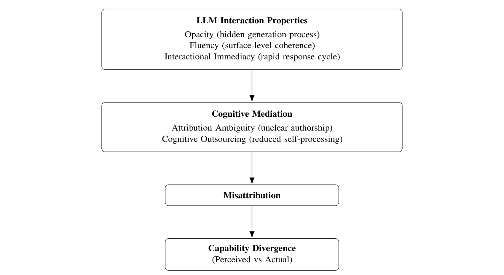

# LLM 謬誤：AI 輔助認知工作流程中的錯誤歸因

Hyunwoo Kim Harin Yu Hanau Yi ddai Inc. hw.kim@ai-dda.com

## **摘要**

隨著大型語言模型（LLMs）快速融入日常工作流程，人們進行寫作、程式設計、數據分析以及多語言溝通等認知任務的方式已然改變。過去的研究多半聚焦於模型的可靠性、幻覺問題（hallucination）以及使用者信任的校準，卻鮮少有人關注使用 LLM 如何重塑使用者對自我能力的認知。本文提出了「LLM 謬誤」（LLM Fallacy）的概念。這是一種認知歸因錯誤（Cognitive attribution error），在此情況下，人們會將 LLM 輔助產出的結果，誤認為是自己獨立能力的證明，從而導致感知能力與實際能力之間產生系統性的能力分歧（Capability divergence）。

我們認為，LLM 的不透明性、流暢度以及低阻力的互動模式，模糊了人類與機器貢獻之間的界線。這使得使用者傾向從最終產出來推斷自己的能力，而非從產生這些結果的過程來評估。我們將 LLM 謬誤置於自動化偏見（Automation bias）、認知卸載（Cognitive offloading）以及人機協作的現有文獻脈絡中進行探討，同時將其區分為一種專屬於 AI 媒介工作流程的歸因扭曲形式。我們提出了其潛在機制的概念框架，並歸納了它在程式運算、語言、分析與創意領域中的表現型態。

最後，我們探討了這項現象對教育、招募與 AI 素養的深遠影響，並為未來的實證研究指明了方向。此外，我們也針對人機協作的方法論提供了透明的說明。這項研究建立了一個基礎，幫助我們理解生成式 AI 系統不僅能提升認知表現，更會重塑人們的自我認知與所感知的專業能力。

## **1 簡介**

隨著大型語言模型（LLMs）迅速融入日常工作流程，人們執行寫作、程式設計、分析與多語言溝通等認知任務的方式已被徹底重塑（Achiam 等人，2023）。這種轉變不單單只是生產力的漸進提升，更反映了認知勞動組織方式的結構性改變。如今，生成式系統已不再只是外部工具，而是成為知識工作（**如企劃、寫作等需要高度腦力的工作**）中不可或缺的內建元件（Brynjolfsson 等人，2025）。LLMs 並非只是單純地輔助獨立的任務，而是改變了我們解決問題與產出內容的根本條件。

現有研究主要聚焦於系統層面的隱憂，例如模型的可靠性、幻覺（系統產生虛假或錯誤資訊），以及使用者信任度的校準（Ji 等人，2023）。而在 AI 對齊（Alignment）與人機互動的相關研究中，則強調透過提升系統的可解釋性、可控性，以及對使用者意圖的回應能力來改善系統行為（Ouyang 等人，2022）。儘管這些研究方向為模型效能與互動設計提供了重要的見解，但它們仍大多以系統為中心。相比之下，鮮少有研究關注持續與 LLM 互動會如何重塑使用者對自我能力的認知，尤其是在那些透過人機反覆交流而共同產出結果的情境中。

本文介紹了「LLM 謬誤」（LLM Fallacy）的概念。這被定義為一種認知歸因錯誤（Cognitive attribution error），即人們會將 LLM 輔助產出的結果，誤解為是自己獨立能力的證明，進而導致感知能力與實際能力之間產生系統性的能力分歧（Capability divergence）。這個現象可以被歸類為一種更廣泛的歸因扭曲。在這種情況下，人們會誤判其表現或知識的來源（Kruger & Dunning，1999）。

然而，有別於過去強調自我評估內部侷限性的研究，LLM 謬誤源於外部生成式系統與認知工作流程的深度整合。這創造出了一個混合環境，在其中，原創作者的身份與主導權（Agency）變得難以輕易區分。

隨著 LLMs 參與並主導越來越多的認知過程，這種錯誤歸因（Misattribution）便會在我們所感知到的能力與實際能力之間，產生一種系統性的分歧。這些分歧不僅僅是個人的誤判，更會進一步影響那些依賴可觀察的「產出」來衡量能力的體制系統（Espeland & Sauder，2007）。當產出可以透過人機協作完成，而無需使用者具備相應的內在專業知識時，現有的評估框架就可能會將系統輔助的表現與個人獨立具備的技能混為一談。

我們認為，這個現象的出現，源於 LLM 系統中幾個固有特性的交互作用，這包含了產出的流暢度、互動的即時性，以及底層運算過程的隱蔽性（Burrell，2016）。高度的流暢度會成為一種元認知（Metacognitive）的線索，引導使用者從表面上的連貫性來推斷能力，而非去審視產生這些結果的背後過程（Reber 等人，2004）。同時，中間運算步驟的抽象化，掩蓋了人類與系統之間的分工，限制了使用者準確歸因雙方貢獻的能力。

總結來說，這些條件共同產生了一種歸因模糊性（Attribution ambiguity）。這種模糊性並非偶然，而是結構性地深植於我們與系統的互動之中。人類貢獻與機器生成之間的界線，在反覆使用的過程中逐漸被重構，導致使用者會將系統輔助的產出內化，認為這就是他們自身能力的真實反映。

本文的主要貢獻如下：第一，我們正式將 LLM 謬誤定義為一種專屬於 AI 媒介環境的認知歸因錯誤。第二，我們將此現象與其他相關概念（包含幻覺、自動化偏見以及認知卸載）進行了明確的區分。第三，我們提出了一個機制性的解釋，說明 LLM 的互動是如何產生歸因模糊性的。第四，我們介紹了該現象在多個領域（包含程式運算、語言、分析、創意、知識論以及專業領域）的表現型態分類。第五，我們分析了這對評估系統（包含招募、教育與專業能力的展現）可能帶來的影響。第六，我們提供了人機協作方法論的結構化說明，以確保研究實踐的透明度。最後，我們勾勒出可供測試的假設，並為未來的實證驗證指明了方向。

## **2 背景與相關研究**

關於人類與自動化系統互動的研究，長期以來一直在探討對機器生成產出的依賴，是如何形塑人類的判斷與行為（Parasuraman & Riley，1997）。這些文獻中的一個核心概念是自動化偏見（Automation bias）。這描述了人們過度依賴自動化系統的傾向，即使系統輸出的結果是錯誤的，人們往往也會選擇接受（Lee & See，2004）。這些研究顯示，這種依賴並不純粹是功能性的考量，而是受到我們所感知的系統權威性與使用者信任度的調節，尤其是在認知負荷（**即大腦處理資訊的負擔**）較高的情況下更是如此。

與此密切相關的另一個概念是認知卸載（Cognitive offloading）。在這種情況下，人們會將心理過程外包，依賴外部系統來執行原本需要耗費心力的任務（Risko & Gilbert，2016）。雖然卸載確實能減輕認知負擔，但它也重塑了知識編碼與保留的方式，且往往會削弱我們對知識的內化程度（Hutchins，1995）。隨著認知責任逐漸向外轉移，內在認知與外部支援之間的界線也變得越來越流動與模糊。

「延伸心智」（Extended mind）的框架進一步發展了這個觀點。該理論提出，認知過程是可以分佈在工具與環境之中的，而不僅僅侷限於個體內部（Clark，2010）。從這個視角來看，科技不僅僅是輔助認知，更是直接參與其中，形成一個整合的系統。在這個系統裡，推理與解決問題的過程是共同建構出來的。這為我們理解 LLMs 提供了一個理論基礎：它們是分散式認知架構中的重要元件，而不單單只是外部的輔助工具。

在人機協作領域的最新研究中，探討了使用者是如何將 AI 系統視為任務執行過程中的夥伴（Amershi 等人，2019）。這些研究強調了協調性、透明度，以及使用者期望的校準。研究表明，有效的協作有賴於對系統能力與侷限性的準確理解（Kocielnik 等人，2019）。然而，使用者在適當校準信任度時往往會遇到困難，特別是當系統產出的內容顯得非常流暢或極具權威性時。

以人為本的 AI 設計研究進一步凸顯了透明度與可解釋性在形塑使用者理解上的關鍵作用（Shneiderman，2020）。當系統運作的過程不透明時，使用者更容易對結果是如何產生的，形成不完整或不準確的心智模型，進而增加了誤解的風險。因此，流程不透明性（Pipeline opacity）不僅僅是技術上的限制，更是一種會影響我們如何看待系統貢獻的認知條件。

儘管這些框架針對依賴、委派與分散式認知提供了重要的見解，但它們並未能完全解釋 LLM 媒介工作流程所引發的歸因動態。現有的研究主要著重於使用者如何評估系統產出，或如何將這些產出整合到決策過程之中，而非探討這些產出是如何被內化並視為個人能力的展現。關於外部生成的內容是如何被納入自我評估的這一個問題，仍有待進一步的探索。

LLM 謬誤透過引入一種獨特的歸因扭曲形式，進一步擴展了這個領域的研究。它的重點不在於我們是否過度依賴或信任系統的正確性，而是探討我們為何會將 LLM 輔助的產出，錯誤歸因（Misattribution）為自己能力的證明。這將分析的焦點從互動與決策，轉移到了自我認知與能力歸因上，將此現象定位為人機互動廣闊版圖中，一個具互補性卻又截然不同的概念。

## **3 LLM 謬誤的概念定義**

LLM 謬誤被定義為一種認知歸因錯誤（Cognitive attribution error）。在此情況下，人們會將 LLM 輔助產出的結果，誤解為是自己獨立能力的證明。當系統的貢獻在認知上被吸收並融入使用者的自我評估時，就會發生這種情況。這會導致實際能力與感知能力之間出現落差（Kruger & Dunning，1999）。從更宏觀的角度來看，這種現象可以被理解為一種元認知監控（Metacognitive monitoring）的失效，意味著人們無法準確地評估自身知識的來源與極限（Wilson & Dunn，2004）。

要讓 LLM 謬誤發生，必須滿足幾個條件。首先，任務必須涉及由 LLM 媒介的產出生成，亦即系統所產出的內容，通常需要具備特定領域的專業知識才能完成。其次，互動過程必須足夠無縫接軌，使得人類輸入與系統輸出之間的區別變得不再明顯。第三，產出的內容必須展現出某種程度的流暢性或連貫性，而這種水準通常會讓人聯想到熟練的人類表現（Alter & Oppenheimer，2009）。在這些條件下，使用者更容易依賴表面的線索來作為能力的代理指標，而非深入評估底層的生成過程（Reber 等人，2004）。

將 LLM 謬誤與其他相關現象（特別是幻覺）區分開來是非常重要的。幻覺是指模型產生錯誤或捏造資訊的情況，代表了系統輸出層面的失敗（Ji 等人，2023）。相反地，LLM 謬誤與輸出的正確性無關，它關注的是這些輸出在認知上是如何被解讀的。無論產生的內容是精確還是錯誤，LLM 謬誤都依然存在。因為它的運作層次在於「歸因」，而非知識論上的有效性。

LLM 謬誤也有別於自動化偏見（Automation bias）與認知卸載（Cognitive offloading）。自動化偏見涉及對系統輸出的過度依賴，而認知卸載則是指將腦力負擔委派給外部系統（Risko & Gilbert，2016）。兩者都聚焦於任務的執行與決策過程。而 LLM 謬誤關注的則是，產出的結果是如何被整合進使用者對自我能力的認知中，它超越了單純的「依賴」，進入到了能力歸因的領域。

追根究底，這個現象反映了人類與系統貢獻之間歸因的不對齊。在 LLM 媒介的工作流程中，使用者輸入與系統輸出之間的界線變得越來越模糊不透明，使得雙方各自扮演的角色難以拆解與釐清（Burrell，2016）。這種不透明性限制了使用者建構準確生成過程心智模型的能力，增加了他們對「推斷」而非「觀察」到之因果關係的依賴（Nisbett & Wilson，1977）。結果就是，使用者可能會不成比例地將產出的功勞歸給自己，即使生成的過程在很大程度上是由系統所驅動的。這種不對齊正是 LLM 謬誤的定義核心，也為後續章節探討其機制與表現型態奠定了基礎。

## **4 出現的機制**

LLM 謬誤的出現，源於多種認知與系統層面因素的交互作用。這些因素共同在 LLM 媒介的工作流程中產生了歸因模糊性（Attribution ambiguity）。這些因素彼此強化，創造出一種條件，讓使用者會系統性地將系統生成的產出，錯誤歸因（Misattribution）為自己能力的反映（Sloman，1996）。從雙歷程觀點（Dual-process perspective）來看，當快速、直覺的判斷主導了反思性評估時，這種錯誤歸因就會發生，讓表面的線索得以引導人們進行推論。

第一個主要機制是人類輸入與模型輸出之間的歸因模糊性。在與 LLM 的互動中，使用者提供的提示（Prompts）通常是片段的、未詳盡說明的，或是需要反覆修改的，而系統卻能產出結構完整且語意連貫的內容。由於結果是透過持續的互動迴圈所產生的，使用者貢獻與系統生成之間的界線變得難以劃分。這種模糊性增加了使用者將產出納入自身「作者身份」認同的可能性。儘管他們對底層過程的內省能力有限，卻仍會為自己扮演的角色建構出事後合理化的解釋（Nisbett & Wilson，1977）。關於主導權（Agency）的研究進一步顯示，作者身份通常是從結果中推斷出來的，而非直接獲得的。這會導致人們對自身的控制力與貢獻產生系統性的錯覺（Aarts 等人，2005）。在人機協作的情境中，這種動態關係被放大了：使用者在認知層面上可能沒有完全體驗到對生成內容的擁有權，但在反思或社交層面上，他們仍會宣稱自己是作者。這揭示了「實際體驗到的」與「被歸因的」作者身份之間存在著分歧（Draxler 等人，2024）。類似的分離現象也出現在熟練的操作行為中，即使人們對產生結果的過程認知不完整，他們仍會將結果歸功於自己（Logan & Crump，2010）。

第二個機制是高品質自然語言生成所帶來的流暢度錯覺（Fluency illusion）。LLM 的產出通常在語法上正確無誤、符合上下文情境，且在風格上保持一致，非常類似熟練人類的表現。這種表面的流暢度會作為一種捷思線索（Heuristic cue），引導使用者從「處理資訊的容易程度」來推斷能力，而非去深究其生成過程（Reber 等人，2004）。流暢度也會使人們在判斷可信度與專業性時產生偏見，增加了產出在缺乏深入評估的情況下，仍被認為是準確且製作精良的可能性（Metzger & Flanagin，2013）。

認知外包（Cognitive outsourcing）進一步促成了這個現象。LLMs 允許使用者以極少的心力，將複雜的任務（包含推理、寫作與解決問題）外包給系統。隨著系統承擔了越來越大比例的認知工作負擔，使用者參與產出過程的程度也隨之降低，這削弱了他們評估自身理解力或技能的能力（Kirsh，2010）。反覆的依賴減少了自我推理的機會，進一步強化了感知能力與實際能力之間的落差。

另一個關鍵因素是流程不透明性（Pipeline opacity），這指的是生成 LLM 產出的過程是不可見的。有別於傳統工具（其中間步驟是可觀察或由使用者驅動的），LLMs 將檢索、模式配對與資料合成的過程徹底抽象化了。這種不透明性阻礙了使用者追蹤產出是如何生成的，也掩蓋了系統驅動與使用者驅動貢獻之間的區別（Ananny & Crawford，2018）。在缺乏透明中間步驟的情況下，使用者只能依賴對系統不完整的心智表徵，這增加了發生歸因錯誤的可能性。

綜合上述，這些機制共同導致了感知能力膨脹（Perceived competence inflation）。歸因模糊性掩蓋了真正的作者身份，流暢度釋放了能力的假訊號，認知外包減少了反思性的參與，而流程不透明性則移除了對生成過程的可見度。它們的交互作用創造出一個結構性強化的環境。在這個環境中，使用者會持續傾向高估自己獨立的能力，進而催生了 LLM 謬誤。正式來說，這種關係可以總結如下：能力分歧（Capability divergence）（ΔC，定義為感知能力與實際能力之間的差距）源於系統層面特性（即不透明性、流暢度與即時性）的交互作用，並由歸因模糊性與認知外包所調節。

如圖 1 所示，這些交互作用的元件，透過中介的歸因過程，共同產生了能力分歧。

圖 1：LLM 謬誤的機制。LLM 的互動特性（不透明性、流暢度與互動即時性）形塑了認知調節過程，包含了歸因模糊性與認知外包。這些過程產生了對系統生成產出的系統性錯誤歸因，最終導致感知能力與實際能力之間出現分歧。

## **5 LLM 謬誤表現型態的分類**

LLM 謬誤廣泛出現在許多使用 LLM 來執行高認知需求任務的領域。儘管其潛在的歸因機制是一致的，但它的形式與可見度會隨著任務與產出類型的不同而有所差異。本節概述了這個現象最為顯著的幾個關鍵領域，說明感知能力膨脹（Perceived competence inflation）是如何在不同情境中浮現的（Dunning，2011）。跨越所有領域，一個共通的結構是：有外部支援的表現與內在扎實的理解之間，存在著斷層與分離。

在程式運算領域中，LLM 謬誤出現在寫程式與系統建置的過程中。在這些情境下，使用者會在 LLM 的輔助下生成功能正常的腳本或應用程式。使用者可能產出了可以運作的成果，卻完全不了解底層的架構、依賴關係或最佳化策略。因此，任務的成功執行被誤解為技術能力的證明（Newell & Simon，1976），反映出外部搭建鷹架（**即系統給予的暫時性輔助**）所帶來的表現，與內在發展出的真實理解之間是有明顯區別的。

在語言領域，這種現象出現在多語言內容的產出上。使用者可能會用自己無法獨立掌握的語言，生成流暢的文本。由於 LLM 的產出通常在語法上正確無誤且符合上下文，使用者可能會將這種流暢度與自己內化的語言能力混為一談，高估了自己在沒有輔助情況下理解或產出語言的能力（Bender & Koller，2020）。這反映了表面的形式與實質的語意能力之間存在著落差。

在分析領域，LLM 謬誤體現在推理與解決問題的任務中。LLMs 能夠生成結構化的解釋與逐步的分析，而使用者可能會直接採用或照搬這些內容。接觸這類產出，會給人一種具備分析技能的錯覺，即使底層的推理過程完全是外部生成的（Evans，2008）。使用者可能會內化這些推理的結構，卻從未參與獨立產生這些推理所需的思考過程。

在創意領域，這種現象出現在寫作、發想與內容生成中。LLMs 協助產出敘事、論點以及風格精煉的文本，使用者可能會將這些內容融入自己的作品中。儘管系統提供了實質的貢獻，這些產出卻可能被錯誤歸因（Misattribution）為個人創造力或作者身份的證明（Latour，1999），反映了創作主導權在人類與機器之間的重新分配。

在知識論領域，LLM 謬誤可以在知識獲取與理解的過程中被觀察到。LLMs 能夠總結複雜的材料並生成易於理解的解釋，這導致使用者會將「取得資訊」等同於「概念上的精通」。這與解釋深度的錯覺（Illusion of explanatory depth）相吻合。在這種錯覺中，人們會高估自己對複雜系統的理解程度（Rozenblit & Keil，2002）。

在專業能力展現（Professional signaling）的領域，該現象體現在個人如何在履歷或面試等外部情境中呈現自己的能力。使用者可能會根據他們在 LLM 輔助下產出成果的能力來填寫技能，而非基於他們獨立獲得的專業知識。這導致了能力的過度膨脹與誇大，而這些能力在沒有輔助的情況下，通常是無法轉換為實際表現的（Lamont，2012）。

綜合來看，這些領域展現了 LLM 謬誤在各種認知工作形式中的廣泛性。儘管任務類型各異，但每個領域都反映了相同的潛在模式：將系統輔助的產出，與內在扎實的能力混為一談。

## **6 實證觀察與案例說明**

本節透過找出真實世界使用情境中反覆出現的模式，為 LLM 謬誤提供了觀察基礎。相較於提出軼事記錄或受控的實驗發現，本節更著重於跨領域的一致性觀察，以說明該現象在實務中是如何表現的（Rosenblat & Stark，2016）。對於早期的概念性研究來說，這種方法特別合適，因為跨情境的穩定模式可以揭示潛在的認知結構。這些觀察旨在呈現概念性與跨情境的模式，而非作為受控的實證驗證。

第一個顯著的模式出現在寫程式與系統建置的工作流程中。使用者可以透過與 LLM 的反覆互動，生成功能正常的腳本、應用程式或系統元件，而通常不需要了解底層的邏輯、架構或除錯過程。儘管這些產出在運作上可能是有效的，但使用者往往缺乏獨立重現、修改或擴充它們的能力。實證研究表明，LLMs 可以提高任務完成率並為程式碼理解搭建鷹架，但使用者通常依賴生成的解決方案，卻沒有將背後的邏輯推理內化（Nam 等人，2024）。此外，對程式碼生成系統的評估顯示，表面層次的正確性並不能可靠地指出更深層次的正確性，因為產出的結果可能包含潛在的錯誤，而這些錯誤如果沒有該領域的專業知識是無法被察覺的（Zhang 等人，2025）。這種模式反映了執行能力與底層實力之間明顯的分歧，與 LLM 謬誤的定義完全一致（Brynjolfsson 等人，2025）。

第二個模式出現在招募與候選人評估的情境中。應徵者可能會展示高品質的作品，但這些作品反映的是 LLM 輔助的產出，而非獨立培養的技能。當在需要無輔助表現或更深入理解的條件下進行評估時，落差就會變得很明顯。有證據指出，AI 輔助雖然能提升可觀察的任務表現，同時增加了對外部系統的依賴，但在個人獨立能力上卻沒有相應的成長。這進一步強化了這種分歧的存在（Karny 等人，2024）。結果就是，自我認知與外部評估可能都會被無法準確反映底層實力的產出所形塑，導致系統性的高估（Espeland & Sauder，2007）。

在教育領域也出現了類似的動態。AI 輔助可以減少持續進行認知參與的需求，特別是在涉及解釋、綜合歸納或解決問題的任務中。研究指出，當 AI 系統提供了解決方案或中間的推理過程時，使用者對材料的投入程度就會降低，限制了附帶學習（Incidental learning）與知識內化的機會（Gajos & Mamykina，2022）。儘管這類輔助可以改善短期的表現，但它削弱了任務完成與概念理解之間的關聯，使得將「表現」解釋為「學習的證據」這件事變得更加複雜。

跨越不同領域，一個一致的模式浮現了：透過 LLM 互動產生產出的能力，經常被解讀為內化技能的證明。這與認知心理學中更廣泛的研究發現相符：即使底層的理解仍然有限，外部協助依然會引發過度自信（Fisher & Oppenheimer，2021）。這種錯誤的校準反映了一種普遍的傾向：人們習慣從結果來推斷能力，而非從產生這些結果的過程。即使人們意識到外部輔助工具扮演的角色，這種偏見依然存在（Sieck & Arkes，2005）。在這個意義上，LLM 謬誤可以被理解為一種更廣泛認知偏見的具體實例，並被 AI 生成產出的流暢度與即時性所放大。

更廣泛地說，這些觀察顯示出任務表現在人類與系統之間的分配方式發生了轉變。在人機協作團隊中，表現是從互動中浮現的，而非源自任何單一元件孤立的能力（Damacharla 等人，2018）。然而，實務上的評估往往未能考慮到這種分配，仍然將產出完全歸功於個人。這種錯誤歸因（Misattribution）更因為對決策輔助工具的依賴而被強化，因為使用者會順從系統的輸出，減少了獨立驗證與自我評估（Van Dongen & Van Maanen，2013）。

總合來說，這些案例展示了 LLM 謬誤是如何在各種應用情境中運作的，提供了一個觀察上的證據層次，以補充先前建立的概念與機制框架。這些模式不依賴受控的驗證，而是凸顯了產出品質與底層能力之間一致的落差。它們搭起了抽象定義與現實世界表現之間的橋樑，也激發了對系統性實證調查的需求。

## **7 對評估系統的影響**

LLM 謬誤的影響力不僅止於個人認知，更擴及依賴準確評估人類能力的體制系統。隨著 LLM 輔助的工作流程變得日益普及，現有的評估框架面臨著與其旨在衡量的能力脫節的風險，特別是當「可觀察的產出」被用作技能的主要指標時（Muller，2018）。當產出可以透過 AI 的介入生成，或在很大程度上被其形塑時，表現與底層能力之間的關係就變得越來越難以解讀，這也削弱了以結果為導向的評估作為能力指標的可靠性。

在招募與候選人評估中，這種脫節在「展示出的作品」與「獨立掌握的專業知識」之間造成了分歧。應徵者可能會展示工作成果或提出解決方案，但這些反映的其實是 LLM 輔助的生成，而非內化的知識或技能。因此，依賴可觀察產出的評估系統可能會高估他們的能力，尤其是在系統的使用不可見，或未被納入考量的情境中（Lamont，2012）。這個問題因為 AI 介入下「評估本身的不穩定性」而變得更加複雜。最近的研究顯示，基於 LLM 的評估系統可能對表面層次的語言特徵非常敏感（例如表達不確定的詞彙），這會導致不一致或帶有偏見的判斷，無法可靠地反映真實的品質（Lee 等人，2025）。結果就是，人類與自動化評估者可能都會受到與實際能力無關的特徵影響，放大了誤判的風險。

在教育領域，LLM 的普及同時改變了學習過程與評估的有效性。學生可能會依賴 LLMs 來生成解釋、完成作業或為解決問題搭建鷹架，減少了他們直接投入底層學習材料的需求。雖然這些工具能提升獲取知識的便利性並支援學習，但它們也讓學習成效的解讀變得複雜。評量結果可能不再可靠地反映概念理解或技能的獲取，這在「學習的便利性」與「準確評估學習進度」之間造成了緊張關係（Kizilcec，2016）。這項挑戰與更廣泛的研究發現密切相關，即替代任務與主觀評估指標，可能會產生關於系統有效性或使用者能力的誤導訊號，特別是當評估者依賴表面指標，而非底層過程時（Buçinca 等人，2020）。在這個脈絡下，教育評量面臨著將「輔助下的表現」與「真實的理解」混為一談的風險。

技能認證與專業知識驗證系統也面臨著類似的挑戰。證照的設計初衷是為了傳達已經過驗證的能力。然而，LLM 輔助的工作流程卻讓人們在不具備相應內化專業知識的情況下，也能滿足基於產出的標準。這削弱了證照作為能力指標的可靠性，特別是在 AI 輔助隨手可得的領域（Porter，1995）。更廣泛來說，AI 系統日益融入任務執行過程中，讓人不禁質疑：現有那些通常專為評估個人表現而設計的評估模式，是否仍然適用於這種人類與機器混合的情境？關於人機團隊合作的研究凸顯出，我們迫切需要能夠明確解釋人類與系統間貢獻分配的評估框架，而非單純將產出歸功於其中一方（Damacharla 等人，2018）。

從更宏觀的層次來看，這些轉變反映了知識與專業技能在生產、解讀與驗證方式上的變革。隨著 LLMs 深植於我們的認知工作流程中，個人認知與系統輔助產出之間的界線變得日益模糊。這挑戰了我們過去對於作者身份、理解力以及知識擁有權的傳統假設。這場變革的影響遠超出了單一任務的範疇，它影響了體制在人類與機器貢獻本質上相互交織的環境中，該如何重新定義並評估所謂的能力。

這些挑戰凸顯了更新 AI 素養框架的必要性，新框架必須明確將 LLMs 在形塑認知過程與產出中所扮演的角色納入考量。這樣的框架不能僅停留在工具的使用層面，更必須著眼於後設認知（Metacognitive）的覺察，讓使用者與評估者能夠分辨「系統輔助的表現」與「個人獨立的扎實能力」之間的差異（Liao 等人，2020）。這包含了針對 AI 媒介產出的適當使用、透明度與解讀方式，發展出共享的社會規範，同時也要釐清在何種情況下，產出可以或不可以被視為能力的指標。

總結來說，這些影響表明，LLM 謬誤不僅在個人的認知層次上運作，也對體制的評估系統產生了深遠的影響。要解決這種落差，我們必須重新思考在 AI 媒介的環境中，該如何定義、衡量並傳達能力。這意味著我們必須從「以產出為中心」的模式，轉向「具有過程意識」的評估框架，以便更精準地捕捉人類與機器在貢獻上的分配（Power，1997）。

## **8 人機協作方法論與聲明**

本研究採用了人機協作的工作流程進行，在此過程中，大型語言模型（LLMs）被作為輔助工具，用於支援草稿撰寫、結構優化、語言潤飾，以及反覆的概念探索。所有與 LLM 的互動都是透過結構化的提示（Prompts）來進行，並由人類作者在一個受控的互動框架內進行評估。在這個脈絡下，LLMs 被視為一種系統，其產出是透過互動設計來形塑的，而非自動自主的執行結果（Bommasani 等人，2021）。這些產出被認定為中間的產物，必須接受人類的解讀與驗證，絕非具權威性的最終貢獻。

所有概念的框架、理論的主張、詮釋以及最終的決定，皆由人類作者完成。作者作為主要研究者，保留了對研究方向、驗證過程及學術誠信的完全掌控權。LLM 並未扮演獨立作者或共同作者的角色，也不具備生成內容的權威性，它僅僅是一個在明確人類指導下運作的輔助系統。這樣的區分維護了語言生成與知識責任之間的界線，確保了作者身份始終建立在人類應負的責任之上（Huang 等人，2025）。

本研究中與 LLM 的互動，是透過基於自然語言宣告式提示（Natural Language Declarative Prompting, NLD-P）框架（Kim 等人，2026）的結構化提示方法論來進行規範的。該方法被用來對任務結構、產出範圍與修改標準實施嚴格的限制。有別於依賴臨時指令撰寫或鬆散結構互動模式的傳統提示工程方法（Sahoo 等人，2024），這個框架在此被當作一種控制機制，以確保模型的行為能保持在界限內、具備可解釋性，並能對明確定義的需求做出精準回應。這種方法與人機互動設計中既有的原則相符，亦即系統行為是透過使用者意圖與系統回應之間協調的互動來形塑的（Amershi 等人，2019）。

這維護了清晰的界線，確保 LLM 輔助的產出不會掩蓋了「生成內容」與「人類原創知識」之間的區別。

## **9 未來工作與研究方向 (Future Work and Research Directions)**

如同本文所介紹，LLM 謬誤（LLM fallacy）值得我們進行系統性的實證研究。未來的工作應聚焦於對照研究，比較在有 LLM 輔助與無輔助的情況下，人們所感受到的自身能力，從而讓我們能直接觀察到感知能力與實際能力之間的能力分歧（capability divergence）（Koriat, 1997）。此外，實驗設計可以進一步操弄系統輔助的透明度，藉此獨立分析在不同程度的透明度下，人們的歸因方式會如何轉變。

在這個框架下，提示詞（prompts）被設計成模組化、人類可讀的指令。這些指令將任務定義與評估條件具象化（**將內在思考轉化為外部明確指令**），確保在反覆的互動中能保持一致的應用標準。這呼應了當前廣泛的趨勢——將提示詞工程轉變為一種深思熟慮且以使用者為中心的實踐（Lo, 2023），並推動人類與 AI 之間走向更明確、協調的合作模式（Kraljic & Lahav, 2024）。在本研究中，運用這些特性是為了在人類與系統之間保持清晰的角色分工，而非試圖擴展或概括框架本身。

另一個核心研究方向，在於發展出能將這種分歧量化的測量框架。這包含設計一些指標，將使用者的自我能力評估與獨立的表現評估進行比較，同時建立特定任務的基準測試，將 LLM 輔助所帶來的貢獻獨立出來。透過這些方法，我們就能將 LLM 謬誤從一種推論而來的現象，轉化為可以具體測量的結構（Wilson & Dunn, 2004）。最關鍵的是，這些框架必須同時捕捉主觀的感知與客觀的表現，才能準確地呈現兩者之間的落差。

所有透過 LLM 互動產生的輸出，都必須經過系統性的人工審查、驗證以及選擇性的整合。這包含評估其概念的準確度、邏輯的一致性，以及是否與預期的理論框架契合。若輸出結果未達標準，就會在後續互動中被修改、捨棄或重新架構。這種反覆驗證的過程，反映了 AI 系統稽核與監督的既定實踐——在系統輔助的工作流程中，人為介入是確保可靠性與一致性的必要條件（Raji et al., 2020）。此過程也解決了系統生成的輸出與使用者理解程度之間潛在的落差，這與近期在人類與 LLM 互動中關於知識對齊（epistemic alignment）的討論不謀而合（Clark et al., 2025）。

縱向研究則提供了另一個探索的途徑。隨著 LLM 逐漸融入日常工作流程，我們有必要檢視這種反覆的互動，將如何隨著時間重塑使用者的自我認知。這類研究能夠評估長期使用 LLM 究竟是會放大、穩定，還是減弱歸因錯位（Dillon et al., 2025）；同時也能了解，使用者是否會對系統的貢獻建立更精確的心智模型，亦或在錯誤歸因（misattribution）中越陷越深。

這套工作流程體現了一種「人機迴圈（human-in-the-loop）」、「人類掌控（human-in-control）」以及「人類作為最終作者（human-as-final-author）」的協作模式。它不僅符合在 AI 輔助研究中對透明度的既定期待，也明確區分了輔助工具的使用與實質作者身分的差異，這與 AI 系統的報告標準是一致的（Mitchell et al., 2019）。在此背景下，結構化的提示方法便成為一種操作機制，用以強制執行限制、維持可解釋性，並維護知識的完整性（preserving epistemic...）。

我們也應該針對第 5 節提出的類型學，進行特定領域的研究。任務結構、評估標準與回饋機制的差異，都可能影響 LLM 謬誤的程度與形式。透過比較分析，我們能找出這種現象在哪裡最為明顯，並揭示特定領域的調節變數（**影響現象強弱的因素**），例如任務複雜度、回饋的取得容易度，以及中間推論過程的可見度（Gigerenzer & Gaissmaier, 2011）。

最後，未來的研究應著眼於探討如何介入以減少歸因的錯位。這可能包含：讓系統貢獻更加明確的介面設計；提升使用者對 LLM 能力與局限性認知的教育方法；以及能夠區別系統輔助表現與獨立表現的評估框架。這些介入措施將有助於將 LLM 謬誤從一個概念架構，轉變為一個具備實證基礎的研究領域（Doshi-Velez & Kim, 2017），同時也能推動人機系統的發展，使其在提升工作效能的同時，也能促進精準的自我評估。

## **10 結論 (Conclusion)**

本文介紹了「LLM 謬誤（LLM fallacy）」這個在人機互動中出現的現象：人們將 LLM 輔助的輸出結果錯誤歸因（misattribution）為自身獨立能力的證明，進而在感知能力與實際能力之間產生了系統性的分歧（Kruger & Dunning, 1999）。透過正式定義這個概念，本文為理解 LLM 介導（LLM-mediated）工作流程中歸因錯位的成因奠定了基礎，並將既有的自我評估錯誤理論，延伸至認知過程分散於人類與機器系統之間的新情境。

我們的分析找出了這個現象背後的運作機制，包括：歸因模糊性（attribution ambiguity）、受流暢度驅動的推論（fluency-driven inference）、認知外包（cognitive outsourcing），以及流程不透明性（pipeline opacity）。這些機制共同形塑出一種情境：即便使用者嚴重依賴系統生成的輸出，他們依然會高估自己的能力（Alter & Oppenheimer, 2009）。本文的類型學進一步證明，這種模式廣泛存在於運算、語言、分析、創意、知識及專業等多個領域。這顯示出 LLM 謬誤並非侷限於單一領域，而是在各種形式的認知工作中，都表現出結構上的一致性。

除了個人認知層面之外，LLM 謬誤對於那些依賴精確評估人類能力的機構系統，也帶來了深遠的影響。其效應延伸至招募、教育、技能認證以及 AI 素養框架——在這些領域中，可觀察到的輸出成果，已越來越無法真實反映出底層的實際能力（Muller, 2018）。隨著表現與能力之間的關聯性逐漸減弱，傳統那種「以輸出為基礎」的評估模式，也變得不再是衡量專業知識的可靠指標。

在生成式 AI 整合的廣闊發展軌跡中，LLM 謬誤反映出人們的關注焦點，正從「以系統為中心」轉移至「以使用者的認知動態為中心」。雖然過往的研究多半強調模型的行為、可靠性與對齊（alignment），但本文則特別凸顯了 LLM 是如何重塑人類的自我認知，以及對自身專業知識的感知能力膨脹（perceived competence inflation）（Bommasani et al., 2021）。因此，要真正理解 AI 所帶來的影響，我們不僅需要評估系統的表現，更必須深入探究人類認知在與 AI 持續互動的過程中，是如何進行調適的。

這項研究為 LLM 謬誤提供了一個概念框架，並指出了未來研究的方向。我們需要更多的實證研究來驗證這個現象、發展測量方法，並設計出能夠減輕歸因錯位的介入措施。隨著 LLM 逐漸深植於各種認知工作流程中，理解其對自我認知與能力評估的影響，將是不可或缺的課題。從更廣泛的角度來看，正視並解決 LLM 謬誤是絕對必要的——唯有如此，我們才能確保在混合認知系統中的人機協作，不僅能提升工作表現，更能促進自我評估的準確度。

## **參考文獻 (References)**

Aarts, H., Custers, R., & Wegner, D. M. (2005). On the inference of personal authorship: Enhancing experienced agency by priming effect information. _Consciousness and Cognition_ , 14(3), 439–458. 

Achiam, J., Adler, S., Agarwal, S., Ahmad, L., Akkaya, I., Aleman, F. L., ... & McGrew, B. (2023). GPT-4 technical report. _arXiv preprint arXiv:2303.08774_ . 

Alter, A. L., & Oppenheimer, D. M. (2009). Uniting the tribes of fluency to form a metacognitive nation. _Personality and Social Psychology Review_ , 13(3), 219–235. 

Amershi, S., Weld, D., Vorvoreanu, M., Fourney, A., Nushi, B., Collisson, P., ... & Horvitz, E. (2019). Guidelines for human-AI interaction. In _Proceedings of the 2019 CHI Conference on Human Factors in Computing Systems_ (pp. 1–13). 

Ananny, M., & Crawford, K. (2018). Seeing without knowing: Limitations of the transparency ideal and its application to algorithmic accountability. _New Media & Society_ , 20(3), 973–989. 

Bender, E. M., & Koller, A. (2020). Climbing towards NLU: On meaning, form, and understanding in the age of data. In _Proceedings of the 58th Annual Meeting of the Association for Computational Linguistics_ (pp. 5185–5198). 

Bommasani, R., Hudson, D. A., Adeli, E., Altman, R., Arora, S., von Arx, S., ... & Liang, P. (2021). On the opportunities and risks of foundation models. _arXiv preprint arXiv:2108.07258_ . 

Brynjolfsson, E., Li, D., & Raymond, L. R. (2025). Generative AI at work. _The Quarterly Journal of Economics_ , 140(2), 889–942. https://doi.org/10.1093/qje/qjae044. 

Buçinca, Z., Lin, P., Gajos, K. Z., & Glassman, E. L. (2020). Proxy tasks and subjective measures can be misleading in evaluating explainable AI systems. In _Proceedings of the 25th International Conference on Intelligent User Interfaces_ (pp. 454–464). 

Burrell, J. (2016). How the machine “thinks”: Understanding opacity in machine learning algorithms. _Big Data & Society_ , 3(1), 2053951715622512. https://doi.org/10.1177/2053951715622512. 

Clark, A. (2010). _Supersizing the Mind: Embodiment, Action, and Cognitive Extension_ . Oxford University Press. 

Clark, N., Shen, H., Howe, B., & Mitra, T. (2025). Epistemic alignment: A mediating framework for user–LLM knowledge delivery. _arXiv preprint arXiv:2504.01205_ . 

Damacharla, P., Javaid, A. Y., Gallimore, J. J., & Devabhaktuni, V. K. (2018). Common metrics to benchmark human-machine teams (HMT): A review. _IEEE Access_ , 6, 38637–38655. 

Dillon, E. W., Jaffe, S., Immorlica, N., & Stanton, C. T. (2025). Shifting work patterns with generative AI (No. w33795). _National Bureau of Economic Research_ . 

Doshi-Velez, F., & Kim, B. (2017). Towards a rigorous science of interpretable machine learning. _arXiv preprint arXiv:1702.08608_ . 

Draxler, F., Werner, A., Lehmann, F., Hoppe, M., Schmidt, A., Buschek, D., & Welsch, R. (2024). The AI ghostwriter effect. _ACM Transactions on Computer-Human Interaction_ , 31(2), 1–40. 

Dunning, D. (2011). The Dunning–Kruger effect. In _Advances in Experimental Social Psychology_ (Vol. 44, pp. 247–296). 

Espeland, W. N., & Sauder, M. (2007). Rankings and reactivity: How public measures recreate social worlds. _American Journal of Sociology_ , 113(1), 1–40. https://doi.org/10.1086/517897. 

Evans, J. S. B. (2008). Dual-processing accounts of reasoning, judgment, and social cognition. _Annual Review of Psychology_ , 59, 255–278. 

Fisher, M., & Oppenheimer, D. M. (2021). Harder than you think: How outside assistance leads to overconfidence. _Psychological Science_ , 32(4), 598–610. https://doi.org/10.1177/0956797620975779. 

Gajos, K. Z., & Mamykina, L. (2022). Do people engage cognitively with AI? Impact of AI assistance on incidental learning. In _Proceedings of the 27th International Conference on Intelligent User Interfaces_ (pp. 794–806). https://doi.org/10.1145/3490099.3511138. 

Gigerenzer, G., & Gaissmaier, W. (2011). Heuristic decision making. _Annual Review of Psychology_ , 62, 451–482. 

Huang, B., Chen, C., & Shu, K. (2025). Authorship attribution in the era of LLMs. _ACM SIGKDD Explorations Newsletter_ , 26(2), 21–43. 

Hutchins, E. (1995). _Cognition in the Wild_ . MIT Press. 

Ji, Z., Lee, N., Frieske, R., Yu, T., Su, D., Xu, Y., ... & Fung, P. (2023). Survey of hallucination in natural language generation. _ACM Computing Surveys_ , 55(12), 1–38. 

Karny, S., Mayer, L. W., Ayoub, J., Song, M., Su, H., Tian, D., ... & Steyvers, M. (2024). Learning with AI assistance. In _Proceedings of the ACM Collective Intelligence Conference_ . 

Kim, H., Yi, H., Bae, J., & Kim, Y. (2026). Natural Language Declarative Prompting (NLD-P): A Modular Governance Method for Prompt Design Under Model Drift. _arXiv preprint arXiv:2602.22790_ . https://doi.org/10.48550/arXiv.2602.22790. 

Kirsh, D. (2010). Thinking with external representations. _AI & Society_ , 25(4), 441–454. 

Kizilcec, R. F. (2016). How much information? Effects of transparency on trust in an algorithmic interface. In _Proceedings of the 2016 CHI Conference on Human Factors in Computing Systems_ (pp. 2390–2395). https://doi.org/10.1145/2858036.2858402. 

Kocielnik, R., Amershi, S., & Bennett, P. N. (2019). Will you accept an imperfect AI? Exploring designs for adjusting end-user expectations of AI systems. In _Proceedings of the 2019 CHI Conference on Human Factors in Computing Systems_ (pp. 1–14). https://doi.org/10.1145/3290605.3300641. 

Koriat, A. (1997). Monitoring one’s own knowledge during study: A cue-utilization approach to judgments of learning. _Journal of Experimental Psychology: General_ , 126(4), 349–370. https://doi.org/10.1037/0096-3445.126.4.349. 

Kraljic, T., & Lahav, M. (2024). From prompt engineering to collaborating. _Interactions_ , 31(3), 30–35. 

Kruger, J., & Dunning, D. (1999). Unskilled and unaware of it: How difficulties in recognizing one’s own incompetence lead to inflated selfassessments. _Journal of Personality and Social Psychology_ , 77(6), 1121–1134. https://doi.org/10.1037/0022-3514.77.6.1121. 

Lamont, M. (2012). Toward a comparative sociology of evaluation. _Annual Review of Sociology_ , 38, 201–221. 

Latour, B. (1999). _Pandora’s Hope_ . Harvard University Press. 

Lee, D., Hwang, Y., Kim, Y., Park, J., & Jung, K. (2025). Are LLM-judges robust to expressions of uncertainty? Investigating the effect of epistemic markers on LLM-based evaluation. In _Proceedings of the 2025 Conference of the Nations of the Americas Chapter of the Association for Computational Linguistics: Human Language Technologies (Volume 1: Long Papers)_ (pp. 8962–8984). https://aclanthology.org/2025.naacl-long.452/. 

Lee, J. D., & See, K. A. (2004). Trust in automation. _Human Factors_ , 46(1), 50–80. 

Liao, Q. V., Gruen, D., & Miller, S. (2020). Questioning the AI: Informing design practices for explainable AI user experiences. In _Proceedings of the 2020 CHI Conference on Human Factors in Computing Systems_ (pp. 1–15). https://doi.org/10.1145/3313831.3376590. 

Lo, L. S. (2023). The CLEAR path. _Journal of Academic Librarianship_ , 49(4), 102720. 

Logan, G. D., & Crump, M. J. (2010). Cognitive illusions of authorship. _Science_ , 330(6004), 683–686. 

Metzger, M. J., & Flanagin, A. J. (2013). Credibility and trust of information in online environments: The use of cognitive heuristics. _Journal of Pragmatics_ , 59, 210–220. https://doi.org/10.1016/j.pragma.2013.07.012. 

Mitchell, M., Wu, S., Zaldivar, A., Barnes, P., Vasserman, L., Hutchinson, B., Spitzer, E., Raji, I. D., & Gebru, T. (2019). Model cards for model reporting. In _Proceedings of the Conference on Fairness, Accountability, and Transparency_ (pp. 220–229). https://doi.org/10.1145/3287560.3287596. 

Muller, J. (2018). _The Tyranny of Metrics_ . Princeton University Press. 

Nam, D., Macvean, A., Hellendoorn, V. J., Vasilescu, B., & Myers, B. A. (2024). Using an LLM to help with code understanding. In _Proceedings of the IEEE/ACM 46th International Conference on Software Engineering_ (pp. 1–13). https://doi.org/10.1145/3597503.3639187. 

Newell, A., & Simon, H. A. (1976). Computer science as empirical inquiry: Symbols and search. _Communications of the ACM_ , 19(3), 113–126. https://doi.org/10.1145/360018.360022. 

Nisbett, R. E., & Wilson, T. D. (1977). Telling more than we can know: Verbal reports on mental processes. _Psychological Review_ , 84(3), 231–259. https://doi.org/10.1037/0033-295X.84.3.231. 

Ouyang, L., Wu, J., Jiang, X., Almeida, D., Wainwright, C. L., Mishkin, P., ... & Lowe, R. (2022). Training language models to follow instructions with human feedback. _Advances in Neural Information Processing Systems_ , 35, 27730–27744. https://doi.org/10.52202/068431-2011. 

Parasuraman, R., & Riley, V. (1997). Humans and automation: Use, misuse, disuse, abuse. _Human Factors_ , 39(2), 230–253. https://doi.org/10.1518/001872097778543886. 

Porter, T. M. (1995). _Trust in Numbers: The Pursuit of Objectivity in Science and Public Life_ . Princeton University Press. 

Power, M. (1997). _The Audit Society_ . Oxford University Press. 

Raji, I. D., Smart, A., White, R. N., Mitchell, M., Gebru, T., Hutchinson, B., Smith-Loud, J., Theron, D., & Barnes, P. (2020). Closing the AI accountability gap: Defining an end-to-end framework for internal algorithmic auditing. In _Proceedings of the 2020 Conference on Fairness, Accountability, and Transparency_ (pp. 33–44). https://doi.org/10.1145/3351095.3372873. 

Reber, R., Schwarz, N., & Winkielman, P. (2004). Processing fluency and aesthetic pleasure: Is beauty in the perceiver’s processing experience? _Personality and Social Psychology Review_ , 8(4), 364–382. https://doi.org/10.1207/s15327957pspr0804_3. 

Risko, E. F., & Gilbert, S. J. (2016). Cognitive offloading. _Trends in Cognitive Sciences_ , 20(9), 676–688. 

Rosenblat, A., & Stark, L. (2016). Algorithmic labor. _International Journal of Communication_ , 10. 

Rozenblit, L., & Keil, F. (2002). The misunderstood limits of folk science: An illusion of explanatory depth. _Cognitive Science_ , 26(5), 521–562. https://doi.org/10.1207/s15516709cog2605_1. 

Sahoo, P., Singh, A. K., Saha, S., Jain, V., Mondal, S., & Chadha, A. (2024). Survey of prompt engineering. _arXiv_ . 

Shneiderman, B. (2020). Human-centered artificial intelligence: Three fresh ideas. _AIS Transactions on Human-Computer Interaction_ , 12(3), 109–124. https://doi.org/10.17705/1thci.00131. 

Sieck, W. R., & Arkes, H. R. (2005). The recalcitrance of overconfidence and its contribution to decision aid neglect. _Journal of Behavioral Decision Making_ , 18(1), 29–53. https://doi.org/10.1002/bdm.486. 

Sloman, S. A. (1996). The empirical case for two systems of reasoning. _Psychological Bulletin_ , 119(1), 3–22. https://doi.org/10.1037/0033-2909.119.1.3. 

Van Dongen, K., & Van Maanen, P. P. (2013). A framework for explaining reliance on decision aids. _International Journal of Human-Computer Studies_ , 71(4), 410–424. https://doi.org/10.1016/j.ijhcs.2012.10.018. 

Wilson, T. D., & Dunn, E. W. (2004). Selfknowledge: Its limits, value, and potential for improvement. _Annual Review of Psychology_ , 55, 493–518. https://doi.org/10.1146/annurev.psych.55.090902.141954. 

Zhang, Z., Wang, C., Wang, Y., Shi, E., Ma, Y., Zhong, W., Chen, J., Mao, M., & Zheng, Z. (2025). LLM hallucinations in practical code generation: Phenomena, mechanism, and mitigation. _Proceedings of the ACM on Software Engineering_ , 2(ISSTA), 481–503. https://doi.org/10.1145/3728894. 
