# **VideoRAG：跨影片語料庫之檢索增強生成**

**Soyeong Jeong**1* **Kangsan Kim**1* **Jinheon Baek**1* **Sung Ju Hwang**1,2  
KAIST1 DeepAuto.ai2  
{starsuzi, kksan07, jinheon.baek, sungju.hwang}@kaist.ac.kr  

---

## **摘要 (Abstract)**

檢索增強生成（Retrieval-Augmented Generation, RAG）是一種強大的策略，透過檢索與查詢相關的外部知識並將其納入生成流程中，從而提高模型的客觀事實準確性。然而，現有的方法主要集中於文字領域，近期部分進展則延伸至圖像，但大致忽視了影片這類豐富的多模態知識來源，而影片比任何其他模態都能更有效率地呈現上下文細節。此外，儘管近期有些研究探索了在答覆生成中使用影片，但它們要麼預先指定與查詢關聯的影片而未進行檢索，要麼將影片轉換為純文字描述，因而喪失了多模態的豐富性。為了克服這些挑戰，我們提出了 **VideoRAG**，這是一個全新的架構，不僅能根據與查詢的關聯性動態檢索影片，更能同時利用視覺與文字資訊。VideoRAG 的運作由近期的大型視覺語言模型（Large Video Language Models, LVLMs）驅動，這些模型能夠直接處理影片內容進行檢索表徵，並將檢索到的影片與查詢無縫整合以生成答覆。此外，鑑於 LVLM 的上下文長度可能不足以處理極長影片中的所有影格，且並非所有影格都同等重要，我們引入了**影片影格選擇機制（Video Frame Selection Mechanism）**來提取最具資訊量的影格子集，並提出了一套當影片缺乏字幕時從影片中提取文字資訊的策略（因文字有助於理解影片內容）。我們透過實驗驗證了 VideoRAG 的有效性，展示出其顯著優於相關的基準模型（Baselines）。我們的程式碼已公開於：https://github.com/starsuzi/VideoRAG。

---

## **1 前言 (Introduction)**

近來，大型基底模型（Foundation Models），例如大型語言模型（LLMs）及其擴展至視覺模態的大型視覺語言模型（LVLMs），因其卓越的能力已成為解決多樣化任務的標準（OpenAI, 2023; Li et al., 2024; Yang et al., 2024; Dai et al., 2024）。特別是這些在龐大文字與多模態語料庫上訓練的模型，在其大規模參數中編碼了浩瀚的知識。然而，由於其參數化知識可能不準確或過時，它們仍容易生成事實錯誤的輸出（Lewis et al., 2020; Ram et al., 2023）。這一局限性凸顯了納入外部知識庫資訊的必要性，而檢索增強生成（RAG）已成為緩解此問題的核心關鍵。具體而言，RAG 的典型運作方式是先檢索與查詢相關的資訊，隨後基於檢索到的內容生成具備事實依據的答覆（Niu et al., 2024; Ayala and Béchard, 2024）。

*同等貢獻

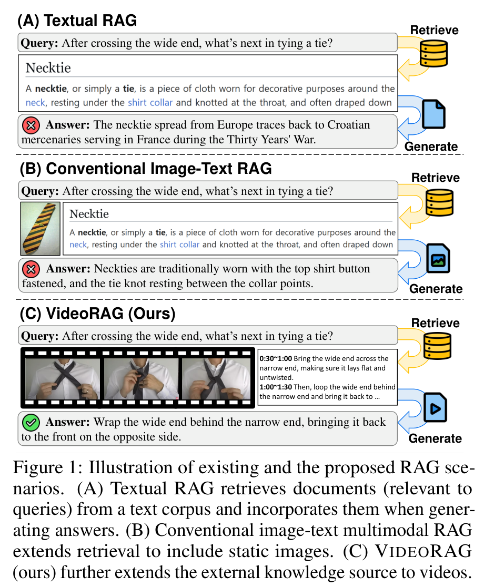

<!-- 圖 1 示意文字 -->
(A) 純文字 RAG：檢索與查詢相關的文字文件並融入答覆生成。  
(B) 傳統圖文 RAG：將檢索擴展至包含靜態圖像。  
(C) VideoRAG（本研究）：進一步將外部知識源擴展至動態影片。  
<!-- 圖 1 示意文字結束 -->

**圖 1：現有 RAG 場景與本研究所提 VideoRAG 之對比示意圖。**(A) 文字 RAG 從文字語料庫檢索與查詢相關的文件並融入生成答覆。(B) 傳統圖文多模態 RAG 將檢索擴展至包含靜態圖像。(C) VideoRAG（本研究）進一步將外部知識來源擴展至影片。

然而，雖然現有的 RAG 方法已被廣泛應用於各種真實世界情境，但它們主要集中於檢索與融入文字內容（Ram et al., 2023; Jeong et al., 2024a），僅有近期的嘗試開始探索將圖像（或圖文對）作為外部知識的附加來源（Yu et al., 2024; Riedler and Langer, 2024）。相對地，我們認為存在一個快速擴展卻尚未被充分利用的媒介——**影片（Videos）**。影片提供了無與倫比的多模態豐富性，是擴展當前 RAG 系統知識圖景極具吸引力的資源。具體而言，影片結合了時間動態、空間細節與多模態線索，能夠共同捕捉複雜的過程、依賴上下文的互動以及非語言訊號，而這些是靜態模態（如文字和圖像）往往無法傳達的。此外，鑑於影片分享平台（如 YouTube）日益普及，豐富且高品質的影片資料大量增加，涵蓋教學指南、科學演示到個人經驗與即時事件，這些在建構使用者查詢答覆時皆非常實用。

近期的少數研究開始考慮利用影片內容來處理使用者查詢；然而，它們仍存在局限性。例如，有些研究假設與查詢相關的影片已被預先指定，轉而專注於在該指定影片中識別與查詢相關的影格（Luo et al., 2024; Ma et al., 2024）。雖然這在明確提供相關影片的情境下有效，但對於更一般的應用場景卻非最佳解，因為使用者期望系統能夠動態識別並檢索影片以提供答覆。另一方面，其他研究則透過將影片轉換為文字格式（如字幕），並在現成的基於文字的 RAG 管道中利用這些文字表徵來處理影片（Arefeen et al., 2024; Zhang et al., 2024b）。然而，這種純文字策略雖然提供了一種便利的替代方案，但在轉換過程中丟棄了關鍵資訊（例如視覺上下文中捕捉的時間動態），從根本上犧牲了影片資料的多模態豐富性。例如，考慮查詢：「狗生氣時表情如何變化？」。雖然文字逐字稿可能會描述狗的吠叫或低吼，但它們無法捕捉視覺線索（露出牙齒、豎起頸毛或瞇起眼睛），而這些線索對於精確解釋狗的情感狀態並隨後建構查詢答覆至關重要。

為解決上述局限性，我們提出了一個全新的架構——**VideoRAG**，旨在透過對影片內容進行整體檢索與融入，為現有的 RAG 架構提供另一個富有成效的視角（參見圖 1）。具體而言，在回應查詢時，本研究所提之 VideoRAG 不僅能從龐大的影片語料庫中檢索相關影片，還能將視覺與文字元素共同整合至答覆生成流程中。此外，我們利用近期大型視覺語言模型（LVLMs）的先進能力來實現此點，這些模型能夠在統一的架構內直接處理包含視覺與文字資訊的影片內容，從而更有效率地捕捉其多模態豐富性。

然而，將影片整合至 RAG 架構中仍存在幾個挑戰。首先，影片在本質上具備長度長且冗餘度高的特點，這使得 LVLM 往往因上下文容量有限而無法處理所有影格，且由於並非所有影格都對檢索和生成有實質貢獻，處理所有影格亦不必要。為了解決這個問題，我們引入了一個**影格選擇模型（Frame Selection Model）**，經由訓練來提取最具資訊量的影格子集，以最大化檢索與生成效能。此外，我們觀察到，雖然聯合利用視覺與文字特徵對於有效表徵影片及其後續檢索不可或缺，但影片的文字描述（如字幕）往往無法取得。為解決此問題，我們進一步提出了一套簡單而有效的緩解策略，利用自動語音識別（ASR）技術從影片中生成輔助文字逐字稿，使我們能夠為每支影片同時利用視覺與文字兩種模態。

為了驗證 VideoRAG 的有效性，我們使用 WikiHowQA 資料集（Bolotova-Baranova et al., 2023，包含查詢-答覆對）與 HowTo100M 資料集（Miech et al., 2019，包含查詢-影片對，但無答覆）中重疊的查詢進行實驗。基於此，我們自動建構了影片 RAG 資料集並在上面評估模型。實驗結果顯示，本研究所提之 VideoRAG 架構相較於相關基準模型獲得了顯著的效能提升，證實了利用影片進行 RAG 的卓越功效。

---

## **2 方法 (Method)**

我們介紹 VideoRAG，該架構能檢索與查詢相關的影片，並基於這些影片生成具備事實依據的答覆。

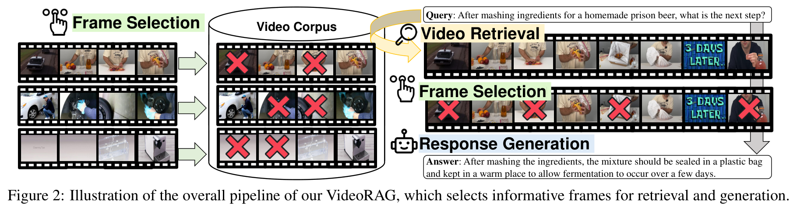

<!-- 圖 2 示意文字 -->
查詢：製作監獄自製啤酒混和原料後，下一步是什麼？  
影片語料庫 -> 影格選擇 -> 影片檢索 -> 影格選擇 -> 答覆生成  
答覆：搗碎原料後，應將混合物密封在塑膠袋中並置於溫暖處，讓其發酵數天。  
<!-- 圖 2 示意文字結束 -->

**圖 2：VideoRAG 整體管道示意圖，包含選擇具資訊量的影格以進行檢索與生成。**

### **2.1 預備知識 (Preliminaries)**

我們首先描述 RAG 與 LVLMs。

**檢索增強生成 (RAG)**：RAG 旨在透過將基底模型的輸出定位於從外部知識源（如維基百科）檢索到的外部知識來增強其能力，包含兩個主要組件：檢索模組與生成模組。形式上，給定一個查詢 $q$，RAG 透過檢索模組，根據外部語料庫 $C$ 中的文件（或知識元素） $K = \{k_1, k_2, \dots, k_k\}$ ($K \subseteq C$) 與 $q$ 的關聯性進行檢索，可公式化為：$K = \text{Retriever}(q, C)$。在此，查詢 $q$ 與知識 $k$ 被表示為 Token 序列：$q = [q_1, q_2, \dots, q_i]$ 與 $k = [k_1, k_2, \dots, k_j]$。此外，在檢索過程中，查詢與語料庫中每個知識元素之間的關聯性由評分函數 $\text{Sim}(q, k)$ 決定，該函數通常衡量它們在嵌入空間中的表徵相似度。在隨後的生成步驟中，檢索到的知識元素將作為生成模組的附加輸入，擴充查詢以產生答覆 $y$：$y = \text{Model}(q, K)$，其中 $\text{Model}$ 通常由 LLM 等基底模型實現。我們注意到，與主要關注於檢索與融入文字內容（或在少數近期案例中融入額外靜態圖像）的現有 RAG 不同，我們探索了向影片模態的擴展。

**大型視覺語言模型 (LVLMs)**：在 LLMs 廣泛的語言理解能力基礎上，LVLMs 被設計用於在統一的 Token 處理架構內處理與納入影片內容的特徵（包括時間、空間與多模態資訊）。形式上，讓影片 $V$ 表示為視覺影格序列：$V = [v_1, v_2, \dots, v_n]$，其關聯的文字資料（如字幕或任何其他文字資訊，例如特定影片的查詢）$t$ 表示為 Token 序列：$t = [t_1, t_2, \dots, t_m]$。接著，典型的 LVLM（表示為 $\text{LVLM}$）透過採用兩個專用組件：視覺編碼器（Vision Encoder）與文字編碼器（Text Encoder），來實現對這些多模態輸入的聯合處理。具體而言，視覺編碼器處理影片影格序列 $V$（可跨越支影片），產生視覺特徵嵌入（或視覺 Token）序列：$F_{\text{visual}} = \text{VisionEncoder}(V)$。同時，文字編碼器處理給定的文字資訊 $t$ 以生成相應的特徵嵌入：$F_{\text{text}} = \text{TextEncoder}(t)$。隨後，獲得影片表徵（旨在同時捕捉視覺與文字特徵）的整體流程可表示如下：$f_{\text{video}} = \text{LVLM}(V, t)$。傳統上，$f_{\text{video}}$ 是透過簡單插值視覺與文字表徵獲得的：$f_{\text{video}} = \alpha \cdot F_{\text{text}} + (1 - \alpha) \cdot F_{\text{visual}}$ (Xu et al., 2021)；而近期則能透過幾個位於現有 LLM 之上的 LVLM 層共同處理視覺與文字嵌入 (Zhang et al., 2024c)，從而使模型能夠學習到更有效的表徵並繼續生成下一序列 Token（例如查詢的答覆）。

### **2.2 VideoRAG 架構**

我們現在介紹 VideoRAG，該架構透過利用影片語料庫作為外部知識來源來擴展現有的 RAG 範式。

**影片檢索 (Video Retrieval)**：在影片語料庫上實施 RAG 的首要步驟是實現影片檢索，其目標是從包含大量影片的語料庫 $C$ 中識別與查詢相關的影片集 $V = \{V_1, V_2, \dots, V_k\}$：$V = \text{Retriever}(q, C)$。回顧此檢索過程包含計算查詢 $q$ 與每個知識元素（在我們的案例中為影片 $V$）之間的相似度以確定其關聯性。為了達成此點，我們首先將影片 $V$（由圖像影格組成，若有則包含字幕）以及查詢 $q$（無視覺資訊）輸入 LVLM，獲得其表徵 $f_{\text{query}}$ 與 $f_{\text{video}}$。之後，基於表徵層級的相似度（例如餘弦相似度）計算關聯性，並檢索相似度得分最高的 前-$k$ 支影片。

**影片增強答覆生成 (Video-Augmented Response Generation)**：在完成查詢相關影片的檢索後，下一步是將檢索到的影片融入答覆生成流程中，以建構立足於這些影片的答覆。為了實現此操作，我們首先將每支檢索到的影片影格與其關聯的文字資料（如字幕）進行串接，然後將所有檢索到的影片的多模態對進行串接，最後附加上使用者查詢：$[V_1, t_1, \dots, V_k, t_k, q]$。接著，將此輸入送入 LVLM，實現視覺、文字與查詢特定資訊的聯合處理，從而捕捉其多模態豐富性與動態特性以生成答覆。

### **2.3 VideoRAG 的影格選擇機制 (Frame Selection for VideoRAG)**

與使用文字或圖像的傳統 RAG 不同，將影片納入 RAG 會帶來額外挑戰：部分影片包含大量的視覺影格，導致處理所有影格效率極低（有時甚至因 LVLM 的上下文長度限制而不可行）。作為簡單的替代方案，常見方法是進行均勻採樣（Uniform Sampling）；然而，此方法存在丟棄關鍵資訊同時保留冗餘或無關影格的風險，導致在由非最佳影格增強時產生次佳的檢索與答覆生成。

**自適應影格選擇 (Adaptive Frame Selection)**：為了克服這些限制，我們引入了自適應影格選擇策略，其目標是提取最具資訊量且在計算上可行的影格子集。讓 $\text{Comb}(\cdot)$ 表示基於組合從影片全部 $n$ 個影格中隨機採樣 $m$ 個影格子集的選擇函數，並讓 $f(\cdot)$ 為評估並給予這些所選影格關聯性得分的評分函數。接著，在檢索期間，給定影片 $V$ 的影格選擇操作表示如下：

$$\tilde{V} = \arg\max_{V' \in \text{Comb}(V, m)} f(V')$$

而在生成階段則擴展為：

$$\tilde{V} = \arg\max_{V' \in \text{Comb}(V, m)} f(V', q)$$

其中 $\tilde{V}$ 為最佳子集。檢索與生成之間的區別在於：檢索作用於龐大的影片語料庫 $C$，使得基於查詢進行窮舉處理不可行；而在生成中，檢索到的前-$k$ 支影片允許進行查詢引導的影格選擇（即即使檢索到的影片相同，也能針對不同查詢使用不同的影格）。

**利用分群縮減影格空間 (Frame Space Reduction with Clustering)**：雖然自適應影格選擇策略能在 RAG 中使用最有效的影格子集，但從 $\text{Comb}$ 獲得的可能影格子集的組合空間仍然龐大到難以承受。例如，從包含 1000 個影格的影片中選擇 32 個影格會產生超過 $10^{60}$ 種可能的組合，使得窮舉搜尋成為不可能。為了解決這個問題，我們透過 $k$-means++ 分群提取具代表性的樣本來縮減影格選擇空間。具體而言，我們將所有影格分成 $k$ 個群組，並從這 $k$ 個群組中選擇最接近群集中心點（Centroid）的影格。隨後，我們將影格選擇過程限制在這個縮減後的集合內；例如當 $k = 64$ 時，搜尋空間從 $C_{32}^{1000}$ 大幅縮減至 $C_{32}^{64}$，在保留所選影格多樣性的同時使計算變得切實可行。

**實作影格選擇 (Operationalizing Frame Selection)**：值得注意的是，用於評分所選影格的評分函數 $f$ 設計非常靈活，允許我們使用任何能夠處理視覺特徵（在生成階段亦可處理文字特徵）的模型，例如 CLIP (Radford et al., 2021)。此外，我們透過對隨機選擇的影格（來自可能的組合）執行檢索與生成，並根據其成功與否將其標記為 True 或 False 來收集訓練 $f$ 的範例，進而使用傳統的損失函數（如交叉熵 Cross-Entropy）進行優化。我們在附錄 A.3 中提供了更多細節。

### **2.4 輔助文字生成 (Auxiliary Text Generation)**

在檢索與生成步驟中，納入影片關聯的文字資料（如字幕）在增強影片表徵方面發揮著至關重要的作用，因為它提供了補充視覺內容的附加上下文與語意線索。然而，語料庫中的每支影片並不一定都帶有字幕，因為字幕需要額外的標註。因此，對於此類影片，我們提出透過從影片中提取音訊，並使用現成的自動語音識別（ASR）技術將其轉換為文字來生成輔助文字資料。形式上，給定影片 $V$，此流程可表示如下：$t_{\text{aux}} = \text{AudioToText}(\text{Audio}(V))$，其中 $\text{Audio}(V)$ 從影片中提取音訊軌道，而 $\text{AudioToText}$ 將提取的音訊訊號轉換為文字內容。因此，對於沒有字幕的影片，可以用輔助文字 $t_{\text{aux}}$ 代替 $t$ 應用於檢索與生成步驟中。

---

## **3 實驗 (Experiment)**

我們現在描述實驗設定與結果。

### **3.1 實驗設定 (Experimental Setup)**

**資料集 (Datasets)**：遵循驗證 RAG 方法的慣例 (Asai et al., 2024; Jeong et al., 2024a)，我們在問答任務中評估 VideoRAG。首先，我們使用 WikiHowQA (Bolotova-Baranova et al., 2023)，該資料集提供了從 WikiHow 網頁提取的廣泛指導性問題，並附有人工撰寫的高品質標準答案（Ground Truth）。此外，對於影片語料庫，我們使用了 HowTo100M (Miech et al., 2019)，這是一個來自 YouTube 的綜合指導性影片集合，並根據搜尋結果進一步與 WikiHow 的查詢關聯。此外，為了進行全面評估，我們在 HowTo100M 上自動生成了查詢-答覆對（參見附錄 A.2）並在其上評估效能。

**基準模型與我們的模型 (Baselines and Our Model)**：我們將 VideoRAG 與五種不同的基準模型進行比較：
1. **NAÏVE**：僅根據查詢生成答覆，無任何附加上下文。
2. **TEXTRAG (BM25)**：基於文字的 RAG 模型，透過 BM25 (Robertson et al., 1994) 根據與查詢的關聯性從維基百科檢索文件，並生成以其為依據的答覆。
3. **TEXTRAG (DPR)**：與 TEXTRAG (BM25) 類似的文字 RAG，但使用 DPR (Karpukhin et al., 2020) 執行檢索。
4. **TEXTIMAGERAG**：遵循傳統圖文多模態 RAG 方法 (Chen et al., 2022; Yasunaga et al., 2023)，檢索一對與查詢相關的文字文件與圖像，並利用它們進行生成。
5. **TEXTVIDEORAG**：遵循先前基於影片的 RAG 方法 (Arefeen et al., 2024; Zhang et al., 2024b)，首先將影片表示為文字描述（如字幕或逐字稿），並僅在檢索和生成中利用這些文字資訊。
6. **VIDEORAG**：我們的模型，包含兩個變體：**VIDEORAG-V**（僅利用影片影格作為上下文，為生成提供視覺基礎）與 **VIDEORAG-VT**（聯合利用影片影格與文字逐字稿）。此外，為評估效能提升的空間，我們包含了 **ORACLE** 版本的 VideoRAG，該版本直接使用 HowTo100M 中標註的與查詢預先關聯的標準答案影片，而非使用檢索結果。

**評估指標 (Evaluation Metrics)**：我們使用以下指標：
1. **ROUGE-L**：衡量生成答覆與標準答案之間的最長公共子序列 (Lin, 2004)。
2. **BLEU-4**：計算生成答覆與參考答覆之間的 N-gram（最多 4-gram）重疊度 (Papineni et al., 2002)。
3. **BERTScore**：透過從 BERT (Devlin et al., 2019) 提取嵌入並計算其相似度，衡量生成答覆與參考答覆之間的語意對齊度 (Zhang et al., 2020)。
4. **G-Eval**：利用 LLM 的評估能力 (Liu et al., 2023)，我們提示 GPT-4o-mini 在 5 分制 Likert 量表上對生成答覆與參考答覆進行評分（提示詞見表 14）。

**實作細節 (Implementation Details)**：我們考慮了多個 LVLM：包含 7B 參數的 LLaVA-Video、8B 的 InternVL 2.5 以及 3B 的 Qwen-2.5-VL 用於生成 (Zhang et al., 2024c; Chen et al., 2024b; Team, 2025)，以及 InternVideo2 (Wang et al., 2024c) 用於檢索（模型選擇詳情請見附錄 A.1）。為了提升效率，我們在檢索時每支影片使用 4 個影格，而在生成時使用 32 個影格（若影片短於 32 秒則使用所有影格，以 1 fps 採樣）。在輔助文字生成中，我們使用 Whisper (Radford et al., 2023)。

---

### **3.2 實驗結果與分析 (Experimental Results and Analyses)**

我們現在展示主要結果與各項分析。

**表 1：跨四種指標的整體 RAG 結果。最佳結果以粗體標示，次佳結果底線標示。請注意，ORACLE 設定（使用理想檢索結果）不可與其他設定直接比較。**

| 模型架構 | 方法 | **WikiHowQA (HowTo100M)** | | | | **Synthetics QA (HowTo100M)** | | | |
|---|---|---|---|---|---|---|---|---|---|
| | | **ROUGE-L** | **BLEU-4** | **BERTScore** | **G-Eval** | **ROUGE-L** | **BLEU-4** | **BERTScore** | **G-Eval** |
| **LLaVA-Video (7B)** | **NAÏVE** | 14.08 | 1.352 | 83.43 | 1.579 | 10.68 | 1.574 | 84.51 | 1.634 |
| | **TEXTRAG (BM25)** | 17.22 | 2.327 | 84.66 | 1.633 | 14.70 | 2.382 | 86.03 | 1.681 |
| | **TEXTRAG (DPR)** | 16.65 | 2.173 | 84.61 | 1.591 | 14.58 | 2.397 | 85.85 | 1.686 |
| | **TEXTIMAGERAG** | 22.43 | 4.222 | 86.88 | 2.022 | 25.19 | 6.149 | 88.56 | 2.175 |
| | **TEXTVIDEORAG** | 22.81 | 4.388 | 86.97 | 1.979 | 23.41 | 5.435 | 88.40 | 2.278 |
| | **VIDEORAG-V** | **24.95** | 5.080 | 87.85 | 2.140 | 29.38 | 7.530 | **89.77** | **2.479** |
| | **VIDEORAG-VT** | 24.93 | **5.276** | **87.92** | **2.142** | **29.74** | **8.043** | 89.72 | 2.476 |
| | **ORACLE-V** | 26.19 | 5.480 | 88.41 | 2.225 | 32.16 | 8.769 | 90.34 | 2.884 |
| | **ORACLE-VT** | 25.37 | 5.237 | 87.95 | 2.166 | 32.31 | 8.885 | 90.46 | 2.938 |
| **InternVL 2.5 (8B)** | **NAÏVE** | 16.54 | 1.859 | 84.30 | 1.720 | 12.60 | 2.381 | 85.12 | 1.725 |
| | **TEXTRAG (BM25)** | 17.41 | 2.275 | 84.89 | 1.552 | 26.66 | 6.760 | 88.48 | 1.938 |
| | **TEXTRAG (DPR)** | 17.21 | 2.077 | 84.84 | 1.563 | 26.72 | 6.579 | 88.56 | 1.917 |
| | **TEXTIMAGERAG** | 22.39 | 3.917 | 86.91 | 1.904 | 27.65 | 7.187 | 88.99 | 2.176 |
| | **TEXTVIDEORAG** | 19.88 | 3.199 | 85.81 | 1.686 | 26.36 | 6.542 | 88.68 | 1.983 |
| | **VIDEORAG-V** | **25.11** | 4.243 | **88.15** | 1.863 | **33.68** | 9.454 | **90.29** | **2.452** |
| | **VIDEORAG-VT** | 23.75 | **4.271** | 87.42 | **1.906** | 32.90 | **9.572** | 90.14 | 2.427 |
| | **ORACLE-V** | 25.59 | 4.318 | 88.29 | 1.958 | 35.21 | 10.57 | 90.70 | 2.813 |
| | **ORACLE-VT** | 24.60 | 4.421 | 87.70 | 2.002 | 34.99 | 10.69 | 90.68 | 2.820 |
| **Qwen-2.5-VL (3B)** | **NAÏVE** | 17.96 | 2.077 | 84.97 | 1.765 | 15.05 | 2.729 | 86.13 | 1.843 |
| | **TEXTRAG (BM25)** | 19.65 | 2.989 | 85.41 | 1.721 | 19.70 | 3.911 | 86.88 | 1.877 |
| | **TEXTRAG (DPR)** | 19.45 | 2.863 | 85.38 | 1.708 | 19.04 | 3.903 | 86.77 | 1.831 |
| | **TEXTIMAGERAG** | 20.66 | 3.327 | 85.80 | 1.838 | 20.36 | 4.298 | 87.11 | 1.931 |
| | **TEXTVIDEORAG** | 22.18 | 4.180 | 86.56 | 1.821 | 24.29 | 5.722 | 88.37 | 2.156 |
| | **VIDEORAG-V** | **23.24** | 3.963 | **87.13** | **1.899** | 26.28 | 5.998 | 88.97 | 2.258 |
| | **VIDEORAG-VT** | 23.22 | **4.531** | 87.00 | 1.876 | **27.54** | **7.279** | **89.11** | **2.274** |
| | **ORACLE-V** | 21.53 | 3.156 | 86.05 | 1.912 | 26.82 | 6.683 | 88.96 | 2.515 |
| | **ORACLE-VT** | 24.37 | 4.811 | 87.43 | 1.994 | 29.76 | 7.721 | 89.56 | 2.566 |

**主要結果**：我們在表 1 中展示了主要結果，展現了使用不同類型檢索知識時各模型的效能。首先，我們發現所有 RAG 模型均顯著優於 NAÏVE 基準模型，再次證實了外部知識在提升生成答覆事實準確性方面的關鍵作用。此外，在這些模型中，我們的 VIDEORAG 取得了最佳效能，顯著超越了傳統的文字、圖文或文字影片 RAG 基準模型。這一提升驗證了我們的假設：影片內容是 RAG 有用的資源，因為它比其他模態提供了更豐富、更詳細的資訊。最後，VIDEORAG-V 與 VIDEORAG-VT 之間的效能差距較小，這表明答覆生成所需的大量必要資訊已被有效地封裝在影片的視覺特徵中，這些特徵本質上包含了透過文字描述所傳達的資訊。

**影片檢索的影響**：我們假設檢索影片的品質是 RAG 成功的關鍵因素，因為它能直接影響隨後的答覆生成流程。為確認此點，我們比較了使用檢索影片的 VideoRAG 與使用 Oracle 設定（代表具有完美相關影片檢索的理想情境）的效能。接著，表 1 顯示 Oracle 設定取得了最高效能，凸顯了透過推進我們 VideoRAG 內的影片檢索機制來實現進一步提升的潛力。

**表 2：影片檢索結果，分別使用僅視覺特徵、僅文字特徵或其特徵整合。**

| **特徵 (Features)** | **R@1** | **R@5** | **R@10** |
|---|---|---|---|
| **僅視覺 (Visual)** | 0.054 | 0.193 | 0.288 |
| **僅文字 (Textual)** | 0.088 | 0.302 | 0.388 |
| **整合 (Ensemble)** | **0.103** | **0.311** | **0.442** |

**文字與視覺特徵的功效**：在執行影片檢索時，不同模態（如文字、視覺或兩者結合）對影片表徵的貢獻程度是一個關鍵問題，我們在表 2 中報告了不同模態的結果。我們觀察到文字特徵持續優於視覺特徵，這可能是因為文字特徵與文字使用者查詢之間具備更強的語意對齊度。為了進一步檢驗此點，我們在圖 3 的潛在空間中主成分分析（PCA）視覺化了影片內容的文字與視覺特徵嵌入以及查詢嵌入（見圖 3），結果清晰地揭示了文字查詢嵌入與文字影片表徵之間的距離相較於視覺影片表徵更為接近。這可能是由於視覺特徵相對於基於文字的查詢存在模態間隙（Modality Gap），導致檢索效能次佳。然而，將文字與視覺特徵結合取得了最高效能，證明了這兩種模態在檢索影片表徵中的互補特性。

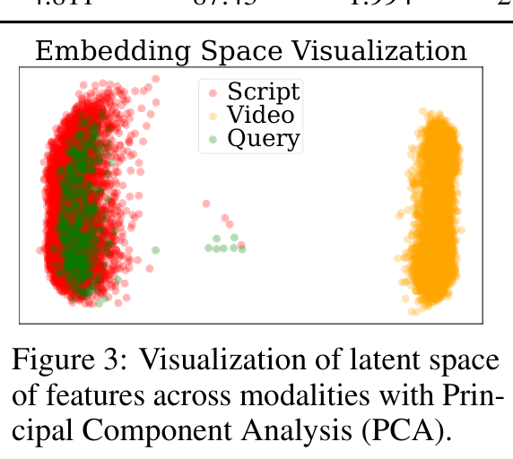
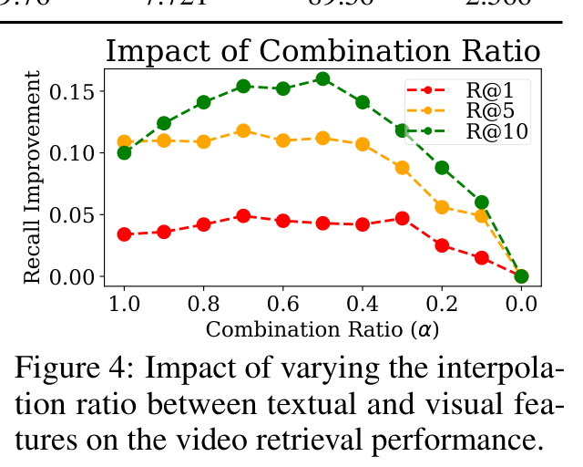

**圖 3：跨模態特徵潛在空間之 PCA 視覺化。**  
**圖 4：改變文字與視覺特徵插值比例對影片檢索效能之影響。**

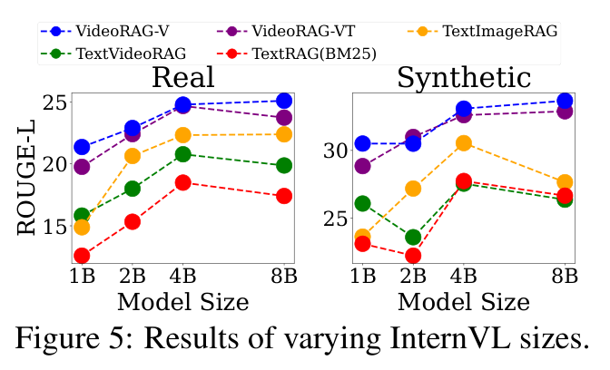
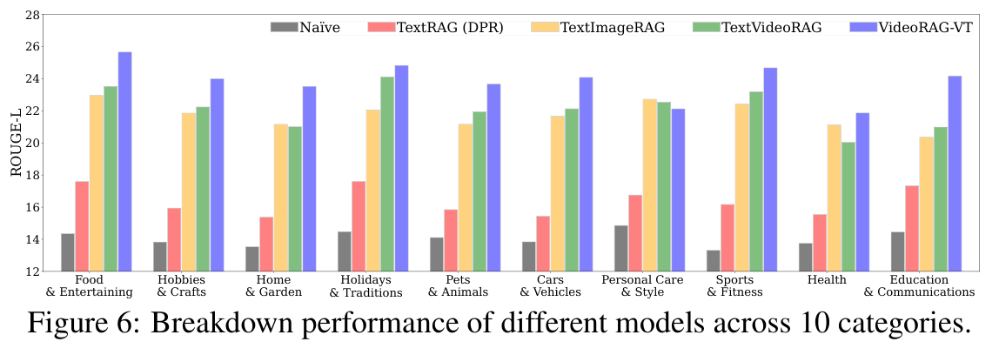

**圖 5：變更 InternVL 模型大小的結果。**  
**圖 6：不同模型在 10 個類別上的細分效能表現。**

**表 3：均勻採樣與我們的影格選擇方法在檢索與生成任務上的效能比較。**

| 任務 (Task) | 方法 (Method) | R@1 / ROUGE-L | R@5 / BLEU-4 | R@10 / BERTScore |
|---|---|---|---|---|
| **檢索 (僅視覺)** | 均勻採樣 (Uniform) | 0.054 | 0.193 | 0.288 |
| | 自適應影格選擇 (Ours) | **0.079** | **0.249** | **0.367** |
| **檢索 (整合)** | 均勻採樣 (Uniform) | 0.097 | 0.305 | 0.448 |
| | 自適應影格選擇 (Ours) | **0.118** | **0.324** | **0.453** |
| **生成** | 均勻採樣 (Uniform) | 21.04 | 3.249 | 86.07 |
| | 自適應影格選擇 (Ours) | **23.24** | **3.963** | **87.13** |

**表 4：不同知識模態組合的消融實驗。對於 TEXTRAG，我們使用 BM25 檢索文字文件。**

| 方法 (Methods) | 文件 (Document) | 影片 (Video) | 字幕 (Subtitle) | ROUGE-L | G-Eval |
|---|---|---|---|---|---|
| **NAÏVE** | $\times$ | $\times$ | $\times$ | 14.08 | 1.579 |
| **TEXTRAG (BM25)** | $\checkmark$ | $\times$ | $\times$ | 17.22 | 1.633 |
| **VIDEORAG-V** | $\times$ | $\checkmark$ | $\times$ | 24.95 | 2.140 |
| **VIDEORAG-VT** | $\times$ | $\checkmark$ | $\checkmark$ | **25.23** | **2.104** |
| **VIDEORAG-VT + TEXTRAG** | $\checkmark$ | $\checkmark$ | $\checkmark$ | 24.35 | 2.048 |

**類別細分效能分析**：為了評估 VideoRAG 在多樣化查詢類型上的強健性，我們在 WikiHow 標註的 10 個類別上細分了效能。如圖 6 所示，VIDEORAG-VT 在所有類別（除了一項外）上均優於所有基準模型，這凸顯了其處理各種查詢的能力。此外，VIDEORAG-VT 在 *飲食與娛樂 (Food & Entertaining)* 類別中展示出顯著的效能提升，考慮到該類別的問題往往極大地受益於視覺細節，這非常合理；例如查詢：*「如何製作健康的菠菜大蒜菜餚」* 需要食材準備或烹飪技巧，這些無法單靠文字有效傳達。因此，該類別的結果再次證實了利用影片內容作為 RAG 外部知識的重要性。

**特徵整合分析**：為了更好地理解文字與視覺特徵在影片檢索中的貢獻，我們分析了變更其結合比例 ($\alpha$) 如何影響不同指標上的效能。如圖 4 所示，平衡文字與視覺特徵的最佳比例約為 0.5 到 0.7（根據指標略有差異）。這些結果進一步凸顯了文字與視覺特徵在檢索影片表徵中的互補貢獻，同時由於模態間隙（圖 3），稍微偏向文字特徵可能更佳。

**影格選擇的有效性**：我們分析了自適應影格選擇的功效，在檢索與生成中將其與均勻採樣進行比較。表 3 顯示我們的策略在兩項任務中均優於均勻採樣，證明了其選擇更有用影格的能力。表 9（檢索）以及表 10 和 11（生成）的定性結果亦凸顯了影格選擇相較於均勻採樣（其影格往往冗餘或相關性較低）的優勢。

**消融研究 (Ablation Studies)**：為了分析效能如何隨不同的知識來源變化，我們進行了消融研究並在表 4 中展現結果。由此我們觀察到，雖然納入外部知識（無論是來自文字百科全書來源還是影片語料庫）相較於 NAÏVE 基準模型都能持續提升效能，但同時使用影片與通用文字文件的做法效能略有下降。這表明從百科全書知識庫檢索的文字內容可能會引入冗餘或不相關的細節，這些細節可能與影片內容提供的資訊重疊或矛盾，從而導致 VideoRAG 架構的有效性降低。

**不同模型大小的分析**：為了觀察 VideoRAG 是否能適應不同規模的 LVLM，我們在圖 5 中報告了其在不同 InternVL2.5 模型大小下的效能。VIDEORAG 的效能隨著模型大小增加而提升（歸功於較大模型中卓越的影片理解能力），展示了我們 VideoRAG 的可擴展性（Scalability），並進一步暗示了其在更大 LVLM 上的潛在益處。

**表 5：NAÏVE 與 VIDEORAG-V 方法的案例研究比較。**

| 模型 / 類型 | 內容描述 |
|---|---|
| **NAÏVE** | |
| **問題** | 請說明如何在汽車儀表板上烘焙餅乾。 |
| **生成的答覆** | 很抱歉，在汽車儀表板上烘焙餅乾是不可能的。儀表板並非為烹飪設計，將其用作熱源並不安全。此外，烘焙產生的煙霧可能對您和汽車內部有害。烘焙需要一個具有穩定溫度的受控環境，這在汽車中很難實現。此外，儀表板由在高溫下容易起火或釋放有毒煙霧的材料製成。如果您想烘焙餅乾，最好在安全且受控的環境中進行，例如廚房或戶外烤肉架。只要記住烹飪時始終遵循適當的安全預防措施和指南。 |
| **VIDEORAG-V** | |
| **問題** | 請說明如何在汽車儀表板上烘焙餅乾。 |
| **檢索到的影片** | （檢索到關於在汽車儀表板上烘烤餅乾的實際教學影片） |
| **生成的答覆** | 要在汽車儀表板上烘焙餅乾，您需要防沾噴霧、餅乾烤盤、餅乾麵團、抹刀和溫度計。首先，在烤盤上噴上防沾噴霧。然後，將餅乾麵團放在噴好的烤盤上。用保鮮膜蓋住並靜置。接著，將烤盤放在汽車儀表板上，確保溫度至少達到華氏 95 度（約攝氏 35 度）。將車停在陽光充足的地方烘烤餅乾。烘烤後，用抹刀將餅乾從儀表板上移開。 |
| **真實標準答案** | 要在汽車儀表板上烘焙餅乾，您需要停在氣溫至少華氏 95 度的陽光充足處。首先，將餅乾麵團鋪在鋪有烘焙紙的烤盤上。然後，將烤盤放在汽車儀表板上，並關上所有車門。最後，每 15-30 分鐘檢查一次餅乾，直到餅乾邊緣變硬，且您能將其滑離烘焙紙。 |

**真人評估 (Human Evaluation)**：為了補充自動評估指標，我們進行了真人評估。具體而言，我們招募了 12 名評估員，將隨機採樣的 50 個查詢分成兩組（每組 25 個），指派每位參與者使用 5 分 Likert 量表評估一組（包含四個基準模型與我們模型的答覆）。表 6 展示的結果顯示，我們的 VideoRAG 在真人評估中獲得了最高分。此外，為了驗證真人評估的品質與可靠性，我們透過計算不同標註者評分之間的 Spearman 相關係數，衡量了評估同一子集的標註者之間的標註者間信度（Inter-annotator Agreement）。我們獲得了 0.632 的係數，證實了我們評估的高度可靠性。同樣地，我們衡量了人工評估與基於模型的評估（G-Eval）之間的吻合度，獲得了 0.588 的係數，表明 G-Eval 是一個合理的判斷替代指標。

**表 6：真人評估結果。結果係在 HowTo100M 語料庫上的 WikiHowQA 子集中評估。**

| 方法 (Methods) | 人工評分 (Human) | G-Eval 評分 |
|---|---|---|
| **NAÏVE** | 1.833 | 1.684 |
| **TEXTRAG (DPR)** | 1.867 | 1.747 |
| **TEXTIMAGERAG** | 2.447 | 2.203 |
| **TEXTVIDEORAG** | 3.130 | 2.279 |
| **VIDEORAG-VT** | **4.043** | **3.689** |

**案例研究 (Case Study)**：最後，我們提供一個案例研究範例，查詢為：*「請說明如何在汽車儀表板上烘焙餅乾」*。如表 5 所示，NAÏVE 基準模型僅依賴其參數化知識，生成了一個泛泛的答覆，強調該方法的不切實際性與安全疑慮，未能提供解決查詢所需的方向步驟。這個範例表明了參數化知識不足的局限性，特別是在需要特定且不常見的資訊時。相反地，VIDEORAG-V 檢索到了展示在汽車儀表板上烘焙餅乾過程的相關影片，透過利用該影片，成功生成了與標準答案高度相似的答覆。這凸顯了 VideoRAG 如何利用外部影片內容來產生更精確、上下文更豐富且具可操作性的答覆。我們在附錄 D 的表 12 中提供了另一個範例。

---

## **4 相關工作 (Related Work)**

**檢索增強生成 (RAG)**：RAG 是一項結合檢索與生成流程的策略，透過將輸出定位於外部知識來產生精確答覆 (Ram et al., 2023; Zhao et al., 2024)。具體而言，在檢索步驟中，透過計算文件與查詢的相似度，從大型語料庫中選出與查詢相關的文件 (Robertson et al., 1994; Jones, 2004; Karpukhin et al., 2020; Izacard et al., 2022)。在生成步驟中，這些檢索到的文件作為輸入生成根植於所提供資訊的答覆 (Jiang et al., 2023; Asai et al., 2024; Hwang et al., 2024; Cheng et al., 2024)，有些進展採用反覆檢索-生成循環 (Trivedi et al., 2023) 或根據查詢複雜度調整不同的 RAG 策略 (Jeong et al., 2024a)。然而，儘管現實世界的大量知識在本質上具備多模態特性 (Lee et al., 2024b; Jeong et al., 2024b; Faysse et al., 2024)，絕大多數 RAG 研究仍集中於文字模態，在融入圖像方面的努力較少，為利用全光譜可用知識實現整體 RAG 運作留下了顯著空白。

**多模態 RAG (Multimodal RAG)**：將 RAG 擴展至納入文字之外的多模態資訊（如圖像 (Chen et al., 2022; Lin and Byrne, 2022; Riedler and Langer, 2024; Yu et al., 2024)、程式碼 (Guo et al., 2024)、表格 (Pan et al., 2022; Biswal et al., 2024) 與音訊 (Yuan et al., 2024)）的興趣正日益濃厚。然而與它們不同，影片為 RAG 提供了獨特且正交的優勢，因為影片以其他模態無法比擬的方式封裝了時間動態、空間細節與多模態線索。受此事實啟發，非常近期的研究開始探索在 RAG 管道中使用影片內容；然而現有方法以次佳方式利用影片。具體而言，有些研究專注於從預先選定的影片中提取查詢相關影格並基於其生成答覆，這雖然在受控場景中有用，卻限制了其在開放領域設定中的現實世界適用性 (Luo et al., 2024; Ma et al., 2024)。此外，其他一些研究試圖透過將影片轉換為文字表徵（如字幕或說明）來迴避處理影片資料的複雜性；雖然直接適用於現有的基於文字的 RAG 架構，但它們犧牲了嵌入在影片中的多模態豐富性（如時間動態與空間模式）(Arefeen et al., 2024; Zhang et al., 2024b; Ma et al., 2024)。為了克服這些問題，我們提出了 VideoRAG，能在 LVLM 驅動下動態檢索並整體利用 RAG 中的影片內容。

**大型視覺語言模型 (LVLMs)**：在 LLMs 取得巨大成功的基礎上 (OpenAI, 2023; Anil et al., 2023; Dubey et al., 2024; Cho et al., 2025; Song et al., 2025)，將其擴展至涵蓋圖像 (Lin et al., 2024; Bordes et al., 2024; Zhu and Zhang, 2025) 與程式碼 (DeepSeekAI et al., 2024; Hui et al., 2024) 等多樣化模態的興趣日益增加。此外，這種擴展近期已延伸至影片模態，導致能夠直接處理影片內容的 LVLM 崛起。它們擅長解決傳統上具挑戰性（但直觀）的任務，例如物件或動作檢測，其能力已迅速擴展至解決更具挑戰性的任務，例如分析時空動態以預測事件序列、推斷因果關係以及生成複雜情境的上下文感知描述 (Tang et al., 2023; Wang et al., 2024a; Maaz et al., 2024; Zhang et al., 2024a; He et al., 2024; Wang et al., 2024b; Hwang et al., 2025)，甚至在零樣本設定下亦然 (Chen et al., 2024a; Kim et al., 2024)。然而，它們在 RAG 上下文中的潛力尚未被探索；因此在本文中，我們旨在透過 VideoRAG 填補這一空白。

---

## **5 結論 (Conclusion)**

我們提出了 VideoRAG，這是一個利用影片語料庫作為外部知識來源來擴展當前 RAG 圖景的架構。具體而言，與使用影片文字表徵或假設存在查詢相關影片而無需檢索的現有工作不同，本研究所提之 VideoRAG 根據影片與查詢的關聯性進行檢索，同時將其多模態豐富性（包含視覺與文字元素）整合至 RAG 管道中，並透過自適應影格選擇僅利用全影格中最具資訊量的子集以實現高效與高精確度。此外，透過全面的分析，我們展示了納入視覺或文字特徵（或兩者結合）如何提升檢索與生成效能；受文字特徵關鍵作用（對檢索品質）但在部分影片中缺失的啟發，我們展示了一套簡單而有效的緩解方案，使用自動語音識別來生成文字逐字稿。整體而言，實驗結果驗證了我們的 VideoRAG 優於現有 RAG 方法，我們相信這標誌著朝向能利用影片的整體 RAG 系統邁出了重要一步。

---

## **局限性 (Limitations)**

值得注意的是，我們的 VideoRAG 是率先在影片語料庫上實施完整 RAG 管道的工作之一，包含動態檢索查詢相關影片以及立足於影片的答覆生成；為了評估此運作，需要查詢、相關影片與標準答案答覆的三元組。然而，我們發現此類資料集目前非常有限，為了解決這個問題，我們不僅透過將 WikiHowQA 資料集（提供查詢與答覆對）與 HowTo100M 資料集（提供查詢與影片對）關聯來構建資料集，還自動收集了合成資料集。雖然此過程實現了全面的評估，但作為未來的工作，開發並發布基準資料集以極大地促進影片 RAG 的研究將極具價值。此外，所提出的影格選擇策略極大地提升了檢索與生成的影片處理效率與有效性（因為它將給定影片的全影格縮減為其精簡子集），未來研究若能透過最大化其有效性與效率來進一步提升我們初步探索 (VideoRAG) 的功效，將會非常有趣。

---

## **倫理聲明 (Ethics Statement)**

回顧我們提出的 VideoRAG 旨在透過從大型影片語料庫檢索查詢相關影片來提供使用者查詢的答覆，這有助於提升答覆品質。然而，檢索過程在本質上依賴於語料庫，如果語料庫包含偏見、有害或其他有問題的範例，可能會導致生成的答覆反映這些問題。此外，由於生成流程由 LVLM 驅動，而 LVLM 是在龐大的多模態資料集上訓練的，其答覆可能會繼承並放大訓練資料中存在的偏見。因此，我們建議從業人員仔細評估這些潛在風險，並考慮使用一些策略來緩解它們，例如偏見檢測與過濾 (Shin et al., 2024; Miao et al., 2024; Lee et al., 2024a; Jang et al., 2025)。

---

## **致謝 (Acknowledgements)**

本研究獲得韓國國家研究基金會 (NRF) 補助款 (RS-2023-00256259)、資訊與通訊技術規劃與評估院 (IITP) 補助款 (RS2019-II190075 人工智慧研究生院計畫 (KAIST)、RS-2022-II220713 適用於現實世界問題的金屬學習)、科學技術情報通訊部 (MSIT) 與光州廣域市資助的人工智慧產業融合聚落開發項目、保健福祉部與科學技術情報通訊部資助的韓國藥物發現機器學習帳本編排項目 (K-MELLODDY) 補助款 (RS-202412345678)、DAPA 與 ADD 資助的應用人工智慧研究中心 (CARAI) 補助款 (UD230017TD)，以及科學技術情報通訊部 (MSIT) 資助的全球 AI 前沿實驗室國際合作研究項目 (RS-2024-00469482 & RS-2024-00509279) 的支持。

---

## **參考文獻 (References)**

*(學術文獻引用項目保持國際標準引用格式)*
- Anil, R., et al. (2023). Gemini: A family of highly capable multimodal models. *arXiv preprint arXiv:2312.11805*.
- Arefeen, M. A., et al. (2024). irag: Advancing RAG for videos with an incremental approach. In *Proceedings of CIKM 2024*, pages 4341–4348.
- Asai, A., et al. (2024). Self-rag: Learning to retrieve, generate, and critique through self-reflection. In *ICLR 2024*.
- Bolotova-Baranova, V., et al. (2023). Wikihowqa: A comprehensive benchmark for multidocument non-factoid question answering. In *ACL 2023*, pages 5291–5314.
- Chen, W., et al. (2022). Murag: Multimodal retrieval-augmented generator for open question answering over images and text. In *EMNLP 2022*, pages 5558–5570.
- Chen, Z., et al. (2024b). Expanding performance boundaries of open-source multimodal models with model, data, and test-time scaling. *arXiv preprint arXiv:2412.05271*.
- Devlin, J., et al. (2019). BERT: Pre-training of deep bidirectional transformers for language understanding. In *NAACL 2019*.
- Jeong, S., et al. (2024a). Adaptive-rag: Learning to adapt retrieval-augmented large language models through question complexity. In *NAACL 2024*, pages 7036–7050.
- Karpukhin, V., et al. (2020). Dense passage retrieval for open-domain question answering. In *EMNLP 2020*, pages 6769–6781.
- Lewis, P. S. H., et al. (2020). Retrieval-augmented generation for knowledge-intensive NLP tasks. In *NeurIPS 2020*.
- Luo, Y., et al. (2024). Video-rag: Visually-aligned retrieval-augmented long video comprehension. *arXiv Preprint arXiv:2411.13093*.
- Miech, A., et al. (2019). Howto100m: Learning a text-video embedding by watching hundred million narrated video clips. In *ICCV 2019*, pages 2630–2640.
- Radford, A., et al. (2021). Learning transferable visual models from natural language supervision. In *ICML 2021*, pages 8748–8763.
- Radford, A., et al. (2023). Robust speech recognition via large-scale weak supervision. In *ICML 2023*, pages 28492–28518.
- Wang, Y., et al. (2024c). Internvideo2: Scaling foundation models for multimodal video understanding. In *ECCV 2024*.
- Zhang, T., et al. (2020). Bertscore: Evaluating text generation with BERT. In *ICLR 2020*.
- Zhang, Y., et al. (2024c). Llava-next: A strong zero-shot video understanding model.

---

## **附錄 A：補充實作細節 (Additional Implementation Details)**

### **A.1 用於檢索與生成的 LVLM 選擇細節**
值得注意的是，有各種 LVLM 可供使用，每種模型根據任務需求各有優勢：對於檢索而言，文字與影片特徵之間的精確對齊（從其專用編碼器獲得）至關重要，以確保檢索到的影片在上下文層面與查詢相關；另一方面，生成過程受益於具有高級功能的 LVLM，可以準確構建答覆並將其立足於檢索到的內容中。為了實現這一點，對於檢索，我們使用 InternVideo2 (Wang et al., 2024c)，因為它是專門訓練用來對齊影片與其文字描述之間的語意的。具體而言，我們使用其影片與文字編碼器分別提取影片與文字的嵌入。另一方面，對於影片增強答覆生成，我們使用 LLaVA-Video、InternVL 2.5 和 Qwen-2.5-VL (Zhang et al., 2024c; Chen et al., 2024b; Team, 2025)，這些模型以在影片理解和相關任務上取得最先進的性能而聞名。最後，對於生成，我們檢索並使用了一支影片，因為我們觀察到使用不同數量的影片在生成性能上沒有太大差異，而增加增強影片的數量會大幅增加計算成本。

### **A.2 合成資料生成細節**
為了更徹底地評估我們 VideoRAG 架構的有效性，我們進一步透過提示 LVLM 自動生成以單個影片為依據的問題-答覆對（除了利用真實世界的基準資料集之外）。具體而言，由於我們的目標是從大型語料庫中檢索與查詢相關的影片，生成的問答不應過於針對單個影片；例如特定影格的問題，如 *「在這支影片中，女孩破裂的氣球是什麼顏色？」*。相反，它們應該以更通用的方式構建，以促進多個相關影片的檢索，例如 *「在搗碎自製監獄啤酒的原料後，下一個關鍵步驟是什麼？」*。為了實現這一點，我們為 LLM 構建了一個結構化的提示，提供了關於 RAG 的上下文並概述了生成問題的關鍵原則，例如指示模型創建三個多樣化、結構良好的問題-答覆對，利用影片內容而不適過於具體，並適合 RAG 架構。我們在表 13 中提供了用於引出問題-答覆對生成的提示。此外，我們使用最先進的 GPT-4o 作為合成資料創建的 LVLM。

### **A.3 影格選擇的補充細節**
我們討論如何例行化評分函數 $f$（其目標是給影格子集賦分）用於檢索與生成，以及如何使用從訓練資料集中自動收集的資料集訓練它：

**檢索**：在檢索中，為了高效處理語料庫中的大量影片，我們將影格選擇流程提取的影格數量設定為 4。具體而言，對於每支影片，我們首先以 1 fps 採樣其影格，並使用 CLIP 提取其特徵。此外，如 2.3 節所述，為了消除冗餘並最終縮減影格採樣空間，我們應用 $k$-means++ 分群並提取 8 個候選影格，從而獲得小於 $C_{4}^{8}$ 的採樣空間。接著，$f$ 的目標是給 4 個影格的集合打分，我們透過從 CLIP 獲得這 4 個影格的表示，並將它們串接的表示通過 3 層 MLP 來設計。此外，這個 MLP 網路是用自動收集的標籤進行訓練的，以獲得導致檢索成功的特定影片最具代表性的影格，其中檢索成功是由特定影片的所選影格與其相關查詢之間的高相似度決定的。換句話說，給定查詢與其相關影片的對，我們採樣多組 4 個影格，並衡量它們與給定查詢的相似度，從而將相似度最高的 前-3 個組合標記為 True，將最低的 後-3 個組合標記為 False。然後，基於這些標籤透過交叉熵損失對網路進行優化。

**生成**：與我們選擇檢索影格的方式類似，在生成中，我們的目標是從 64 個候選影格中選擇 32 個影格（透過 $k$-means++ 分群獲得）。值得注意的是，影格數量大於檢索，因為生成更多地受益於對影片內容的全面理解，以提高答覆準確性。此外，在產生的 $C_{32}^{64}$ 種可能組合中，我們隨機採樣 40 個子集，因為 $C_{32}^{64}$ 的空間仍然非常大。對於評分函數 $f$，我們透過從 CLIP 之上的 3 層 MLP 獲得採樣影格以及查詢（以考慮它們與查詢的關聯性）的表徵，然後計算平均影格表徵與查詢表徵之間的點積來設計它。此外，我們透過根據 ROUGE-L 得分以及使用 LLaVA-Video (7B) 作為生成的 LVLM，將 ROUGE-L 得分最高的 前-3 個組合標記為 True，將最低的 後-3 個標記為 False，來自動收集訓練資料集。

---

## **附錄 B：影片對答覆品質的影響 (Impact of Videos on Answer Quality)**

作為輔助分析，我們比較了我們的 VideoRAG 在增強不同影片時的性能，包括隨機選擇的影片和檢索到的影片（與查詢相關）。如表 7 所示，與隨機選擇的影片相比，併入查詢相關的影片顯著提高了答覆品質，證明了檢索品質的重要性。此外，代表具有完美相關影片檢索的理想情境的 Oracle 設定取得了最高性能，凸顯了透過推進我們 VideoRAG 內的影片檢索機制實現進一步改進的潛力。

**表 7：使用不同影片集（如隨機採樣影片的 Random、根據與查詢關聯性選擇影片的 Retrieved，以及使用資料中標註之標準答案影片的 Oracle）的生成結果。**

| **影片集合 (Video Set)** | **ROUGE-L** | **BLEU-4** | **BERTScore** |
|---|---|---|---|
| **隨機影片 (Random)** | 24.29 | 4.996 | 87.83 |
| **檢索影片 (Retrieved)** | **25.42** | **5.375** | **88.12** |
| **黃金標準 (Oracle)** | 26.19 | 5.480 | 88.41 |

---

## **附錄 C：影格縮減的有效性 (Effectiveness of Frame Reduction)**

為了進一步驗證我們在將全套影格縮減為較小子集以獲得多樣化但具代表性的 $k$ 個影格子集時選擇 $k$-means++ 分群的合理性，我們使用替代的影格縮減操作進行了比較實驗，包括隨機採樣（從整支影片中隨機採樣多個 $n$ 個影格的子集）和均勻採樣（選擇 $k$ 個影格，然後在 $k$ 個影格中採樣 $n$ 個影格，與我們的類似）。如表 8 所示，我們觀察到 $k$-means 持續優於這些替代方案，這表明基於分群的縮減為最終影格選擇提供了更好的初始化。儘管如此，VideoRAG 非常靈活，允許任何人將目前 $k$-means 的影格縮減操作替換為其他操作，這對未來的工作來說很有趣。

**表 8：在 WikiHowQA 和 SyntheticQA 資料集中使用三種不同影格縮減方法比較影片檢索效能（R@1）。**

| **方法 (Method)** | **WikiHowQA** | **SyntheticQA** |
|---|---|---|
| **隨機採樣 (Random)** | 0.101 | 0.103 |
| **均勻採樣 (Uniform)** | 0.099 | 0.094 |
| **分群縮減 (Clustering - Ours)** | **0.118** | **0.122** |

---

## **附錄 D：定性分析結果 (Qualitative Results)**

我們現在透過案例研究定性分析 VideoRAG 的有效性，除了表 5 中顯示的範例之外。如表 12 所示，我們觀察到僅靠外部文字知識有時無法為特定過程性查詢（例如 *「請說明如何製作粘土玫瑰」*）提供相關且具可操作性的資訊。更具體地說，TEXTRAG (BM25) 檢索到了關於名為 Rose 的人的不相關文件，因為維基百科不包含關於該主題的具體過程指導，因此，生成的答覆與查詢不匹配。相反，VIDEORAG-V 檢索到了展示如何製作粘土玫瑰的相關影片，並利用該視覺內容生成了簡潔且準確的答覆，該答覆與真實情況非常相似，從中我們清晰地確認了影片對 RAG 的效用。

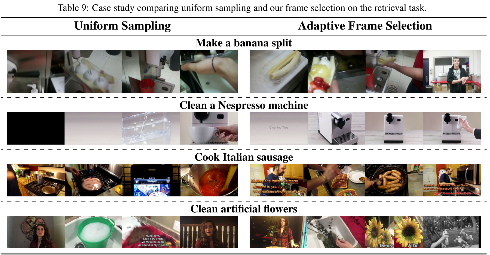

**表 9：檢索任務中均勻採樣與自適應影格選擇之比較範例。** 
* **均勻採樣 (Uniform Sampling)** 往往擷取到冗餘或不相關的畫面。
* **自適應影格選擇 (Adaptive Frame Selection, 本研究)** 能夠精準鎖定具備關鍵視覺動態特徵的影格（如：製作香蕉船、清潔 Nespresso 咖啡機、烹飪義大利香腸、清潔人造花）。

---

**表 10：生成任務中均勻採樣與自適應影格選擇之比較範例。**
* **問題 (Question)**：說明如何切橡實南瓜 (acorn squash)。
* **均勻採樣 (Uniform Sampling) 擷取影格**：
  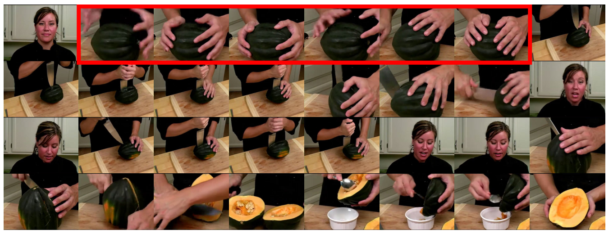
* **均勻採樣之生成答覆**：要切橡實南瓜，首先，將其放在砧板上。用大刀在頂部附近切一刀，去除莖。然後，將南瓜翻轉並將其切成兩半。舀出種子，切成所需大小。*(含有不正確的切割步驟)*
* **自適應影格選擇 (Adaptive Frame Selection) 擷取影格**：
  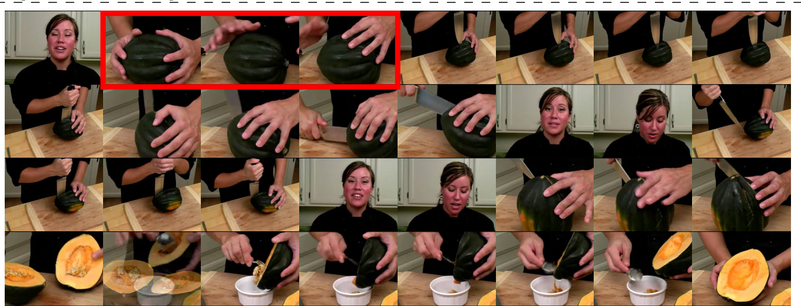
* **自適應影格選擇之生成答覆**：要切橡實南瓜，首先，將其放在砧板上。用大刀切掉南瓜的頂部。然後，將南瓜縱向切成兩半。使用湯匙舀出種子。*(更貼近真實過程)*
* **標準答案 (Ground Truth)**：為了將橡實南瓜切半，請選擇一把具有 8 到 10 英吋刀片且堅固鋒利的刀。在靠近南瓜頂部莖的位置切下。將南瓜平放，從上到下切半。使用金屬湯匙舀出種子。你可以將南瓜瓣進一步切片或切塊，具體取決於你的食譜。

---

**表 11：生成任務中均勻採樣與自適應影格選擇之比較範例。**
* **問題 (Question)**：說明如何製作椰子糖 (coconut candy)。
* **均勻採樣 (Uniform Sampling) 擷取影格**：
  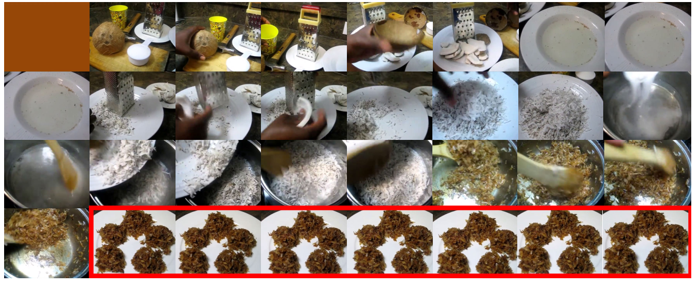
* **均勻採樣之生成答覆**：製作椰子糖，先將椰子刨絲放入鍋中。然後加入糖並用中火熬煮。攪拌混合物直到變稠，然後讓它冷卻。冷卻後，將混合物塑造成小球，然後在更多的椰絲中滾動。
* **自適應影格選擇 (Adaptive Frame Selection) 擷取影格**：
  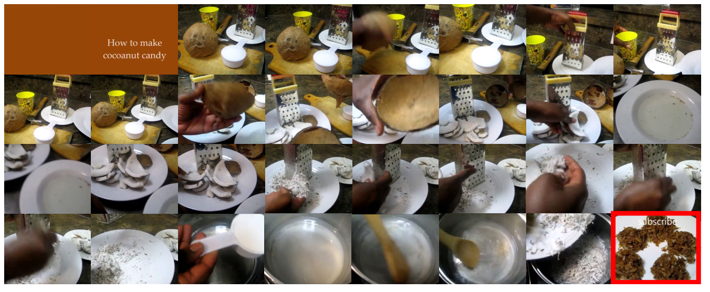
* **自適應影格選擇之生成答覆**：製作椰子糖，先在盤子上使用箱型刨絲器將椰子刨絲。然後，在平底鍋中將椰絲與糖和水混合。中火加熱並不斷攪拌，直到混合物變稠。從火上移開，冷卻後切成小塊。
* **標準答案 (Ground Truth)**：製作椰子糖塊，你需要椰絲、白糖、玉米糖漿、水和鹽。在平底鍋中將糖、玉米糖漿、水和鹽混合煮沸。加入椰絲煮至混合物變稠。將混合物倒在塗有油脂的烤盤上，並將其切成方塊。

---

**表 12：比較 TEXTRAG (BM25) 與 VIDEORAG-V 效能之案例分析。**
* **問題 (Question)**：說明如何製作粘土玫瑰 (clay rose)。
* **TEXTRAG (BM25) 檢索文件**：Vally Wiselthier，裝飾藝術陶瓷家... *(檢索到不相關的維基百科條目)*
* **TEXTRAG (BM25) 生成答覆**：製作粘土玫瑰，你需要遵循以下一般步驟：1. 準備材料：你需要粘土... *(回答籠統且未針對影片中實際的操作步驟)*
* **VIDEORAG-V 擷取影片影格**：
  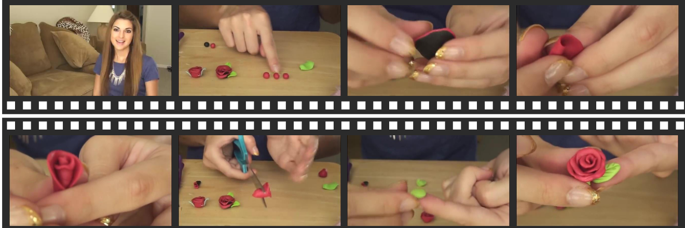
* **VIDEORAG-V 生成答覆**：製作粘土玫瑰，先將一塊粘土擀成平坦的薄片。用刀將薄片切成花瓣形狀，然後將它們分層。捏住花瓣的底部，將它們固定在一起，然後將邊緣向外折疊以形成玫瑰形狀。
* **標準答案 (Ground Truth)**：製作粘土玫瑰，先將一塊粘土揉成球，將球分成兩半。把其中一半捏平，對折並捲起來形成玫瑰花心。從另一半粘土捏出小塊壓平，貼在花心周圍並向外捲曲作為花瓣，直到玫瑰達到所需大小。
