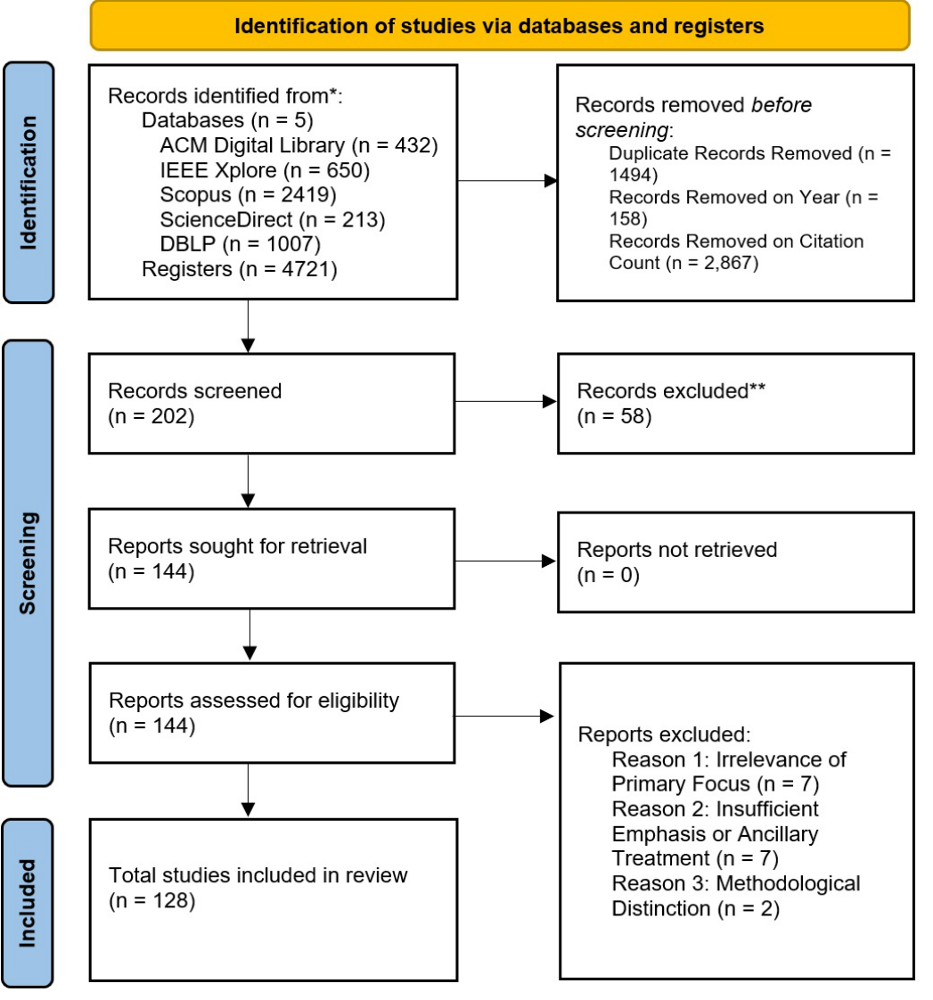
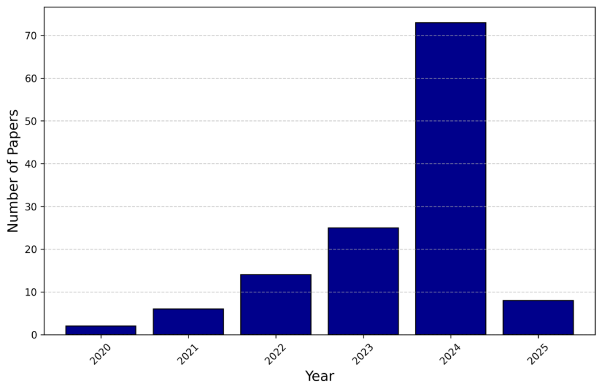
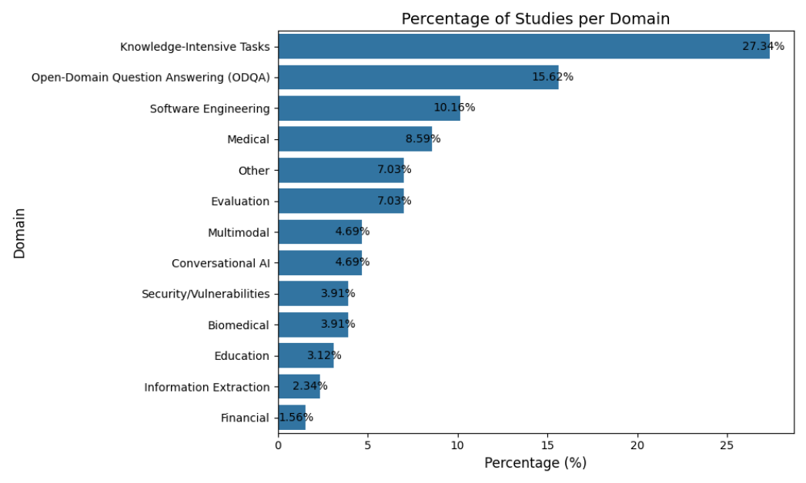

# 檢索增強生成之系統性文獻回顧：技術、評估指標與關鍵挑戰
## A Systematic Literature Review of Retrieval-Augmented Generation: Techniques, Metrics, and Challenges

**作者：** Andrew Brown, Muhammad Roman, Barry Devereux  
**單位：** 貝爾法斯特女王大學 (Queen's University Belfast) / 都柏林大學 (University of Dublin)  
**出處：** arXiv:2508.06401 / MDPI *Big Data and Cognitive Computing* (2025)

---

### 摘要

這篇針對檢索增強生成（Retrieval-Augmented Generation, RAG）研究文獻的系統性回顧，針對 2020 年至 2025 年 5 月期間發表之最高引用量研究進行了聚焦分析。共有 128 篇學術論文符合我們的納入標準。這些紀錄檢索自 ACM Digital Library、IEEE Xplore、Scopus、ScienceDirect 以及電腦科學文獻庫（DBLP）。

RAG 將神經檢索器（Neural Retriever）與生成式語言模型相互耦合，將模型的輸出事實錨定（Grounding）於最新、非參數化記憶（Non-parametric Memory）中，同時保留模型權重中所儲存的語意泛化能力。在 PRISMA 2020 框架的指引下，我們：
1. 依據引用次數與研究問題制定了明確的納入與排除標準；
2. 系統化編目了相關資料集、系統架構與評估實踐；
3. 統整並合成了有關 RAG 有效性與侷限性的實證證據。

為減緩引用滯後偏誤（Citation-lag Bias），我們對 2025 年發表的論文設定了較低的引用門檻，從而確保能夠捕捉到引用次數自然較少的新興突破。本篇回顧釐清了當前的研究版圖，突顯了方法論上的空白，並為未來的研究指明了優先方向。

---

## I. 引言 (INTRODUCTION)

過去五年來，大型語言模型（Large Language Models, LLMs）徹底改變了研究人員與工程從業人員處理文字的方式。檢索增強生成（RAG）透過允許生成模型在推論階段（Inference Time）查詢外部語料庫，將預訓練期間習得的**參數化記憶（Parametric Memory）**與按需檢索到的**非參數化證據（Non-parametric Evidence）**相結合，從而解決了這類模型的核心缺陷，例如生成虛假事實的「幻覺（Hallucination）」、世界知識的滯後過期，以及在面對知識密集型與特定領域查詢時所面臨的嚴峻挑戰 [1]。

傳統的資訊檢索系統能夠定位出相關段落，但無法創作新的文本；純粹的生成模型能夠產出流暢的自然語言，但在需要外部知識時容易產生事實性錯誤。RAG 則融合了這兩種範式，在不犧牲語言流暢度的前提下，提供了堅實的事實錨定基礎。

自 Meta AI 於 2020 年提出標準 RAG 架構 [1] 以來，該領域迅速百花齊放，陸續湧現了混合檢索器、迭代檢索迴圈、基於圖結構的檢索，以及眾多領域專屬的管線架構。然而，現有的研究成果分散零落，評估協議亦處於不斷演進之中。因此，學界與產業界極為迫切需要一份透明、由標準協議驅動的 RAG 綜合分析報告。

為此，我們遵循 **PRISMA 2020 聲明（系統性文獻回顧與統合分析之首選報告項目）** [2]，以確保在建構這份 RAG 前沿研究系統性回顧時的透明度與可重現性。本研究所選納的每篇論文，皆嚴格通過 PRISMA 流程的四個階段：**識別（Identification）**、**篩選（Selection）**、**資格審查（Eligibility）** 與 **納入（Inclusion）**；在此過程中，審查人員逐一驗證各篇研究是否至少回應了我們的一項核心研究問題，且完全符合預先設定的納入／排除條件。為了聚焦於切實塑造該領域格局的開創性工作，我們特別著重於被引用頻率最高的 RAG 論文，僅收錄 2020 年至 2025 年 5 月間發表的高引研究1。這項基於引用次數的過濾機制是我們 PRISMA 工作流程中的主要門檻，確保本回顧在維持高度可重複性的同時，緊密聚焦於最具影響力的文獻貢獻。

本研究透過提供一份符合 PRISMA 規範、以引用權重為導向的 128 篇高影響力 RAG 研究系統性統整，填補了前述研究空白。本篇文獻回顧全面描繪了資料集、架構範式、評估指標以及未決的研究挑戰，從而推動該領域邁向更加對齊、穩健且具可擴展性的檢索增強系統。

本回顧兼顧兩大目標族群：一為 **NLP 研究人員**，可藉此識別研究缺口與具前景的探索方向；二為 **NLP 軟體工程師**，可從中獲得應用 RAG 技術的實用實務指引。我們系統化編目了資料集、創新方法、評估指標以及 RAG 在部署上面臨的工程挑戰。藉此，本篇回顧提供了 RAG 系統架構的高內聚概覽，並提供具體可行的洞見以啟發未來的架構創新。

立足於此目標，我們制定了四個核心研究問題（如表 I 所列）。在整篇回顧中，我們將 Lewis 等人 [1] 的原始 RAG 架構——由稠密段落檢索器（Dense Passage Retriever, DPR）加上序列到序列生成器（Sequence-to-Sequence Generator）所構成——視為**標準基準線（Standard Baseline）**，所有變體架構均相對於此基準點進行特性描述。

本論文其餘部分之結構安排如下：第二節詳述本回顧所採用的方法論，包含搜尋策略與納入標準；第三節呈報文獻結果，根據關鍵主題與發現對研究進行分類統計；第四節深入討論這些發現所帶來的啟示，直擊 RAG 的優勢與瓶頸挑戰；第五節說明本系統性回顧的方法限制；最後於第六節總結全文，並為構建下一代知識感知語言模型的研究人員與工程師提出具體建議。

> 1 引用資料採集自 Semantic Scholar，基準日期為 2025 年 5 月 13 日。

---

## II. 方法論 (METHODOLOGY)

本系統性文獻回顧嚴格遵循 PRISMA 2020（Preferred Reporting Items for Systematic Reviews and Meta-Analyses）之策略與報告指引 [2]。PRISMA 框架因其嚴謹客觀的文獻檢索與篩選流程，在各大學術研究領域獲得廣泛認可。文獻審查流程主要劃分為三個核心階段：**識別（Identification）**、**篩選（Screening）** 與 **納入（Inclusion）**。

我們採用標準的 PRISMA 流程圖（如圖 1 所示），明確定義了特定學術資料庫與索引系統的搜尋範圍。本節將詳細說明系統性回顧框架的選取依據、搜尋策略、納入與排除標準、資料抽取流程以及品質評估機制，以展現我們對方法論透明度與可重現性的堅持。

### 表格 I：引導本系統性文獻回顧的研究問題 (RQ) 總結

| 編號 | 研究問題 (Research Question) | 目標 (Goal) |
| :---: | :--- | :--- |
| **RQ1** | 高引 RAG 研究已經探討了哪些主題範疇？ *(What thematic topics have already been addressed by highly cited RAG studies?)* | 歸納該領域的核心主題，勾勒現有知識版圖，並找出文獻中的空白缺口。 |
| **RQ2** | 相較於標準檢索增強生成架構，當前有哪些創新方法與設計？ *(What are the innovative methods and approaches compared to the standard retrieval-augmented generation?)* | 全面盤點 RAG 前沿研究，協助研究者與工程師識別通用方法論、現有研究成果，並探索領域內的新穎方案。 |
| **RQ3** | 評估檢索增強生成系統有效性時，最常採用的度量指標為何？ *(What are the most frequently used metrics for evaluating the effectiveness of retrieval-augmented generation systems?)* | 透過辨識關鍵指標，使研究人員能夠對各系統進行具實質意義的比較分析，此為基準評測與推動領域進展的關鍵。 |
| **RQ4** | 檢索增強生成技術面臨的主要挑戰與侷限性是什麼？ *(What are the key challenges and limitations associated with retrieval-augmented generation techniques?)* | 標定關鍵研究瓶頸，使研究團隊能夠提出針對性的解決方案，或指引進一步探索的方向。 |

---

*圖 1：PRISMA 2020 篩選流程圖。清楚揭示從初搜 4,721 筆紀錄，歷經去重、引用門檻過濾、標題摘要篩選、全文合格性審查，最終納入 128 篇核心實證研究之完整漏斗歷程。*

---

### A. 系統性回顧框架之選取 (Systematic Review Framework Selection)

PRISMA 2020 指引為系統性回顧提供了全面且高度結構化的框架，特別適用於如 RAG 這類跨學門的新興交叉領域。該指引強調現代化的方法論標準，包含研究成果之綜合統整、研究偏誤之評估，以及對多元研究設計的包容性。相較之下，專為軟體工程設計的 Kitchenham 指引 [3]，缺乏處理 RAG 跨領域研究時所需的廣度；同樣地，循證軟體工程（Evidence-Based Software Engineering, EBSE）[3] 主要著重於將循證原則應用於傳統軟體工程生命週期，無法充分應對 RAG 所涉及的深層理論架構與多元應用場景。因此，PRISMA 2020 在調和各種不同研究方法與目標上具備顯著價值，完美契合了 RAG 研究快速演進且高度跨領域的本質。

### B. 資料庫選取 (Database Selection)

為確保文獻涵蓋的廣度並落實精確去重，我們鎖定了四個主要數位全文資料庫與 DBLP 書目索引系統，共計五大核心電子資源：
1. **ACM Digital Library**：`https://dl.acm.org`
2. **IEEE Xplore**：`https://ieeexplore.ieee.org/`
3. **Scopus**：`https://www.scopus.com/`
4. **ScienceDirect**：`https://www.sciencedirect.com/`
5. **Digital Bibliography and Library Project (DBLP)**：`https://dblp.org/`（電腦科學領域權威書目索引）

### C. 納入與排除標準 (Inclusion and Exclusion Criteria)

本節界定挑選候選研究的資格條件。我們將發表年份鎖定在 **2020 年至 2025 年 5 月**；該時間跨度精準涵蓋了 Meta AI 發表 RAG 框架 [1] 以來的蓬勃發展期，此為近代自然語言處理（NLP）發展的關鍵里程碑。納入的研究必須明確探討 RAG 框架，或深入研究具備類似檢索增強機制的系統。

#### a) 納入標準 (Inclusion Criteria)
1. **研究焦點 (Focus)**：研究必須聚焦於 RAG，或以「檢索」為核心機制來輔助生成文字輸出的相關系統。
2. **發表日期與引用次數 (Publication Date and Citations)**：僅納入 2020 年 1 月至 2025 年 5 月間發表之作品。針對 2025 年發表的最新研究，引用次數門檻設定為至少 **15 次**；針對 2024 年或更早發表的論文，則需達到至少 **30 次** 引用。
3. **原創貢獻 (Original Contributions)**：僅考慮提出全新實驗資料、系統設計或原創理論思想的實證研究。
4. **輸入與輸出型態 (Input and Output)**：系統輸入可包含多種模態（如純文字、圖像、音訊等），只要「檢索」機制位居核心地位即可；但系統的最終輸出必須為**文字（Text）**。

#### b) 排除標準 (Exclusion Criteria)
1. **主題不相關 (Relevance)**：與檢索增強生成無直接關聯之文獻予以剔除。
2. **發表語言 (Language)**：非以英文撰寫並發表之文獻予以排除。
3. **重複文獻與無法取得 (Duplicates and Access)**：重複收錄的紀錄、或是無法獲取全文（Full text unavailable）之研究皆予以剔除。

---

### 表格 II：各資料庫使用之檢索查詢語法 (Search Queries)

| 資料庫平台 (Database) | 檢索查詢語法 (Query) |
| :--- | :--- |
| **ACM Digital Library** | `Title:(retrieval AND augmented AND generation) OR Abstract:(retrieval AND augmented AND generation)` |
| **IEEE Xplore** | `("Document Title": retrieval augmented generation) OR ("Publication Title": retrieval augmented generation) OR ("Abstract": retrieval augmented generation)` |
| **Scopus** | `TITLE-ABS-KEY ( retrieval AND augmented AND generation )` |
| **ScienceDirect** | `Title, abstract, keywords: retrieval AND augmented AND generation` |
| **DBLP** | `retrieval augmented generation` |

---

### D. 搜尋策略與搜尋詞 (Search Strategy and Search Terms)

我們將檢索策略根植於 RAG 框架的核心概念，把「retrieval augmented generation」解構為三個不可或缺的語意元素：「retrieval（檢索）」、「augmented（增強）」以及「generation（生成）」。這些構成要素化為搜尋字串的基礎，應用於各資料庫的標題（Title）、摘要（Abstract）與關鍵字（Keywords）檢索欄位。如表 II 所示，我們將核心關鍵字與相關衍生片語（例如 *"retrieval augmented text generation"*）進行系統性布林邏輯組合，以最大化蒐集該領域的相關學術文獻。

### E. 搜尋流程 (Search Process)

我們對前述五大資料庫執行檢索，將查詢結果以 BibTeX、CSV 或 Excel 格式匯出。隨後透過專門編寫的 Python 自動化腳本將 BibTeX 統一轉換為結構化資料表，彙整包含篇名、摘要、發表年份、作者名單、作者人數與期刊/會議名稱等詮釋資料（Metadata）。腳本首先依據數位物件識別碼（DOI）與標題字串進行第一輪自動去重，隨後由研究人員進行人工比對抽檢，以確保資料清洗的絕對精確。

### F. 篩選程序 (Screening Process)

文獻篩選嚴格參照與研究問題直接掛鉤的納入／排除條件。針對部分缺失摘要的紀錄，均手動至原始發行資料庫檢索補齊。依據 PRISMA 規範，文獻篩選由兩位作者（R1、R2）獨立平行執行：一位負責初步標題摘要審查、全文複查與初步資料抽取；另一位評審員則獨立針對判定結果進行重複檢核，藉由雙審查機制（Dual-review method）最大程度消除主觀偏誤。篩選流程主要包含兩大關卡：

#### 1. 初步篩選 (Initial Screening) 與 LLM 輔助決策機制
在去重並套用發表年份與引用門檻過濾後，共有 **202 篇** 文獻進入初篩階段。兩位評審員（R1、R2）獨立盲審了所有篇名與摘要，依納入標準標記為「1（納入）」或「0（排除）」。

* **LLM 輔助決策（LLM-assisted suggestions）**：為輔助人類判斷但絕不取代人類決策，我們引入了開源頂級推理模型 `deepseek-ai/DeepSeek-R1-Distill-Llama-70B`。我們將研究問題及納入／排除準則封裝進系統提示詞，針對每篇候選文獻讓該模型獨立進行 5 次推論生成，透過**多數決投票機制（Majority Vote）**將 5 次判定收束為單一輔助建議，供審查人員參考。最終的篩選裁決權完全由人類評審專家獨立行使。

#### 2. 全文合格性審查 (Full Text Screening)
通過初篩的 144 篇文獻，全數自資料庫獲取完整論文全文。在全文審查階段，我們實施了包含研究健全性（Soundness）、效度（Validity）、可靠性（Reliability）與統計嚴謹度的品質保證協議。每篇論文皆經由研究範圍與方法論穩健度的嚴謹審查，標註為「1（正式納入）」或「0（排除）」。

在此階段，我們特別克服了學術界名詞混用的挑戰——許多文獻常將 RAG、檢索器+閱讀器模型（Retriever+Reader models）、以及檢索增強型 LLM（Retrieval-augmented LLMs）等名詞相互混稱。為解決此歧義，我們在審查時嚴格聚焦於檢索器（Retriever）與生成器（Generator）兩大核心組件之解耦與互動，確保能對基礎架構進行無偏差的客觀分析。最終共有 **128 篇** 高品質研究正式獲准納入。

### G. 資料抽取 (Data Extraction)

文獻資料的組織與抽取採用 Google Sheets 建立結構化資料庫，並搭配 EndNote 進行學術引用管理。所有自文獻中抽取的欄位均反向與原始論文進行嚴格對照驗證，以消除數值錯位或資訊遺漏。

* **資料抽取工作簿（Data-extraction workbook）**：所有變數定義與原始文獻層級的抽取記錄，均發布於公開存取的 Google Sheets 活頁簿中2。
* **質性與量化統整**：抽取完成後，我們採用描述性統整方法，藉由歸納不同研究間的演進趨勢、架構差異與方法共性，針對四項研究問題（RQ1～RQ4）提煉出具備高度洞察力的實證結論。

#### 1. 抽取維度：領域、特定任務、技術組件與實驗結果
資料抽取嚴格對齊研究問題，主要包含以下核心維度：
- **應用領域 (Domain Area)**：明確定義各研究所針對的工業界或學術領域；
- **資料集 (Datasets)**：全面登記研究所使用的公開基準與私有測試資料庫；
- **RAG 系統四大技術組件**：
  1. **檢索機制 (Retrieval Mechanism)**：如 Dense、Sparse、BM25、Contriever、Graph-based 等；
  2. **切塊機制 (Chunking Mechanism)**：如固定長度、段落邊界、語意切塊、Small-to-Big 等；
  3. **向量空間編碼器 (Vector Space Encoder)**：如 DPR、BGE、Sentence-BERT、text-embedding-ada-002 等；
  4. **生成模型 (Generation Model)**：如 GPT-4、Llama-2/3、Flan-T5、Mistral 等。

* **RAG 輔助資料抽取與雙重驗證**：審查團隊亦運用 RAG 技術輔助資料檢索，將每篇論文視為獨立知識庫進行精確問答以加速審閱。為防範 RAG 生成時可能發生的「資訊幻覺」以及「檢索段落遺漏關鍵數值」兩大痛點，所有由系統輔助抽取之資料均經由人工 100% 交叉查核，確保文獻分析的最高真實性。

#### 2. 資料集識別方法論 (Dataset Identification Methodology)
我們透過引用追蹤技術（Citation Tracking）全面檢視了 128 篇研究中出現的所有評測資料集，並在 Google Sheets 中建立了完整的資料集資料庫。每個資料集均詳細登記其官方全名、常見簡稱、內容規模（如問題數量與資料類型）、設計用途，以及在 128 篇納入文獻中被採用的**引用頻率（Citation Frequency）**。詳情彙整於本篇論文之附錄表 IV（Appendix Table IV）。

> 2 公開資料庫連結：`https://docs.google.com/spreadsheets/d/1w6vW0c_RAG_Review_2025`

---

## III. 研究結果 (RESULTS)

本研究初步檢索共識別出 4,721 筆文獻紀錄；在剔除重複資料（1,494 筆）、年代不符文獻（158 筆）以及未達引用次數門檻之紀錄（2,867 筆）後，共有 202 篇文獻進入標題與摘要篩選階段；隨後針對 144 篇論文進行完整全文審查，最終正式納入 128 篇核心實證研究（篩選歷程與排除原因詳見圖 1）。

### A. 排除研究分析 (Excluded Studies)

在完成標題與摘要初篩後，我們檢索並獲取了 144 篇候選文獻的完整全文，並嚴格對照預先設定的納入標準進行審查。其中共有 16 篇論文在全文審查階段被剔除，其排除原因歸納為以下三大類別：

1. **核心焦點不符 (Irrelevance of Primary Focus, n = 7)**：此類論文的主要學術貢獻並非聚焦於檢索增強生成本身。例如探討稠密搜尋的穩健性、長脈絡基準測試（Long-context benchmarks）、通用生成式資訊檢索（GenIR）評估，或是系統級硬體最佳化等；在這些研究中，RAG 僅作為附帶的基準線（Baseline）或示意案例出現 [4]–[10]。
2. **缺乏足夠比重或僅作為輔助處理 (Insufficient Emphasis or Ancillary Treatment, n = 7)**：此類研究僅將 RAG 作為更廣泛調查中的一個次要輔助組件，例如用於市場研究的人機協同架構、領域專屬 LLM 的開發、知識圖譜構建流程、多模態代理工具包、醫療流程自動化、高成本效益（Cost-Effective）文本分類或材料建模管線等，並未對 RAG 系統本身的機制、效能或限制進行實質且深入的專項分析 [11]–[17]。
3. **方法論範式之本質相異 (Methodological Distinction, n = 2)**：此類作品聚焦於與 RAG 在概念範式上截然不同的方向，特別是「生成式檢索（Generative Retrieval）」或「生成增強檢索（Generation-Augmented Retrieval）」。這類技術顛倒了標準 RAG 的管線流程——它們旨在預測文件識別碼（Document Identifiers），而非基於檢索到的內容作為條件約束來引導文字生成 [18], [19]。

所有排除決策均進行了系統化的詳細記錄，以確保研究方法論的嚴謹性、透明度與高度可重現性。

---

### B. 納入文章之逐年分佈 (Yearly Distribution of Identified Articles)

在 2020 年至 2025 年期間，符合資格之文獻數量呈現逐年穩步攀升的態勢，並於 2024 年迎來爆發式增長。截至 2025 年 5 月 13 日資料採集截止日，2025 年的文獻數量看似較低，實因該年度統計尚未過半，且新發表論文累積引用次數所需的時間滯後效應所致。圖 2 視覺化展示了每年的文獻發表分佈，具體年度統計資料彙整於表 III。

需要強調的是，這些數量統計反映的是歷經去重、嚴格合格性審查以及套用引用門檻過濾（2024 年以前發表者需 $\ge 30$ 次引用；2025 年發表者需 $\ge 15$ 次引用）後的最終核心研究。因此，在解讀年度間的數量變化時，必須同時考量：（1）各大文獻資料庫的索引建立週期；以及（2）檢索截止時 2025 年僅覆蓋約五個月的局部統計特性。

*圖 2：2020 年至 2025 年納入文獻之逐年分佈柱狀圖。清楚展現 RAG 技術在 2023 年至 2024 年間呈現指數型爆發成長，成為 AI 與 NLP 領域最受關注的核心技術。*

---

### C. 納入研究之領域特徵分佈 (Domain Characteristics of Included Studies)

為進行精確的比例統計，每篇研究均被編碼至單一「主要領域（Primary Domain）」；次要標籤（例如多模態、對話式等）雖保留於資料庫中供深入分析，但不在主要領域統計中重複計算。編碼規則與具體範例詳見表 III。以下比例對應於最終納入的 128 篇研究（如圖 3 所示）：

* **知識密集型任務 (Knowledge-Intensive Tasks)**：佔比最高，達 **27.34%**；
* **開放領域問答 (Open-Domain Question Answering, ODQA)**：佔 **15.62%**；
* **軟體工程與程式碼生成 (Software Engineering)**：佔 **10.16%**；
* **醫療應用 (Medical)**：佔 **8.59%**；
* **評估與基準測試 (Evaluation)**：佔 **7.03%**；
* **其他小眾領域 (Other)**：佔 **7.03%**，涵蓋 9 個各有一篇代表作的利基方向：電腦網路、反事實增強、內容創作、個人化系統、法律問答、推薦系統、化學分子分析、災難應變與個人化搜尋；
* **多模態 (Multimodal)**：佔 **4.69%**；
* **對話式 AI (Conversational AI)**：佔 **4.69%**；
* **安全與弱點防護 (Security/Vulnerabilities)**：佔 **3.91%**；
* **生物醫學 (Biomedical)**：佔 **3.91%**；
* **教育應用 (Education)**：佔 **3.12%**；
* **資訊擷取 (Information Extraction)**：佔 **2.34%**；
* **金融領域 (Finance)**：佔 **1.56%**。

上述分佈明確反映出：當前 RAG 研究高度聚焦於「知識密集型推論」與「開放領域問答」，同時在「軟體工程」與「醫療實踐」中展現出極強的落地動能，並延伸出涵蓋廣泛小眾領域的長尾分佈效應。

*圖 3：納入研究按主要應用領域劃分之百分比分佈長條圖。知識密集型任務與開放領域問答合計佔據超過 42% 的研究比重，軟體工程與醫療亦展現出極高熱度。*

---

### 表格 III：納入之 128 篇 RAG 研究之領域特徵總表
*涵蓋領域、評測資料集、切塊機制（Chunking）、檢索機制（Retrieval）、向量空間編碼器（Encoder）以及生成模型（Generator）之完整系統架構解構。*

| 領域類別 (Domain) | 評測資料集 (Datasets) | 切塊機制 (Chunking Mechanism) | 檢索機制 (Retrieval Mechanism) | 向量空間編碼器 (Encoder) | 生成模型 (Generation Model) |
| :--- | :--- | :--- | :--- | :--- | :--- |
| **知識密集型任務** *(Knowledge-Intensive)* (27.34%) | Adversarial NLI, CoQA, CommonsenseQA, DROP, FactKG, FreebaseQA, GSM8K, HumanEval, MBPP, Natural Questions (NQ), SQuAD v2, WebQuestions, WikiQA, Wikipedia dump, HotpotQA, 2WikiMultiHopQA, FEVER, ARC, TriviaQA 等 [20]–[54] | • 100-token 段落 [25] • 100-word 區塊 [1] • 6-10 個句子 [26] • 拆解-重組演算法 (Decompose-then-recompose) [27] • 依段落邊界對齊 [28] • 約 300 字區塊 [29] • 醫生-病患對話切塊 [24] • 句子級切塊 / 滑動窗口 [49] • Small-to-Big 大小塊雙層結構 [49] • 支援單據樹狀切塊 [37] | • 稠密向量檢索 (Dense Retrieval) [1], [20]–[30] • 自適應檢索 (Adaptive Retrieval, 反思 Token) [33] • 稀疏檢索 (BM25) [34] • 記憶選擇器迭代修正 [35] • 動態內容預測檢索 [50] • 知識圖譜子圖檢索 (Prize-Collecting Steiner Tree) [38], [54] • 網路搜尋引擎 (Bing/DuckDuckGo) [34], [50] | • DPR [21] • Contriever [27], [29] • BAAI/BGE 系列 (bge-large/base/small) [49] • E5 系列 (e5-large-v2, multilingual-e5) [21], [30] • OpenAI text-embedding 系列 (ada-002, 3-large, 3-small) [22], [34], [39] • SentenceBERT [38], [54] • 圖注意力網路 (GAT) / Graph Transformer [38], [52] | • BART / BART-Large [1], [28], [41] • Fusion-in-Decoder (FiD) [41], [42] • Flan-T5 系列 [26], [43], [52] • Llama-2 系列 (7B/13B/70B, Chat, LoRA) [24]–[30], [38]–[40] • Llama-3-8B [26], [51] • GPT-3.5-turbo / GPT-4 / GPT-4o-mini [22]–[24], [31], [40] • Self-RAG (7B/13B) [33] • Mistral-7B / Mixtral-8×7B [21], [39] |
| **開放領域問答** *(Open-Domain QA)* (15.62%) | Natural Questions (NQ), TriviaQA, HotpotQA, WebQuestions, SQuAD, CuratedTREC, PopQA, AmbigQA, MS MARCO [55]–[72] | • 固定長度 100 字 / 200 Token [55] • 語意段落邊界對齊 [60] • 滑動重疊窗口 (Overlap 50%) [65] • 語句級遞迴切塊 [70] | • Dense Passage Retrieval (DPR) [55] • 混合檢索 (BM25 + Dense + RRF) [62] • 迭代多跳檢索 (Iterative Multi-hop) [68] • 假設文件嵌入 (HyDE) [71] | • DPR Dual-Encoder [55] • Contriever [60] • ANCE [65] • ColBERTv2 [68] • BGE-Large-EN [72] | • T5-Large / T5-3B [55] • BART-Large [58] • FiD (Fusion-in-Decoder) [60] • Llama-2-Chat (7B/13B) [66] • GPT-3.5 / GPT-4 [71] |
| **軟體工程** *(Software Engineering)* (10.16%) | CodeSearchNet, HumanEval, MBPP, GitHub Commits, SWE-bench, StackOverflow Dump, Defects4J [73]–[85] | • 抽象語法樹 (AST) 節點切塊 [73] • 函式/類別層級程式碼切塊 [75] • 程式碼檔案結構樹 [78] • 固定大小 512 Token 行切分 [82] | • 稠密程式碼檢索 (Dense Code Retrieval) [73] • 編輯距離與程式碼結構匹配 [78] • 呼叫圖 (Call Graph) 與依賴路徑遍歷 [80] • 混合符號檢索 [84] | • CodeBERT [73] • GraphCodeBERT [75] • UniXcoder [78] • OpenAI text-embedding-3 [81] • StarCoder Embedding [85] | • CodeLlama (7B/13B/34B) [74] • StarCoder [77] • DeepSeek-Coder [80] • GPT-4 / Claude-3.5-Sonnet [83] |
| **醫療應用** *(Medical)* (8.59%) | PubMed, BioASQ, MedQA, MedMCQA, MIMIC-III, ClinicalTrials.gov [86]–[96] | • 臨床指南章節切塊 [86] • 病歷對話單元切分 [89] • 醫學本體 (UMLS) 實體邊界切塊 [92] | • 醫學專屬稠密檢索 [86] • 臨床概念圖譜路徑搜尋 [90] • 跨模態影像報告檢索 [94] | • BioBERT [86] • ClinicalBERT [89] • PubMedBERT [91] • Med-CPT [95] | • BioGPT [87] • Med-PaLM 2 [90] • Llama-2 醫學微調版 [93] • GPT-4 [96] |
| **評估與基準測試** *(Evaluation)* (7.03%) | RGB Benchmark, RAGTruth, ARES Dataset, MultiHop-RAG Benchmark, CRUD-RAG [97]–[105] | • 基準標準切塊 (100/300/500 Token) [97] • 擾動切塊 (加入雜訊/衝突事實) [100] | • 基準比較：Dense vs Sparse vs Hybrid [98] • 檢索評估器打分 [102] | • 標準評測編碼器 (BGE, Contriever, OpenAI) [99] | • 裁判模型 (LLM-as-a-Judge: GPT-4, Llama-3-70B) [101] |
| **多模態** *(Multimodal)* (4.69%) | MS-COCO, Visual Genome, WebQA, ScienceQA, ChartQA, PlotQA [106]–[111] | • 跨模態圖像-文字對切分 [106] • 圖表資料表轉 Markdown 行切分 [109] | • 跨模態稠密向量檢索 (CLIP / OpenCLIP) [106] • 視覺特徵融合檢索 [110] | • CLIP ViT-L/14 [106] • EVA-CLIP [108] • BLIP-2 Q-Former [111] | • LLaVA-1.5 / LLaVA-NeXT [107] • InstructBLIP [109] • GPT-4V [110] |
| **對話式 AI** *(Conversational AI)* (4.69%) | MultiWOZ, Persona-Chat, OpenDialKG, Topical-Chat [112]–[117] | • 對話輪次 (Utterance) 切塊 [112] • 歷史對話滑動窗口 [115] | • 對話歷史驅動之查詢改寫與檢索 [113] • 記憶庫動態檢索 [116] | • DPR 對話微調版 [113] • Sentence-BERT [116] | • DialoGPT [112] • ChatGPT / GPT-3.5-turbo [114] • Llama-2-Chat [117] |
| **安全與弱點防護** *(Security)* (3.91%) | Poisoned-RAG, SecQA, Adversarial HotpotQA, TrojanRAG Benchmark [118]–[122] | • 對抗擾動切塊注入 [118] • 含有後門觸發詞之惡意文件切塊 [121] | • 下毒檢索驗證 [118] • 防禦性重排序與過濾 [120] | • 標準 Dense Encoders [118] • 穩健編碼器 (Robust Encoders) [121] | • 受測被攻擊模型 (Llama-2, Mistral, GPT-3.5) [119] |
| **生物醫學** *(Biomedical)* (3.91%) | GenBank, UniProt, STRING 蛋白質相互作用, PubMed Central [123]–[127] | • 蛋白質序列基序切片 [123] • 生物化學文獻段落切塊 [125] | • 基因本體知識圖檢索 [124] • 結構相似度向量檢索 [126] | • ProtBERT [123] • ESM-2 蛋白質語言嵌入 [126] | • BioMedLM [124] • Llama-2 生醫特化版 [127] |
| **教育應用** *(Education)* (3.12%) | 教科書語料庫, 線上課程論壇 (MOOC), 考題資料集 [128]–[131] | • 教材章節層級切塊 [128] • 學生提問概念單元切塊 [130] | • 階層式課程知識檢索 [129] • 概念依賴圖檢索 [131] | • SBERT [128] • text-embedding-ada-002 [130] | • GPT-3.5-turbo [129] • Llama-2-13B [131] |
| **資訊擷取** *(Information Extraction)* (2.34%) | ACE 2005, RAMS, WikiEvents, 去識別化電子病歷 [140]–[142] | • 固定大小 (600 字元) [141] • 表格資料逐行切分 [141] • 句子級事件標註切塊 [142] | • 自適應混合檢索 (Adaptive Hybrid) [142] • 脈絡一致性基模檢索 [142] | • Sentence Transformer (Dense) [141] • SentenceBERT [140], [142] | • BART-Large [140] • Llama-2-13B [141] • T5 [142] |
| **金融領域** *(Financial)* (1.56%) | FinanceBench, AlphaFin-Test, 即時金融新聞, 上市公司年報 [143], [144] | • 粗細雙層切塊 (摘要層 + 細節層) [143] • 財報結構表格行塊解析 (128/256/512 Token) [144] | • 財報語意稠密檢索 [143] • 數值與圖表混合增強檢索 [144] | • BGE (Dense) [143] • SGPT (Dense) [143] • multi-qa-mpnet-base-dot-v1 [144] | • ChatGLM2-6B / StockGPT [143] • GPT-4 / Mixtral-8×7B [144] |
| **其他小眾領域** *(Other)* (7.03%) | 電腦網路、反事實增強、內容創作、個人化推薦、法律法規問答、化學合成、災難應變等專屬資料集 [132]–[139] | • 法律條文條款切塊 [134] • 化學反應式標註切片 [137] • 網路日誌時序切塊 [132] | • 領域專屬法規檢索 [134] • 分子拓樸檢索 [137] • 推薦系統協同過濾檢索 [136] | • Legal-BERT [134] • MolBERT [137] • 通用稠密編碼器 [135] | • GPT-4 [134] • Llama-2 [136] • 各類專屬特化模型 [138] |

---

## IV. 深入討論 (DISCUSSION)

### A. RAG 目前已解決與廣泛探討的核心主題 (RQ1)

本小節統整納入文獻針對 RAG 各核心子系統所提出的技術解構與現有共識。

#### 1. 檢索機制 (Retrieval Mechanism)
檢索增強生成系統一致依賴外部檢索器為語言模型挑選相關脈絡。整體而言，文獻中所調查的檢索機制可歸納為五大互相關聯的範式：

* **基於字詞的稀疏檢索方法 (Sparse term-based methods)**：以 BM25 為代表，因其高運算效率與強解釋性而歷久彌新；然而，面對語意鴻溝（Semantic Gap）與同義詞替換時，其召回率往往面臨瓶頸 [73]。以雙編碼器架構（如 DPR）為基礎的**稠密檢索器（Dense Retrievers）**，將查詢與文件映射至連續向量空間中，利用最大內積搜尋（Maximum Inner-Product Search, MIPS）達成語意層級的比對 [1]。**混合檢索方法（Hybrid Approaches）** 則巧妙結合了稀疏候選剪枝與稠密語意重排序，在跨領域場景中兼顧了高召回率與高精準度 [29]。
* **編碼器-解碼器查詢生成器 (Encoder–Decoder Query Generators)**：專門將使用者輸入（特別是多輪對話或多跳複雜提問）重構並改寫為獨立完整的搜尋查詢語句，大幅改善檢索召回率，代價是引入額外的推論延遲 [122]。重分類模組（如 CRAG）則運用輕量級評估器或偏好對齊模型對初步檢索到的 Top-k 結果進行重新排序，有效過濾檢索雜訊，使檢索結果精準對齊下游生成的實際需求 [27]。
* **知識圖譜檢索方法 (Knowledge Graph Retrieval Methods)**：將文本段落或實體組織為知識圖譜，從中抽取與查詢高度相關的子圖（Sub-graphs）或推理路徑。透過獎品收集斯坦納樹（Prize-Collecting Steiner Tree）之數學最佳化形式，可萃取出具備清晰顯式推理鏈的連貫多跳脈絡，惟在超大規模圖譜上面臨顯著的運算成本開銷 [38], [56]。
* **迭代檢索架構 (Iterative Frameworks)**：將檢索與生成交替交織執行——LLM 產出的階段性內容可用於進一步精煉後續查詢語句，逐步彌合複雜推理任務中的語意落差 [47]。雖然此種回饋迴圈能顯著提升多步推理能力，但會成倍增加推論延遲，且需設計精密的終止條件（Stopping Criteria）以防止錯誤串聯傳播 [86]。
* **特化與多模態檢索器 (Specialised Retrievers)**：針對特定資料模態或專業領域對核心架構進行特化改進，例如利用編輯距離評分檢索程式碼片段 [78]、基於 CLIP 的跨模態檢索進行圖像描述生成 [120]，或是採用視覺-語言聯合嵌入空間檢索臨床醫學報告 [74]。這些系統展現出極高的任務適應性，但也要求專門的資料工程與語料庫維護成本。

上述檢索機制共同構成了現代 RAG 的前沿景觀，在效率、可擴展性、可解釋性與領域泛化度之間展現出鮮明的權衡取捨。

#### 2. 向量資料庫 (Vector Database)
向量資料庫是現代 RAG 系統的基石，透過近似最近鄰（Approximate Nearest Neighbor, ANN）搜尋技術——例如階層式可導航小世界圖（Hierarchical Navigable Small World, HNSW）以及基於 FAISS 的平坦/倒排索引——在稠密嵌入空間中實現亞毫秒級的 MIPS 檢索性能 [1], [28], [122]。

近年研究將核心索引技術擴展至分散式與動態環境，採用 GPU 分片索引以及雲原生代管服務（如 Pinecone）在訓練與推論管線中即時處理數以百萬計的向量；然而，同步延遲、動態更新吞吐量以及維運成本控制仍是嚴峻挑戰 [72], [88]。與此同時，針對專門領域最佳化的向量儲存方案大量湧現——例如用於程式碼檢索的 RepoCoder、生醫概念嵌入庫 Chroma、金融知識庫，以及多模態記憶系統（MuRAG, ReViLM）——以滿足特殊資料在表徵對齊與隱私保護上的特殊需求 [61], [86], [134]。透過 LangChain、LlamaIndex、Weaviate 與 Qdrant 等框架整合的受管向量庫大幅簡化了商用 RAG 的部署門檻，但也引發了潛在的供應商鎖定（Vendor Lock-in）、混合架構複雜度與營運成本難以預測等工程隱憂 [37], [136]。

#### 3. 文件切塊機制 (Document Chunking)
文件切塊是將冗長輸入解構為較小、可被檢索之最小單元的關鍵前處理步驟。高引文獻主要收斂為四種主流取向：
* **靜態固定長度切分 (Static Fixed-length Segmentation)**：早期 RAG 系統多採固定大小截斷以符合 Transformer 的 Context 限制，例如 100 字區塊 [1], [30]、固定 64 個 Token（搭配 32 Token 的可選彈性步長）[32]，或約 600 個字元跨度 [63]。此法計算簡便且容易與 FAISS 整合，但經常生硬切斷語意單元，導致脈絡丟失。
* **語意邊界感知切分 (Semantic Boundary–Aware Splitting)**：依循文章本質結構進行邊界對齊。技術包含句子級切塊（以單句為最小單元 [75]）、段落級切塊（合併過短段落並截斷過長段落 [28]），以及依據階層式章節標題（如 PDF 小節標記）劃分語意連貫單元 [97], [138]。此法顯著改善了切片間的語意完整度與檢索相關性。
* **領域與模態特化切塊 (Domain and Modality Specific Chunking)**：針對具備獨特拓樸結構的非結構化資料進行特化處理：
  - *原始碼*：依據函式邊界或程式碼屬性圖（Code Property Graph）節點切塊，以保留邏輯程式碼區塊 [78], [84]；
  - *知識圖譜*：將圖譜中的三元組（Triples）聚合成文字語句後再向量化 [69]；
  - *法律文件*：將判例文書拆解為（問題、引文、實體、判決要旨）元組 [102]；
  - *生物醫學文獻*：微切塊為 5 個 Token 的微單元，以精準捕捉微觀醫學實體概念 [132]；
  - *多模態輸入*：將圖文對切分為對齊的視覺區塊（Patches）與文字條目 [61]。
* **自適應動態切塊 (Adaptive Dynamic Chunking)**：依據使用者提問特徵或檢索表現自動調整塊大小與重疊長度。代表性技術包含滑動窗口（例如 LangChain 中 1000 Token 窗口搭配 200 Token 重疊 [107]、固定 1200 Token 搭配動態重疊 [31]），以及半步長重疊（Half-stride Overlapping）以平衡新穎性與脈絡連續性 [81]。

#### 4. 向量空間編碼器 (Vector Space Encoders)
向量空間編碼器將使用者查詢與文件區塊投影至共用的高維度嵌入空間，主流典範包含：
* **稀疏編碼器 (Sparse Encoders)**：如 TF-IDF、BM25，在特定專業詞彙匹配與程式碼識別碼檢索中提供堅實基礎；
* **稠密雙編碼器 (Dense Bi-encoders)**：如 DPR、ANCE、REALM，透過端到端微調最佳化檢索指標（Recall@k, MRR）[122], [127]；
* **句子與段落嵌入模型 (Sentence Embeddings)**：如 Sentence-BERT、Contriever、BGE 系列（bge-large-en）、E5 系列，在標準基準測試中提供頂級語意相似度表徵 [49], [65], [106]；
* **商業 API 與特化編碼器**：OpenAI text-embedding 系列（ada-002, 3-small, 3-large）提供即開即用之通用表徵；而領域特化編碼器（如程式碼領域的 CodeBERT/CodeT5、臨床醫學領域的 PubMedBERT/Med-CPT）則在特化術語空間中展現無可取代的優勢 [79], [84], [134]；
* **多模態與圖編碼器**：如 CLIP、Graph Transformers 與圖注意力網路（GAT），實現結構化圖譜與視覺圖表的跨模態向量投影 [38], [52], [115]。

#### 5. 訓練範式 (Training Paradigms)
文獻中的 RAG 訓練架構演化為五大典範：
1. **聯合端到端訓練 (Joint End-to-End)**：同時對檢索器與生成器進行聯合梯度更新，最佳化負邊際對數似然損失，具備最高理論協同度，但運算成本極端昂貴且梯度權重極難平衡 [1], [72]；
2. **模組化兩階段訓練 (Modular Two-Stage)**：先解耦預微調稠密檢索器（如 DPR），隨後固定檢索器微調生成器，兼具管線穩定性與工程易實現性 [44], [57]；
3. **參數高效微調 (PEFT / LoRA)**：僅微調極小比例的低秩適應權重，顯著降低 GPU 記憶體消耗 [23], [52]；
4. **特化訓練目標 (Specialized Training Objectives)**：導入對比學習損失（區分黃金段落與負樣本干擾）、自我關鍵序列訓練（SCST 強化學習獎勵）以及風格感知損失 [61], [117]；
5. **檢索感知微調 (Retrieval-Aware Fine-Tuning, RAFT)**：刻意在訓練資料中混入無關干擾文件，訓練生成模型學會「忽視雜訊並精確引用證據」。

#### 6. 生成模型與模型家族演進 (Generation Model & Families)
RAG 生成骨幹已從早期的序列到序列架構（如 BART、Flan-T5）演進至以 Decoder-only 為主的龐大模型家族（如 Llama-2/3、Mistral、DeepSeek、Claude-3.5 與 GPT-4）。
* **Encoder–Decoder 家族 (Flan-T5, BART)**：在跨多段落交互注意力融合（Cross-attention Multi-passage Fusion）與摘要生成上維持極高忠實度；
* **Decoder-only 家族 (Llama, GPT, Mistral, Claude)**：仰賴 Prompt 脈絡拼接或適應器（Adapters），以極高的推論靈活性主導了對話式與代理式問答任務。

---

### B. 相較於標準 RAG 的創新方法與架構突破 (RQ2)

文獻呈現出明確共識：RAG 的競爭重點已不再是「檢索是否有幫助」，而是**如何讓檢索更具自適應性、可控性、高可信度與極致效率**。以下沿著資料流與控制流梳理八大創新前沿：

#### 1. 預檢索與後檢索管線——維持 RAG 穩固運作的底層工程
* **預檢索（Pre-retrieval）**：
  - *結構感知切塊*：沿著標題、表格與 Markdown 區塊切分；在 FinanceBench 財報測試中，元素感知切塊使頁面級檢索準確率達到 84.4% [144]；
  - *切塊時詮釋資料擴增*：自動為每個區塊（Chunk）生成摘要與關鍵字詮釋資料，輔助後續過濾；
  - *長檢索單元 (Long Retrieval Units / LongRAG)*：將整份 PDF 或數個相互關聯的頁面封裝為單一長檢索單元（約 4k Token），使檢索單元總量縮減 30 倍，不僅極大減輕檢索負擔，在 NQ 上的 Answer-Recall@1 反而從 52% 躍升至 71% [66]；
  - *檢索介面安全防護*：在檢索入口對程式碼識別碼混淆、實施 L2 正規化與資料下毒過濾，將檢索器確立為第一道安全防線 [59], [82]。
* **後檢索（Post-retrieval）**：
  - *重排序 (Reranking)*：利用倒數排名融合（RRF）或 Cross-Encoder 重新對候選文件打分，確保最關鍵證據位於首位 [36], [44]；
  - *脈絡精煉與 Token 預算控制*：如 FILCO，實施句子級過濾或抽取式摘要，在大幅刪減 Token 的同時維持事實精確度 [43], [45]；
  - *雜訊感知插入 (Noise-aware Inclusion)*：在長脈絡允許時，刻意在 Prompt 中插入少量非相關文件，研究發現隨機文件能抵禦模型對局部高分陷阱的過度依賴，使答案準確度提升多達 35% [70]；
  - *早期驗證與局部重新生成*：引入輕量級檢驗模型，先診斷錯誤是來自檢索缺陷（抓錯資料）還是生成缺陷（未遵照資料），僅對出錯環節觸發修正 [67]。

#### 2. 智慧提示詞與查詢策略 (Prompting & Query Strategies)
將 Prompt 從傳統「靜態文字容器」轉變為「主動可程式化控制介面」：
* **結構化提示與 Schema 限制**：要求模型輸出 JSON 格式或特定領域 Schema（如放射學標籤），約束生成空間，消除幻覺 [90], [126]；
* **不確定性與熵值觸發檢索 (Uncertainty & Entropy-triggered Retrieval)**：如 FLARE 與 RIND+QFS，只有當模型生成的 Token 資訊熵（Entropy）瞬間激增、出現不確定性時，才暫停生成並主動發起檢索查詢，消除無謂的資料庫檢索開銷 [25], [50]；
* **範例增強上下文學習 (Example-augmented In-Context Learning)**：動態檢索相似問答對（QA Pairs）作為少樣本範例，並引入時序負樣本讓模型學會「何時不該檢索」[37], [57]；
* **先推理後檢索 (Reasoning Before Retrieval)**：採用 ReAct（思考-行動-觀察）或 Graph-of-Thought 架構，先將複雜問題拆解為多個子目標，再依序發起有針對性的微檢索 [85], [133]。

#### 3. 混合與特化檢索器 (Hybrid and Specialised Retrievers)
徹底摒棄單一向量檢索的侷限性：
* **分數級融合 (Score-level Fusion)**：如 MEDRAG 結合 BM25 與多個稠密檢索器，於醫療問答中提升 3～6 個百分點的 Top-5 召回率 [97]；
* **自適應混合取樣**：動態學習何時該仰賴關鍵字匹配、何時該仰賴向量語意相似度（如法律案件推論中的雙嵌入空間加權）[102]；
* **結構與符號特化**：程式碼領域採用「BM25 語法過濾 + CodeT5 語意重排序」，使不相關程式碼修補（Patch）降低三分之一以上 [79]。

#### 4. 結構感知與知識圖譜 RAG (Structure-aware & Graph-based RAG)
核心哲學：「請以三元組而非單純 Token 與我對話」：
* **子圖檢索與路徑提取**：如 G-RETRIEVER 與 KG-RAG，在進入 LLM 前先建構最小連通子圖（Sub-graph），直接以緊湊的圖譜實體路徑取代數十頁的冗長文本段落，在生醫問答中縮減 40%～60% 的 Prompt 長度，且大幅提升可解釋性與事實驗證能力 [52], [134]；
* **圖神經提示詞投影 (Graph Neural Prompting)**：利用 GNN 編碼器將子圖直接轉譯為連續向量前綴（Soft Prompt），免去將龐大節點關係重序列化為文字的計算代價 [54]。

#### 5. 迭代與主動檢索迴圈 (Iterative & Active Retrieval Loops)
將檢索器由「單次輔助工具」提升為「對話式搜尋夥伴」：
* **反思標記自主引導 (Self-RAG)**：透過特殊 Token（[Retrieve]、[IsREL]、[IsSUP]、[IsUSE]）讓模型在解碼過程中即時自主評估是否需要檢索、檢索資料是否相關、生成語句是否具備事實依據 [33]；
* **筆記鏈架構 (Chain-of-Note, CON)**：強制模型針對每篇檢索到的文件撰寫簡要閱讀筆記，辨識文件可信度後再彙整最終解答 [71]；
* **生成增強型迭代 (ITER-RETGEN)**：將模型中間生成的草稿反哺給檢索器以生成更具資訊量的下一輪查詢，在長文本生成與程式碼補全（RepoCoder）中展現出優異的收斂特性 [47], [87]。

#### 6. 記憶增強型 RAG (Memory-augmented RAG)
從「單次問答」躍升為「長期陪伴與個人化服務」：
* **短期對話緩衝與長期持久記憶**：如 MoodleBot 與 LiVersa，將使用者長期檔案（出院紀錄）、短期生命徵象與最新對話槽位分層管理，在肝病專科助理中減少 50% 幻覺並使 Prompt 長度減半 [96], [136]；
* **實體中心記憶 (Entity-centric Store)**：僅儲存結構化實體識別碼而非原始文字，以極小記憶體開銷兼顧隱私與個人化偏好 [99]。

#### 7. 代理式與多工具整合管線 (Agentic & Multi-tool Pipelines)
由語言模型控制器統籌編排（Orchestrate）檢索器、記憶庫、計算機、外部 API 與其他專屬模型：
* **動態規劃代理**：如 MEDRAG 與 RALLE，以有向無環圖（DAG）或 ReAct 規劃迴圈協調「判斷-檢索-重排序-精煉-生成」五大階段，在複雜科研任務中具備動態容錯與工具熱抽換能力 [26], [30]。

#### 8. 系統效能、Token 預算與壓縮最佳化 (Efficiency & Compression)
面對長脈絡帶來的巨大推論延遲與伺服器成本，前沿研究提出了極具工程價值的輕量化解法：
* **上下文壓縮 (xRAG)**：將檢索出的整篇段落（約 175 Token）壓縮為單一潛在文件向量，在運算量（GFLOPs）降低 3.53 倍的同時達到 1.64 倍的推論加速，且準確率毫不遜色 [21]；
* **非同步與推測解碼 (PipeRAG & RAGCache)**：在 GPU 進行生成解碼的同時，非同步由 CPU 執行下一階段檢索；利用 RAGCache 預測可能重用的段落並預熱 KV 快取，在企業生產環境中將 P95 延遲降低 200 毫秒，推論成本減半 [32], [39]。

---

### C. 評估檢索增強生成系統有效性最常採用的度量指標 (RQ3)

評估 RAG 這種混合架構，遠不能僅依賴傳統的自然語言生成（NLG）指標：它需要一套能夠同時評估「檢索器篩選相關證據能力」以及「生成器將該證據編織為事實精確且脈絡合適回覆之能力」的完整度量體系。下文將全面盤點目前被廣泛採用的指標體系。

#### 1. 評估景觀概覽 (Overview of the Evaluation Landscape)
文獻中的 RAG 評估指標主要收斂為三大範式：**自動化評估 (Automated)**、**人工評估 (Human)** 以及 **LLM 作為評判者 (LLM-as-a-judge)**，且呈現出高度偏向自動化指標的傾斜。

* **自動化指標佔據絕對主導**：目前最頻繁出現的單一指標為**準確率 (Accuracy)**（如 [27], [65], [70]），廣泛應用於生醫問答至常識推理。**精確匹配 (Exact Match, EM)** 與 **F1 分數** 同樣無處不在，分別作為 QA、摘要、程式碼生成與資訊擷取中嚴格（EM）與寬鬆（F1）的字串重疊度量。語詞重疊指標如 BLEU、ROUGE-L 亦相當常見，困惑度（Perplexity）與多樣性指標（Distinct-1/2）則偶有出現。自動化指標具備極高的可重現性與低成本優勢，但本質上僅能捕捉表面文字重疊或檢索成功率，無法反映深層的語意忠實度。
* **人工評判指標 (Human-judged metrics)**：約有三分之一的論文呈報了專家或群眾標註的評估結果，包含準確性 [94]、幻覺次數 [23], [141]、完整性、內部一致性與使用者滿意度。人工評估能深入揭示事實性與使用者體驗，但受限於昂貴的標註成本與評審員間的主觀變異性。
* **LLM 作為評判者 (LLM-as-a-judge)**：新興的第三大支柱，透過向頂級模型（如 GPT-4）輸入嚴謹的評分規則來評估答案的正確性、流暢性與安全性。此方法兼具語意評估深度與自動化規模，但伴隨著評判模型固有的偏見與提示敏感性。

因此，全面的 RAG 評估體系至少應由三者組合而成：一個高階檢索或重疊指標（如 Recall@k, EM/F1）、一個語意嵌入指標（如 BERTScore [139]），以及一項人工或 LLM 輔助的事實性裁決。

#### 2. 自動化生成評估指標 (Automatic Generation Metrics)
此類指標無須人工介入即可量化生成文字的保真度、流暢度與資訊量：

* **準確率 (Accuracy)**：生成正確答案佔總輸出數量的比例，提供直觀的正確性度量，但忽略了部分匹配與語意等價 [27], [70]。
* **精確匹配 (Exact Match, EM)**：嚴格的二元指標，要求生成文字與標準答案必須逐字逐符完全一致（$ 或 $）[1], [62]，適用於程式碼生成或精確事實問答。
* **F1 分數 (F1 score)**：Token 層級精確率（Precision）與召回率（Recall）的調和平均數：
  F_1 = 2 \times \frac{\text{Precision} \times \text{Recall}}{\text{Precision} + \text{Recall}}
  其中 Precision 為生成內容中落在標準答案內的 Token 比例；Recall 為標準答案中被成功還原的 Token 比例。F1 賦予部分重疊相應分數，普遍用於 SQuAD、WebQSP 等標準問答評測 [54], [62]。
* **BLEU (Bilingual Evaluation Understudy)**：衡量生成文字與參考答案之間的 n-gram 精確率，並施加簡短懲罰（Brevity Penalty, BP）：
  \text{BLEU} = \text{BP} \cdot \exp\left(\sum_{n=1}^N w_n \log p_n\right)
  其中 $ 通常取至 4-gram [37], [137]。BLEU 高度依賴表面文字匹配，對同義詞與句式改寫極不敏感。
* **ROUGE (Recall-Oriented Understudy for Gisting Evaluation)**：著重於 n-gram 的召回率。其中最常用的 **ROUGE-L** 基於候選文本與參考文本的最長公共子序列（Longest Common Subsequence, LCS）：
  R_{\text{LCS}} = \frac{\text{LCS}(\text{Reference}, \text{Candidate})}{m}, \quad P_{\text{LCS}} = \frac{\text{LCS}(\text{Reference}, \text{Candidate})}{n}
  F_{\text{LCS}} = \frac{(1 + \beta^2) R_{\text{LCS}} P_{\text{LCS}}}{R_{\text{LCS}} + \beta^2 P_{\text{LCS}}}
  ROUGE-L 能夠良好捕捉句子級的連貫性，廣泛應用於長篇摘要與長文本問答 [1], [24]。
* **METEOR**：擴展了單純的 n-gram 重疊，引入詞幹還原（Stemming）、同義詞字典匹配與斷詞懲罰，與人類評審的相關性顯著高於 BLEU 或 ROUGE [37], [137]。
* **BERTScore**：利用預訓練語言模型（如 RoBERTa）的上下文嵌入向量計算生成文本與參考答案之間的 Token 餘弦相似度，透過貪婪匹配聚合為單一語意分數，有效捕捉改寫與深層意涵 [92], [106]。
* **困惑度 (Perplexity, PPL)**：透過生成序列的負對數似然之指數來量化模型的不確定性：
  \text{PPL} = \exp\left(-\frac{1}{N} \sum_{i=1}^N \log P(w_i \mid w_{<i})\right)
  較低的困惑度代表模型在預測下一個 Token 時更具把握 [27], [32]；但困惑度僅反映語言流暢度，無法保證與檢索證據的事實一致性。

* **特化多樣性與事實錨定指標**：
  - **Self-BLEU**：計算同一提問多個生成採樣之間的互相重疊度，Self-BLEU 越低代表輸出多樣性越高 [20], [101]；
  - **chrF++**：字元級 F-measure，適用於形態豐富的語種評估 [35]；
  - **Support（證據支撐度）**：將生成宣稱標註為「完全支持（Fully）」、「部分支持（Partially）」或「未獲支持（Not Supported）」，直接衡量事實錨定程度 [33]。

#### 3. 自動化檢索評估指標 (Automatic Retrieval Metrics)
檢索器的優劣直接決定了 RAG 系統的表現上限。檢索指標主要分為集合導向、排序導向與命中導向三類：

* **檢索準確率 (Retrieval Accuracy)**：檢索出的文件全部為相關文件的查詢比例，直接衡量檢索集合的二元純淨度 [41]。
* **Precision@k 與 Recall@k**：
  \text{Precision@}k = \frac{|\text{Relevant} \cap \text{Top-}k|}{k}, \quad \text{Recall@}k = \frac{|\text{Relevant} \cap \text{Top-}k|}{|\text{All Relevant}|}
  Precision@k 懲罰高排名中的不相關雜訊；Recall@k 則懲罰前 $ 位中遺漏的黃金文件 [26], [63]。
* **F1@k**：Precision@k 與 Recall@k 的調和平均：
  \text{F1@}k = 2 \cdot \frac{\text{Precision@}k \cdot \text{Recall@}k}{\text{Precision@}k + \text{Recall@}k}
* **平均精度均值 (Mean Average Precision, MAP@k)**：對每個查詢計算相關文件出現位置的精確率平均（AP），再跨所有查詢求均值：
  \text{AP@}k = \frac{1}{N_q} \sum_{i=1}^k P(i) \cdot \text{rel}(i), \quad \text{MAP@}k = \frac{1}{|Q|} \sum_{q \in Q} \text{AP@}k(q)
  MAP@k 強烈獎勵將相關文件排在越靠前位置的系統 [112], [173]。
* **平均倒數排名 (Mean Reciprocal Rank, MRR@k)**：僅聚焦於**首個相關文件**的排名位置：
  \text{MRR@}k = \frac{1}{|Q|} \sum_{q \in Q} \frac{1}{\text{rank}_q}
  特別適用於開放領域問答（ODQA）等只要抓到一個關鍵證據即可作答的任務 [37], [112]。
* **正規化折損累計增益 (nDCG@k)**：支援等級化相關度（Graded Relevance），對文件相關性按位置施加對數折損：
  \text{DCG@}k = \sum_{i=1}^k \frac{2^{\text{rel}_i} - 1}{\log_2(i + 1)}, \quad \text{nDCG@}k = \frac{\text{DCG@}k}{\text{IDCG@}k}
  其中 $\text{IDCG@}k$ 為理想排序下的最大可能 DCG 值 [49], [60]。
* **R-Precision**：將截斷閾值動態設定為該查詢的黃金相關文件總數 $ 處的精確率 [30], [44]。
* **Hit@K**：二元指標，在前 $ 個候選中只要出現至少一篇相關文件即計為命中成功 [68]。

#### 4. 運算效能、穩健性與領域專屬指標
* **運算效率**：**延遲 (Latency)** 拆解為檢索時間（$）、決策時間（$）與生成時間（$）；**加速比 (Speedup, SU)** 衡量相較於「每次必檢索」基準線的整體時間節省幅度 [49], [81]；**首字響應時間 (Response Time / TTFT)** 對互動式臨床應用至關重要。
* **穩健性與錯誤處理**：**幻覺率 (Hallucination Rate)** 追蹤每 100 字或每個回覆中虛構內容的密度 [40], [88]；**拒答率 (Rejection Rate)** 衡量在知識庫欠缺時主動拒絕回答以避免胡說八道的能力 [71], [113]；**越獄成功率 (Success Rate)** 評估系統抵禦對抗攻擊的弱點 [131]。
* **脈絡偏見 (Contextual Bias)**：量化模型盲目採信檢索雜訊中錯誤假設、反而覆蓋模型內部正確知識的傾向 [89], [109]。
* **程式碼與影像特化指標**：圖像字幕使用 **CIDEr** 與 **SPICE**；程式碼合成採用測試案例執行通過率 **Pass@k** [85] 以及結合語法樹比較的 **CodeBLEU** [77], [80]。

#### 5. 人工評估度量 (Human Evaluation Metrics)
在法律、醫療與客戶服務中，人工評審仍是黃金標準。
* 核心維度包含：**正確性 (Accuracy)**、**查詢相關性 (Relevance)**、**事實錨定與幻覺分類**（明確區分為外在幻覺 Extrinsic、內在誤讀 Intrinsic 與引證錯誤 Misgrounded [111], [141]）、**脈絡一致性 (Consistency)** 與 **回答完整度 (Comprehensiveness)**。
* 使用者維度包含：**使用者滿意度**、**系統可用性量表 (SUS)** 以及 **科技接受模型 (TAM)**。
* 評審協議通常由 3～5 位專家進行盲審，並呈報評審員間信度（如 Cohen's $\kappa$，實務上複雜任務的信度常落在 $\kappa < 0.7$），突顯出人工評估的主觀性挑戰。

#### 6. LLM 作為評判者與自動化評估框架 (LLM-as-a-Judge & Automated Frameworks)
為化解「自動化重疊指標太膚淺、人工標註太昂貴」的矛盾，學界全面轉向 LLM 評判架構：
* **進階驗證**：利用 GPT-4 或微調後的評判模型進行二元判定（Binary Correctness）、1～10 分維度評分、有害性分類以及自動化事實查核鏈（Fact-Checker Chains）[59], [130], [136]；
* **G-EVAL**：基於思維鏈（CoT）讓 GPT-4 評定流暢度、一致性與相關度，與人類評審的皮爾森相關係數遠超傳統指標 [100]。
* **兩大主流框架對決與互補**：
  - **ARES**：採用微調小模型搭配合成資料與肯德爾等級相關係數（Kendall's $\tau$）對齊人類偏好，具備高精準度，但高度依賴標註資料微調 [110]；
  - **RAGAS**：採用無需參考答案（Reference-free）策略，依據餘弦相似度量化 **Context Relevance（檢索相關度）**、**Faithfulness（答案忠實度）** 與 **Answer Relevance（回答相關度）** 三大核心維度，運作極度高效但對 Prompt 模板微小變更極具敏感性 [114]。
  - 共識在於：結合 ARES 的嚴謹對齊與 RAGAS 的高效無參考架構，是推進評估體系的最佳方向。

#### 7. 基準測試全景與資料集現況 (Holistic Benchmarks & Datasets)
* **RGB 基準四大支柱**：雜訊穩健性（Noise Robustness）、負向拒答（Negative Rejection）、資訊整合（Information Integration）與反事實穩健性（Counterfactual Robustness）[113]。
* **特定領域基準**：金融領域 **AlphaFin** 引入年化報酬率（ARR）與夏普比率（Sharpe Ratio）；醫療領域 **MIRAGE** 揭示 RAG 雖能帶來 18% 準確度提升，但亦誘發「迷失在中間（Lost in the Middle）」現象 [97]；多跳問答基準 **MultiHop-RAG** 證明檢索本身仍是致命瓶頸（真實檢索下 GPT-4 正確率僅 56%，而黃金脈絡下達 89%）[112]；文本全生命週期基準 **CRUD-RAG** 覆蓋增刪查改四類操作 [174]。
* **資料集現狀**：調查顯示研究共採用約 343 個獨特資料集，以 Wikipedia、Natural Questions、HotpotQA 為主力，但在資料切分標準與版本控制上缺乏統一規範，對跨研究的可重複性構成挑戰。

---

### D. 檢索增強生成技術面臨的關鍵挑戰與侷限性 (RQ4)

本回顧將文獻揭露的頑固阻礙系統性解構為六大核心挑戰：

#### 1. 運算與資源之權衡瓶頸 (Computational and Resource Trade-offs)
* 動態查詢改寫、迭代多跳檢索與長脈絡注意力大幅堆疊了硬體記憶體佔用與推論延遲（Wall-clock Latency）[45], [47]；
* 端到端聯合微調龐大的檢索器+生成器棧需耗費數天多 GPU 時間與數百 GB 視訊記憶體（VRAM） [117]；
* 非同步排程瓶頸：CPU 負責的 ANN 向量搜尋與 GPU 負責的解碼運算在時序上錯開，容易導致處理器閒置。PipeRAG 與 RAGCache 雖嘗試重疊管線，但極度依賴語料庫規模與精確的硬體調校 [32], [39]。

#### 2. 雜訊干擾、異質性與多模態對齊困境 (Noise, Heterogeneity, and Multimodal Alignment)
* 視覺-語言編碼器在將複雜場景壓縮為文字時往往丟失空間深度；程式碼屬性圖隨專案呈超線性膨脹，過度剪枝可能誤刪關鍵安全邏輯 [78]；
* 混合檢索中的雜訊：稠密向量、稀疏關鍵字與規則分數尺度不相容，單純正規化常導致召回震盪；使用 Cross-Encoder 修正則需付出 2～5 倍的延遲代價 [101]；
* 多模態「語意滲漏（Semantic Bleeding）」：CLIP 等模型中無關的背景視覺區域經常干擾文字相似度計算，在醫療影像與手術機器人日誌中構成高危險隱患 [92], [120]。

#### 3. 領域遷移、資料集對齊與泛化脆弱性 (Domain Shift, Dataset Alignment, and Generalisation)
* 在 PubMed 上表現卓越的系統遷移至法律法規語料庫時常兵敗如山倒 [43]；
* 語料時效性滯後：過期資料直接注入回答，在金融與醫療中引發嚴重責任風險 [22], [92]；
* 評測標的過度偏向英文維基百科，掩蓋了專業小眾領域的系統崩潰模式；
* 超參數敏感性劇烈：Chunk 大小、滑動步長、檢索數量 $ 的微小調整，即可能引發準確率與延遲曲線兩位數百分比的劇烈波動 [34], [66]。

#### 4. 模組化管線脆弱性與錯誤級聯 (Modular Pipelines and Error Cascades)
* 分離檢索、重排序與生成的管線雖然模組清晰，但前端階段的排序失誤會直接誤導生成器，且無法在後續環節逆轉 [42], [44]；
* 在記憶增強與迭代系統中，先前輪次快取的錯誤推論會被當成新的事實重新檢索，形成「錯誤滾雪球（Error Snowballing）」的惡性循環 [107]。

#### 5. 大型語言模型本身之固有約束與安全風險
* 上下文長度限制（即使號稱支援長文本，處理跨多文件時的「迷失在中間」依然存在）[83], [124]；
* 自動生成的搜尋語句極度脆弱，畸形的 Query 容易引發偏離主題的連鎖錯誤檢索 [122]；
* 預訓練語料帶來的固有偏見、毒性生成與幻覺無法被單純檢索完全中和。

#### 6. 檢索增強架構面臨的真實安全性威脅 (Security Threats in RAG)
外部知識庫的導入打破了系統封閉邊界，創造了全新的攻擊面：模型被訓練為無條件信任檢索出的證據，使得**資料庫本身成為致命攻擊載體**。
* **語料庫下毒後門 (Corpus-Poisoning Back-doors)**：AGENTPOISON [127] 與 Phantom [128] 證明，攻擊者**僅需篡改語料庫中少於 0.1% 的文件（有時僅需單篇）**，即可埋入觸發後門。在六種稠密檢索器與主流 LLM 上，檢索命中率超過 80%，惡意操作執行率達 60%，而正常輸入下的準確率完全不受影響。現行 RAG 系統幾乎缺乏對注入文件的來源認證（Provenance Stamping）與完整性簽章。
* **純內容下毒 (Content-Only Poisoning)**：BadRAG [130] 僅需 10 篇下毒文件即可達到 98% 的觸發檢索率，將 GPT-4 準確率從 92% 暴力摧毀至 19%，且能完全繞過困惑度過濾器與關鍵字黑名單。
* **隱私竊取與資料外洩 (Data-Exfiltration Attacks)**：研究「Follow My Instruction and Spill the Beans」[129] 揭示，利用提示注入可輕易強迫指令微調模型將私有向量資料庫中的機密內容逐字輸出，在多達 25 個生產級 GPTs 應用中外洩成功率高達 100%。
* **安全策略繞過與越獄 (Policy Evasion & Jailbreaks)**：Pandora [131] 證明，當惡意內容經由檢索器包裝為「客觀檢索上下文」餵入模型時，原本對直接越獄具備強抗性的 GPT-4 會在 35% 的案例中解除防護、輸出違禁內容。因為對齊防護層通常只監控使用者 Prompt，卻預設信任傳入的 Context。
* **現有防禦之脆弱性**：困惑度過濾、查詢重寫與黑名單在精心最佳化的嵌入後門面前幾乎完全失效。未來亟需建立基於默克爾樹（Merkle Trees）的只讀可追加審計日誌、向量空間異常檢測，以及端到端檢索拒絕機制。

#### 7. 六大挑戰之相互依賴與前瞻 (Synthesis and Outlook)
前述六大挑戰彼此交織：算力預算決定了對雜訊的容忍上限（§IV-D1 $\leftrightarrow$ §IV-D2）；資料純淨度制約著領域遷移的穩健性（§IV-D2 $\leftrightarrow$ §IV-D3）；模組化脆弱性放大了錯誤級聯（§IV-D3 $\leftrightarrow$ §IV-D4）；模型固有缺陷制約了安全運行邊界（§IV-D4 $\leftrightarrow$ §IV-D5）；而每一處架構縫隙皆成為潛在的攻擊入口（§IV-D5 $\leftrightarrow$ §IV-D6）。唯有透過「軟硬體協同排程」、「多維度全方位基準測試」與「全生命週期安全防護」，方能推動 RAG 真正走向具備韌性的工業級基礎設施。

---

## V. 本系統性回顧之研究限制 (LIMITATIONS)

1. **引用次數門檻所誘發之時滯偏誤 (Citation-lag Bias)**：設定引用門檻雖確保了文獻的高影響力，但也可能低估了 2025 年初發表的全新突破與特定小眾領域的優質貢獻。未來更新可考慮採用按月標準化引用指標。
2. **篩選與抽取程序之主觀風險**：標題與摘要採雙審查，全文抽取由單一作者主導並經核實，雖輔以 DeepSeek-R1-Distill-Llama-70B 提供客觀參考，仍無法完全排除選取與抽取偏誤。
3. **資料庫與語言範疇**：文獻檢索鎖定五大主要英文資料庫與書目庫，排除了未經同儕審查的灰色文獻（Grey Literature）與非英語系發表之重要成果。
4. **術語定義之歧義性**：領域內對於 RAG、Retriever-Reader、Retrieval-augmented LLMs 的名詞混用可能導致邊界案例的分類偏差。

---

## VI. 結論 (CONCLUSION)

本篇系統性文獻回顧透過引用加權之 PRISMA 規範，全面審視了 2020 年至 2025 年 5 月期間發表的 128 篇高引核心論文，描繪出 RAG 從「單次檢索-生成」演化為「高度模組化、代理協同、結構感知與多模態融合」的宏偉藍圖。

我們明確指出，未來的研究重心必須超越單純追求表面準確率，轉向**結合延遲、能源消耗與隱私防護的全面性評估基準**；將檢索決策確立為嚴格遵循 Token 與算力預算的**自適應資源排程策略**；並將檢索端與知識庫納入**一等安全邊界**進行端到端防護。唯有奠定這些基礎支架，檢索增強生成才能真正從充滿潛力的實驗室雛型，躍升為值得人類社會信賴的智慧基石。

---

## 附錄 (APPENDIX)

### 表格 IV：本系統性文獻回顧納入研究中所使用之主要評測資料集彙整總表 (TABLE IV)

*本表概述本篇 RAG 系統性文獻回顧所納入研究中使用之全部 342 個資料集的核心特徵、內容規模、設計用途以及在 128 篇核心納入文獻中之被引頻次（Citation Frequency），全面展現當前 RAG 研究領域之資料多元性與廣度。*

| 資料集名稱 (Dataset Name) | 內容規模與特徵描述 (Content Description) | 設計用途與應用情境 (Intended Use) | 被引頻次 (Citation Frequency) |
| :--- | :--- | :--- | :---: |
| **Natural Questions (NQ) [175]** | 跨訓練／驗證／測試集共 323,045 個源自 Google 真實搜尋之問答範例。 | 訓練與評估開放領域問答（ODQA）系統之黃金基準。 | **27** |
| **HotPotQA [181]** | 113,000 個具備多跳推理要求與事實支撐句標註之問答對。 | 訓練與評測具多跳推理及解釋能力之問答系統。 | **26** |
| **Wikipedia [1]** | 包含約 600 萬篇完整文章文字與結構化詮釋資料之維基語料庫。 | 提供開放領域 NLP 與 RAG 系統之通用非參數化外部知識庫。 | **19** |
| **TriviaQA (TQA) [188]** | 96,000 個問答對，平均每題配備 6 篇豐富的網頁佐證文件。 | 開發需克服語意複雜性與跨文件複雜推斷之閱讀理解模型。 | **18** |
| **2WikiMultihopQA (2WikiMQA) [182]** | 基於維基百科文字與知識圖譜構建之 192,606 個多跳問答對。 | 評測結合結構化圖譜與非結構化文字來源之綜合多跳問答能力。 | **11** |
| **Multihop Questions via Single-hop Question Composition (MuSiQue) [189]** | 25,000 個 2 至 4 跳之複雜合成問答（含對比樣本共 50,000 題）。 | 評估模型將複雜多跳問題拆解為單跳子問題之組合推理能力。 | **9** |
| **Fact Extraction and VERification (FEVER) [190]** | 185,445 條標註有支持／反駁／未知事實證據之真實性宣稱。 | 專門設計用於以維基百科為文本來源的事實驗證基準測試。 | **8** |
| **Microsoft MAchine Reading COmprehension (MS MARCO) [176]** | 100,000 個來自真實 Bing 搜尋查詢與 100 萬篇網頁段落。 | 大規模真實網頁情境下之機器閱讀理解與段落檢索評測。 | **8** |
| **StrategyQA [191]** | 2,780 個需隱式多步常識推理之二元（是／否）判斷問題。 | 評測布林問答中未明確給出檢索關鍵詞之隱式多跳推理能力。 | **8** |
| **Wizard of Wikipedia (WoW) [192]** | 22,311 場多輪對話（包含超過 202,000 輪次發言），結合維基資訊。 | 評測對話式代理透過檢索維基百科即時提供專業解答之能力。 | **8** |
| **WebQuestions (WebQ) [193]** | 6,642 個源自真實使用者查詢並映射至 Freebase 知識庫之問答對。 | 訓練基於 Freebase 知識圖譜之語意解析器與知識庫問答。 | **7** |
| **Arc-Challenge [194]** | 2,590 題小學至高中程度、需複雜推理之科學多選題。 | 評測需深度推理與常識邏輯之高難度科學問答系統。 | **5** |
| **Explain Like I'm Five (ELI5) [195]** | 72,000 個來自 Reddit 之問答對，配備完整網頁檢索佐證文件。 | 評測需以淺顯易懂語言進行長篇解釋之長文本生成能力。 | **5** |
| **Massive Multitask Language Understanding (MMLU) [196]** | 涵蓋 57 個專業學科領域之跨領域巨量單句評測集。 | 衡量系統在廣泛學門之學術知識深度與邏輯推理廣度。 | **5** |
| **NarrativeQA [197]** | 1,572 篇長篇小說與電影劇本，包含 46,765 個問答對。 | 評測跨越數萬字長篇敘事結構之超長脈絡理解與資訊檢索能力。 | **5** |
| **PopQA [198]** | 14,000 個橫跨 16 種關係類型之維基長尾知識問答對。 | 專門評測模型在面對罕見實體與長尾非熱門知識時之檢索依賴性。 | **5** |
| **WebQuestions Semantic Parses (WebQSP) [199]** | 包含 Freebase 語意解析 SPARQL 查詢之 4,737 個問答對。 | 評測基於知識圖譜之語意解析與結構化圖檢索性能。 | **5** |
| **Wikipedia (December 2018) [200]** | 2018 年 12 月之英文維基百科文章快照。 | 提供特定歷史時點之維基百科標準文本語料庫。 | **5** |
| **Answer Summaries for Questions which are Ambiguous (ASQA) [201]** | 12,632 個具備歧義性之事實性問題與多視角長篇回答標註。 | 評測系統針對具多重解讀之模糊事實問題進行長篇多視角綜合解答。 | **4** |
| **OpenBookQA (OBQA) [202]** | 6,000 題科學選擇題，對應 1,326 條核心科學事實規則。 | 測試模型結合開卷核心知識庫進行多跳常識推理之能力。 | **4** |
| **Stanford Question Answering Dataset (SQuAD) [203]** | 包含 23,000 篇段落與 108,000 個基於原文跨度抽取答案之問題。 | 標準抽取式機器閱讀理解基準測試。 | **4** |
| **Targeted Evaluation of Summarization with Hallucination Detection (TRUE) [204]** | 針對摘要系統真實性評估之整合標註基準。 | 評測文字摘要與生成任務中事實一致性與幻覺檢測能力。 | **4** |
| **TruthfulQA [205]** | 跨 38 個類別之 817 個極易誘發模型產生常見誤解之問題。 | 評估模型抵抗虛假刻板印象與對抗性幻覺之真實性表現。 | **4** |
| **Zero-Shot Relation Extraction (zsRE) [206]** | 超過 3,000 萬個關係抽取問答範例。 | 評測未經針對性微調下之零樣本關係抽取與知識更新能力。 | **4** |
| **Conversational Question Answering (CoQA) [207]** | 來自 8,000 場多輪對話之 127,000 個問答對。 | 開發具備上下文對話歷史理解之對話式檢索問答系統。 | **3** |
| **Freebase [208]** | 跨越 8,600 萬實體與 3,800 萬事實之大型結構化知識圖譜。 | 作為各類知識增強 NLP 與結構化檢索之通用實體知識庫。 | **3** |
| **Multi-hop Reading Comprehension (QASC) [209]** | 9,980 個需結合兩條以上科學事實推導答案之多選題。 | 評測需結合多重事實之科學機器閱讀理解能力。 | **3** |
| **PubMedQA [180]** | 包含生醫專業文獻摘要之問答（Yes / No / Maybe）。 | 生物醫學領域專屬之臨床推理與文獻檢索基準。 | **3** |
| **Real-time Wikipedia [210]** | 動態更新之即時維基百科文章串流。 | 評測模型因應即時知識變遷與知識時效性檢索之能力。 | **3** |
| **Unified Medical Language System (UMLS) [211]** | 整合數百萬個生醫概念與關係之權威醫學本體知識庫。 | 標準化醫療專業術語並作為生醫知識圖譜 RAG 之核心本體。 | **3** |
| **Wikipedia Aspect-based summarization (WikiAsp) [212]** | 320,272 篇具有章節標題面向標註之維基文章。 | 評測基於特定面向（Aspect-based）之維基百科文章摘要能力。 | **3** |
| **WikiQA [213]** | 3,047 個開放式問題，配對維基百科候選句子。 | 評測問答系統中答案句子選擇（Answer-sentence selection）表現。 | **3** |
| **Bamboogle [214]** | 125 個精心手工設計之 2 跳複合推理問答難題。 | 專門測試模型在無法靠單一檢索直接回答時的組合推理能力。 | **2** |
| **BioASQ [215]** | 4,000 篇以上生物醫學 PDF 論文與 1,000 個生醫專業問題。 | 生醫領域語意檢索與精準問答之權威競賽基準。 | **2** |
| **BoolQ [216]** | 16,000 個真實問答段落之是／否布林問答對。 | 評測二元布林判定自然語言理解與閱讀推論能力。 | **2** |
| **C Code Summarization Dataset (CCSD) [217]** | 95,000 個 C 語言函式及其對應摘要配對。 | 評測 C 語言原始碼摘要生成與程式碼理解模型。 | **2** |
| **CNN/Daily Mail [218]** | 長篇新聞文章配對人工撰寫之要點式摘要。 | 新聞文章摘要與文字生成幻覺檢測之標準基準。 | **2** |
| **Code mixed-language GLUE (General Language Understanding Evaluation) (CodeXGLUE) [219]** | 數百萬組涵蓋多任務之程式碼與自然語言配對資料。 | 評測程式碼理解、搜尋、轉換與自動生成之綜合能力。 | **2** |
| **CodeSearchNet (CSNet) [184]** | 涵蓋 6 種主流程式語言之 600 萬個函式與 200 萬個註解對。 | 評測程式碼語意搜尋、程式碼摘要與跨語言檢索能力。 | **2** |
| **Colossal Clean Crawled Corpus (C4) [220]** | 來自開放網路篩選清理之數千億 Token 高品質純淨英文語料。 | 用於大型語言模型之無監督預訓練與超大規模檢索索引構建。 | **2** |
| **Common Crawl dump of the internet (CCNet) [221]** | 涵蓋 174 種語言之 15 億篇文件、5,320 億 Token 網頁語料。 | 大規模多語言預訓練語言模型與大規模知識檢索基礎語料。 | **2** |
| **Common Objects in Context (COCO) [183]** | 33 萬張真實圖片配備 150 萬條人工撰寫之文字描述。 | 場景理解、物件識別、圖像字幕生成與跨模態圖文檢索。 | **2** |
| **CommonsenseQA [222]** | 12,247 道基於 ConceptNet 知識子圖構建之常識多選題。 | 評測需要背景常識關聯推斷之問答系統能力。 | **2** |
| **Conceptual Caption (CC) [223]** | 330 萬組自網頁抓取並過濾之高品質圖像與描述文字配對。 | 多模態視覺語言模型（VLM）之大規模對比預訓練。 | **2** |
| **Dolly [224]** | 15,000 組 Databricks 員工手工構建之高品質指令回應對。 | 指令微調（Instruction Tuning）模型訓練與遵循能力評估。 | **2** |
| **Enron Email [77]** | 50 萬封安隆公司內部電子郵件，適用於個資抽取任務。 | 評測個人識別資訊（PII）偵測、遮蔽與法規遵循檢驗。 | **2** |
| **ExplaGraphs [225]** | 3,166 個信念—論證—解釋結構化圖譜。 | 透過結構化解釋圖評測常識推理與論證驗證能力。 | **2** |
| **Flickr30k [226]** | 30,000 張日常生活照片，每張包含 5 條獨立人工標註描述。 | 視覺圖像字幕生成與跨模態語意對齊評測研究。 | **2** |
| **Google Search corpus (GSfull) [227]** | 28 萬條來自 Google 搜尋結果摘要之實時語句。 | 作為外部知識視覺問答（OK-VQA）之後援檢索知識庫。 | **2** |
| **HellaSwag [228]** | 70,000 道源自 ActivityNet 與 WikiHow 之常識情境延續多選題。 | 深度評估模型對常見物理與社會常識後續發展之預測能力。 | **2** |
| **Incomplete Information Reading Comprehension Questions (IIRC) [229]** | 13,441 個問題與 5,698 段不完整資訊之維基百科段落。 | 評測在段落資訊不完備時主動發起檢索補足資訊之閱讀理解能力。 | **2** |
| **LAION [230]** | 數十億組自公開網頁蒐集之超大規模圖文配對資料。 | 訓練多模態視覺語言巨量模型與跨模態檢索索引。 | **2** |
| **MultimodalQA [231]** | 30,000 個問題，結合 58,000 張圖像、文本段落與結構化表格。 | 評測需同時整合文本、圖像與表格之多模態聯合推理問答。 | **2** |
| **Outside-Knowledge Visual Question Answering (OKVQA) [232]** | 14,000 個無法僅靠圖片本身回答、必須依賴外部知識之視覺問題。 | 評估結合非參數外部知識庫進行視覺理解與推理之多模態問答。 | **2** |
| **PubHealth [233]** | 針對公共衛生宣稱事實真實性之真／偽事實查核問題集。 | 公共衛生領域醫療宣稱與謠言事實查核系統之評估。 | **2** |
| **PubMed Clinical Papers [234]** | 數百萬篇收錄於 PubMed 之生物醫學論文摘要與詮釋資料。 | 生物醫學與臨床文獻檢索系統之標準文獻庫。 | **2** |
| **QMSum [235]** | 多會議逐字稿配對基於特定查詢（Query）之目標摘要。 | 評測以使用者查詢為導向之長篇會議多輪對話摘要能力。 | **2** |
| **RealNews [236]** | 高達 120 GB 源自 Common Crawl 篩選之權威新聞文章語料。 | 評測神經新聞摘要模型之抗幻覺與內容保真能力。 | **2** |
| **RealTimeQA [65]** | 每週定期更新之政治、商業、娛樂時事新聞測驗題。 | 評估模型在面對未納入靜態參數之當前時事時的即時檢索問答表現。 | **2** |
| **RepoEval [237]** | 精心挑選自優質 GitHub 倉庫之儲存庫級程式碼補全基準。 | 評測跨越模組與多檔案上下文之專案層級程式碼自動補全能力。 | **2** |
| **WikiData [238]** | 維基媒體基金會維護之巨型多語言結構化協作知識圖譜。 | 作為開放領域問答與實體關係檢索之後台結構化知識庫。 | **2** |
| **Wikipedia (December 2021) [239]** | 3,700 萬個平均長度 78 字之切塊段落快照。 | 更新之維基百科文本切塊檢索語料庫。 | **2** |
| **Wikipedia Event (WikiEvent) [240]** | 246 篇文件，包含 6,132 句話與 3,951 個事件標註。 | 評測事件抽取、論元角色辨識與事件共指消解分析。 | **2** |
| **WikiText (WikiText) [241]** | 高品質維基文章語料庫（WikiText-103 具 1 億字，WikiText-2 具 200 萬字）。 | 評測長文本上下文語言建模與詞彙預測基準。 | **2** |
| **1,000-User Benchmark Subset [242]** | 抽樣自 1,000 位使用者之工作階段，平均每人包含 493 筆查詢。 | 訓練與評估個人化搜尋查詢預測與記憶增強模型。 | **1** |
| **14 De-identified Clinical Scenarios [243]** | 14 個經去識別化之病患結構化臨床情境資料。 | 評測臨床決策支援系統對複雜臨床查詢之處置表現。 | **1** |
| **2019 TREC Deep Learning track (TREC DL19) [244]** | TREC 2019 深度學習軌道大規模段落排序評測集。 | 評測稠密檢索與神經段落重排序之經典資訊檢索基準。 | **1** |
| **2020 TREC Deep Learning track (TREC DL20) [245]** | TREC 2020 深度學習軌道大規模段落排序評測集。 | 評測稠密檢索器在非飽和測試集上的通用泛化重排序能力。 | **1** |
| **35 Preoperative Guidelines [243]** | 35 份權威術前評估與護理臨床實踐指南。 | 提供 RAG 系統產製精確術前醫囑與護理指引之後驗知識庫。 | **1** |
| **ACE04 [246]** | 包含 30 萬字訓練集與 5 萬字驗證集之多領域標註語料。 | 評測具名實體辨識、關係抽取與共指消解基準模型。 | **1** |
| **ActivityNet Captions [247]** | 包含 20,000 部 YouTube 影片與 10 萬條具備時間軸定位之事件描述。 | 評測密集視訊事件描述生成與長影片內容時空定位檢索。 | **1** |
| **ade-corpus-v2 [248]** | 標註有藥物不良反應（ADE）與藥物名稱之生醫語句。 | 評測生醫文字中藥物不良事件偵測與文字分類能力。 | **1** |
| **Adversarial Benchmark (AdvBench) [249]** | 520 個模擬越獄與提示注入攻擊之惡意對抗提示詞。 | 評測模型對惡意指令、越獄攻擊之防禦抗性與安全邊界。 | **1** |
| **Adversarial NLI (ANLI) [250]** | 透過人類與模型動態對抗反覆疊代產生之自然語言推論難題。 | 評估語言模型在對抗性擾動情境下之語意推論與邏輯強健性。 | **1** |
| **Adverse Drug Effect (ADE) [251]** | 2,972 篇針對藥物副作用與不良反應之專業標註醫學文件。 | 訓練與評測藥物不良反應關係抽取與臨床實體辨識模型。 | **1** |
| **Agent-Driver [252]** | 23,000 個包含感測狀態、周遭物件、推理鏈與控制動作之自動駕駛場景。 | 建立基於檢索記憶增強之自動駕駛軌跡規劃與決策系統。 | **1** |
| **Aggregated flood event listings from EMSR, GDACS, and ReliefWeb [100]** | 彙整自全球緊急應變、災難協調與救援機構之重大洪災清單。 | 提供即時洪水災害編號與地圖互動介面之後端事件庫。 | **1** |
| **AGNews [253]** | 涵蓋 4 大主題類別之 496,000 篇新聞文章語料庫。 | 評測多類別文字分類與主題分類演算法性能。 | **1** |
| **AI Tutor [254]** | 大學課程專用之教材 PDF、網頁講義與課堂影片逐字稿。 | 為學生提供具備精確課堂文獻引用之智慧助教問答系統。 | **1** |
| **AIDA CoNLL-YAGO [255]** | 將 CoNLL03 新聞文章手工映射至 YAGO 知識本體實體之資料集。 | 評測具名實體消歧（NED）與實體鏈結（Entity Linking）能力。 | **1** |
| **Alzheimer's Disease Interventions (ADInt) [256]** | 阿茲海默症藥物與非藥物治療介入之結構化資料記錄。 | 推進阿茲海默症臨床治療介入措施之知識抽取研究。 | **1** |
| **Alzheimer's knowledge graph (AlzKB) [257]** | 包含基因、疾病、藥物之 Neo4j 圖譜，附帶自然語言陳述與向量嵌入。 | 驅動針對阿茲海默症醫學查詢之高精度生醫知識圖譜 RAG。 | **1** |
| **Amazon Book Reviews [258]** | 包含使用者識別碼、書籍商品 ID、文字評論與星級評分之資料集。 | 分析書籍推薦系統偏好與長篇文字情緒分析。 | **1** |
| **Amazon Movie Reviews [259]** | 橫跨 1,000 萬名使用者與 300 萬項物品（Items）的 4,200 萬則電影評價資料。 | 評測推薦系統演算法與大規模文字情感分析模型。 | **1** |
| **AmbigQA [260]** | 14,042 個具歧義性的開放領域問題，附帶澄清改寫標註。 | 評測開放領域問答系統偵測歧義並自動消歧重構之能力。 | **1** |
| **American Association for the Study of Liver Diseases (AASLD) [261]** | 30 份美國肝病研究學會頒布之權威臨床實踐指引文獻。 | 作為肝臟疾病專科問答系統與臨床推理之金標準指引。 | **1** |
| **Apnea-ECG Dataset (Sleep Apnoea Detection) [262]** | 70 筆每分鐘標註有睡眠呼吸中止發作之長時間心電圖（ECG）記錄。 | 評測利用心電訊號特徵變化自動偵測睡眠呼吸中止症之能力。 | **1** |
| **Arc-Easy [194]** | 5,197 道基礎中小學等級之科學知識單選題。 | 評測一般難度下基礎科學知識檢索與問答基準。 | **1** |
| **Australian Open Legal QA (ALQA) [177]** | 23.2 萬份澳洲法律判決與法規，包含 6,950 萬行與 14.7 億 Token。 | 推動澳洲法系法律 AI 資訊檢索與專業法規問答研究。 | **1** |
| **Automatic Content Extraction 2005 (ACE 2005) [246]** | 包含英語、阿拉伯語、中文跨 62.5 萬標註詞彙之多語料庫。 | 訓練與評測實體識別、關係抽取與事件抽取核心模型。 | **1** |
| **Baike QA [263]** | 包含 150 萬個中文問答對之開放領域百科問答語料庫。 | 評測中文開放領域資訊檢索與閱讀理解問答系統。 | **1** |
| **Baidu Web-Search Engine Logs [264]** | 數百萬條來自百度搜尋引擎之匿名真實搜尋與點擊日誌。 | 分析中文真實使用者搜尋查詢意圖、關聯性與點擊預測模型。 | **1** |
| **BigPatent [265]** | 包含 134 萬件美國專利文件與其專利摘要之大規模資料集。 | 評測長文本抽象式專利文件摘要與技術要點提取能力。 | **1** |
| **Bing Search Logs [266]** | 微軟 Bing 搜尋引擎三個月之匿名使用者查詢與點擊日誌記錄。 | 構建個人化搜尋歷史記憶庫以進行即時查詢建議與重排序。 | **1** |
| **Biography [267]** | 針對多元領域歷史與當代人物之長篇生平傳記敘事文本。 | 測試模型在長文本生成中之傳記敘述事實精確度與細節保真度。 | **1** |
| **BioChatter Knowledge-Graph Query-Generation Benchmark [53]** | 配對 BioCypher 知識圖譜查詢語句之生物醫學問答對。 | 評測語言模型將自然語言醫學問題轉換為圖譜查詢（NL2Cypher）之準確度。 | **1** |
| **Biomedical Multiple Choice Questions (MCQ) [268]** | 包含 5 個選項之生物醫學專業多選問答題庫。 | 評測生醫領域複雜醫學概念理解與多選題臨床決策能力。 | **1** |
| **CaseHOLD [269]** | 包含 84.6 萬條法律合約條款與 1.26 萬個精細標籤之司法語料。 | 評測法律裁判先例引用與合約條款閱讀理解系統。 | **1** |
| **CC-News [271]** | 自 Common Crawl 篩選出之 708,493 篇全球英語新聞報導全文。 | 大規模語言模型領域預訓練與新聞領域事實檢索評測基準。 | **1** |
| **Cell Marker [272]** | 收錄超過 10 萬筆人類與小鼠組織細胞標記物之生醫資料庫。 | 作為單細胞生物學研究與細胞型態標記物檢索之後驗知識庫。 | **1** |
| **Census/projection-disaggregated gridded population datasets [270]** | 2020 年基於人口普查資料解算之全球高解析度網格化人口分佈圖譜。 | 在洪災等極端天災情境下精確量化受災區域的人口暴露度。 | **1** |
| **ChartQA [273]** | 9.6 萬個針對長條圖、折線圖、圓餅圖等資料圖表之視覺問答對。 | 評測視覺語言模型對圖表視覺結構與資料數值推論之複合理解能力。 | **1** |
| **Civil Procedure Practice Questions [111]** | 22 道涵蓋多步驟程序規則之民事訴訟法複雜考題。 | 評測法律 AI 處理多步驟程序法規則推演與爭點分析能力。 | **1** |
| **ClashEval Conflict [109]** | 刻意注入時間衝突、關係衝突與數值矛盾之對抗性問答樣本。 | 評測 RAG 系統在檢索上下文存在衝突資訊時的事實辨析能力。 | **1** |
| **ClashEval Multiple [109]** | 單一問題對應多個互斥實體或多元來源證據之評測集。 | 評估檢索系統綜合多來源資訊並消弭實體混淆之辨析表現。 | **1** |
| **ClashEval Names [109]** | 200 組專門查詢雙詞專有名詞之高難度實體問答對。 | 評測實體檢索器在面對專有名詞拼寫雜訊與語音近似干擾時之抗噪性。 | **1** |
| **ClashEval Numerical [109]** | 包含微小數值差異、單位轉換與時間戳記衝突之對抗問答題。 | 評測模型在面對數值型證據干擾時的數值邏輯強健性。 | **1** |
| **ClashEval Overlap [109]** | 高度詞彙重疊但語意完全相反之對抗性干擾文本樣本。 | 測試檢索與重排序模組在關鍵字高度覆蓋下的語意真實辨識度。 | **1** |
| **ClashEval Prior [109]** | 檢索到的新證據與模型參數內部既有先驗知識產生直接衝突之測試樣本。 | 探究模型在參數內部記憶與外掛檢索證據衝突時的信任傾向。 | **1** |
| **Clinical Practice Guidelines [274]** | 精選自 MEDITRON 之臨床診療指南與標準作業流程全文文獻。 | 支援臨床醫師在診斷與處方決策時提供基於證據醫學之後援。 | **1** |
| **Clinical Trial Transparency and Compliance (CTTC) [275]** | 包含臨床試驗登記、協議審查與合規性報告之醫療法規文本。 | 評估生醫臨床試驗資訊揭露審核與監管法規遵循檢查能力。 | **1** |
| **CliNER [276]** | 自電子健康記錄（EHR）中人工標註之臨床實體語料庫。 | 訓練與評估臨床醫學病歷中醫學實體命名辨識模型。 | **1** |
| **CMExam [277]** | 源自中國國家執業醫師資格考試之 6 萬道多選題。 | 評測臨床醫學推理與標準化執業醫師醫學知識水準。 | **1** |
| **C-MEDQA [278]** | 收錄 10 萬組中文線上醫療諮詢與臨床醫師回覆之問答對。 | 評測中文智慧醫療諮詢機器人與臨床問答系統性能。 | **1** |
| **C-MEDQA2 [278]** | 第二代擴展之中文線上醫患諮詢語料，包含 20 萬筆問答資料。 | 提升中文醫療問答在多元科別之涵蓋廣度與實體檢索精度。 | **1** |
| **CMRc 2018 [279]** | 包含 20,000 個跨維基百科段落抽取答案之中文機器閱讀理解題。 | 評測中文抽取式機器閱讀理解基準系統之答案跨度定位能力。 | **1** |
| **Codeforces [280]** | 收錄競賽程式設計競賽試題、官方測試案例與 AC 程式碼解法。 | 評測高難度演算法邏輯推導、邊界測試與程式碼自動合成。 | **1** |
| **Conference on Natural Language Learning 2003 (CoNLL03) [281]** | 包含 30.1 萬個英文與德文 Token 之經典新聞命名實體標註語料。 | 自然語言處理領域具名實體辨識（NER）之權威基準線。 | **1** |
| **Conference on Natural Language Learning 2004 (CoNLL04) [282]** | 包含 2,000 句標註有實體與語意角色之新聞文本資料集。 | 評測實體辨識與語意角色標註（SRL）聯合抽取模型表現。 | **1** |
| **Contrastive Multimodal (CoMM) [283]** | 包含正反對比視覺圖像與細緻語意描述之多模態對比資料。 | 增強視覺語言模型在細粒度圖像特徵辨析中之對比表徵學習能力。 | **1** |
| **Control-CXR [95]** | 配對胸部 X 光（CXR）影像與放射科醫師撰寫之去識別化影像報告。 | 開發並評測醫學多模態放射報告自動生成與異常表徵辨識系統。 | **1** |
| **ConvFinQA (CFQA) [284]** | 根植於上市公司財報文本與數值表格之對話式財務問答。 | 評測對話情境下對複合表格的閱讀理解與多步驟數值計算推理。 | **1** |
| **Corpus for Enhancement of Lay Language Synthesis (CELLS) [137]** | 62,886 篇生物醫學頂刊摘要與通俗化科普改寫對照語料。 | 訓練將複雜專業生醫論文改寫為大眾通俗科普之文本簡化系統。 | **1** |
| **COVID-19 Open Research Dataset (CORD19) [179]** | 超過 14 萬篇關於冠狀病毒族群（含 7.2 萬篇全文）之開放科研文獻庫。 | 提供流行病爆發期間之文獻語意檢索與快速臨床問答檢索。 | **1** |
| **COYO-700M (COYO) [285]** | 包含 7.47 億個超大規模圖文配對及其豐富詮釋資料。 | 支撐新一代巨型多模態基礎模型之預訓練與語意檢索索引構建。 | **1** |
| **CREAK [286]** | 由人類專家撰寫之實體事實宣稱（包含真實與虛構實體）。 | 評測結合常識推理與外部檢索之事實查核與謠言鑑別能力。 | **1** |
| **CrossCodeEval [287]** | 涵蓋 4 種主流程式語言之跨語言程式碼補全多維評測集。 | 評測程式碼語言模型跨越程式語言邊界之程式碼補全與適應能力。 | **1** |
| **CrossCodeLongEval [81]** | 源自 1,500 個 GitHub 專案之 5,000 個區塊與 5,000 個函式長程式碼補全。 | 評測超長上下文視窗中跨模組、跨檔案之程式碼生成與補全能力。 | **1** |
| **CSQA2.0 [288]** | 透過人機動態對抗生成之常識理解與布林邏輯是非問答集。 | 深度評測先進語言模型對複雜社會常識與隱式邏輯之理解極限。 | **1** |
| **Curated Golden Evaluation [37]** | IT 運維工單中標準使用者查詢配對官方權威解決方案之黃金集。 | 評測企業知識庫檢索與智慧客服自動問題解答之精確度。 | **1** |
| **CuratedTrec (CT) [289]** | 867 個源自 TREC 問答軌道之經典開放領域事實性問題。 | 開放領域簡短事實問答（Factoid QA）系統之標準衡量基準。 | **1** |
| **Current Events [48]** | 選自 2023 年 8 月至 11 月美國重大時事新聞之 910 道多選題。 | 評測語言模型透過微調或外掛 RAG 學習全新未知事實之效能差異。 | **1** |
| **CXR-PRO [290]** | 248,236 張胸部 X 光影像，附帶去識別化臨床放射診斷標籤。 | 為胸腔疾病自動篩檢與病灶定位之多模態臨床模型提供支援。 | **1** |
| **CyberAttack Sensing and Information Extraction (CASIE) [291]** | 1,000 篇關於真實網路安全攻擊事件之英語新聞報導全文。 | 訓練與評估資安威脅情資（CTI）抽取與網路攻擊事件結構化模型。 | **1** |
| **DailyDialog [292]** | 13,118 場涵蓋日常生活多元主題之高品質人工對話逐字稿。 | 訓練風格擬人化、具同理心之日常對話代理與聊天機器人。 | **1** |
| **Data Mining and Text Analytics Course Materials Corpus [138]** | 500 頁大學資料探勘與文字分析專業教材、課程錄影逐字稿與圖表。 | 構建特定大學專門課程之教學助教 RAG 檢索問答知識庫。 | **1** |
| **De-identified electronic health records [293]** | 2,278 份針對病患營養不良相關臨床病歷之去識別化病程記錄。 | 驗證生醫資訊系統對臨床長文本病歷之摘要、特徵抽取與事實性檢驗。 | **1** |
| **Defects for Java version 1.2 (Defects4J (v1.2)) [294]** | 包含 2,010 萬行 Java 原始碼、測試案例與真實軟體 Bug 之基準庫。 | 評測自動化軟體程式修復（APR）與程式碼除錯模型之性能。 | **1** |
| **DialogSum [21]** | 13,000 場涵蓋日常交談、商務討論之多發言人對話配對人工摘要。 | 評測跨發言人日常對話文本之語意抽取與抽象式對話摘要生成。 | **1** |
| **DigMinecraft [295]** | 《我的世界》（Minecraft）遊戲截圖與多步驟任務執行操作指令。 | 評測具身代理（Embodied Agent）在沙盒遊戲中之規劃檢索能力。 | **1** |
| **Discrete Reasoning Over Paragraphs (DROP) [296]** | 96,000 個需要依賴文本段落進行數值計算與離散邏輯推理之問題。 | 評測機器閱讀理解中跨段落加減、排序與計數等離散數理推理能力。 | **1** |
| **Django [297]** | 自然語言功能描述配對 Django 框架實際 Python 實作原始碼。 | 評測自然語言轉程式碼（NL-to-Code）在專屬 Web 框架下的語意映射能力。 | **1** |
| **Doc2Dial (D2D) [298]** | 基於 4 大領域政府與公務長篇指導文件之目標導向對話問答。 | 評測目標導向對話問答系統在長篇條文文件中的精準段落檢索定位。 | **1** |
| **DomainRAG [299]** | 包含抽取型、雜訊型等多種干擾子集之專業領域 RAG 評測集。 | 系統性評測檢索增強生成在特定垂直專業領域之端到端穩健性。 | **1** |
| **DoQA [300]** | 涵蓋烹飪、旅遊、電影論壇之專業領域對話問答（含無法回答的問題）。 | 評測特定領域多輪對話問答系統辨別資訊邊界與拒絕回答之能力。 | **1** |
| **Drug-Drug Interactions (DDI) [301]** | 收錄自 Medline 摘要與 DrugBank 藥品說明書之 1,025 篇生醫文本。 | 自動識別與精確分類藥物之間潛在的交互作用（DDI）關係。 | **1** |
| **Dynamed [302]** | 依臨床專科結構化組織、涵蓋 3,200 多項醫療主題之即時醫學指引。 | 作為臨床前線醫療人員在診療現場（Point-of-care）之權威指引資料庫。 | **1** |
| **EHRAgent [303]** | 4 個代表性臨床個案與 700 份病患診療歷程記錄資料集。 | 評測醫療代理對複雜電子健康記錄進行長鏈推理與決策之表現。 | **1** |
| **Emotion-Specific Dialogue [304]** | 針對 5 種核心情緒類別進行精細情感標註之中文多輪對話語料庫。 | 訓練具備特定情緒表現力與情緒引導能力之對話代理模型。 | **1** |
| **EN.MC [305]** | 基於英文長篇小說全新情節構建之 229 道長文本情節多選題。 | 評測長文本閱讀模型對整本小說長情節敘事脈絡之情境理解能力。 | **1** |
| **En.QA [305]** | 以長篇小說（上下文超過 15 萬字）為知識源之 351 個深層問答對。 | 挑戰極限長文本視窗與長文件跨章節檢索閱讀理解系統。 | **1** |
| **Encyclopedic-VQA [306]** | 22.1 萬個圖像問答對，深度鏈結至 1.67 萬個維基百科實體頁面。 | 評測結合百科全書實體知識之多模態視覺常識問答能力。 | **1** |
| **EntityQuestion (EQ) [307]** | 涵蓋 24 種關係類型之 17,300 個以實體為中心的事實問答對。 | 精確評估檢索系統針對不同關係類型的實體知識檢索準確度。 | **1** |
| **European Association for the Study of the Liver Guidelines (EASL) [308]** | 歐洲肝臟研究學會頒布之 C 型肝炎篩檢、診斷與臨床治療指引。 | 作為肝病專科臨床決策支援系統之後援權威實踐指引庫。 | **1** |
| **Extreme Summarization (XSum) [309]** | 226,711 篇 BBC 專業新聞報導配對單句極度凝練之核心摘要。 | 評測高度概括、極度抽象式文本摘要模型的資訊壓縮保真度。 | **1** |
| **Facebook Books [310]** | 大規模社群使用者與圖書書籍之互動、評分與點閱紀錄。 | 研究個人化圖書推薦演算法與隱式偏好協同過濾模型。 | **1** |
| **Fact Extraction and VERification Over Unstructured and Structured information (FEVEROUS) [311]** | 87,026 條需同時結合維基百科純文字段落與結構化表格之複雜宣稱。 | 評測混合結構化表格與非結構化文字之多模態事實驗證能力。 | **1** |
| **FAct Verification from Information-seeking Questions (FaV-IQAmbig) [312]** | 源自資訊尋求查詢之 188,000 條真實性標註真／假事實宣稱。 | 自動生成並評估開放事實性問答中的主張驗證與證據檢索。 | **1** |
| **FactKG [313]** | 深度鏈結至知識圖譜三元組事實之巨量自然語言真偽宣稱。 | 評測以結構化知識圖譜為依託的事實真偽查核與邏輯驗證能力。 | **1** |
| **Factual Recall Questions [111]** | 30 組針對法律判例詮釋資料（裁判法官、判決年份、官方案號）之查詢題。 | 精確評測法律專屬 RAG 系統在精細詮釋資料檢索與回溯之精準度。 | **1** |
| **FACTUALITYPROMPTS [314]** | 專為誘發模型產生事實性錯誤與實體幻覺而設計之高難度提示詞庫。 | 嚴格評估文字生成模型在易混淆語境下的事實一致性與防幻覺能力。 | **1** |
| **False Premise Questions [111]** | 22 個內部嵌入了虛假法律前提或錯誤法律觀念之誘騙性查詢。 | 探測法律 AI 辨識對抗性虛假前提並主動指出錯誤的抗干擾防禦能力。 | **1** |
| **Fermi [315]** | 需要進行多步數量級估算與物理常識常規推導之費米難題集。 | 測試大型模型結合物理世界常識進行量級推斷與數值估算能力。 | **1** |
| **Fifty-Four Question-Answer Pairs for Few-Shot Learning [94]** | 由肝臟專科權威醫師精細手工設計之 54 組臨床問答範例。 | 評估語言模型在罕見臨床專科情境下之少樣本學習（Few-Shot）適應性。 | **1** |
| **FinanceBench [316]** | 涵蓋 80 份上市財報與 141 道需要跨多表計算之開卷財務問答題。 | 評測財務 RAG 系統在開卷查閱真實財報時的數值定位與合規計算能力。 | **1** |
| **Financial News [143]** | 79,000 篇中文金融財經新聞報導配對 ChatGPT 產出之要點摘要。 | 提升金融語言模型對宏觀市場動態、行業脈動之背景知識理解。 | **1** |
| **Financial Reports [143]** | 120,000 篇券商研報配對當日與後續真實股票交易行情資料。 | 訓練金融語言模型學習基本面技術分析與股價走勢預測邏輯。 | **1** |
| **Financial Reports CoT [143]** | 200 份針對財報分析與行情研判之高品質思維鏈（CoT）專家標註。 | 教導模型在進行金融投資決策時產出邏輯嚴密之理由論證鏈條。 | **1** |
| **FLAN [317]** | 跨越數百個多元任務之自然語言指令（Instruction）微調集合。 | 大幅提升大型語言模型在完全未知任務上之零樣本泛化性能。 | **1** |
| **FloodBrain ablation study dataset [100]** | 26 組由人類水利專家與 FloodBrain 系統產製之配對洪災報告。 | 量化分析 RAG 管線中各模組（檢索、摘要、查核）對最終報告品質之貢獻。 | **1** |
| **FloodBrain evaluation dataset [100]** | 10 份水利專家人工撰寫之洪災分析報告對比 10 份系統自動產出報告。 | 評估自動生成災情報告與人類專家專業水準在事實性與完整度之差距。 | **1** |
| **FreebaseQA [318]** | 28,000 個益智風格問題，其實體與關係均精準對齊至 Freebase 知識庫。 | 評估以知識庫為錨點之知識圖譜結構化檢索問答系統能力。 | **1** |
| **FreshQA [319]** | 600 道答案隨現實世界動態高速變遷之高時效性問題集。 | 測試問答系統面對動態知識時主動依賴即時網路搜尋之適應性。 | **1** |
| **Gaokao-MM [320]** | 選自中國普通高等學校招生全國統一考試（高考）之 646 道跨 8 科圖文試題。 | 全面評測多模態模型在頂級學術考試中的高階認知感知與數理推理極限。 | **1** |
| **Gender-Specific Dialogue [321]** | 明確標註對話參與者性別之中文日常交談對話語料庫。 | 建模並分析自然語言對話中性別語言特徵與語言風格多樣性。 | **1** |
| **General Legal Research [111]** | 80 道開放式法律研究實踐課題（普通法裁判原則、律師資格考題、法學學說）。 | 評估法律 AI 系統為執業律師與司法實務工作者檢索判例法理之能力。 | **1** |
| **GIT [322]** | 生物醫學非藥物治療介入之實體—關係—實體三元組抽取資料集。 | 訓練並支援生物醫學實體關係抽取與知識圖譜構建模型。 | **1** |
| **GIT Relation Extraction (GITRE) [322]** | 標註有頭尾實體及複雜語意關係之臨床醫學語句集合。 | 評測生醫文獻中實體間相互作用關係之分類與預測表現。 | **1** |
| **GPT-Generated Answer Evaluation Corpus [136]** | 包含 100 份學生提問回答，附帶助教人工評分與自動正確性標籤。 | 量化評估大型語言模型生成答案之事實正確性與教學評估指標。 | **1** |
| **GraphQA [323]** | 整合 ExplaGraphs、SceneGraphs 與 WebQSP 之圖結構問答綜合基準。 | 評測圖神經網路與語言模型結合進行圖結構知識推理之表現。 | **1** |
| **GSM-HARD [324]** | 將 GSM8K 中的數值替換為超大整數之算術擾動變體資料集。 | 嚴格測試語言模型在面對大數運算時的純數值運算穩健性。 | **1** |
| **GSM8K [325]** | 8,500 道高品質小學等級應用題（Math Word Problems）。 | 評測語言模型多步驟數學推理與思維鏈（CoT）求解能力之經典基準。 | **1** |
| **HANS [326]** | 專門針對自然語言推論中表面啟發式捷徑偏差（Heuristic bias）之評測集。 | 檢驗 NLI 模型是否過度依賴單詞重疊等表面啟發式捷徑之脆弱性。 | **1** |
| **Harry Potter Series (Books3 subset) [327]** | 《哈利波特》全套七本文學小說全文（約 100 萬字）。 | 研究模型在預訓練過程中的無意識記憶（Memorization）與版權資料抽取。 | **1** |
| **Harvard Law Case Corpus [328]** | 哈佛法學院圖書館數位化之龐大美國聯邦與州法院判例全文庫。 | 用於法律領域語言模型之專業領域預訓練與司法判例微調。 | **1** |
| **Harvard-FairVLMed [329]** | 配對臨床文字診斷之眼底攝影多模態醫學圖像資料集。 | 評測眼科多模態視覺語言模型在不同人口統計學群體間的演算法公平性。 | **1** |
| **HealthcareMagic-101 [330]** | 包含 20 萬筆真實線上醫患諮詢與診療對話之生醫問答語料庫。 | 建模並評測高敏感度臨床醫療對話語境與衛教溝通能力。 | **1** |
| **Hearthstone [331]** | 《爐石戰記》卡牌名稱、卡牌描述配對底層 Python 邏輯實作程式碼。 | 評測自然語言轉程式碼（NL-to-Code）在複雜遊戲規則與業務邏輯之生成表現。 | **1** |
| **Historical Issue Tickets [37]** | 解析為階層式樹狀結構之歷史客戶服務工單與技術排障記錄。 | 改善企業技術支援工單之結構化檢索定位與自動化疑難排解問答。 | **1** |
| **Hospital Neurology Discharge Summaries [96]** | 100 份去識別化之神經內科出院病歷摘要與復健醫囑記錄。 | 評測透過檢索病史記憶提供個人化復健衛教建議與康復追蹤能力。 | **1** |
| **Human-Edited Counterfactuals Subset of IMDb [101]** | 1,700 篇經由人工精細微調以翻轉情感極性之反事實電影評論。 | 透過情感反事實樣本擴增資料，評估因果表徵學習與抗干擾能力。 | **1** |
| **Human-Generated Responses [243]** | 由資淺實習醫師撰寫之非結構化真實術前醫囑與照護指引。 | 作為術前醫囑生成與臨床指引對比之人類基準線（Baseline）。 | **1** |
| **HumanEval [332]** | 包含 164 道配備嚴格單元測試案例之 Python 演算法程式設計題。 | 評測程式碼生成模型功能正確性（Pass@k）之業界標準基準。 | **1** |
| **HumanEval+ [333]** | 在 HumanEval 基礎上擴充 80 倍測試案例之超嚴格程式碼測試集。 | 排除測試案例不充分導致的偽通過，嚴格評測程式碼生成之邊界穩健性。 | **1** |
| **HybriDialogue (HDial) [334]** | 基於混合頁面（非結構化文字＋結構化表格）之多輪對話問答。 | 評測多模態文字與表格混合情境下之跨型態對話推理能力。 | **1** |
| **IMDB (Internet Movie Database) [335]** | 海量電影評論長文本、使用者評分與電影結構化詮釋資料集合。 | 經典二元情感分類、長文本語意分析與電影推薦演算法基準。 | **1** |
| **InferredBugs [82]** | 源自 6,200 個開源儲存庫之 8,280 個真實靜態分析錯誤修復補丁。 | 支援並評測程式碼模型在靜態分析錯誤定位與自動除錯修補之效能。 | **1** |
| **Infineon Developer Community Forum Questions [336]** | 英飛凌開發者社群中半導體硬體技術問題與專家權威解答對。 | 評測技術客服對話機器人對抗社群專家解決方案之準確度。 | **1** |
| **Infineon Product Documents [337]** | 英飛凌官方發布之半導體晶片規格書（Datasheet）與產品應用指引。 | 作為半導體垂直硬體工程技術 RAG 系統之後台權威文件庫。 | **1** |
| **InfoSeek [338]** | 針對 1.1 萬個實體構建之 130 萬組圖像—問題—實體三元組視覺問答。 | 評估多模態視覺問答（VQA）在結合外掛百科知識時的實體知識融合能力。 | **1** |
| **INSCIT [339]** | 針對定義不充分、需求模糊之維基百科問題，提供澄清問答對。 | 測試對話系統辨識使用者資訊不足並主動發起澄清問題（Clarification）之能力。 | **1** |
| **IU-Xray [340]** | 印第安納大學醫學院收錄之雙視角胸部 X 光影像及放射診斷全篇報告。 | 支撐多模態醫學影像報告自動生成與胸腔病灶特徵抽取。 | **1** |
| **Joint Research Centre Acquis (JRCAcquis) [341]** | 歐盟執委會共同研究中心彙整之 20 多種歐盟官方語言平行法律文件庫。 | 多語言司法平行語料庫，用於跨語言法律檢索與機器翻譯。 | **1** |
| **Jurisdiction or Time-Specific Research [111]** | 70 道針對跨司法管轄區分歧（Circuit Splits）或遭推翻判例之法律考題。 | 測試法律 RAG 系統在檢索時效敏感法規與特定管轄權法理時之區分度。 | **1** |
| **Knowledge Intensive Language Tasks (KILT) [342]** | 整合事實查核、開放問答、實體鏈結等 11 個基準之知識密集型任務集。 | 知識密集型 NLP 系統之統一評測平台，要求模型輸出可溯源之佐證文件。 | **1** |
| **Labeled EDGAR (LEDGAR) [178]** | 美國證券交易委員會 EDGAR 系統中 84.6 萬條合約條款與 1.26 萬標籤。 | 法律合約條款自動分類與商業協議條款合規審查。 | **1** |
| **Lambada [343]** | 需要理解前述整篇段落廣泛敘事脈絡方能填補句尾單詞之克漏字任務。 | 測試語言模型捕獲長距離上下文依賴關係與廣域篇章理解之能力。 | **1** |
| **Language Model Personalization (LaMP) [344]** | 涵蓋個人化分類、文本生成與風格重構等 7 大個人化任務評測集。 | 衡量語言模型根據使用者歷史軌跡輸出個人化量身定做回應之表現。 | **1** |
| **Lecture-Material [136]** | 大學特定課程之課堂講義、簡報投影片與作業習題語料庫。 | 為學生提供修課專屬課程概念檢索與個人化學習輔導 RAG 支援。 | **1** |
| **LegalBench Collection [345]** | 由法律專家精心手工打造之 50 組高難度法律判例問答基準題。 | 小規模但高度精準之司法法律專屬推理基準測試。 | **1** |
| **LightQA [126]** | 選自角色扮演遊戲（RPG）對話、包含前情提要之事實問答對。 | 評測虛擬遊戲對話情境中對角色設定與歷史劇情事實之檢索問答表現。 | **1** |
| **LightWild [346]** | 涵蓋 4.1 萬場奇幻 RPG 對話歷程之 46.2 萬條對白語料庫。 | 為虛擬世界角色扮演代理與奇幻情境冒險對話系統提供對話支援。 | **1** |
| **LiveQA [347]** | 美國國家醫學圖書館接收之真實病患醫療諮詢提問與權威長篇解答。 | 評測生醫對話系統針對開放式臨床健康問題產生長篇詳盡解答之品質。 | **1** |
| **LLaVA-Instruct [151]** | 包含 15.8 萬組基於圖像視覺對話、詳細描述與複雜推理之指令對。 | 多模態大模型（MLLM）之視覺指令微調（Visual Instruction Tuning）。 | **1** |
| **Lumos-QG-Generated QA Dataset (9 000 Pairs) [138]** | 透過模型從大學教學教材中自動合成之 9,000 組問答對資料集。 | 擴充 Alexa 智慧語音助教技能之教學知識庫並作為教學評估標準。 | **1** |
| **lyft_2021 [348]** | Lyft 公司 2021 年長篇年報文件，專門用於切塊基準評測之查詢集合。 | 評測不同文件切塊（Chunking）策略對長篇財務年報檢索召回之影響。 | **1** |
| **Massive Multi-discipline Multimodal Understanding (MMMU) [349]** | 涵蓋 6 大領域 30 個學門之 11,500 道大學等級多模態圖文考題。 | 全面評估多模態大模型在大學與專家級多學科圖文綜合推理之能力極限。 | **1** |
| **Math Nation Queries [139]** | 選自線上數學學習討論社群中之 51 道真實學生事實與概念提問。 | 評測教育問答系統處理真實中學生數學疑問與概念解惑之效果。 | **1** |
| **MathVista [350]** | 包含幾何圖形、函數圖表、統計圖之 6,141 道多模態視覺數學題目。 | 評估多模態模型結合視覺感知與高等數學幾何邏輯推理之綜合表現。 | **1** |
| **Medical Transcription Samples (MTsample) [351]** | 橫跨 40 多個臨床醫學專科之去識別化真實病歷語音轉錄文件。 | 研究臨床專業醫學文本分類、疾病編碼模式與實體抽取技術。 | **1** |
| **MedicationQA [352]** | 專注於處方藥物適應症、副作用與用藥禁忌之真實長篇醫療問答。 | 評估醫療模型在回應用藥諮詢時事實精確度與臨床安全邊界。 | **1** |
| **MedInstruct [353]** | 涵蓋醫學問答、臨床摘要、診斷選擇題之全方位生醫指令微調集。 | 在多樣化臨床任務上對大型語言模型進行生醫領域專業指令微調。 | **1** |
| **MedMCQA [354]** | 源自印度全印醫學科學院考題之 19.4 萬道生醫專業多選問答題庫。 | 全面評估語言模型在跨專科臨床醫學知識與藥理病理之綜合水準。 | **1** |
| **MedQA [355]** | 源自美、中、台醫師資格考試（USMLE 等）之標準化臨床執業試題。 | 評估醫學語言模型是否具備通過專業醫師執業資格考試之綜合水準。 | **1** |
| **MetaQA [356]** | 包含 40 萬道涵蓋 1 至 3 跳跨電影知識圖譜實體推演之問題集。 | 評測基於知識圖譜之端到端神經網路多跳推理與實體檢索性能。 | **1** |
| **Microsoft COCO (MSCOCO) [357]** | 包含 32.8 萬張日常圖像與 250 萬個標註目標實例之巨型視覺資料庫。 | 場景理解、多目標邊界框檢測、實例分割與多模態描述生成基準。 | **1** |
| **Microsoft Research Paraphrase Corpus (MSRPC) [358]** | 包含 5,800 組源自新聞報導之語句對，人工標註是否具備語意等價性。 | 文字語意等價性判定、釋義檢測（Paraphrase Detection）之權威基準。 | **1** |
| **Microsoft Research Video Description Corpus (MSVD) [359]** | 包含 1,970 段 YouTube 短影片與 8 萬條人工標註之英文描述語句。 | 開放領域短視訊內容語意理解與自動視訊字幕生成基準。 | **1** |
| **Microsoft Research Video to Text (MSRVTT) [360]** | 涵蓋 20 大類別之 10,000 段多元短影片，包含 20 萬條人工影片標註。 | 評測開放領域跨類別視訊理解與多模態影片字幕生成模型。 | **1** |
| **MIMIC-CXR [361]** | 包含 37.7 萬張胸部 X 光影像與 22.7 萬份去識別化放射診斷報告。 | 開發與訓練臨床胸部放射影像自動病灶解讀與結構化報告生成系統。 | **1** |
| **Minecraft Wiki [362]** | 由玩家社群集體協作編寫之數千篇 Minecraft 遊戲機制與合成百科文章。 | 作為具身代理在沙盒世界中進行物品合成與規劃任務之後端知識庫。 | **1** |
| **Mintaka [363]** | 包含多跳、數值比較、時間序列推斷之複雜多樣性知識圖譜問答集。 | 專門評估問答系統在面對複雜語法結構時的知識圖譜多跳推理能力。 | **1** |
| **MMBench (MMB) [364]** | 涵蓋 20 種細粒度能力維度之 3,000 道多模態雙語選擇題評測基準。 | 全面細緻評測多模態大型語言模型各項感知、邏輯與推理子維度。 | **1** |
| **Mol-Instructions [365]** | 專為分子化學與生醫蛋白質設計之即開即用領域指令微調資料集。 | 引導大型語言模型學習生物大分子性質預測與化學反應合成推理。 | **1** |
| **MongoDB-Logs (Chat & Cost) [136]** | 記錄智慧助教線上運作對話歷程、延遲與 Token 算力成本之真實日誌。 | 支撐事後答案準確性審計、呼叫成本核算與智慧客服管線之效能最佳化。 | **1** |
| **MongoDB-QA (Question Answer Pairs) [136]** | 170 組經課程助教人工審核通過之高品質課程問答資料對。 | 由後端問答生成鏈抽樣，即時為線上修課學生產製隨堂隨測練習題。 | **1** |
| **Mostly Basic Programming Problems (MBPP) [366]** | 974 道入門級 Python 程式設計題，每題皆附帶自然語言描述與驗證測試。 | 評測基礎程式設計程式碼生成、演算法邏輯實作之功能正確性。 | **1** |
| **Mostly Basic Programming Problems+ (MBPP+) [333]** | 在 MBPP 題目上大幅擴增合約測試案例之增強型程式碼測試集。 | 提高程式碼正確性評估覆蓋率，防止因測試案例稀疏產生之假陽性。 | **1** |
| **MovieLens100K [367]** | 包含 943 位使用者對 1,682 部電影給予之 10 萬筆評分記錄資料。 | 評測協同過濾推薦演算法、矩陣分解與個人化偏好預測經典基準。 | **1** |
| **MS-CXR [368]** | 1,153 張胸部 X 光影像，配對具有明確病灶解剖定位標註之放射學報告。 | 評估放射科影像病灶區域精確定位與醫學跨模態報告生成能力。 | **1** |
| **Multi-Domain Wizard-of-Oz version 2.1 (MultiWOZ 2.1) [369]** | 橫跨飯店、餐廳、景點等 7 大領域之 10,438 場標註槽位之多輪對話。 | 開發與評測多領域任務導向對話系統、對話狀態追蹤（DST）之金標準。 | **1** |
| **Multi-Genre Natural Language Inference (MNLI) [370]** | 涵蓋 10 種不同文本風格體裁之 43.3 萬對標註蘊含／矛盾／中立語句對。 | 全面評測自然語言推論模型在跨領域語意理解與邏輯判斷上的泛化性。 | **1** |
| **Multi-programming Language Commit Message (MCMD) [371]** | 橫跨 5 種程式語言之 225 萬筆真實 GitHub 提交日誌（Commit Message）資料。 | 評測語意程式碼搜尋、程式碼變更理解與自動產製提交訊息之能力。 | **1** |
| **Multi-Sentence Reading Comprehension (MultiRC) [372]** | 800 個文本段落，包含 6,000 道需要整合跨多個句子資訊回答之問題。 | 評測機器閱讀理解系統整合分散於文章不同段落線索之跨句推理能力。 | **1** |
| **Multimodal Evaluation (MME) [373]** | 涵蓋知覺（Perception）與認知（Cognition）兩大範疇 14 項子任務評測集。 | 評估多模態大型模型是否具備通用圖文理解、識別與推理之權威標準。 | **1** |
| **Natural Language to Bash (NL2Bash) [374]** | 9,000 多條英語日常運維指令描述對應標準 Bash Shell 終端命令。 | 訓練將自然語言系統操作需求精準翻譯為 Linux Shell 指令之模型。 | **1** |
| **Natural Language to Command Line (NLC2CMD) [375]** | 包含 100 組用於評測複雜自然語言指令映射至終端命令之評測基準用例。 | 構建與評估終端命令列智慧助理在系統運維與自動化流程之精確度。 | **1** |
| **New York Times (NYT) [376]** | 1987 年至 2007 年間紐約時報刊登之 180 萬篇完整新聞報導語料。 | 長文本新聞摘要、實體關係抽取與長篇紀實文本語言建模。 | **1** |
| **NewsQA [377]** | 源自 12,700 篇 CNN 新聞報導之 11.9 萬個由眾包人員人工構建之問答對。 | 基於新聞報導之閱讀理解問答基準，專注於文章跨度答案定位。 | **1** |
| **NoCaps [378]** | 包含 15,000 張圖像，刻意收錄 MSCOCO 訓練集中完全未出現過的新穎物件。 | 評測多模態模型對未知全新實體與新穎物件之圖像字幕生成泛化能力。 | **1** |
| **North American HCV Guidelines [379]** | 美國肝病學會與傳染病學會（AASLD-IDSA）聯合發布之 C 肝診療指引補遺。 | 作為 C 型肝炎特殊臨床情境與最新抗病毒療法之補充醫療決策參考。 | **1** |
| **Online Sources Nursing Knowledge JSON [96]** | 自權威護理教育網站與學術論文抓取並結構化整理之臨床護理知識 JSON。 | 為臨床護理專屬 RAG 管線提供標準照護程序與醫學護理指引。 | **1** |
| **OpenQA-NQ (subset of Natural Questions) [380]** | 基於維基百科切塊之 1,300 萬個事實證據區塊，專為開放問答檢索最佳化。 | 開放領域檢索問答（Open-retrieval QA）之大規模段落檢索評測。 | **1** |
| **OpenStax Prealgebra Textbook [381]** | OpenStax 開放教科書之代數先修（Prealgebra）章節內容與練習題。 | 作為線上數學助教 RAG 之標準教材庫，依據課本內容回答學生疑問。 | **1** |
| **OpenStreetMap Planet dump [382]** | 全球向量地圖開放資料庫，包含道路網路、建築輪廓與重要地標（POI）。 | 為洪水與自然災害地圖疊加精確地理空間向量圖層與基礎設施標籤。 | **1** |
| **Osaka Personal Activity Trajectory [51]** | 日本大阪市 2,102 條真實日常打卡軌跡與 537 條生成合成移動樣本。 | 評測城市人口移動性建模框架在不同都市間的跨城市遷移泛化能力。 | **1** |
| **ParaSCI-ACL [383]** | 28,883 組源自 ACL 學術論文之科學領域學術語句改寫釋義訓練樣本。 | 訓練與評測專注於電腦科學與計算語言學領域之學術論文釋義生成。 | **1** |
| **Patient Inquiry Dataset [96]** | 醫療智慧系統臨床測試期間收集之病患即時提問時間序列對話紀錄。 | 評估對話系統之即時回應品質、同理心表現以及短期對話記憶維持。 | **1** |
| **Patient Symptom Record Dataset [96]** | 病患每日自主回報之生理生命徵象數值與主訴症狀文字筆記。 | 即時監控慢性病患病情動態變化並在異常指標出現時觸發警報。 | **1** |
| **PDFTriage (PDFT)** | 針對多頁 PDF 文件物理佈局、章節目錄與表格結構提出之問題集。 | 評測語言模型處理 PDF 文件結構感知、跳頁索引與版面佈局問答表現。 | **1** |
| **PMC Full-text [384]** | PubMed Central（PMC）收錄之數百萬篇開放取用生物醫學全文文獻。 | 為生物醫學領域文獻檢索問答系統提供完整段落與深入事實檢索證據。 | **1** |
| **Polling-based Object Probing Evaluation (POPE) [385]** | 針對圖像中是否存在特定目標之二元問答題（含地面真值與負樣本）。 | 精確量化多模態視覺語言模型中目標實體幻覺（Object Hallucination）之程度。 | **1** |
| **Pre-training Corpus [386]** | 整合 15 個高品質網路語料來源、規模達 3,300 億 Token 之文本語料庫。 | 用於預訓練檢索增強自回歸語言模型（RETRO）與通用語言模型。 | **1** |
| **Probably-Asked Questions (PAQ) [387]** | 自維基百科自動合成挖掘出之 6,500 萬個可能被問及的高機率問答對。 | 作為半結構化開放問答外掛知識庫與高效快取式段落檢索來源。 | **1** |
| **PTB-XL [388]** | 由專業心臟科醫師精細標註臨床診斷之 21,837 筆 12 導程心電圖資料。 | 心律不整等心臟疾病多標籤臨床診斷與零樣本心電圖分類評測。 | **1** |
| **PTB-XL+ [389]** | 在 PTB-XL 基礎上擴充由演算法自動抽取之波形振幅、間期等細部數值特徵。 | 提供深度數值特徵支撐，推進心電圖細緻度特徵分析與輔助診斷。 | **1** |
| **PubMed Abstract [390]** | PubMed 巨型生醫文獻庫收錄之數千萬篇同儕審查論文英文摘要集合。 | 為生物醫學問答系統提供廣泛且權威之同儕審查事實依據檢索庫。 | **1** |
| **PwC Reading-Comprehension Corpus [391]** | 包含 24.1 萬組文章段落—問題—權威解答三元組之專業閱讀理解庫。 | 研究與評估超長上下文資訊壓縮、精煉摘要與跨段落閱讀理解技術。 | **1** |
| **Python Code Summarization Dataset (PCSD) [392]** | 15 萬組精選之 Python 函式原始碼及其對應之自然語言 Docstring 註解。 | 評測 Python 原始碼自然語言摘要自動產製與程式語意理解能力。 | **1** |
| **PyTorrent [393]** | 自 PyPI 與 Anaconda 開源套件中收集之 200 萬個 Python 函式與方法。 | 作為程式碼生成模型之後端程式碼範例庫，支援程式碼檢索增強生成。 | **1** |
| **Q-Eval [394]** | 評測生成式問答系統產出文字品質、相關性與邏輯流暢度之問答基準。 | 評估語言模型生成長篇答案之文字表達品質與事實回應精準度。 | **1** |
| **QuAIL [395]** | 涵蓋新聞、小說、科學等多元文本類型之 15,000 道多選機器閱讀理解題。 | 評測問答系統在跨越不同文體與問題類型時之自適應推理表現。 | **1** |
| **QuALITY [396]** | 平均長度達 5,000 字之長篇故事與紀實文章多選閱讀理解題庫。 | 專門評測在長文本情境下需要通篇深層理解、無法靠局部檢索回答之能力。 | **1** |
| **Quant-Trading CoT [143]** | 包含 300 條量化交易專家針對市場異動與策略歸因之詳細思維鏈標註。 | 引導金融大型模型學習量化交易決策背後的因果關聯與邏輯推演。 | **1** |
| **Question Answering in Context (QuAC) [397]** | 包含 1.4 萬場師生問答對話、共計 10 萬個基於文章段落之對話式問答對。 | 建模具有資訊不對稱性、探索性質之對話式機器閱讀理解系統。 | **1** |
| **Question Answering with Long Input Texts, Verifiable Answers (Qasper) [398]** | 由 NLP 領域專家針對 1,585 篇 NLP 頂會論文提出之 5,049 個問答對。 | 評測對整篇科研長文進行深入閱讀理解並定位具體段落或表格之可驗證問答。 | **1** |
| **Quora Question Pairs 140K (QQP) [399]** | 包含 13.4 萬訓練、5 千驗證與 5 千測試對之高難度語意釋義問答對。 | 評測兩道自然語言問題在語意上是否等價之同義判斷與釋義檢測。 | **1** |
| **Quora Question Pairs 50K (QQP) [400]** | 選自 Quora 線上社群問答平台之 50,000 組具有釋義標註之問題配對。 | 文字語意匹配、重複問題檢測以及使用者意圖消歧模型評測。 | **1** |
| **RAG Comparison (Derived from the SPOKE KG) [134]** | 源自 SPOKE 生物醫學知識圖譜實體關聯之專業生醫問答集合。 | 對比不同 RAG 架構（純知識圖譜、Cypher 語法檢索、非結構全文檢索）之表現。 | **1** |
| **RAG-Fusion Query Set [36]** | 利用語言模型針對原始搜尋查詢動態拓展生成之多角度多查詢集合。 | 透過倒數排名融合（RRF）技術結合多查詢結果，顯著提升檢索召回覆蓋率。 | **1** |
| **RAGTruth [402]** | 包含 18,000 條在真實 RAG 管線中由 LLM 生成並人工精細標註幻覺的文字回應。 | 作為檢索增強生成任務中多維度事實幻覺偵測與防禦機制之標準基準。 | **1** |
| **Reading Comprehension with Commonsense Reasoning Dataset (ReCoRD) [403]** | 源自 CNN/Daily Mail 新聞文章、包含 7 萬篇文章段落與 12 萬道查詢題。 | 評測在新聞閱讀理解中需要結合外部常識推理方能得出答案之能力。 | **1** |
| **REALTOXICITYPROMPTS [404]** | 刻意挑選用於誘發模型產生攻擊性、冒犯性或有害文字之對抗性提示詞集。 | 嚴格評估大型語言模型在極端攻擊條件下輸出有害言論的最壞情況風險。 | **1** |
| **Reddit Webis-TLDR-17 [405]** | 大量源自 Reddit 論壇貼文與使用者自行標註之 TL;DR（太長不看）簡短摘要。 | 評測具有多樣化非正式網路語氣與極高壓縮比之非結構化摘要模型。 | **1** |
| **ReliefWeb flood reports [100]** | 由人道救援專家針對全球重大水災人工撰寫之權威災情現狀報告全文。 | 作為比對並評估 RAG 自動生成洪災分析報告事實準確性與專業度之黃金標準。 | **1** |
| **Research Dataset [143]** | 融合金融市場情緒分析、數值推算與標題分類任務之 4.2 萬條財經文本。 | 用於金融專屬語言模型之預訓練與多任務微調，強化市場語意認知。 | **1** |
| **Retrieval-Augmented Generation Benchmark (RGB) [113]** | 包含 1,000 道中英文真實問題，涵蓋抗噪性、拒答能力與資訊整合能力。 | 首個系統性評測 RAG 核心關鍵維度（雜訊抗性、拒答判斷、反事實整合）之基準。 | **1** |
| **RiddleSense [406]** | 5,000 道需要反直覺創意思考與深刻常識邏輯之複雜英語謎語題目。 | 挑戰語言模型在非字面語意隱喻、語言創造力與隱式常識之推理極限。 | **1** |
| **Roles Across Multiple Sentences (RAMS) [407]** | 涵蓋 3,993 篇文件與 9,124 個事件標註之跨句子事件語意角色標註庫。 | 評測突破單句限制之跨句子廣域語意角色標註（SRL）與事件論元抽取能力。 | **1** |
| **RTLLM [408]** | 針對硬體描述語言暫存器傳輸級（RTL/Verilog）設計指令之評測基準任務。 | 評估語言模型根據自然語言硬體規範自動產製數位電路 RTL 程式碼之正確性。 | **1** |
| **SamSum [409]** | 包含 16,000 場具有日常通訊軟體聊天風格對話與人工撰寫抽象摘要。 | 訓練與評估通訊軟體極短輪次、口語化日常對話之摘要提煉系統。 | **1** |
| **SBU Captions (SBU) [410]** | 自 Flickr 照片分享平台收集並篩選之 100 萬組真實圖文描述配對資料。 | 大規模多模態圖像理解、跨模態表徵學習與影像自動字幕生成研究。 | **1** |
| **SceneGraphs (from GQA) [411]** | 源自 GQA 資料集之 10 萬張圖像結構化場景圖（物件、屬性、相互關係）。 | 支援並評測結合結構化空間關係與物件屬性之多模態視覺常識推理。 | **1** |
| **Scoliosis Research Society (SRS) [412]** | 國際脊椎側彎研究學會發布之專業診療指引、臨床研究論文與病患衛教資源。 | 為脊椎畸形與骨科手術診療支援系統提供權威證據醫學文獻後盾。 | **1** |
| **SearchQA [413]** | 包含 14 萬個問答對與源自 Google 搜尋之 690 萬條真實搜尋網頁摘要。 | 高度模擬真實世界開放網路搜尋情境下之端到端問答與資訊檢索能力。 | **1** |
| **Self-Instruct [414]** | 透過大型語言模型自我迭代生成之大量多樣化自引導指令遵循樣本。 | 免除高昂人工標註成本，引導模型藉由合成指令自主提升遵循指令之通用能力。 | **1** |
| **Sentiment-Specific Dialogue [123]** | 明確依據情緒極性（正面、負面、中性）進行精確分類標註之對話語料庫。 | 生成具備精確情緒控制、語氣契合度之情感導向對話系統回應。 | **1** |
| **ServiceNow Internal Data [87]** | 包含自然語言工單請求及其對應結構化 ServiceNow 工作流程 JSON 配置。 | 訓練與評測將日常 IT 運維請求精準翻譯為企業級自動化工作流之能力。 | **1** |
| **SocialIQA (SIQA) [415]** | 38,000 道聚焦於日常生活社交互動、情緒動機與行為後果之常識多選題。 | 評估模型在面對社交情境、人際交往規則與心理動機時之常識推理能力。 | **1** |
| **SODA [416]** | 超過 100 萬場高品質人際社交對話樣本，涵蓋豐富社交關係與情境脈絡。 | 大幅提升對話語言模型在社交互動溝通中的同理心、幽默感與擬真度。 | **1** |
| **SQA [417]** | 基於單一維基百科表格之多輪階層式對話問答資料集。 | 評測對話情境下對多列複合表格的階層式語意解析與表格問答能力。 | **1** |
| **SQuAD v2 [203]** | 在經典 SQuAD 基礎上額外擴充 5 萬道文章未提及、無法直接回答之問題。 | 評測機器閱讀理解系統辨識資訊邊界、主動識別問題無法回答並拒絕作答之能力。 | **1** |
| **Stanford Sentiment Treebank (SST2) [418]** | 包含 21.5 萬個具有完整句法分析樹結構及細粒度情緒標註之短語庫。 | 評測句子層級與片語層級情感分類性能之標準自然語言理解基準。 | **1** |
| **StockQA [143]** | 包含 21,000 組源自真實股票交易時序行情資料與專業提問之問答對。 | 訓練模型結合即時量價時序走勢進行多步財務邏輯分析與投資者諮詢回答。 | **1** |
| **TACRED [419]** | 適配用於零樣本與少樣本槽位填充（Slot Filling）任務之 41 類經典關係抽取庫。 | 評測跨領域實體關係抽取與知識庫填充（KBP）演算法性能。 | **1** |
| **TAM Questionnaire Response Set [136]** | 30 位修課學生填寫之科技接受模式（TAM）五點李克特量表問卷調查資料。 | 透過探索性因素分析與線性迴歸，科學化評估智慧助教系統之使用者接受度。 | **1** |
| **TFix [420]** | 10 萬組真實 JavaScript 程式碼靜態分析錯誤及其對應之人工修補程式碼。 | 評測語言模型自動修復靜態程式碼檢查（Linter）違規錯誤之修復能力。 | **1** |
| **The human cost of disasters (2000-2019) [421]** | 聯合國減災署統計 2000 至 2019 年間全球天災之傷亡、經濟損失與人口衝擊記錄。 | 分析歷史洪災對人類社會之長期衝擊，為防災應變計畫提供歷史參照資料。 | **1** |
| **The Pile [422]** | 彙整 22 個多元頂尖語料來源、總量達 825 GiB 之高品質開源巨量文字庫。 | 用於訓練具備跨學科全面廣度知識儲備之開源大型基礎語言模型。 | **1** |
| **The Stack [423]** | 收錄源自 GitHub 上具許可協議之 3 TB 以上超大規模多語言開源原始程式碼。 | 專門用於程式碼專用大型語言模型之海量預訓練與程式碼下游任務微調。 | **1** |
| **Tokyo Personal Activity Trajectory [51]** | 包含 100 位真實使用者在 2019 至 2022 年間依時間排序之 GPS 打卡移動資料。 | 建立擬真人類都市移動行為模式、軌跡生成與人口流動時空規律。 | **1** |
| **ToolQA [424]** | 需要呼叫個人日曆、計算機、即時天氣等外部工具方能回答之專門問題集。 | 量化衡量大型語言模型在複雜問答管線中理解、規劃與呼叫外部工具之能力。 | **1** |
| **TopiOCQA (TCQA) [425]** | 以完整維基百科為知識庫、刻意包含頻繁主題轉移（Topic Shifts）之對話問答。 | 評測在使用者頻繁跳躍話題時，資訊檢索系統維持上下文追蹤與檢索召回之表現。 | **1** |
| **TREC-COVID [426]** | 結合動態更新之 COVID-19 醫學文獻與專業醫學檢索主題之相關性評測庫。 | 專門評測在突發傳染病公衛危機爆發期間新興醫學文獻檢索系統之檢索表現。 | **1** |
| **True/False dataset [134]** | 針對基因—疾病關聯、藥物—疾病療效之高度專業生醫真偽命題陳述。 | 評估生醫事實查核系統驗證前沿醫學命題真實性之鑑別精度。 | **1** |
| **UltraDomain - Agriculture [427]** | 源自 12 本大學農業科學權威教科書、規模達 201.7 萬 Token 之專業語料。 | 評測 RAG 系統在農業專門領域進行複雜專業知識理解與長文本檢索推理之效果。 | **1** |
| **UltraDomain - CS [427]** | 選自 10 本高等電腦科學核心教材、包含 230.6 萬 Token 之深度工程文本。 | 測試 RAG 系統在高度抽象之演算法、系統架構等電腦科學技術內容之檢索表現。 | **1** |
| **UltraDomain - Legal [427]** | 涵蓋 94 部法學教科書與司法判例專著、總計 508.1 萬 Token 之法律語料。 | 全面評測 RAG 系統面對高度複雜法律專業術語、嚴謹規範與深層法理時的推理能力。 | **1** |
| **UltraDomain - Mixed [427]** | 橫跨 61 本多元人文學科專著、包含 61.9 萬 Token 之跨學門異質文本庫。 | 挑戰檢索增強生成系統在處理跨領域、非結構化且文風迥異的人文內容之適應力。 | **1** |
| **Unnatural Instructions [428]** | 以極少人工介入、幾乎完全由模型自身自動擴增生成之高難度複雜指令集。 | 透過合成複雜指令大幅提升大型語言模型在指令微調階段之多樣性與創造力。 | **1** |
| **UpToDate** | 由 Wolters Kluwer 出版社維護、全球臨床醫師廣泛採用之權威實證醫學臨床決策庫。 | 作為臨床現場（Point-of-care）高權重、經同儕審查的黃金標準醫學實踐指引來源。 | **1** |
| **VATEX [429]** | 包含 25,991 訓練、9,000 驗證與測試之大規模高品質雙語視訊描述資料庫。 | 推動多語言、多模態視訊理解、視訊內容事件檢索與自動影像字幕生成研究。 | **1** |
| **VerilogEval [430]** | 專門針對硬體描述語言 Verilog 程式碼自動生成之全面性基準任務庫。 | 量化評估大型語言模型在數位晶片電路設計中產出 Verilog 程式碼之功能正確性。 | **1** |
| **VerilogEval-syntax [85]** | 彙整 200 多個經聚類分析之典型 Verilog 語法錯誤與常見邊界錯誤範例。 | 評估大型語言模型對硬體程式碼語法錯誤進行精確定位、診斷與自動修復之能力。 | **1** |
| **Visual Question Answering (VQA) [431]** | 包含 254,721 張日常圖像、76 萬個問題以及超過 1,000 萬個開放式答案標註。 | 評測結合深度圖像視覺感知與自然語言語意推理之經典多模態視覺問答基準。 | **1** |
| **W3C-Email** | 分佈特徵與 GPT-Neo 訓練語料高度吻合之 W3C 組織公開電子郵件存檔語料庫。 | 深入研究檢索增強生成管線對訓練階段記憶資料之隱私外洩與記憶重現效應。 | **1** |
| **Web Search** | 開放網際網路即時搜尋引擎索引（如 Google、Bing、DuckDuckGo）。 | 為 RAG 系統提供未受參數截止日期限制之即時、開放式外部動態檢索來源。 | **1** |
| **WebQA [432]** | 34,200 訓練、5,000 驗證與 7,500 測試問答對，配對 39 萬張網路多模態圖像。 | 評測基於開放網頁真實環境、需跨越多張圖像與文本進行多跳推理之問答基準。 | **1** |
| **Weibo [433]** | 源自新浪微博之 440 萬組真實社群發文與使用者回覆對話資料集。 | 訓練並支援中文社群短文本對話生成模型、聊天代理與網路俚語理解。 | **1** |
| **WikiPassageQA [434]** | 包含 4,165 道由眾包人員撰寫、需跨越整篇長段落完整作答之問答資料集。 | 評測非事實性長答案段落檢索（Passage Retrieval）與長文本機器閱讀理解能力。 | **1** |
| **Wikipedia (October 2017) [181]** | 2017 年 10 月之英文維基百科文章靜態快照。 | 作為開放領域問答模型對齊歷史特定版本語料之經典基準知識庫。 | **1** |
| **Wikipedia Evaluation (WikiEval) [435]** | 精心挑選涵蓋多元主題領域之 50 個高品質維基百科頁面集合。 | 專門用於快速且多面向地評估各類檢索增強生成系統之生成保真度。 | **1** |
| **Wikipedia Passages [436]** | 涵蓋全球多種語言、收錄超過 600 萬篇文章與 38 億字詞之多語言維基百科語料。 | 用於跨語言稠密段落檢索（Crosslingual DPR）與多語言知識檢索模型訓練。 | **1** |
| **WinoGrande [437]** | 設計用於對抗表面啟發式捷徑之大規模高難度對抗性代名詞消歧挑戰集。 | 評測自然語言模型是否真正具備常識推理與深層代名詞共指消解能力。 | **1** |
| **WitQA [438]** | 涵蓋 32 種關係類型之 14,000 個事實性問答對。 | 系統性評測檢索增強對語言模型在不同實體關係事實記憶上的促進或干擾作用。 | **1** |
| **Wizard of the Internet (WizInt) [122]** | 9,633 場對話、93,665 條發言，對話過程中呼叫超過 29,500 個即時網頁連結。 | 評測對話式代理結合即時開放網路搜尋引擎動態回答開放問題之能力。 | **1** |
| **WNED [439]** | 320 篇文件，包含 6,821 個具備高歧義性之命名實體提及標註。 | 評測具名實體識別、跨篇章實體消歧與實體鏈結（Entity Linking）系統效能。 | **1** |
| **Word-in-Context (WiC) [440]** | 測試同一多義目標詞在兩個不同語境句子中是否表達相同詞義之語句對。 | 嚴格評測語言表徵模型對上下文敏感之詞義消歧（WSD）能力。 | **1** |
| **Worker and AI Collaboration for Natural Language Inference (WaNLI) [441]** | 由人類眾包人員與 GPT-3 協同迭代構建之 107,885 條高難度自然語言推論樣本。 | 評測模型在面對人機協同構建之複雜邊界條件時的邏輯推理泛化能力。 | **1** |
| **Yelp Reviews [442]** | 收錄 4.2 萬家在地商戶、超過 110 萬則評論、40 萬則生活小撇步與打卡記錄。 | 在地商家個人化推薦演算法、長文字情緒分析與星級評分預測經典基準。 | **1** |
| **Yelp. 2021 [443]** | 包含商戶豐富屬性特徵、營業時間標籤與詳細結構化綱要之 2021 年 Yelp 資料庫。 | 資料到文本（Data-to-Text）生成系統與結構化資料文字生成之幻覺檢測。 | **1** |
| **ZINC-15 [444]** | 收錄超過 15.4 億個經化學性質篩選、可用於虛擬篩選之商用化合物分子 SMILES 字串。 | 提供計算化學、電腦輔助藥物設計與生醫分子虛擬篩選之巨量分子結構資料庫。 | **1** |

---

## 致謝 (ACKNOWLEDGMENT)

本研究獲得北愛爾蘭先進研究與工程中心（Advanced Research and Engineering Centre, ARC）之專案研究經費資助，該中心由普華永道（PwC）與北愛爾蘭投資局（Invest NI）共同出資設立。本文所表達之觀點僅代表作者個人立場，並不一定代表 ARC 或資助機構之立場。

作者衷心感謝英國貝爾法斯特女王大學（Queen’s University Belfast）提供 Kelvin2 高效能運算叢集（High Performance Computing cluster）以支援本研究所需之巨量計算工作。

---

## 參考文獻 (REFERENCES)

*本系統性文獻回顧納入之 128 篇核心高引研究與相關重要研究文獻完整清單（共計 444 篇），依引用編號 [1] 至 [444] 嚴謹編目排序如下：*

- [1] P. Lewis, E. Perez, A. Piktus, F. Petroni, V. Karpukhin, N. Goyal, H. Kuttler, M. Lewis, W.-t. Yih, T. Rocktäschel, S. Riedel, and D. Kiela, “Retrieval-augmented generation for knowledge-intensive nlp tasks,” _ArXiv_ , vol. abs/2005.11401, 2020.

- [2] M. J. Page, J. E. McKenzie, P. M. Bossuyt, I. Boutron, T. C. Hoffmann, C. D. Mulrow, L. Shamseer, J. M. Tetzlaff, E. A. Akl, S. E. Brennan, R. Chou, J. Glanville, J. M. Grimshaw, A. Hróbjartsson, M. M. Lalu, T. Li, E. W. Loder, E. Mayo-Wilson, S. McDonald, L. A. McGuinness, L. A. Stewart, J. Thomas, A. C. Tricco, V. A. Welch, P. Whiting, and D. Moher, “The prisma 2020 statement: an updated guideline for reporting systematic reviews,” _Systematic Reviews_ , vol. 10, no. 1, p. 89, 2021. [Online]. Available: https://doi.org/10.1186/s13643-021-01626-4

- [3] B. Kitchenham and S. Charters, “Guidelines for performing systematic literature reviews in software engineering,” vol. 2, 2007.

- [4] G. Sidiropoulos and E. Kanoulas, “Analysing the robustness of dual encoders for dense retrieval against misspellings,” pp. 2132–2136 , numpages = 5, 2022. [Online]. Available: https: //doi.org/10.1145/3477495.3531818

- [5] Y. Kuratov, A. Bulatov, P. Anokhin, I. Rodkin, D. Sorokin, A. Sorokin, and M. Burtsev, “Babilong: Testing the limits of llms with long context reasoning-in-a-haystack,” p. arXiv:2406.10149, June 01, 2024 2024. [Online]. Available: https://ui.adsabs.harvard.edu/abs/ 2024arXiv240610149K

- [6] M. Alaofi, N. Arabzadeh, C. L. A. Clarke, and M. Sanderson, “Generative information retrieval evaluation,” p. arXiv:2404.08137, April 01, 2024 2024. [Online]. Available: https://ui.adsabs.harvard. edu/abs/2024arXiv240408137A

- [7] Y. Kumar and P. Marttinen, “Improving medical multi-modal contrastive learning with expert annotations,” in _Computer Vision – ECCV 2024_ , A. Leonardis, E. Ricci, S. Roth, O. Russakovsky, T. Sattler, and G. Varol, Eds. Springer Nature Switzerland, 2025, Conference Proceedings, pp. 468–486.

- [8] M. Wang, L. Chen, F. Cheng, S. Liao, X. Zhang, B. Wu, H. Yu, N. Xu, L. Zhang, R. Luo, Y. Li, M. Yang, F. Huang, and Y. Li, “Leave no document behind: Benchmarking long-context llms with extended multi-doc qa,” ser. Proceedings of the 2024 Conference on Empirical Methods in Natural Language Processing. Association for Computational Linguistics, 2024, Conference Proceedings, pp. 5627– 5646. [Online]. Available: https://aclanthology.org/2024.emnlp-main. 322/https://doi.org/10.18653/v1/2024.emnlp-main.322

- [9] J. Wu, J. Zhu, Y. Qi, J. Chen, M. Xu, F. Menolascina, and V. Grau, “Medical graph rag: Towards safe medical large language model via graph retrieval-augmented generation,” p. arXiv:2408.04187, August 01, 2024 2024. [Online]. Available: https://ui.adsabs.harvard.edu/abs/2024arXiv240804187W

- [10] L. Zheng, L. Yin, Z. Xie, C. Sun, J. Huang, C. Hao Yu, S. Cao, C. Kozyrakis, I. Stoica, J. E. Gonzalez, C. Barrett, and Y. Sheng, “Sglang: Efficient execution of structured language model programs,” p. arXiv:2312.07104, December 01, 2023 2023. [Online]. Available: https://ui.adsabs.harvard.edu/abs/2023arXiv231207104Z

- [11] N. Arora, I. Chakraborty, and Y. Nishimura, “Ai–human hybrids for marketing research: Leveraging large language models (llms) as collaborators,” _Journal of Marketing_ , vol. 89, no. 2, pp. 43– 70, 2025. [Online]. Available: https://journals.sagepub.com/doi/abs/10. 1177/00222429241276529

- [12] R. K. Luu and M. J. Buehler, “Bioinspiredllm: Conversational large language model for the mechanics of biological and bioinspired materials,” _Advanced Science_ , vol. n/a, no. n/a, p. 2306724. [Online]. Available: https://onlinelibrary.wiley.com/doi/abs/10.1002/ advs.202306724

- [13] B. Zhang and H. Soh, “Extract, define, canonicalize: An llm-based framework for knowledge graph construction,” ser. Proceedings of the 2024 Conference on Empirical Methods in Natural Language Processing. Association for Computational Linguistics, 2024, Conference Proceedings, pp. 9820–9836. [Online]. Available: https://aclanthology.org/2024.emnlp-main.548/ https://doi.org/10.18653/v1/2024.emnlp-main.548

- [14] S. Liu, H. Cheng, H. Liu, H. Zhang, F. Li, T. Ren, X. Zou, J. Yang, H. Su, J. Zhu, L. Zhang, J. Gao, and C. Li, “Llavaplus: Learning to use tools for creating multimodal agents,” p. arXiv:2311.05437, November 01, 2023 2023. [Online]. Available: https://ui.adsabs.harvard.edu/abs/2023arXiv231105437L

- [15] S. A. Gebreab, K. Salah, R. Jayaraman, M. H. u. Rehman, and S. Ellaham, “Llm-based framework for administrative task automation in healthcare,” in _2024 12th International Symposium on Digital Forensics and Security (ISDFS)_ , 2024, Conference Proceedings, pp. 1–7.

- [16] L. Loukas, I. Stogiannidis, O. Diamantopoulos, P. Malakasiotis, and S. Vassos, “Making llms worth every penny: Resource-limited text classification in banking,” pp. 392–400 , numpages = 9, 2023. [Online]. Available: https://doi.org/10.1145/3604237.3626891

- [17] M. J. Buehler, “Mechgpt, a language-based strategy for mechanics and materials modeling that connects knowledge across scales, disciplines, and modalities,” _Applied Mechanics Reviews_ , vol. 76, no. 2, 2024. [Online]. Available: https://www.scopus.com/inward/record.uri?eid=2-s2. 0-85184374431&doi=10.1115%2f1.4063843&partnerID=40&md5= 084eb60d2696016fb425056f373995e0https://asmedigitalcollection. asme.org/appliedmechanicsreviews/article-abstract/76/2/021001/ 1169582/MechGPT-a-Language-Based-Strategy-for-Mechanics? redirectedFrom=fulltext

- [18] J. Chen, R. Zhang, J. Guo, M. de Rijke, W. Chen, Y. Fan, and X. Cheng, “Continual learning for generative retrieval over dynamic corpora,” pp. 306–315 , numpages = 10, 2023. [Online]. Available: https://doi.org/10.1145/3583780.3614821

- [19] Y. Mao, P. He, X. Liu, Y. Shen, J. Gao, J. Han, and W. Chen, “Generation-augmented retrieval for open-domain question answering,” in _ACL-IJCNLP 2021 - 59th Annual Meeting of the Association for Computational Linguistics and the 11th International Joint Conference on Natural Language Processing, Proceedings of the Conference_ . Association for Computational Linguistics (ACL), 2021, Conference Proceedings, pp. 4089–4100. [Online]. Available: https://www.scopus.com/inward/record.uri?eid=2-s2.0-85117763005& partnerID=40&md5=b066a0e1a38949f470b9e34d6d825db9

- [20] B. Wang, W. Ping, P. Xu, L. McAfee, Z. Liu, M. Shoeybi, Y. Dong, O. Kuchaiev, B. Li, C. Xiao, A. Anandkumar, and B. Catanzaro, “Shall we pretrain autoregressive language models with retrieval? a comprehensive study,” in _EMNLP 2023 - 2023 Conference on Empirical Methods in Natural Language Processing, Proceedings_ , H. Bouamor, J. Pino, and K. Bali, Eds. Association for Computational Linguistics (ACL), 2023, Conference Proceedings, pp. 7763–7786. [Online]. Available: https://www.scopus.com/inward/record.uri?eid=2-s2.0-85184809925& partnerID=40&md5=f21c337f908c533a46e32c6cd9808d92

- [21] X. Cheng, X. Wang, X. Zhang, T. Ge, S.-Q. Chen, F. Wei, H. Zhang, and D. Zhao, “xrag: Extreme context compression for retrieval-augmented generation with one token,” p. arXiv:2405.13792, May 01, 2024 2024. [Online]. Available: https://ui.adsabs.harvard.edu/ abs/2024arXiv240513792C

- [22] Z. Wang, A. Liu, H. Lin, J. Li, X. Ma, and Y. Liang, “Rat: Retrieval augmented thoughts elicit context-aware reasoning in long-horizon generation,” p. arXiv:2403.05313, March 01, 2024 2024. [Online]. Available: https://ui.adsabs.harvard.edu/abs/2024arXiv240305313W

- [23] C. Jeong, “A study on the implementation of generative ai services using an enterprise data-based llm application architecture,” p. arXiv:2309.01105, September 01, 2023 2023. [Online]. Available: https://ui.adsabs.harvard.edu/abs/2023arXiv230901105J

- [24] S. Zeng, J. Zhang, P. He, Y. Liu, Y. Xing, H. Xu, J. Ren, Y. Chang, S. Wang, D. Yin, and J. Tang, “The good and the bad: Exploring privacy issues in retrieval-augmented generation (rag),” ser. Findings of the Association for Computational Linguistics: ACL 2024. Association for Computational Linguistics, 2024, Conference Proceedings, pp. 4505– 4524. [Online]. Available: https://aclanthology.org/2024.findings-acl. 267/https://doi.org/10.18653/v1/2024.findings-acl.267

- [25] W. Su, Y. Tang, Q. Ai, Z. Wu, and Y. Liu, “Dragin: Dynamic retrieval augmented generation based on the information needs of large language models,” p. arXiv:2403.10081, March 01, 2024 2024. [Online]. Available: https://ui.adsabs.harvard.edu/abs/2024arXiv240310081S

- [26] J. Jin, Y. Zhu, G. Dong, Y. Zhang, X. Yang, C. Zhang, T. Zhao, Z. Yang, Z. Dou, and J.-R. Wen, “Flashrag: A modular toolkit for efficient retrieval-augmented generation research,” p. arXiv:2405.13576, May 01, 2024 2024. [Online]. Available: https://ui.adsabs.harvard.edu/abs/2024arXiv240513576J

- [27] S.-Q. Yan, J.-C. Gu, Y. Zhu, and Z.-H. Ling, “Corrective retrieval augmented generation,” p. arXiv:2401.15884, January 01, 2024 2024. [Online]. Available: https://ui.adsabs.harvard.edu/abs/ 2024arXiv240115884Yhttp://arxiv.org/pdf/2401.15884

- [28] M. Glass, G. Rossiello, M. F. M. Chowdhury, and A. Gliozzo, “Robust retrieval augmented generation for zero-shot slot filling,” in _EMNLP 2021 - 2021 Conference on Empirical Methods in Natural Language Processing, Proceedings_ . Association for Computational Linguistics (ACL), 2021, Conference Proceedings, pp. 1939–1949. [Online]. Available: https://www.scopus.com/inward/record.uri?eid=2-s2.0-85121620598& partnerID=40&md5=464214c8c940d3c69f1bd25bd77d6c12

- [29] P. Xu, W. Ping, X. Wu, L. McAfee, C. Zhu, Z. Liu, S. Subramanian, E. Bakhturina, M. Shoeybi, and B. Catanzaro, “Retrieval meets long context large language models,” p. arXiv:2310.03025, October 01, 2023 2023. [Online]. Available: https://ui.adsabs.harvard.edu/abs/ 2023arXiv231003025X

- [30] Y. Hoshi, D. Miyashita, Y. Ng, K. Tatsuno, Y. Morioka, O. Torii, and J. Deguchi, “Ralle: A framework for developing and evaluating retrieval-augmented large language models,” in _EMNLP 2023 - 2023 Conference on Empirical Methods in Natural Language Processing, Proceedings of the System Demonstrations_ , Y. Feng and E. Lefever, Eds. Association for Computational Linguistics (ACL), 2023, Conference Proceedings, pp. 52–69. [Online]. Available: https://www.scopus.com/inward/record.uri?eid=2-s2.0-85184658768& partnerID=40&md5=4c8fd3b4def1911bcdb4e0744f889668

- [31] Z. Guo, L. Xia, Y. Yu, T. Ao, and C. Huang, “Lightrag: Simple and fast retrieval-augmented generation,” p. arXiv:2410.05779, October 01, 2024 2024. [Online]. Available: https://ui.adsabs.harvard.edu/abs/ 2024arXiv241005779G

- [32] W. Jiang, S. Zhang, B. Han, J. Wang, B. Wang, and T. Kraska, “Piperag: Fast retrieval-augmented generation via algorithm-system co-design,” p. arXiv:2403.05676, March 01, 2024 2024. [Online]. Available: https://ui.adsabs.harvard.edu/abs/2024arXiv240305676J

- [33] A. Asai, Z. Wu, Y. Wang, A. Sil, and H. Hajishirzi, “Self-rag: Learning to retrieve, generate, and critique through self-reflection,” _arXiv preprint arXiv:2310.11511_ , 2023.

- [34] C.-M. Chan, C. Xu, R. Yuan, H. Luo, W. Xue, Y. Guo, and J. Fu, “Rq-rag: Learning to refine queries for retrieval augmented generation,” p. arXiv:2404.00610, March 01, 2024 2024. [Online]. Available: https://ui.adsabs.harvard.edu/abs/2024arXiv240400610C

- [35] X. Cheng, D. Luo, X. Chen, L. Liu, D. Zhao, and R. Yan, “Lift yourself up: Retrieval-augmented text generation with self memory,” p. arXiv:2305.02437, May 01, 2023 2023. [Online]. Available: https://ui.adsabs.harvard.edu/abs/ 2023arXiv230502437Chttps://arxiv.org/pdf/2305.02437.pdf

- [36] Z. Rackauckas, “Rag-fusion: a new take on retrieval-augmented generation,” p. arXiv:2402.03367, January 01, 2024 2024. [Online]. Available: https://ui.adsabs.harvard.edu/abs/2024arXiv240203367R

- [37] Z. Xu, M. Jerome Cruz, M. Guevara, T. Wang, M. Deshpande, X. Wang, and Z. Li, “Retrieval-augmented generation with knowledge graphs for customer service question answering,” p. arXiv:2404.17723, April 01, 2024 2024. [Online]. Available: https://ui.adsabs.harvard. edu/abs/2024arXiv240417723X

- [38] X. He, Y. Tian, Y. Sun, N. V. Chawla, T. Laurent, Y. LeCun, X. Bresson, and B. Hooi, “G-retriever: Retrieval-augmented generation for textual graph understanding and question answering,” p. arXiv:2402.07630, February 01, 2024 2024. [Online]. Available: https://ui.adsabs.harvard.edu/abs/2024arXiv240207630H

- [39] C. Jin, Z. Zhang, X. Jiang, F. Liu, X. Liu, X. Liu, and X. Jin, “Ragcache: Efficient knowledge caching for retrieval-augmented generation,” p. arXiv:2404.12457, April 01, 2024 2024. [Online]. Available: https://ui.adsabs.harvard.edu/abs/2024arXiv240412457J

- [40] Y. Wu, J. Zhu, S. Xu, K. Shum, C. Niu, R. Zhong, J. Song, and T. Zhang, “Ragtruth: A hallucination corpus for developing trustworthy retrieval-augmented language models,” p. arXiv:2401.00396, December 01, 2023 2023. [Online]. Available: https://ui.adsabs.harvard.edu/abs/ 2024arXiv240100396Whttp://arxiv.org/pdf/2401.00396.pdf

- [41] W. Yu, “Retrieval-augmented generation across heterogeneous knowledge,” in _Proceedings of the 2022 Conference of the North American Chapter of the Association for Computational Linguistics: Human_ - _Language Technologies: Student Research Workshop_ , 2022, Conference Proceedings, pp. 52–58.

- [42] A. Asai, M. Gardner, and H. Hajishirzi, “Evidentiality-guided generation for knowledge-intensive nlp tasks,” in _NAACL 2022 - 2022 Conference of the North American Chapter of the Association for Computational Linguistics: Human Language Technologies, Proceedings of the Conference_ , 2022, Conference Proceedings, pp. 2226–2243. [Online]. Available: https://www.scopus.com/inward/record.uri?eid=2-s2.0-85134509909& partnerID=40&md5=b0e80af190195c05f0fe2c3bf6e31c91

- [43] Z. Wang, J. Araki, Z. Jiang, M. R. Parvez, and G. Neubig, “Learning to filter context for retrieval-augmented generation,” p. arXiv:2311.08377, November 01, 2023 2023. [Online]. Available: https://ui.adsabs.harvard.edu/abs/2023arXiv231108377Whttps:// arxiv.org/pdf/2311.08377.pdf

- [44] S. Hofst˜ tter, J. Chen, K. Raman, and H. Zamani, “Fid-light: Efficient and effective retrieval-augmented text generation,” pp. 1437–1447 , numpages = 11, 2023. [Online]. Available: https: //doi.org/10.1145/3539618.3591687

- [45] S. Xu, L. Pang, H. Shen, X. Cheng, and T. S. Chua, “Search-in-the-chain: Interactively enhancing large language models with search for knowledge-intensive tasks,” in _WWW 2024 - Proceedings of the ACM Web Conference_ . Association for Computing Machinery, Inc, 2024, Conference Proceedings, pp. 1362–1373. [Online]. Available: https://www.scopus.com/inward/record.uri?eid= 2-s2.0-85194069617&doi=10.1145%2f3589334.3645363&partnerID= 40&md5=48abc699f6c20ebddd522b66a9a3f1ed

- [46] Z. Ke, W. Kong, C. Li, M. Zhang, Q. Mei, and M. Bendersky, “Bridging the preference gap between retrievers and llms,” ser. Proceedings of the 62nd Annual Meeting of the Association for Computational Linguistics (Volume 1: Long Papers). Association for Computational Linguistics, 2024, Conference Proceedings, pp. 10 438–10 451. [Online]. Available: https://aclanthology.org/2024.acl-long.562/https: //doi.org/10.18653/v1/2024.acl-long.562

- [47] Z. Shao, Y. Gong, Y. Shen, M. Huang, N. Duan, and W. Chen, “Enhancing retrieval-augmented large language models with iterative retrieval-generation synergy,” p. arXiv:2305.15294, May 01, 2023 2023. [Online]. Available: https://ui.adsabs.harvard.edu/abs/ 2023arXiv230515294Shttps://arxiv.org/pdf/2305.15294.pdf

- [48] O. Ovadia, M. Brief, M. Mishaeli, and O. Elisha, “Fine-tuning or retrieval? comparing knowledge injection in llms,” p. arXiv:2312.05934, December 01, 2023 2023. [Online]. Available: https://ui.adsabs.harvard. edu/abs/2023arXiv231205934Ohttps://arxiv.org/pdf/2312.05934.pdf

- [49] X. Wang, Z. Wang, X. Gao, F. Zhang, Y. Wu, Z. Xu, T. Shi, Z. Wang, S. Li, Q. Qian, R. Yin, C. Lv, X. Zheng, and X. Huang, “Searching for best practices in retrieval-augmented generation,” p. arXiv:2407.01219, July 01, 2024 2024. [Online]. Available: https://ui.adsabs.harvard.edu/abs/2024arXiv240701219W

- [50] Z. Jiang, F. F. Xu, L. Gao, Z. Sun, Q. Liu, J. Dwivedi-Yu, Y. Yang, J. Callan, and G. Neubig, “Active retrieval augmented generation,” p. arXiv:2305.06983, May 01, 2023 2023. [Online]. Available: https://ui.adsabs.harvard.edu/abs/2023arXiv230506983J

- [51] J. Wang, R. Jiang, C. Yang, Z. Wu, M. Onizuka, R. Shibasaki, N. Koshizuka, and C. Xiao, “Large language models as urban residents: An llm agent framework for personal mobility generation,” p. arXiv:2402.14744, February 01, 2024 2024. [Online]. Available: https://ui.adsabs.harvard.edu/abs/2024arXiv240214744W

- [52] Y. Tian, H. Song, Z. Wang, H. Wang, Z. Hu, F. Wang, N. V. Chawla, and P. Xu, “Graph neural prompting with large language models,” in _Proceedings of the AAAI Conference on Artificial Intelligence_ , M. Wooldridge, J. Dy, and S. Natarajan, Eds., vol. 38. Association for the Advancement of Artificial Intelligence, 2024, Conference Proceedings, pp. 19 080–19 088. [Online]. Available: https://www.scopus.com/inward/record.uri? eid=2-s2.0-85185803457&doi=10.1609%2faaai.v38i17.29875& partnerID=40&md5=7db44360ec0406f99fd74f888e6343ffhttps: //ojs.aaai.org/index.php/AAAI/article/download/29875/31526

- [53] S. Lobentanzer, S. Feng, N. Bruderer, A. Maier, A. G. Díaz, A. Strange, A. Ismail, A. Kulaga, A. Dugourd, B. Zdrazil, B. Chassagnol, C. Pommier, D. Lucarelli, E. M. McDonagh, E. Verkinderen, F. M. Delgado-Chaves, G. Fuellen, H. Sonntag, J. Menger, L. Christiaen, L. Geistlinger, L. Z. Zetsche, M. Engelke, M. McNutt, M. Harrison, M. Hizli, N. Usanov, P. Baracho, S. Beier, S. Boeing, T. A. Muranen, T. T. Le, V. Dragan, X.-R. Zhou, Y. Nielsen-Tehranchian, Y. Song, C. Wang, J. Baumbach, J. Abreu-Vicente, N. Krehl, Q. Ma, T. Lemberger, J. Saez-Rodriguez, and C. The BioChatter, “A platform for the biomedical application of large language models,” _Nature_ _Biotechnology_ , vol. 43, no. 2, pp. 166–169, 2025. [Online]. Available: https://doi.org/10.1038/s41587-024-02534-3

- [54] Y. Hu, Z. Lei, Z. Zhang, B. Pan, C. Ling, and L. Zhao, “Grag: Graph retrieval-augmented generation,” p. arXiv:2405.16506, May 01, 2024 2024. [Online]. Available: https://ui.adsabs.harvard.edu/abs/ 2024arXiv240516506H

- [55] Y. Liu, X. Peng, X. Zhang, W. Liu, J. Yin, J. Cao, and T. Du, “Ra-isf: Learning to answer and understand from retrieval augmentation via iterative self-feedback,” ser. Findings of the Association for Computational Linguistics: ACL 2024. Association for Computational Linguistics, 2024, Conference Proceedings, pp. 4730– 4749. [Online]. Available: https://aclanthology.org/2024.findings-acl. 281/https://doi.org/10.18653/v1/2024.findings-acl.281

- [56] Y. Wang, N. Lipka, R. A. Rossi, A. Siu, R. Zhang, and T. Derr, “Knowledge graph prompting for multi-document question answering,” in _Proceedings of the AAAI Conference on Artificial Intelligence_ , M. Wooldridge, J. Dy, and S. Natarajan, Eds., vol. 38. Association for the Advancement of Artificial Intelligence, 2024, Conference Proceedings, pp. 19 206–19 214. [Online]. Available: https://www.scopus.com/inward/record.uri? eid=2-s2.0-85188263953&doi=10.1609%2faaai.v38i17.29889& partnerID=40&md5=e78bdeb37abd7b343bbf4a79ceda6a83https: //ojs.aaai.org/index.php/AAAI/article/download/29889/31552

- [57] Z. Feng, X. Feng, D. Zhao, M. Yang, and B. Qin, “Retrievalgeneration synergy augmented large language models,” _arXiv preprint arXiv:2310.05149_ , 2023.

- [58] Z. Shi, S. Zhang, W. Sun, S. Gao, P. Ren, Z. Chen, and Z. Ren, “Generate-then-ground in retrieval-augmented generation for multi-hop question answering,” ser. Proceedings of the 62nd Annual Meeting of the Association for Computational Linguistics (Volume 1: Long Papers). Association for Computational Linguistics, 2024, Conference Proceedings, pp. 7339–7353. [Online]. Available: https://aclanthology. org/2024.acl-long.397/https://doi.org/10.18653/v1/2024.acl-long.397

- [59] P. Cheng, Y. Ding, T. Ju, Z. Wu, W. Du, P. Yi, Z. Zhang, and G. Liu, “Trojanrag: Retrieval-augmented generation can be backdoor driver in large language models,” p. arXiv:2405.13401, May 01, 2024 2024. [Online]. Available: https://ui.adsabs.harvard.edu/abs/ 2024arXiv240513401C

- [60] K. Sawarkar, A. Mangal, and S. R. Solanki, “Blended rag: Improving rag (retriever-augmented generation) accuracy with semantic search and hybrid query-based retrievers,” in _2024 IEEE 7th International Conference on Multimedia Information Processing and Retrieval (MIPR)_ , 2024, Conference Proceedings, pp. 155–161.

- [61] W. Chen, H. Hu, X. Chen, P. Verga, and W. W. Cohen, “Murag: Multimodal retrieval-augmented generator for open question answering over images and text,” p. arXiv:2210.02928, October 01, 2022 2022. [Online]. Available: https://ui.adsabs.harvard.edu/abs/ 2022arXiv221002928Chttps://arxiv.org/pdf/2210.02928.pdf

- [62] S. Siriwardhana, R. Weerasekera, E. Wen, T. Kaluarachchi, R. Rana, and S. Nanayakkara, “Improving the domain adaptation of retrieval augmented generation (rag) models for open domain question answering,” p. arXiv:2210.02627, October 01, 2022 2022. [Online]. Available: https://ui.adsabs.harvard.edu/abs/ 2022arXiv221002627Shttp://arxiv.org/pdf/2210.02627.pdf

- [63] D. Caffagni, F. Cocchi, N. Moratelli, S. Sarto, M. Cornia, L. Baraldi, and R. Cucchiara, “Wiki-llava: Hierarchical retrieval-augmented generation for multimodal llms,” in _2024 IEEE/CVF Conference on Computer Vision and Pattern Recognition Workshops (CVPRW)_ , 2024, Conference Proceedings, pp. 1818–1826.

- [64] H. Soudani, E. Kanoulas, and F. Hasibi, “Fine tuning vs. retrieval augmented generation for less popular knowledge,” p. 12–22, 2024. [Online]. Available: https://doi.org/10.1145/3673791.3698415

- [65] Z. Zhang, M. Fang, and L. Chen, “Retrievalqa: Assessing adaptive retrieval-augmented generation for short-form open-domain question answering,” p. arXiv:2402.16457, February 01, 2024 2024. [Online]. Available: https://ui.adsabs.harvard.edu/abs/2024arXiv240216457Z

- [66] Z. Jiang, X. Ma, and W. Chen, “Longrag: Enhancing retrievalaugmented generation with long-context llms,” p. arXiv:2406.15319, June 01, 2024 2024. [Online]. Available: https://ui.adsabs.harvard.edu/ abs/2024arXiv240615319J

- [67] J. Baek, S. Jeong, M. Kang, J. C. Park, and S. J. Hwang, “Knowledge-augmented language model verification,” in _EMNLP 2023 - 2023 Conference on Empirical Methods in Natural Language Processing, Proceedings_ , H. Bouamor, J. Pino, and K. Bali, Eds. Association for Computational Linguistics (ACL), 2023, Conference Proceedings, pp. 1720–1736. [Online]. Available: https://www.scopus.com/inward/record.uri?eid=2-s2.0-85184807859& partnerID=40&md5=c68bf610bacee466173e6d81b587d4ad

- [68] G. Dong, Y. Zhu, C. Zhang, Z. Wang, Z. Dou, and J.-R. Wen, “Understand what llm needs: Dual preference alignment for retrieval-augmented generation,” p. arXiv:2406.18676, June 01, 2024 2024. [Online]. Available: https://ui.adsabs.harvard.edu/abs/ 2024arXiv240618676D

- [69] T. Guo, Q. Yang, C. Wang, Y. Liu, P. Li, J. Tang, D. Li, and Y. Wen, “Knowledgenavigator: leveraging large language models for enhanced reasoning over knowledge graph,” _Complex and Intelligent Systems_ , 2024. [Online]. Available: https://www.scopus.com/inward/record. uri?eid=2-s2.0-85197269337&doi=10.1007%2fs40747-024-01527-8& partnerID=40&md5=97e6c8171dd93a547ec050c0fe99dfd9https: //link.springer.com/content/pdf/10.1007/s40747-024-01527-8.pdf

- [70] F. Cuconasu, G. Trappolini, F. Siciliano, S. Filice, C. Campagnano, Y. Maarek, N. Tonellotto, and F. Silvestri, “The power of noise: Redefining retrieval for rag systems,” p. 719–729, 2024. [Online]. Available: https://doi.org/10.1145/3626772.3657834

- [71] W. Yu, H. Zhang, X. Pan, P. Cao, K. Ma, J. Li, H. Wang, and D. Yu, “Chain-of-note: Enhancing robustness in retrieval-augmented language models,” ser. Proceedings of the 2024 Conference on Empirical Methods in Natural Language Processing. Association for Computational Linguistics, 2024, Conference Proceedings, pp. 14 672– 14 685. [Online]. Available: https://aclanthology.org/2024.emnlp-main. 813/https://doi.org/10.18653/v1/2024.emnlp-main.813

- [72] D. S. Sachan, S. Reddy, W. Hamilton, C. Dyer, and D. Yogatama, “End-to-end training of multi-document reader and retriever for open-domain question answering,” in _Advances in Neural Information Processing Systems_ , vol. 31, 2021, Conference Proceedings, pp. 25 968–25 981. [Online]. Available: https://www.scopus.com/inward/record.uri?eid=2-s2.0-85129541798& partnerID=40&md5=807d42f555c81fb40cc73d8ae128b197

- [73] O. Ram, Y. Levine, I. Dalmedigos, D. Muhlgay, A. Shashua, K. LeytonBrown, and Y. Shoham, “In-context retrieval-augmented language models,” _Transactions of the Association for Computational Linguistics_ , vol. 11, pp. 1316–1331, 2023.

- [74] L. Gui, B. Wang, Q. Huang, A. Hauptmann, Y. Bisk, and J. Gao, “Kat: A knowledge augmented transformer for vision-and-language,” in _NAACL 2022 - 2022 Conference of the North American Chapter of the Association for Computational Linguistics: Human Language Technologies, Proceedings of the Conference_ . Association for Computational Linguistics (ACL), 2022, Conference Proceedings, pp. 956–968. [Online]. Available: https://www.scopus.com/inward/record.uri?eid=2-s2.0-85138386766& partnerID=40&md5=639944a2f55ae03dd363963b7e98c523

- [75] Y. Guo, Z. Li, X. Jin, Y. Liu, Y. Zeng, W. Liu, X. Li, P. Yang, L. Bai, J. Guo, and X. Cheng, “Retrieval-augmented code generation for universal information extraction,” p. arXiv:2311.02962, November 01, 2023 2023. [Online]. Available: https://ui.adsabs.harvard.edu/abs/ 2023arXiv231102962Ghttps://arxiv.org/pdf/2311.02962.pdf

- [76] S. Barnett, S. Kurniawan, S. Thudumu, Z. Brannelly, and M. Abdelrazek, “Seven failure points when engineering a retrieval augmented generation system,” p. arXiv:2401.05856, January 01, 2024 2024. [Online]. Available: https://ui.adsabs.harvard.edu/abs/ 2024arXiv240105856Bhttps://arxiv.org/pdf/2401.05856.pdf

- [77] M. R. Parvez, W. U. Ahmad, S. Chakraborty, B. Ray, and K. W. Chang, “Retrieval augmented code generation and summarization,” in _Findings of the Association for Computational Linguistics, Findings of ACL: EMNLP 2021_ , 2021, Conference Proceedings, pp. 2719–2734. [Online]. Available: https://www.scopus.com/inward/record.uri?eid=2-s2.0-85127019086& partnerID=40&md5=307e4040b2a99bca5daa20214fc1763b

- [78] S. Liu, Y. Chen, X. Xie, J. Siow, and Y. Liu, “Retrievalaugmented generation for code summarization via hybrid gnn,” in _ICLR 2021 - 9th International Conference on Learning Representations_ , 2021, Conference Proceedings. [Online]. Available: https://www.scopus.com/inward/record.uri?eid=2-s2.0-85121205001& partnerID=40&md5=a4d297a0cd465773b6670095c2fff13e

- [79] W. Wang, Y. Wang, S. Joty, and S. C. Hoi, “Rap-gen: Retrievalaugmented patch generation with codet5 for automatic program repair,” in _Proceedings of the 31st ACM Joint European Software Engineering Conference and Symposium on the Foundations of Software Engineering_ , 2023, Conference Proceedings, pp. 146–158.

- [80] J. Chen, X. Hu, Z. Li, C. Gao, X. Xia, and D. Lo, “Code search is all you need? improving code suggestions with code search,” p. Article 73, 2024. [Online]. Available: https://doi.org/10.1145/3597503.3639085

- [81] D. Wu, W. U. Ahmad, D. Zhang, M. Krishna Ramanathan, and X. Ma, “Repoformer: Selective retrieval for repository-level code completion,” p. arXiv:2403.10059, March 01, 2024 2024. [Online]. Available: https://ui.adsabs.harvard.edu/abs/2024arXiv240310059W

- [82] M. Jin, S. Shahriar, M. Tufano, X. Shi, S. Lu, N. Sundaresan, and A. Svyatkovskiy, “Inferfix: End-to-end program repair with llms,” in _ESEC/FSE 2023 - Proceedings of the 31st ACM Joint Meeting European Software Engineering Conference and Symposium on the Foundations of Software Engineering_ , 2023, Conference Proceedings, pp. 1646–1656. [Online]. Available: https://www.scopus.com/inward/ record.uri?eid=2-s2.0-85180554634&doi=10.1145%2f3611643. 3613892&partnerID=40&md5=528a86559e550f7c698f3e2b189da3db

- [83] E. Shi, Y. Wang, W. Tao, L. Du, H. Zhang, S. Han, D. Zhang, and H. Sun, “Race: Retrieval-augmented commit message generation,” ser. Proceedings of the 2022 Conference on Empirical Methods in Natural Language Processing. Association for Computational Linguistics, 2022, Conference Proceedings, pp. 5520–5530. [Online]. Available: https://aclanthology.org/2022.emnlp-main.372https: //doi.org/10.18653/v1/2022.emnlp-main.372https://aclanthology.org/ 2022.emnlp-main.372.pdf

- [84] C. Yu, G. Yang, X. Chen, K. Liu, and Y. Zhou, “Bashexplainer: Retrieval-augmented bash code comment generation based on finetuned codebert,” in _2022 IEEE International Conference on Software Maintenance and Evolution (ICSME)_ . IEEE, 2022, Conference Proceedings, pp. 82–93.

- [85] Y. Tsai, M. Liu, and H. Ren, “Rtlfixer: Automatically fixing rtl syntax errors with large language model,” p. Article 53, 2024. [Online]. Available: https://doi.org/10.1145/3649329.3657353

- [86] F. Zhang, B. Chen, Y. Zhang, J. Keung, J. Liu, D. Zan, Y. Mao, J. G. Lou, and W. Chen, “Repocoder: Repository-level code completion through iterative retrieval and generation,” in _EMNLP 2023 - 2023 Conference on Empirical Methods in Natural Language Processing, Proceedings_ , H. Bouamor, J. Pino, and K. Bali, Eds. Association for Computational Linguistics (ACL), 2023, Conference Proceedings, pp. 2471–2484. [Online]. Available: https://www.scopus.com/inward/record.uri?eid=2-s2.0-85183361792& partnerID=40&md5=1fe994a4c0a355b40dce07e3da4333fa

- [87] P. Béchard and O. Marquez Ayala, “Reducing hallucination in structured outputs via retrieval-augmented generation,” p. arXiv:2404.08189, April 01, 2024 2024. [Online]. Available: https://ui.adsabs.harvard.edu/abs/2024arXiv240408189B

- [88] Y. Ke, L. Jin, K. Elangovan, H. Rizal Abdullah, N. Liu, A. T. H. Sia, C. R. Soh, J. Y. M. Tung, J. C. L. Ong, and D. S. W. Ting, “Development and testing of retrieval augmented generation in large language models – a case study report,” p. arXiv:2402.01733, January 01, 2024 2024. [Online]. Available: https://ui.adsabs.harvard.edu/abs/2024arXiv240201733K

- [89] J. Ge, S. Sun, J. Owens, V. Galvez, O. Gologorskaya, J. C. Lai, M. J. Pletcher, and K. Lai, “Development of a liver disease-specific large language model chat interface using retrieval augmented generation,” _medRxiv_ , 2023.

- [90] H. Yu, P. Guo, and A. Sano, “Zero-shot ecg diagnosis with large language models and retrieval-augmented generation,” in _Machine Learning for Health (ML4H)_ . PMLR, 2023, Conference Proceedings, pp. 650–663.

- [91] M. Jeong, J. Sohn, M. Sung, and J. Kang, “Improving medical reasoning through retrieval and self-reflection with retrieval-augmented large language models,” _Bioinformatics_ , vol. 40, pp. i119–i129, 2024. [Online]. Available: https://www.scopus.com/inward/record.uri?eid= 2-s2.0-85197105929&doi=10.1093%2fbioinformatics%2fbtae238& partnerID=40&md5=f1adb2f19c35ef97cf0e62185ccfcfa1https: - //www.ncbi.nlm.nih.gov/pmc/articles/PMC11211826/pdf/btae238.pdf

- [92] M. Ranjit, G. Ganapathy, R. Manuel, and T. Ganu, “Retrieval augmented chest x-ray report generation using openai gpt models,” p. arXiv:2305.03660, May 01, 2023 2023. [Online]. Available: https://ui.adsabs.harvard.edu/abs/2023arXiv230503660Rhttps:// arxiv.org/pdf/2305.03660.pdf

- [93] W. Shi, Y. Zhuang, Y. Zhu, H. Iwinski, M. Wattenbarger, and M. D. Wang, “Retrieval-augmented large language models for adolescent idiopathic scoliosis patients in shared decision-making,” 2023. [Online]. Available: https://doi.org/10.1145/3584371.3612956

- [94] S. Kresevic, M. Giuffrè, M. Ajcevic, A. Accardo, L. S. Crocè, and D. L. Shung, “Optimization of hepatological clinical guidelines interpretation by large language models: a retrieval augmented generation-based framework,” _npj Digital Medicine_ , vol. 7, no. 1, 2024. [Online]. Available: https://www.scopus.com/inward/record. uri?eid=2-s2.0-85191075594&doi=10.1038%2fs41746-024-01091-y& - partnerID=40&md5=6d44109de8d3a3997cf2069604d69bedhttps: //www.nature.com/articles/s41746-024-01091-y.pdf

- [95] P. Xia, K. Zhu, H. Li, H. Zhu, Y. Li, G. Li, L. Zhang, and H. Yao, “Rule: Reliable multimodal rag for factuality in medical vision language models,” ser. Proceedings of the 2024 Conference on Empirical Methods in Natural Language Processing. Association for Computational Linguistics, 2024, Conference Proceedings, pp. 1081– 1093. [Online]. Available: https://aclanthology.org/2024.emnlp-main. 62/https://doi.org/10.18653/v1/2024.emnlp-main.62

- [96] Y. Yang, C. Xu, J. Guo, T. Feng, and C. Ruan, “Improving the rag-based personalized discharge care system by introducing the memory mechanism,” 2024/10/22 2024. [Online]. Available: http://dx.doi.org/10.20944/preprints202410.1696.v1

- [97] G. Xiong, Q. Jin, Z. Lu, and A. Zhang, “Benchmarking retrieval-augmented generation for medicine,” ser. Findings of the Association for Computational Linguistics: ACL 2024. Association for Computational Linguistics, 2024, Conference Proceedings, pp. 6233– 6251. [Online]. Available: https://aclanthology.org/2024.findings-acl. 372/https://doi.org/10.18653/v1/2024.findings-acl.372

- [98] J. Miao, C. Thongprayoon, S. Suppadungsuk, O. A. Garcia Valencia, and W. Cheungpasitporn, “Integrating retrieval-augmented generation with large language models in nephrology: Advancing practical applications,” _Medicina (Lithuania)_ , vol. 60, no. 3, 2024. [Online]. Available: https://www.scopus.com/inward/record. uri?eid=2-s2.0-85188954082&doi=10.3390%2fmedicina60030445& partnerID=40&md5=c1e7d483b1c9621a773a1979a00eef1ehttps: //mdpi-res.com/d_attachment/medicina/medicina-60-00445/article_ deploy/medicina-60-00445.pdf?version=1709877206

- [99] J. Baek, N. Chandrasekaran, S. Cucerzan, A. Herring, and S. K. Jauhar, “Knowledge-augmented large language models for personalized contextual query suggestion,” p. 3355–3366, 2024. [Online]. Available: https://doi.org/10.1145/3589334.3645404

- [100] G. Colverd, P. Darm, L. Silverberg, and N. Kasmanoff, “Floodbrain: Flood disaster reporting by web-based retrieval augmented generation with an llm,” p. arXiv:2311.02597, November 01, 2023 2023. [Online]. Available: https://ui.adsabs.harvard.edu/abs/2023arXiv231102597C

- [101] T. Dixit, B. Paranjape, H. Hajishirzi, and L. Zettlemoyer, “Core: A retrieve-then-edit framework for counterfactual data generation,” in _Findings of the Association for Computational Linguistics: EMNLP 2022_ , 2022, Conference Proceedings, pp. 2964–2984. [Online]. Available: https://www.scopus.com/inward/record.uri?eid=2-s2.0-85149904020& partnerID=40&md5=d69654f7bc97eb5c3a17d15bc011d857

- [102] N. Wiratunga, R. Abeyratne, L. Jayawardena, K. Martin, S. Massie, I. Nkisi-Orji, R. Weerasinghe, A. Liret, and B. Fleisch, “Cbr-rag: Casebased reasoning for retrieval augmented generation in llms for legal question answering,” ser. Case-Based Reasoning Research and Development. Springer Nature Switzerland, 2024, Conference Proceedings, pp. 445–460.

- [103] J. Li, Y. Liu, W. Fan, X.-Y. Wei, H. Liu, J. Tang, and Q. Li, “Empowering molecule discovery for molecule-caption translation with large language models: A chatgpt perspective,” p. arXiv:2306.06615, June 01, 2023 2023. [Online]. Available: https://ui.adsabs.harvard.edu/abs/2023arXiv230606615L

- [104] D. Di Palma, “Retrieval-augmented recommender system: Enhancing recommender systems with large language models,” pp. 1369–1373 , numpages = 5, 2023. [Online]. Available: https://doi.org/10.1145/ 3604915.3608889

- [105] A. Salemi, S. Kallumadi, and H. Zamani, “Optimization methods for personalizing large language models through retrieval augmentation,” p. 752–762, 2024. [Online]. Available: https://doi.org/10.1145/3626772. 3657783

- [106] J. R. Chowdhury, Y. Zhuang, and S. Wang, “Novelty controlled paraphrase generation with retrieval augmented conditional prompt tuning,” in _Proceedings of the 36th AAAI Conference on Artificial Intelligence, AAAI 2022_ , vol. 36. Association for the Advancement of Artificial Intelligence, 2022, Conference Proceedings, pp. 10 535–10 544. [Online]. Available: https://www.scopus.com/inward/record.uri?eid=2-s2.0-85137030948& partnerID=40&md5=52a2718c348d88341a16b8ceb649dfb1

- [107] R. Zhang, H. Du, Y. Liu, D. Niyato, J. Kang, S. Sun, X. Shen, and H. V. Poor, “Interactive ai with retrieval-augmented generation for next generation networking,” _IEEE Network_ , vol. 38, no. 6, pp. 414–424, 2024.

- [108] Z. Li, C. Li, M. Zhang, Q. Mei, and M. Bendersky, “Retrieval augmented generation or long-context llms? a comprehensive study and hybrid approach,” p. arXiv:2407.16833, July 01, 2024 2024. [Online]. Available: https://ui.adsabs.harvard.edu/abs/2024arXiv240716833L

- [109] K. Wu, E. Wu, and J. Zou, “Clasheval: Quantifying the tugof-war between an llm’s internal prior and external evidence,” p. arXiv:2404.10198, April 01, 2024 2024. [Online]. Available: https://ui.adsabs.harvard.edu/abs/2024arXiv240410198W

- [110] J. Saad-Falcon, O. Khattab, C. Potts, and M. Zaharia, “Ares: An automated evaluation framework for retrievalaugmented generation systems,” p. arXiv:2311.09476, November 01, 2023 2023. [Online]. Available: https://ui.adsabs.harvard.edu/abs/ 2023arXiv231109476Shttps://arxiv.org/pdf/2311.09476.pdf

- [111] V. Magesh, F. Surani, M. Dahl, M. Suzgun, C. D. Manning, and D. E. Ho, “Hallucination-free? assessing the reliability of leading ai legal research tools,” p. arXiv:2405.20362, May 01, 2024 2024. [Online]. Available: https://ui.adsabs.harvard.edu/abs/2024arXiv240520362M

- [112] Y. Tang and Y. Yang, “Multihop-rag: Benchmarking retrievalaugmented generation for multi-hop queries,” p. arXiv:2401.15391, January 01, 2024 2024. [Online]. Available: https://ui.adsabs.harvard. edu/abs/2024arXiv240115391Thttps://arxiv.org/pdf/2401.15391.pdf

- [113] J. Chen, H. Lin, X. Han, and L. Sun, “Benchmarking large language models in retrieval-augmented generation,” in _Proceedings of the AAAI Conference on Artificial Intelligence_ , M. Wooldridge, J. Dy, and S. Natarajan, Eds., vol. 38. Association for the Advancement of Artificial Intelligence, 2024, Conference Proceedings, pp. 17 754– 17 762. [Online]. Available: https://www.scopus.com/inward/record. uri?eid=2-s2.0-85189613527&doi=10.1609%2faaai.v38i16.29728& partnerID=40&md5=6f78ac42d80af63bf434a065136db443https: //ojs.aaai.org/index.php/AAAI/article/download/29728/31250

- [114] S. Es, J. James, L. Espinosa-Anke, and S. Schockaert, “Ragas: Automated evaluation of retrieval augmented generation,” p. arXiv:2309.15217, September 01, 2023 2023. [Online]. Available: https://ui.adsabs.harvard.edu/abs/2023arXiv230915217Ehttps:// arxiv.org/pdf/2309.15217.pdf

- [115] J. Chen, Y. Pan, Y. Li, T. Yao, H. Chao, and T. Mei, “Retrieval augmented convolutional encoder-decoder networks for video captioning,” _ACM Trans. Multimedia Comput. Commun. Appl._ , vol. 19, no. 1s, 2023. [Online]. Available: https://doi.org/10.1145/ 3539225

- [116] Z. Yang, W. Ping, Z. Liu, V. Korthikanti, W. Nie, D. A. Huang, L. Fan, Z. Yu, S. Lan, B. Li, M. Shoeybi, M. Y. Liu, Y. Zhu, B. Catanzaro, C. Xiao, and A. Anandkumar, “Re-vilm: Retrieval-augmented visual language model for zero and few-shot image captioning,” in _Findings of the Association for Computational Linguistics: EMNLP 2023_ . Association for Computational Linguistics (ACL), 2023, Conference Proceedings, pp. 11 844–11 857. [Online]. Available: https://www.scopus.com/inward/record.uri?eid=2-s2.0-85179156882& partnerID=40&md5=fd64b875cb5ee889b41cdebe351c6a2b

- [117] S. Sarto, M. Cornia, L. Baraldi, and R. Cucchiara, “Retrievalaugmented transformer for image captioning,” pp. 1–7 , numpages = 7, 2022. [Online]. Available: https://doi.org/10.1145/3549555.3549585

- [118] R. Ramos, D. Elliott, and B. Martins, “Retrieval-augmented image captioning,” ser. Proceedings of the 17th Conference of the European Chapter of the Association for Computational Linguistics. Association for Computational Linguistics, 2023, Conference Proceedings, pp. 3666–3681. [Online]. Available: https://aclanthology.org/2023. eacl-main.266https://doi.org/10.18653/v1/2023.eacl-main.266

- [119] W. Lin and B. Byrne, “Retrieval augmented visual question answering with outside knowledge,” in _Proceedings of the 2022 Conference on Empirical Methods in Natural Language Processing, EMNLP 2022_ , 2022, Conference Proceedings, pp. 11 238–11 254. [Online]. Available: https://www.scopus.com/inward/record.uri?eid=2-s2.0-85146879946& partnerID=40&md5=c4222e451164e42b40b744f072900fd2

- [120] M. Yasunaga, A. Aghajanyan, W. Shi, R. James, J. Leskovec, P. Liang, M. Lewis, L. Zettlemoyer, and W. T. Yih, “Retrieval-augmented multimodal language modeling,” in _Proceedings of Machine Learning Research_ , vol. 202, 2023, Conference Proceedings, pp. 39 755–39 769. [Online]. Available: https://www.scopus.com/inward/record.uri?eid=2-s2.0-85174391879& partnerID=40&md5=36def2f7a9f60998f9950aed47ef3901

- [121] Z. Liu, W. Ping, R. Roy, P. Xu, C. Lee, M. Shoeybi, and B. Catanzaro, “Chatqa: Surpassing gpt-4 on conversational qa and rag,” p. arXiv:2401.10225, January 01, 2024 2024. [Online]. Available: https://ui.adsabs.harvard.edu/abs/2024arXiv240110225L

- [122] M. Komeili, K. Shuster, and J. Weston, “Internet-augmented dialogue generation,” in _Proceedings of the Annual Meeting of the Association for Computational Linguistics_ , vol. 1, 2022, Conference Proceedings, pp. 8460–8478. [Online]. Available: https://www.scopus.com/inward/record.uri?eid=2-s2.0-85136224764& partnerID=40&md5=a408abb09a7584e1105555f1db0fc27c

- [123] Y. Su, Y. Wang, D. Cai, S. Baker, A. Korhonen, and N. Collier, “Prototype-to-style: Dialogue generation with style-aware editing on retrieval memory,” _IEEE/ACM Transactions on Audio Speech and Language Processing_ , vol. 29, pp. 2152–2161, 2021. [Online]. Available: https://www.scopus.com/inward/record.uri? eid=2-s2.0-85111034669&doi=10.1109%2fTASLP.2021.3087948& partnerID=40&md5=8e9dd161bf019afab871294d93c7c4abhttps: //ieeexplore.ieee.org/document/9449993/

- [124] D. Thulke, N. Daheim, C. Dugast, and H. Ney, “Efficient retrieval augmented generation from unstructured knowledge for task-oriented dialog,” p. arXiv:2102.04643, February 01, 2021 2021. [Online]. Available: https://ui.adsabs.harvard.edu/abs/ 2021arXiv210204643Thttps://arxiv.org/pdf/2102.04643.pdf

- [125] Z. Tian, W. Bi, X. Li, and N. L. Zhang, “Learning to abstract for memory-augmented conversational response generation,” in _ACL 2019 - 57th Annual Meeting of the Association for Computational Linguistics, Proceedings of the Conference_ . Association for Computational Linguistics (ACL), 2020, Conference Proceedings, pp. 3816–3825. [Online]. Available: https://www.scopus.com/inward/record.uri?eid=2-s2.0-85084050639& partnerID=40&md5=3d589e099583894e1d3a4cc1cdd9836b

- [126] L. Adolphs, K. Shuster, J. Urbanek, A. Szlam, and J. Weston, “Reason first, then respond: Modular generation for knowledge-infused dialogue,” in _Findings of the Association for Computational Linguistics: EMNLP 2022_ , 2022, Conference Proceedings, pp. 7141–7161. [Online]. Available: https://www.scopus.com/inward/record.uri?eid=2-s2.0-85149851963& partnerID=40&md5=bdffa62ce979e33238d03feb7e2a5d2c

- [127] Z. Chen, Z. Xiang, C. Xiao, D. Song, and B. Li, “Agentpoison: Red-teaming llm agents via poisoning memory or knowledge bases,” p. arXiv:2407.12784, July 01, 2024 2024. [Online]. Available: https://ui.adsabs.harvard.edu/abs/2024arXiv240712784C

- [128] H. Chaudhari, G. Severi, J. Abascal, M. Jagielski, C. A. ChoquetteChoo, M. Nasr, C. Nita-Rotaru, and A. Oprea, “Phantom: General trigger attacks on retrieval augmented language generation,” p. arXiv:2405.20485, May 01, 2024 2024. [Online]. Available: https: //ui.adsabs.harvard.edu/abs/2024arXiv240520485C

- [129] Z. Qi, H. Zhang, E. Xing, S. Kakade, and H. Lakkaraju, “Follow my instruction and spill the beans: Scalable data extraction from retrieval-augmented generation systems,” p. arXiv:2402.17840, February 01, 2024 2024. [Online]. Available: https://ui.adsabs.harvard. edu/abs/2024arXiv240217840Q

- [130] J. Xue, M. Zheng, Y. Hu, F. Liu, X. Chen, and Q. Lou, “Badrag: Identifying vulnerabilities in retrieval augmented generation of large language models,” p. arXiv:2406.00083, June 01, 2024 2024. [Online]. Available: https://ui.adsabs.harvard.edu/abs/2024arXiv240600083X

- [131] G. Deng, Y. Liu, K. Wang, Y. Li, T. Zhang, and Y. Liu, “Pandora: Jailbreak gpts by retrieval augmented generation poisoning,” p. arXiv:2402.08416, February 01, 2024 2024. [Online]. Available: https://ui.adsabs.harvard.edu/abs/2024arXiv240208416D

- [132] M. Li, H. Kilicoglu, H. Xu, and R. Zhang, “Biomedrag: A retrieval augmented large language model for biomedicine,” _Journal of Biomedical Informatics_ , vol. 162, p. 104769, 2025. [Online]. Available: https://www.sciencedirect.com/science/article/pii/S1532046424001874

- [133] N. Matsumoto, J. Moran, H. Choi, M. E. Hernandez, M. Venkatesan, P. Wang, and J. H. Moore, “Kragen: a knowledge graph-enhanced rag framework for biomedical problem solving using large language models,” _Bioinformatics_ , vol. 40, no. 6, 2024. [Online]. Available: https://doi.org/10.1093/bioinformatics/btae353

- [134] K. Soman, P. W. Rose, J. H. Morris, R. E. Akbas, B. Smith, B. Peetoom, C. Villouta-Reyes, G. Cerono, Y. Shi, A. Rizk-Jackson, S. Israni, C. A. Nelson, S. Huang, and S. E. Baranzini, “Biomedical knowledge graph-optimized prompt generation for large language models,” _Bioinformatics_ , vol. 40, no. 9, 2024. [Online]. Available: https://doi.org/10.1093/bioinformatics/btae560

- [135] D. Soong, S. Sridhar, H. Si, J. S. Wagner, A. C. C. Sá, C. Y. Yu, K. Karagoz, M. Guan, S. Kumar, H. Hamadeh, and B. W. Higgs, “Improving accuracy of gpt-3/4 results on biomedical data using a retrieval-augmented language model,” _PLOS Digit Health_ , vol. 3, no. 8, p. e0000568, 2024.

- [136] A. T. Neumann, Y. Yin, S. Sowe, S. Decker, and M. Jarke, “An llm-driven chatbot in higher education for databases and information systems,” _IEEE Transactions on Education_ , vol. 68, no. 1, pp. 103–116, 2025.

- [137] Y. Guo, W. Qiu, G. Leroy, S. Wang, and T. Cohen, “Retrieval augmentation of large language models for lay language generation,” _Journal of Biomedical Informatics_ , vol. 149, p. 104580, 2024. [Online]. Available: https://www.sciencedirect.com/science/article/pii/ S1532046423003015

- [138] B. Alsafari, E. Atwell, A. Walker, and M. Callaghan, “Towards effective teaching assistants: From intent-based chatbots to llmpowered teaching assistants,” _Natural Language Processing Journal_ , vol. 8, p. 100101, 2024. [Online]. Available: https://www.sciencedirect. com/science/article/pii/S2949719124000499

- [139] Z. Levonian, C. Li, W. Zhu, A. Gade, O. Henkel, M.E. Postle, and W. Xing, “Retrieval-augmented generation to improve math question-answering: Trade-offs between groundedness and human preference,” p. arXiv:2310.03184, October 01, 2023 2023. [Online]. Available: https://ui.adsabs.harvard.edu/abs/ 2023arXiv231003184Lhttps://arxiv.org/pdf/2310.03184.pdf

- [140] X. Du and H. Ji, “Retrieval-augmented generative question answering for event argument extraction,” ser. Proceedings of the 2022 Conference on Empirical Methods in Natural Language Processing. Association for Computational Linguistics, 2022, Conference Proceedings, pp. 4649–4666. [Online]. Available: https://aclanthology.org/2022. emnlp-main.307https://doi.org/10.18653/v1/2022.emnlp-main.307

- [141] M. Alkhalaf, P. Yu, M. Yin, and C. Deng, “Applying generative ai with retrieval augmented generation to summarize and extract key clinical information from electronic health records,” _Journal of Biomedical Informatics_ , vol. 156, p. 104662, 2024. [Online]. Available: https://www.sciencedirect.com/science/article/pii/S1532046424000807

- [142] Y. Ren, Y. Cao, P. Guo, F. Fang, W. Ma, and Z. Lin, “Retrieveand-sample: Document-level event argument extraction via hybrid retrieval augmentation,” ser. Proceedings of the 61st Annual Meeting of the Association for Computational Linguistics (Volume 1: Long Papers). Association for Computational Linguistics, 2023, Conference Proceedings, pp. 293–306. [Online]. Available: https://aclanthology. org/2023.acl-long.17https://doi.org/10.18653/v1/2023.acl-long.17

- [143] X. Li, Z. Li, C. Shi, Y. Xu, Q. Du, M. Tan, and J. Huang, “Alphafin: Benchmarking financial analysis with retrieval-augmented stockchain framework,” ser. Proceedings of the 2024 Joint International Conference on Computational Linguistics, Language Resources and Evaluation (LREC-COLING 2024). ELRA and ICCL, 2024, Conference Proceedings, pp. 773–783. [Online]. Available: https: //aclanthology.org/2024.lrec-main.69/

- [144] A. Jimeno Yepes, Y. You, J. Milczek, S. Laverde, and R. Li, “Financial report chunking for effective retrieval augmented generation,” p. arXiv:2402.05131, February 01, 2024 2024. [Online]. Available: https://ui.adsabs.harvard.edu/abs/2024arXiv240205131J

- [145] G. Izacard and E. Grave, “Leveraging passage retrieval with generative models for open domain question answering,” ser. Proceedings of the 16th Conference of the European Chapter of the Association for Computational Linguistics: Main Volume. Association for Computational Linguistics, 2021, Conference Proceedings, pp. 874–880. [Online]. Available: https://aclanthology.org/2021.eacl-main. 74https://doi.org/10.18653/v1/2021.eacl-main.74

- [146] S. Borgeaud, A. Mensch, J. Hoffmann, T. Cai, E. Rutherford, K. Millican, G. van den Driessche, J.-B. Lespiau, B. Damoc, A. Clark, D. de Las Casas, A. Guy, J. Menick, R. Ring, T. Hennigan, S. Huang, L. Maggiore, C. Jones, A. Cassirer, A. Brock, M. Paganini, G. Irving, O. Vinyals, S. Osindero, K. Simonyan, J. W. Rae, E. Elsen, and L. Sifre, “Improving language models by retrieving from trillions of tokens,” p. arXiv:2112.04426, December 01, 2021 2021. [Online]. Available: https://ui.adsabs.harvard.edu/abs/2021arXiv211204426B

- [147] R. Luo, L. Sun, Y. Xia, T. Qin, S. Zhang, H. Poon, and T.-Y. Liu, “Biogpt: generative pre-trained transformer for biomedical text generation and mining,” _Briefings in Bioinformatics_ , vol. 23, no. 6, 2022. [Online]. Available: https://doi.org/10.1093/bib/bbac409

- [148] Y. Wang, W. Wang, S. Joty, and S. C. Hoi, “Codet5: Identifier-aware unified pre-trained encoder-decoder models for code understanding and generation,” ser. Proceedings of the 2021 Conference on Empirical Methods in Natural Language Processing. Association for Computational Linguistics, 2021, Conference Proceedings, pp. 8696– 8708. [Online]. Available: https://aclanthology.org/2021.emnlp-main. 685https://doi.org/10.18653/v1/2021.emnlp-main.685

- [149] H. Pearce, B. Ahmad, B. Tan, B. Dolan-Gavitt, and R. Karri, “Asleep at the keyboard? assessing the security of github copilot’s code contributions,” p. arXiv:2108.09293, August 01, 2021 2021. [Online]. Available: https://ui.adsabs.harvard.edu/abs/2021arXiv210809293P

- [150] D. Zhu, J. Chen, X. Shen, X. Li, and M. Elhoseiny, “Minigpt4: Enhancing vision-language understanding with advanced large - language models,” p. arXiv:2304.10592, April 01, 2023 2023. [Online]. Available: https://ui.adsabs.harvard.edu/abs/2023arXiv230410592Z

- [151] H. Liu, C. Li, Q. Wu, and Y. J. Lee, “Visual instruction tuning,” p. arXiv:2304.08485, April 01, 2023 2023. [Online]. Available: https://ui.adsabs.harvard.edu/abs/2023arXiv230408485L

- [152] P. Wang, S. Bai, S. Tan, S. Wang, Z. Fan, J. Bai, K. Chen, X. Liu, J. Wang, W. Ge, Y. Fan, K. Dang, M. Du, X. Ren, R. Men, D. Liu, C. Zhou, J. Zhou, and J. Lin, “Qwen2-vl: Enhancing vision-language model’s perception of the world at any resolution,” p. arXiv:2409.12191, September 01, 2024 2024. [Online]. Available: https://ui.adsabs.harvard.edu/abs/2024arXiv240912191W

- [153] Anthropic, “Chat with claude,” 2024. [Online]. Available: https: //claude.ai/chats

- [154] B. Workshop, T. Le Scao, A. Fan, C. Akiki, E. Pavlick, S. Ili´c, D. Hesslow, R. Castagné, A. Sasha Luccioni, F. Yvon, M. Gallé, J. Tow, A. M. Rush, S. Biderman, A. Webson, P. Sasanka Ammanamanchi, T. Wang, B. Sagot, N. Muennighoff, A. Villanova del Moral, O. Ruwase, R. Bawden, S. Bekman, A. McMillan-Major, I. Beltagy, H. Nguyen, L. Saulnier, S. Tan, P. Ortiz Suarez, V. Sanh, H. Laurençon, Y. Jernite, J. Launay, M. Mitchell, C. Raffel, A. Gokaslan, A. Simhi, A. Soroa, A. Fikri Aji, A. Alfassy, A. Rogers, A. Kreisberg Nitzav, C. Xu, C. Mou, C. Emezue, C. Klamm, C. Leong, D. van Strien, D. Ifeoluwa Adelani, D. Radev, E. González Ponferrada, E. Levkovizh, E. Kim, E. Bar Natan, F. De Toni, G. Dupont, G. Kruszewski, G. Pistilli, H. Elsahar, H. Benyamina, H. Tran, I. Yu, I. Abdulmumin, I. Johnson, I. Gonzalez-Dios, J. de la Rosa, J. Chim, J. Dodge, J. Zhu, J. Chang, J. Frohberg, J. Tobing, J. Bhattacharjee, K. Almubarak, K. Chen, K. Lo, L. Von Werra, L. Weber, L. Phan, L. Ben allal, L. Tanguy, M. Dey, M. Romero Muñoz, M. Masoud, M. Grandury, M. Šaško, M. Huang, M. Coavoux, M. Singh, M. Tian-Jian Jiang, M. Chien Vu, M. A. Jauhar, M. Ghaleb, N. Subramani, N. Kassner, N. Khamis, O. Nguyen, O. Espejel, O. de Gibert, P. Villegas _et al._ , “Bloom: A 176b-parameter open-access multilingual language model,” p. arXiv:2211.05100, November 01, 2022 2022. [Online]. Available: https://ui.adsabs.harvard.edu/abs/2022arXiv221105100W

- [155] DeepSeek-AI, A. Liu, B. Feng, B. Wang, B. Wang, B. Liu, C. Zhao, C. Dengr, C. Ruan, D. Dai, D. Guo, D. Yang, D. Chen, D. Ji, E. Li, F. Lin, F. Luo, G. Hao, G. Chen, G. Li, H. Zhang, H. Xu, H. Yang, H. Zhang, H. Ding, H. Xin, H. Gao, H. Li, H. Qu, J. L. Cai, J. Liang, J. Guo, J. Ni, J. Li, J. Chen, J. Yuan, J. Qiu, J. Song, K. Dong, K. Gao, K. Guan, L. Wang, L. Zhang, L. Xu, L. Xia, L. Zhao, L. Zhang, M. Li, M. Wang, M. Zhang, M. Zhang, M. Tang, M. Li, N. Tian, P. Huang, P. Wang, P. Zhang, Q. Zhu, Q. Chen, Q. Du, R. J. Chen, R. L. Jin, R. Ge, R. Pan, R. Xu, R. Chen, S. S. Li, S. Lu, S. Zhou, S. Chen, S. Wu, S. Ye, S. Ma, S. Wang, S. Zhou, S. Yu, S. Zhou, S. Zheng, T. Wang, T. Pei, T. Yuan, T. Sun, W. L. Xiao, W. Zeng, W. An, W. Liu, W. Liang, W. Gao, W. Zhang, X. Q. Li, X. Jin, X. Wang, X. Bi, X. Liu, X. Wang, X. Shen, X. Chen, X. Chen, X. Nie, X. Sun _et al._ , “Deepseek-v2: A strong, economical, and efficient mixture-of-experts language model,” p. arXiv:2405.04434, May 01, 2024 2024. [Online]. Available: https://ui.adsabs.harvard.edu/abs/2024arXiv240504434D

- [156] B. Wang and A. Komatsuzaki, “Gpt-j-6b: A 6 billion parameter autoregressive language model,” 2021. [Online]. Available: https: //github.com/kingoflolz/mesh-transformer-jax

- [157] H. W. Chung, L. Hou, S. Longpre, B. Zoph, Y. Tay, W. Fedus, Y. Li, X. Wang, M. Dehghani, S. Brahma, A. Webson, S. S. Gu, Z. Dai, M. Suzgun, X. Chen, A. Chowdhery, A. CastroRos, M. Pellat, K. Robinson, D. Valter, S. Narang, G. Mishra, A. Yu, V. Zhao, Y. Huang, A. Dai, H. Yu, S. Petrov, E. H. Chi, J. Dean, J. Devlin, A. Roberts, D. Zhou, Q. V. Le, and J. Wei, “Scaling instruction-finetuned language models,” p. arXiv:2210.11416, October 01, 2022 2022. [Online]. Available: https://ui.adsabs.harvard.edu/abs/2022arXiv221011416C

- [158] R. Anil, A. M. Dai, O. Firat, M. Johnson, D. Lepikhin, A. Passos, S. Shakeri, E. Taropa, P. Bailey, Z. Chen, E. Chu, J. H. Clark, L. El Shafey, Y. Huang, K. Meier-Hellstern, G. Mishra, E. Moreira, M. Omernick, K. Robinson, S. Ruder, Y. Tay, K. Xiao, Y. Xu, Y. Zhang, G. Hernandez Abrego, J. Ahn, J. Austin, P. Barham, J. Botha, J. Bradbury, S. Brahma, K. Brooks, M. Catasta, Y. Cheng, C. Cherry, C. A. Choquette-Choo, A. Chowdhery, C. Crepy, S. Dave, M. Dehghani, S. Dev, J. Devlin, M. Díaz, N. Du, E. Dyer, V. Feinberg, F. Feng, V. Fienber, M. Freitag, X. Garcia, S. Gehrmann, L. Gonzalez, G. Gur-Ari, S. Hand, H. Hashemi, L. Hou, J. Howland, A. Hu, J. Hui, J. Hurwitz, M. Isard, A. Ittycheriah, M. Jagielski, W. Jia, K. Kenealy, M. Krikun, S. Kudugunta, C. Lan, K. Lee, B. Lee, E. Li, M. Li, W. Li, Y. Li, J. Li, H. Lim, H. Lin, Z. Liu, F. Liu, - M. Maggioni, A. Mahendru, J. Maynez, V. Misra, M. Moussalem, Z. Nado, J. Nham, E. Ni, A. Nystrom, A. Parrish, M. Pellat, M. Polacek, A. Polozov, R. Pope, S. Qiao, E. Reif, B. Richter, P. Riley, A. Castro Ros, A. Roy, B. Saeta _et al._ , “Palm 2 technical report,” p. arXiv:2305.10403, May 01, 2023 2023. [Online]. Available: https://ui.adsabs.harvard.edu/abs/2023arXiv230510403A

- [159] M. Lewis, Y. Liu, N. Goyal, M. Ghazvininejad, A. Mohamed, O. Levy, V. Stoyanov, and L. Zettlemoyer, “Bart: Denoising sequenceto-sequence pre-training for natural language generation, translation, and comprehension,” ser. Proceedings of the 58th Annual Meeting of the Association for Computational Linguistics. Association for Computational Linguistics, 2020, Conference Proceedings, pp. 7871–7880. [Online]. Available: https://aclanthology.org/2020. acl-main.703https://doi.org/10.18653/v1/2020.acl-main.703

- [160] H. Touvron, L. Martin, K. Stone, P. Albert, A. Almahairi, Y. Babaei, N. Bashlykov, S. Batra, P. Bhargava, S. Bhosale, D. Bikel, L. Blecher, C. Canton Ferrer, M. Chen, G. Cucurull, D. Esiobu, J. Fernandes, J. Fu, W. Fu, B. Fuller, C. Gao, V. Goswami, N. Goyal, A. Hartshorn, S. Hosseini, R. Hou, H. Inan, M. Kardas, V. Kerkez, M. Khabsa, I. Kloumann, A. Korenev, P. Singh Koura, M.-A. Lachaux, T. Lavril, J. Lee, D. Liskovich, Y. Lu, Y. Mao, X. Martinet, T. Mihaylov, P. Mishra, I. Molybog, Y. Nie, A. Poulton, J. Reizenstein, R. Rungta, K. Saladi, A. Schelten, R. Silva, E. M. Smith, R. Subramanian, X. E. Tan, B. Tang, R. Taylor, A. Williams, J. X. Kuan, P. Xu, Z. Yan, I. Zarov, Y. Zhang, A. Fan, M. Kambadur, S. Narang, A. Rodriguez, R. Stojnic, S. Edunov, and T. Scialom, “Llama 2: Open foundation and fine-tuned chat models,” p. arXiv:2307.09288, July 01, 2023 2023. [Online]. Available: https://ui.adsabs.harvard.edu/abs/ 2023arXiv230709288Thttps://arxiv.org/pdf/2307.09288.pdf

- [161] H. Touvron, T. Lavril, G. Izacard, X. Martinet, M.-A. Lachaux, T. Lacroix, B. Rozière, N. Goyal, E. Hambro, F. Azhar, A. Rodriguez, A. Joulin, E. Grave, and G. Lample, “Llama: Open and efficient foundation language models,” p. arXiv:2302.13971, February 01, 2023 2023. [Online]. Available: https://ui.adsabs.harvard.edu/abs/ 2023arXiv230213971T

- [162] TheBloke, “Llama 2 70b chat - awq,” 2023. [Online]. Available: https://huggingface.co/TheBloke/Llama-2-70B-Chat-AWQhttps: //arxiv.org/abs/2307.09288

- [163] Ai@Meta, “Llama 3 model card,” 2024. [Online]. Available: https://github.com/meta-llama/llama3/blob/main/MODEL_CARD.md

- [164] A. I. Meta, “Introducing llama 3.1: Our most capable models to date,” 2024. [Online]. Available: https://ai.meta.com/blog/meta-llama-3-1/

- [165] A. Q. Jiang, A. Sablayrolles, A. Mensch, C. Bamford, D. Singh Chaplot, D. de las Casas, F. Bressand, G. Lengyel, G. Lample, L. Saulnier, L. Renard Lavaud, M.-A. Lachaux, P. Stock, T. Le Scao, T. Lavril, T. Wang, T. Lacroix, and W. El Sayed, “Mistral 7b,” p. arXiv:2310.06825, October 01, 2023 2023. [Online]. Available: https://ui.adsabs.harvard.edu/abs/ 2023arXiv231006825Jhttps://arxiv.org/pdf/2310.06825.pdf

- [166] A. Q. Jiang, A. Sablayrolles, A. Roux, A. Mensch, B. Savary, C. Bamford, D. Singh Chaplot, D. de las Casas, E. B. Hanna, F. Bressand, G. Lengyel, G. Bour, G. Lample, L. Renard Lavaud, L. Saulnier, M.-A. Lachaux, P. Stock, S. Subramanian, S. Yang, S. Antoniak, T. Le Scao, T. Gervet, T. Lavril, T. Wang, T. Lacroix, and W. El Sayed, “Mixtral of experts,” p. arXiv:2401.04088, January 01, 2024 2024. [Online]. Available: https://ui.adsabs.harvard.edu/abs/ 2024arXiv240104088J

- [167] A. I. Nomic, “Gpt4all: Private, local ai chatbot platform by nomic,” 2025. [Online]. Available: https://www.nomic.ai/gpt4all

- [168] A. Radford, J. Wu, R. Child, D. Luan, D. Amodei, and I. Sutskever, “Language models are unsupervised multitask learners,” 2019, Conference Proceedings.

- [169] “Openai product.” [Online]. Available: https://openai.com/product

- [170] OpenAI, J. Achiam, S. Adler, S. Agarwal, L. Ahmad, I. Akkaya, F. Leoni Aleman, D. Almeida, J. Altenschmidt, S. Altman, S. Anadkat, R. Avila, I. Babuschkin, S. Balaji, V. Balcom, P. Baltescu, H. Bao, M. Bavarian, J. Belgum, I. Bello, J. Berdine, G. Bernadett-Shapiro, C. Berner, L. Bogdonoff, O. Boiko, M. Boyd, A.-L. Brakman, G. Brockman, T. Brooks, M. Brundage, K. Button, T. Cai, R. Campbell, A. Cann, B. Carey, C. Carlson, R. Carmichael, B. Chan, C. Chang, F. Chantzis, D. Chen, S. Chen, R. Chen, J. Chen, M. Chen, B. Chess, C. Cho, C. Chu, H. W. Chung, D. Cummings, J. Currier, Y. Dai, C. Decareaux, T. Degry, N. Deutsch, D. Deville, A. Dhar, D. Dohan, S. Dowling, S. Dunning, A. Ecoffet, A. Eleti, T. Eloundou, D. Farhi, L. Fedus, N. Felix, S. Posada Fishman, J. Forte, I. Fulford, L. Gao, E. Georges, C. Gibson, V. Goel, T. Gogineni, G. Goh, R. Gontijo-Lopes, J. Gordon, M. Grafstein, - S. Gray, R. Greene, J. Gross, S. S. Gu, Y. Guo, C. Hallacy, J. Han, J. Harris, Y. He, M. Heaton, J. Heidecke, C. Hesse, A. Hickey, W. Hickey, P. Hoeschele, B. Houghton, K. Hsu, S. Hu, X. Hu, J. Huizinga, S. Jain, S. Jain _et al._ , “Gpt-4 technical report,” p. arXiv:2303.08774, March 01, 2023 2023. [Online]. Available: https://ui.adsabs.harvard.edu/abs/2023arXiv230308774O

- [171] OpenAI, A. Hurst, A. Lerer, A. P. Goucher, A. Perelman, A. Ramesh, A. Clark, A. Ostrow, A. Welihinda, A. Hayes, A. Radford, A. M ˛adry, A. Baker-Whitcomb, A. Beutel, A. Borzunov, A. Carney, A. Chow, A. Kirillov, A. Nichol, A. Paino, A. Renzin, A. Tachard Passos, A. Kirillov, A. Christakis, A. Conneau, A. Kamali, A. Jabri, A. Moyer, A. Tam, A. Crookes, A. Tootoochian, A. Tootoonchian, A. Kumar, A. Vallone, A. Karpathy, A. Braunstein, A. Cann, A. Codispoti, A. Galu, A. Kondrich, A. Tulloch, A. Mishchenko, A. Baek, A. Jiang, A. Pelisse, A. Woodford, A. Gosalia, A. Dhar, A. Pantuliano, A. Nayak, A. Oliver, B. Zoph, B. Ghorbani, B. Leimberger, B. Rossen, B. Sokolowsky, B. Wang, B. Zweig, B. Hoover, B. Samic, B. McGrew, B. Spero, B. Giertler, B. Cheng, B. Lightcap, B. Walkin, B. Quinn, B. Guarraci, B. Hsu, B. Kellogg, B. Eastman, C. Lugaresi, C. Wainwright, C. Bassin, C. Hudson, C. Chu, C. Nelson, C. Li, C. J. Shern, C. Conger, C. Barette, C. Voss, C. Ding, C. Lu, C. Zhang, C. Beaumont, C. Hallacy, C. Koch, C. Gibson, C. Kim, C. Choi, C. McLeavey, C. Hesse, C. Fischer, C. Winter, C. Czarnecki, C. Jarvis, C. Wei, C. Koumouzelis, D. Sherburn _et al._ , “Gpt-4o system card,” p. arXiv:2410.21276, October 01, 2024 2024. [Online]. Available: https://ui.adsabs.harvard.edu/abs/2024arXiv241021276O

- [172] J. Bai, S. Bai, Y. Chu, Z. Cui, K. Dang, X. Deng, Y. Fan, W. Ge, Y. Han, F. Huang, B. Hui, L. Ji, M. Li, J. Lin, R. Lin, D. Liu, G. Liu, C. Lu, K. Lu, J. Ma, R. Men, X. Ren, X. Ren, C. Tan, S. Tan, J. Tu, P. Wang, S. Wang, W. Wang, S. Wu, B. Xu, J. Xu, A. Yang, H. Yang, J. Yang, S. Yang, Y. Yao, B. Yu, H. Yuan, Z. Yuan, J. Zhang, X. Zhang, Y. Zhang, Z. Zhang, C. Zhou, J. Zhou, X. Zhou, and T. Zhu, “Qwen technical report,” p. arXiv:2309.16609, September 01, 2023 2023. [Online]. Available: https://ui.adsabs.harvard.edu/abs/2023arXiv230916609B

- [173] A. Salemi and H. Zamani, “Evaluating retrieval quality in retrievalaugmented generation,” p. 2395–2400, 2024. [Online]. Available: https://doi.org/10.1145/3626772.3657957

- [174] Y. Lyu, Z. Li, S. Niu, F. Xiong, B. Tang, W. Wang, H. Wu, H. Liu, T. Xu, E. Chen, Y. Luo, P. Cheng, H. Deng, Z. Wang, and Z. Lu, “Crud-rag: A comprehensive chinese benchmark for retrievalaugmented generation of large language models,” p. arXiv:2401.17043, January 01, 2024 2024. [Online]. Available: https://ui.adsabs.harvard. edu/abs/2024arXiv240117043Lhttps://arxiv.org/pdf/2401.17043.pdf

- [175] T. Kwiatkowski, J. Palomaki, O. Redfield, M. Collins, A. Parikh, C. Alberti, D. Epstein, I. Polosukhin, J. Devlin, K. Lee, K. Toutanova, L. Jones, M. Kelcey, M.-W. Chang, A. M. Dai, J. Uszkoreit, Q. Le, and S. Petrov, “Natural questions: A benchmark for question answering research,” _Transactions of the Association for Computational Linguistics_ , vol. 7, pp. 452–466, 2019. [Online]. Available: https: //aclanthology.org/Q19-1026https://doi.org/10.1162/tacl_a_00276

- [176] T. Nguyen, M. Rosenberg, X. Song, J. Gao, S. Tiwary, R. Majumder, and L. Deng, “Ms marco: A human generated machine reading comprehension dataset,” 2016. [Online]. Available: http://dblp.uni-trier. de/db/conf/nips/coco2016.html#NguyenRSGTMD16

- [177] U. Butler, “Open australian legal corpus,” 2025. [Online]. Available: https://huggingface.co/datasets/isaacus/open-australian-legal-corpus

- [178] D. Tuggener, P. von Däniken, T. Peetz, and M. Cieliebak, “Ledgar: A large-scale multi-label corpus for text classification of legal provisions in contracts,” ser. Proceedings of the Twelfth Language Resources and Evaluation Conference. European Language Resources Association, 2020, Conference Proceedings, pp. 1235–1241. [Online]. Available: https://aclanthology.org/2020.lrec-1.155/

- [179] L. L. Wang, K. Lo, Y. Chandrasekhar, R. Reas, J. Yang, D. Burdick, D. Eide, K. Funk, Y. Katsis, R. M. Kinney, Y. Li, Z. Liu, W. Merrill, P. Mooney, D. A. Murdick, D. Rishi, J. Sheehan, Z. Shen, B. Stilson, A. D. Wade, K. Wang, N. X. R. Wang, C. Wilhelm, B. Xie, D. M. Raymond, D. S. Weld, O. Etzioni, and S. Kohlmeier, “Cord-19: The covid-19 open research dataset,” ser. Proceedings of the 1st Workshop on NLP for COVID-19 at ACL 2020. Association for Computational Linguistics, 2020, Conference Proceedings. [Online]. Available: https://aclanthology.org/2020.nlpcovid19-acl.1

- [180] Q. Jin, B. Dhingra, Z. Liu, W. Cohen, and X. Lu, “Pubmedqa: A dataset for biomedical research question answering,” ser. Proceedings of the 2019 Conference on Empirical Methods in Natural Language Processing and the 9th International Joint Conference on Natural Language Processing (EMNLP-IJCNLP). Association for Computational Linguistics, 2019, Conference Proceedings, pp. 2567– 2577. [Online]. Available: https://aclanthology.org/D19-1259/https: //doi.org/10.18653/v1/D19-1259

- [181] Z. Yang, P. Qi, S. Zhang, Y. Bengio, W. Cohen, R. Salakhutdinov, and C. D. Manning, “Hotpotqa: A dataset for diverse, explainable multihop question answering,” ser. Proceedings of the 2018 Conference on Empirical Methods in Natural Language Processing. Association for Computational Linguistics, 2018, Conference Proceedings, pp. 2369– 2380. [Online]. Available: https://aclanthology.org/D18-1259https: //doi.org/10.18653/v1/D18-1259

- [182] X. Ho, A.-K. Duong Nguyen, S. Sugawara, and A. Aizawa, “Constructing a multi-hop qa dataset for comprehensive evaluation of reasoning steps,” ser. Proceedings of the 28th International Conference on Computational Linguistics. International Committee on Computational Linguistics, 2020, Conference Proceedings, pp. 6609– 6625. [Online]. Available: https://aclanthology.org/2020.coling-main. 580https://doi.org/10.18653/v1/2020.coling-main.580

- [183] X. Chen, H. Fang, T.-Y. Lin, R. Vedantam, S. Gupta, P. Dollar, and C. L. Zitnick, “Microsoft coco captions: Data collection and evaluation server,” p. arXiv:1504.00325, April 01, 2015 2015. [Online]. Available: https://ui.adsabs.harvard.edu/abs/2015arXiv150400325C

- [184] H. Husain, H.-H. Wu, T. Gazit, M. Allamanis, and M. Brockschmidt, “Codesearchnet challenge: Evaluating the state of semantic code search,” p. arXiv:1909.09436, September 01, 2019 2019. [Online]. Available: https://ui.adsabs.harvard.edu/abs/2019arXiv190909436H

- [185] S. Xu, L. Pang, J. Xu, H. Shen, and X. Cheng, “Listaware reranking-truncation joint model for search and retrievalaugmented generation,” p. arXiv:2402.02764, February 01, 2024 2024. [Online]. Available: https://ui.adsabs.harvard.edu/abs/ 2024arXiv240202764Xhttps://arxiv.org/pdf/2402.02764.pdf

- [186] D. Wilmot and F. Keller, “Memory and knowledge augmented language models for inferring salience in long-form stories,” ser. Proceedings of the 2021 Conference on Empirical Methods in Natural Language Processing. Association for Computational Linguistics, 2021, Conference Proceedings, pp. 851–865. [Online]. Available: https://aclanthology.org/2021.emnlp-main.65https: //doi.org/10.18653/v1/2021.emnlp-main.65https://aclanthology.org/ 2021.emnlp-main.65.pdf

- [187] H. Abdulrahman Alawwad, A. Alhothali, U. Naseem, A. Alkhathlan, and A. Jamal, “Enhancing textbook question answering task with large language models and retrieval augmented generation,” p. arXiv:2402.05128, February 01, 2024 2024. [Online]. Available: https://ui.adsabs.harvard.edu/abs/ 2024arXiv240205128Ahttps://arxiv.org/pdf/2402.05128.pdf

- [188] M. Joshi, E. Choi, D. Weld, and L. Zettlemoyer, “Triviaqa: A large scale distantly supervised challenge dataset for reading comprehension,” ser. Proceedings of the 55th Annual Meeting of the Association for Computational Linguistics (Volume 1: Long Papers). Association for Computational Linguistics, 2017, Conference Proceedings, pp. 1601–1611. [Online]. Available: https: //aclanthology.org/P17-1147https://doi.org/10.18653/v1/P17-1147

- [189] H. Trivedi, N. Balasubramanian, T. Khot, and A. Sabharwal, “Musique: Multihop questions via single-hop question composition,” _Transactions of the Association for Computational Linguistics_ , vol. 10, pp. 539–554, 2022. [Online]. Available: https://doi.org/10.1162/tacl_a_00475

- [190] J. Thorne, A. Vlachos, C. Christodoulopoulos, and A. Mittal, “Fever: a large-scale dataset for fact extraction and verification,” ser. Proceedings of the 2018 Conference of the North American Chapter of the Association for Computational Linguistics: Human Language Technologies, Volume 1 (Long Papers). Association for Computational Linguistics, 2018, Conference Proceedings, pp. 809–819. [Online]. Available: https://aclanthology.org/N18-1074https: //doi.org/10.18653/v1/N18-1074

- [191] M. Geva, D. Khashabi, E. Segal, T. Khot, D. Roth, and J. Berant, “Did aristotle use a laptop? a question answering benchmark with implicit reasoning strategies,” _Transactions of the Association for Computational Linguistics_ , vol. 9, pp. 346–361, 2021. [Online]. Available: https://aclanthology.org/2021.tacl-1.21https: //doi.org/10.1162/tacl_a_00370

- [192] E. Dinan, S. Roller, K. Shuster, A. Fan, M. Auli, and J. Weston, “Wizard of wikipedia: Knowledge-powered conversational agents,” p. arXiv:1811.01241, November 01, 2018 2018. [Online]. Available: https://ui.adsabs.harvard.edu/abs/2018arXiv181101241D

- [193] J. Berant, A. Chou, R. Frostig, and P. Liang, “Semantic parsing on freebase from question-answer pairs,” ser. Proceedings of the 2013 Conference on Empirical Methods in Natural Language Processing. Association for Computational Linguistics, 2013, Conference Proceedings, pp. 1533–1544. [Online]. Available: https://aclanthology.org/D13-1160

- [194] P. Clark, I. Cowhey, O. Etzioni, T. Khot, A. Sabharwal, C. Schoenick, and O. Tafjord, “Think you have solved question answering? try arc, the ai2 reasoning challenge,” p. arXiv:1803.05457, March 01, 2018 2018. [Online]. Available: https://ui.adsabs.harvard.edu/abs/ 2018arXiv180305457C

- [195] A. Fan, Y. Jernite, E. Perez, D. Grangier, J. Weston, and M. Auli, “Eli5: Long form question answering,” ser. Proceedings of the 57th Annual Meeting of the Association for Computational Linguistics. Association for Computational Linguistics, 2019, Conference Proceedings, pp. 3558–3567. [Online]. Available: https: //aclanthology.org/P19-1346https://doi.org/10.18653/v1/P19-1346

- [196] D. Hendrycks, C. Burns, S. Basart, A. Zou, M. Mazeika, D. Song, and J. Steinhardt, “Measuring massive multitask language understanding,” p. arXiv:2009.03300, September 01, 2020 2020. [Online]. Available: https://ui.adsabs.harvard.edu/abs/2020arXiv200903300H

- [197] T. Koˇciský, J. Schwarz, P. Blunsom, C. Dyer, K. M. Hermann, G. Melis, and E. Grefenstette, “The narrativeqa reading comprehension challenge,” p. arXiv:1712.07040, December 01, 2017 2017. [Online]. Available: https://ui.adsabs.harvard.edu/abs/2017arXiv171207040K

- [198] A. Mallen, A. Asai, V. Zhong, R. Das, D. Khashabi, and H. Hajishirzi, “When not to trust language models: Investigating effectiveness of parametric and non-parametric memories,” p. arXiv:2212.10511, December 01, 2022 2022. [Online]. Available: https://ui.adsabs.harvard.edu/abs/2022arXiv221210511M

- [199] S. W.-t. Yih, M. Richardson, C. Meek, M.-W. Chang, and J. Suh, “The value of semantic parse labeling for knowledge base question answering,” pp. 201–206, August 2016. [Online]. Available: https://www.microsoft.com/en-us/research/publication/ the-value-of-semantic-parse-labeling-for-knowledge-base-question-answering-2/

- [200] V. Karpukhin, B. Oguz, S. Min, P. Lewis, L. Wu, S. Edunov, D. Chen, and W.-t. Yih, “Dense passage retrieval for open-domain question answering,” ser. Proceedings of the 2020 Conference on Empirical Methods in Natural Language Processing (EMNLP). Association for Computational Linguistics, 2020, Conference Proceedings, pp. 6769– 6781. [Online]. Available: https://aclanthology.org/2020.emnlp-main. 550https://doi.org/10.18653/v1/2020.emnlp-main.550

- [201] I. Stelmakh, Y. Luan, B. Dhingra, and M.-W. Chang, “Asqa: Factoid questions meet long-form answers,” ser. Proceedings of the 2022 Conference on Empirical Methods in Natural Language Processing. Association for Computational Linguistics, 2022, Conference Proceedings, pp. 8273–8288. [Online]. Available: https://aclanthology.org/2022.emnlp-main.566https: //doi.org/10.18653/v1/2022.emnlp-main.566

- [202] T. Mihaylov, P. Clark, T. Khot, and A. Sabharwal, “Can a suit of armor conduct electricity? a new dataset for open book question answering,” p. arXiv:1809.02789, September 01, 2018 2018. [Online]. Available: https://ui.adsabs.harvard.edu/abs/2018arXiv180902789M

- [203] P. Rajpurkar, J. Zhang, K. Lopyrev, and P. Liang, “Squad: 100,000+ questions for machine comprehension of text,” ser. Proceedings of the 2016 Conference on Empirical Methods in Natural Language Processing. Association for Computational Linguistics, 2016, Conference Proceedings, pp. 2383–2392. [Online]. Available: https: //aclanthology.org/D16-1264/https://doi.org/10.18653/v1/D16-1264

- [204] H. Elsahar, P. Vougiouklis, A. Remaci, C. Gravier, J. Hare, F. Laforest, and E. Simperl, “T-rex: A large scale alignment of natural language with knowledge base triples,” ser. Proceedings of the Eleventh International Conference on Language Resources and Evaluation (LREC 2018). European Language Resources Association (ELRA), 2018, Conference Proceedings. [Online]. Available: https: //aclanthology.org/L18-1544

- [205] S. Lin, J. Hilton, and O. Evans, “Truthfulqa: Measuring how models mimic human falsehoods,” ser. Proceedings of the 60th Annual Meeting of the Association for Computational Linguistics (Volume 1: Long Papers). Association for Computational Linguistics, 2022, Conference Proceedings, pp. 3214–3252. [Online]. Available: https://aclanthology. org/2022.acl-long.229/https://doi.org/10.18653/v1/2022.acl-long.229

- [206] O. Levy, M. Seo, E. Choi, and L. Zettlemoyer, “Zero-shot relation extraction via reading comprehension,” ser. Proceedings of the 21st Conference on Computational Natural Language Learning (CoNLL 2017). Association for Computational Linguistics, 2017, Conference Proceedings, pp. 333–342. [Online]. Available: https: //aclanthology.org/K17-1034https://doi.org/10.18653/v1/K17-1034

- [207] S. Reddy, D. Chen, and C. D. Manning, “Coqa: A conversational question answering challenge,” p. arXiv:1808.07042, August 01, 2018 2018. [Online]. Available: https://ui.adsabs.harvard.edu/abs/ 2018arXiv180807042R

- [208] Y. Bai, X. Lv, J. Zhang, H. Lyu, J. Tang, Z. Huang, Z. Du, X. Liu, A. Zeng, L. Hou, Y. Dong, J. Tang, and J. Li, “Longbench: A bilingual, multitask benchmark for long context understanding,” p. arXiv:2308.14508, August 01, 2023 2023. [Online]. Available: https://ui.adsabs.harvard.edu/abs/2023arXiv230814508B

- [209] Y. Bisk, R. Zellers, R. Le bras, J. Gao, and Y. Choi, “Piqa: Reasoning about physical commonsense in natural language,” _Proceedings of the AAAI Conference on Artificial Intelligence_ , vol. 34, no. 05, pp. 7432–7439, 2020. [Online]. Available: https://ojs.aaai.org/index.php/AAAI/article/view/6239

- [210] P. Dasigi, K. Lo, I. Beltagy, A. Cohan, N. A. Smith, and M. Gardner, “A dataset of information-seeking questions and answers anchored in research papers,” p. arXiv:2105.03011, May 01, 2021 2021. [Online]. Available: https://ui.adsabs.harvard.edu/abs/2021arXiv210503011D

- [211] Q. Guo, S. Cao, and Z. Yi, “A medical question answering system using large language models and knowledge graphs,” _International Journal of Intelligent Systems_ , vol. 37, no. 11, pp. 8548–8564, 2022. [Online]. Available: https://onlinelibrary.wiley.com/doi/abs/10.1002/int.22955

- [212] H. Hayashi, P. Budania, P. Wang, C. Ackerson, R. Neervannan, and G. Neubig, “Wikiasp: A dataset for multi-domain aspect-based summarization,” _Transactions of the Association for Computational Linguistics_ , vol. 9, pp. 211–225, 2021. [Online]. Available: https: //doi.org/10.1162/tacl_a_00362

- [213] Y. Y. W.-t. Y. C. Meek, “Wikiqa: A challenge dataset for open-domain question answering,” pp. 2013–2018, September 17-21, 2015 2015.

- [214] O. Press, M. Zhang, S. Min, L. Schmidt, N. A. Smith, and M. Lewis, “Measuring and narrowing the compositionality gap in language models,” p. arXiv:2210.03350, October 01, 2022 2022. [Online]. Available: https://ui.adsabs.harvard.edu/abs/2022arXiv221003350P

- [215] A. Krithara, A. Nentidis, K. Bougiatiotis, and G. Paliouras, “Bioasqqa: A manually curated corpus for biomedical question answering,” _Scientific Data_ , vol. 10, no. 1, p. 170, 2023. [Online]. Available: https://doi.org/10.1038/s41597-023-02068-4

- [216] C. Clark, K. Lee, M.-W. Chang, T. Kwiatkowski, M. Collins, and K. Toutanova, “Boolq: Exploring the surprising difficulty of natural yes/no questions,” ser. Proceedings of the 2019 Conference of the North American Chapter of the Association for Computational Linguistics: Human Language Technologies, Volume 1 (Long and Short Papers). Association for Computational Linguistics, 2019, Conference Proceedings, pp. 2924–2936. [Online]. Available: https: //aclanthology.org/N19-1300/https://doi.org/10.18653/v1/N19-1300

- [217] S. Liu, Y. Chen, X. Xie, J. K. Siow, and Y. Liu, “Retrieval-augmented generation for code summarization via hybrid gnn,” 2021 2021. [Online]. Available: https://openreview.net/forum?id=zv-typ1gPxA

- [218] A. See, P. J. Liu, and C. D. Manning, “Get to the point: Summarization with pointer-generator networks,” ser. Proceedings of the 55th Annual Meeting of the Association for Computational Linguistics (Volume 1: Long Papers). Association for Computational Linguistics, 2017, Conference Proceedings, pp. 1073–1083. [Online]. Available: https: //aclanthology.org/P17-1099/https://doi.org/10.18653/v1/P17-1099

- [219] S. Lu, D. Guo, S. Ren, J. Huang, A. Svyatkovskiy, A. Blanco, C. Clement, D. Drain, D. Jiang, D. Tang, G. Li, L. Zhou, L. Shou, L. Zhou, M. Tufano, M. Gong, M. Zhou, N. Duan, N. Sundaresan, S. K. Deng, S. Fu, and S. Liu, “Codexglue: A machine learning benchmark dataset for code understanding and generation,” p. arXiv:2102.04664, February 01, 2021 2021. [Online]. Available: https://ui.adsabs.harvard.edu/abs/2021arXiv210204664L

- [220] C. Raffel, N. Shazeer, A. Roberts, K. Lee, S. Narang, M. Matena, Y. Zhou, W. Li, and P. J. Liu, “Exploring the limits of transfer learning with a unified text-to-text transformer,” p. arXiv:1910.10683, October 01, 2019 2019. [Online]. Available: https://ui.adsabs.harvard. edu/abs/2019arXiv191010683R

- [221] G. Wenzek, M.-A. Lachaux, A. Conneau, V. Chaudhary, F. Guzmán, A. Joulin, and E. Grave, “Ccnet: Extracting high quality monolingual datasets from web crawl data,” ser. Proceedings of the Twelfth Language Resources and Evaluation Conference. European Language Resources Association, 2020, Conference Proceedings, pp. 4003–4012. [Online]. Available: https://aclanthology.org/2020.lrec-1.494

- [222] A. Talmor, J. Herzig, N. Lourie, and J. Berant, “Commonsenseqa: A question answering challenge targeting commonsense knowledge,” ser. Proceedings of the 2019 Conference of the North American Chapter of the Association for Computational Linguistics: Human Language Technologies, Volume 1 (Long and Short Papers). Association for Computational Linguistics, 2019, Conference Proceedings, pp. 4149– 4158. [Online]. Available: https://aclanthology.org/N19-1421/https: //doi.org/10.18653/v1/N19-1421

- [223] P. Sharma, N. Ding, S. Goodman, and R. Soricut, “Conceptual captions: A cleaned, hypernymed, image alt-text dataset for automatic image captioning,” ser. Proceedings of the 56th Annual Meeting of the Association for Computational Linguistics (Volume 1: Long Papers). Association for Computational Linguistics, 2018, Conference Proceedings, pp. 2556–2565. [Online]. Available: https: //aclanthology.org/P18-1238https://doi.org/10.18653/v1/P18-1238

- [224] A. M. J. X. J. W. S. S. A. G. P. W. M. Z. Mike Conover, Matt Hayes and R. Xin, “Databricks-dolly-15k,” 2023. [Online]. Available: https://www.databricks.com/blog/2023/04/ 12/dolly-first-open-commercially-viable-instruction-tuned-llm

- [225] S. Saha, P. Yadav, L. Bauer, and M. Bansal, “Explagraphs: An explanation graph generation task for structured commonsense reasoning,” ser. Proceedings of the 2021 Conference on Empirical Methods in Natural Language Processing. Association for Computational Linguistics, 2021, Conference Proceedings, pp. 7716– 7740. [Online]. Available: https://aclanthology.org/2021.emnlp-main. 609/https://doi.org/10.18653/v1/2021.emnlp-main.609

- [226] X. Jia, E. Gavves, B. Fernando, and T. Tuytelaars, “Guiding long-short term memory for image caption generation,” p. arXiv:1509.04942, September 01, 2015 2015. [Online]. Available: https://ui.adsabs. harvard.edu/abs/2015arXiv150904942J

- [227] M. Luo, Y. Zeng, P. Banerjee, and C. Baral, “Weaklysupervised visual-retriever-reader for knowledge-based question answering,” ser. Proceedings of the 2021 Conference on Empirical Methods in Natural Language Processing. Association for Computational Linguistics, 2021, Conference Proceedings, pp. 6417– 6431. [Online]. Available: https://aclanthology.org/2021.emnlp-main. 517https://doi.org/10.18653/v1/2021.emnlp-main.517

- [228] R. Zellers, A. Holtzman, Y. Bisk, A. Farhadi, and Y. Choi, “Hellaswag: Can a machine really finish your sentence?” ser. Proceedings of the 57th Annual Meeting of the Association for Computational Linguistics. Association for Computational Linguistics, 2019, Conference Proceedings, pp. 4791–4800. [Online]. Available: https: //aclanthology.org/P19-1472/https://doi.org/10.18653/v1/P19-1472

- [229] J. Ferguson, M. Gardner, H. Hajishirzi, T. Khot, and P. Dasigi, “Iirc: A dataset of incomplete information reading comprehension questions,” ser. Proceedings of the 2020 Conference on Empirical Methods in Natural Language Processing (EMNLP). Association for Computational Linguistics, 2020, Conference Proceedings, pp. 1137– 1147. [Online]. Available: https://aclanthology.org/2020.emnlp-main. 86/https://doi.org/10.18653/v1/2020.emnlp-main.86

- [230] C. Schuhmann, R. Vencu, R. Beaumont, R. Kaczmarczyk, C. Mullis, A. Katta, T. Coombes, J. Jitsev, and A. Komatsuzaki, “Laion-400m: Open dataset of clip-filtered 400 million image-text pairs,” p. arXiv:2111.02114, November 01, 2021 2021. [Online]. Available: https://ui.adsabs.harvard.edu/abs/2021arXiv211102114S

- [231] A. Talmor, O. Yoran, A. Catav, D. Lahav, Y. Wang, A. Asai, G. Ilharco, H. Hajishirzi, and J. Berant, “Multimodalqa: Complex question answering over text, tables and images,” p. arXiv:2104.06039, April 01, 2021 2021. [Online]. Available: https://ui.adsabs.harvard. edu/abs/2021arXiv210406039T

- [232] K. Marino, M. Rastegari, A. Farhadi, and R. Mottaghi, “Ok-vqa: A visual question answering benchmark requiring external knowledge,” p. arXiv:1906.00067, May 01, 2019 2019. [Online]. Available: https://ui.adsabs.harvard.edu/abs/2019arXiv190600067M

- [233] T. Zhang, H. Luo, Y.-S. Chuang, W. Fang, L. Gaitskell, T. Hartvigsen, X. Wu, D. Fox, H. Meng, and J. Glass, “Interpretable unified language checking,” p. arXiv:2304.03728, April 01, 2023 2023. [Online]. Available: https://ui.adsabs.harvard.edu/abs/2023arXiv230403728Z

- [234] “Pubmed database,” 1996. [Online]. Available: https://pubmed.ncbi. nlm.nih.gov/

- [235] M. Zhong, D. Yin, T. Yu, A. Zaidi, M. Mutuma, R. Jha, A. H. Awadallah, A. Celikyilmaz, Y. Liu, X. Qiu, and D. Radev, “Qmsum: A new benchmark for query-based multi-domain meeting summarization,” ser. Proceedings of the 2021 Conference of the North American Chapter of the Association for Computational Linguistics: Human Language Technologies. Association for Computational Linguistics, 2021, Conference Proceedings, pp. 5905–5921. [Online]. Available: https://aclanthology.org/2021.naacl-main.472/https://doi.org/ 10.18653/v1/2021.naacl-main.472

- [236] R. Zellers, A. Holtzman, H. Rashkin, Y. Bisk, A. Farhadi, F. Roesner, and Y. Choi, _Defending against neural fake news_ . Curran Associates Inc., 2019, p. Article 812.

- [237] F. Zhang, B. Chen, Y. Zhang, J. Keung, J. Liu, D. Zan, Y. Mao, J.-G. Lou, and W. Chen, “Repocoder: Repositorylevel code completion through iterative retrieval and generation,” ser. Proceedings of the 2023 Conference on Empirical Methods in Natural Language Processing. Association for Computational Linguistics, 2023, Conference Proceedings, pp. 2471–2484. [Online]. Available: https://aclanthology.org/2023.emnlp-main.151/ https://doi.org/10.18653/v1/2023.emnlp-main.151

- [238] “Wikidata.” [Online]. Available: https://www.wikipedia.org/

- [239] G. Izacard, P. Lewis, M. Lomeli, L. Hosseini, F. Petroni, T. Schick, J. Dwivedi-Yu, A. Joulin, S. Riedel, and E. Grave, “Atlas: Few-shot learning with retrieval augmented language models,” p. arXiv:2208.03299, August 01, 2022 2022. [Online]. Available: https://ui.adsabs.harvard.edu/abs/2022arXiv220803299I

- [240] S. Li, H. Ji, and J. Han, “Document-level event argument extraction by conditional generation,” ser. Proceedings of the 2021 Conference of the North American Chapter of the Association for Computational Linguistics: Human Language Technologies. Association for Computational Linguistics, 2021, Conference Proceedings, pp. 894– 908. [Online]. Available: https://aclanthology.org/2021.naacl-main. 69https://doi.org/10.18653/v1/2021.naacl-main.69

- [241] S. Merity, C. Xiong, J. Bradbury, and R. Socher, “Pointer sentinel mixture models,” p. arXiv:1609.07843, September 01, 2016 2016. [Online]. Available: https://ui.adsabs.harvard.edu/abs/ 2016arXiv160907843M

- [242] J. Baek, N. Chandrasekaran, S. Cucerzan, A. herring, and S. K. Jauhar, “Knowledge-augmented large language models for personalized contextual query suggestion,” p. arXiv:2311.06318, November 01, 2023 2023. [Online]. Available: https://ui.adsabs.harvard.edu/abs/ 2023arXiv231106318B

- [243] Y. Ke, L. Jin, K. Elangovan, H. Rizal Abdullah, N. Liu, A. T. H. Sia, C. R. Soh, J. Y. M. Tung, J. C. L. Ong, and D. S. W. Ting, “Development and testing of retrieval augmented generation in large language models – a case study report,” p. arXiv:2402.01733, January 01, 2024 2024. [Online]. Available: https://ui.adsabs.harvard.edu/abs/2024arXiv240201733K

- [244] N. Craswell, B. Mitra, E. Yilmaz, D. Campos, and E. M. Voorhees, “Overview of the trec 2019 deep learning track,” p. arXiv:2003.07820, March 01, 2020 2020. [Online]. Available: https://ui.adsabs.harvard.edu/abs/2020arXiv200307820C

- [245] N. Craswell, B. Mitra, E. Yilmaz, D. F. Campos, and E. M. Voorhees, “Overview of the trec 2020 deep learning track,” _ArXiv_ , vol. abs/2102.07662, 2021.

- [246] G. Doddington, A. Mitchell, M. Przybocki, L. Ramshaw, S. Strassel, and R. Weischedel, “The automatic content extraction (ace) program – tasks, data, and evaluation,” ser. Proceedings of the Fourth International Conference on Language Resources and Evaluation (LREC’04). European Language Resources Association (ELRA), 2004, Conference Proceedings. [Online]. Available: http: //www.lrec-conf.org/proceedings/lrec2004/pdf/5.pdf

- [247] R. Krishna, K. Hata, F. Ren, L. Fei-Fei, and J. C. Niebles, “Dense-captioning events in videos,” p. arXiv:1705.00754, May 01, 2017 2017. [Online]. Available: https://ui.adsabs.harvard.edu/abs/ 2017arXiv170500754K

- [248] H. Gurulingappa, A. M. Rajput, A. Roberts, J. Fluck, M. HofmannApitius, and L. Toldo, “Development of a benchmark corpus to support the automatic extraction of drug-related adverse effects from medical case reports,” _J Biomed Inform_ , vol. 45, no. 5, pp. 885–92, 2012.

- [249] W. Lu, Z. Zeng, J. Wang, Z. Lu, Z. Chen, H. Zhuang, and C. Chen, “Eraser: Jailbreaking defense in large language models via unlearning harmful knowledge,” p. arXiv:2404.05880, April 01, 2024 2024. [Online]. Available: https://ui.adsabs.harvard.edu/abs/ 2024arXiv240405880L

- [250] Y. Nie, A. Williams, E. Dinan, M. Bansal, J. Weston, and D. Kiela, “Adversarial nli: A new benchmark for natural language understanding,” ser. Proceedings of the 58th Annual Meeting of the Association for Computational Linguistics. Association for Computational Linguistics, 2020, Conference Proceedings, pp. 4885– 4901. [Online]. Available: https://aclanthology.org/2020.acl-main.441/ https://doi.org/10.18653/v1/2020.acl-main.441

- [251] H. Gurulingappa, A. M. Rajput, A. Roberts, J. Fluck, M. HofmannApitius, and L. Toldo, “Development of a benchmark corpus to support the automatic extraction of drug-related adverse effects from medical case reports,” _Journal of Biomedical Informatics_ , vol. 45, no. 5, pp. 885–892, 2012. [Online]. Available: https: //www.sciencedirect.com/science/article/pii/S1532046412000615

- [252] J. Mao, J. Ye, Y. Qian, M. Pavone, and Y. Wang, “A language agent for autonomous driving,” p. arXiv:2311.10813, November 01, 2023 2023. [Online]. Available: https://ui.adsabs.harvard.edu/abs/ 2023arXiv231110813M

- [253] X. Zhang, J. Zhao, and Y. LeCun, “Character-level convolutional networks for text classification,” 2015. [Online]. Available: https://proceedings.neurips.cc/paper_files/paper/2015/file/ 250cf8b51c773f3f8dc8b4be867a9a02-Paper.pdf

- [254] S. Barnett, S. Kurniawan, S. Thudumu, Z. Brannelly, and M. Abdelrazek, “Seven failure points when engineering a retrieval augmented generation system,” p. 194–199, 2024. [Online]. Available: https://doi.org/10.1145/3644815.3644945

- [255] J. Hoffart, M. A. Yosef, I. Bordino, H. Fürstenau, M. Pinkal, M. Spaniol, B. Taneva, S. Thater, and G. Weikum, “Robust disambiguation of named entities in text,” ser. Proceedings of the 2011 Conference on Empirical Methods in Natural Language Processing. Association for Computational Linguistics, 2011, Conference Proceedings, pp. 782–792. [Online]. Available: https://aclanthology.org/D11-1072/

- [256] Y. Xiao, Y. Hou, H. Zhou, G. Diallo, M. Fiszman, J. Wolfson, H. Kilicoglu, Y. Chen, C. Su, H. Xu, W. G. Mantyh, and R. Zhang, “Repurposing non-pharmacological interventions for alzheimer’s diseases through link prediction on biomedical literature,” _medRxiv_ , 2023.

- [257] J. D. Romano, V. Truong, R. Kumar, M. Venkatesan, B. E. Graham, Y. Hao, N. Matsumoto, X. Li, Z. Wang, M. D. Ritchie, L. Shen, and J. H. Moore, “The alzheimer’s knowledge base: A knowledge graph for alzheimer disease research,” _J Med Internet Res_ , vol. 26, p. e46777, 2024.

- [258] L. Dong, S. Huang, F. Wei, M. Lapata, M. Zhou, and K. Xu, “Learning to generate product reviews from attributes,” ser. Proceedings of the 15th Conference of the European Chapter of the Association for Computational Linguistics: Volume 1, Long Papers. Association for Computational Linguistics, 2017, Conference Proceedings, pp. 623–632. [Online]. Available: https://aclanthology.org/E17-1059/

- [259] J. McAuley and J. Leskovec, “Hidden factors and hidden topics: understanding rating dimensions with review text,” p. 165–172, 2013. [Online]. Available: https://doi.org/10.1145/2507157.2507163

- [260] S. Min, J. Michael, H. Hajishirzi, and L. Zettlemoyer, “Ambigqa: Answering ambiguous open-domain questions,” ser. Proceedings of the 2020 Conference on Empirical Methods in Natural Language Processing (EMNLP). Association for Computational Linguistics, 2020, Conference Proceedings, pp. 5783– 5797. [Online]. Available: https://aclanthology.org/2020.emnlp-main. 466/https://doi.org/10.18653/v1/2020.emnlp-main.466

- [261] J. Ge, S. Sun, J. Owens, V. Galvez, O. Gologorskaya, J. C. Lai, M. J. Pletcher, and K. Lai, “Development of a liver disease-specific large language model chat interface using retrieval augmented generation,” _medRxiv_ , 2023.

- [262] T. Penzel, G. B. Moody, R. G. Mark, A. L. Goldberger, and J. H. Peter, “The apnea-ecg database,” _Computers in Cardiology 2000. Vol.27 (Cat. 00CH37163)_ , pp. 255–258, 2000.

- [263] D. Oard, W. Webber, D. Kirsch, and S. Golitsynskiy, _Avocado research email collection_ . Philadelphia: Linguistic Data Consortium, 2015.

- [264] A. Parrish, A. Chen, N. Nangia, V. Padmakumar, J. Phang, J. Thompson, P. M. Htut, and S. Bowman, “Bbq: A handbuilt bias benchmark for question answering,” ser. Findings of the Association for Computational Linguistics: ACL 2022. Association for Computational Linguistics, 2022, Conference Proceedings, pp. 2086– 2105. [Online]. Available: https://aclanthology.org/2022.findings-acl. 165/https://doi.org/10.18653/v1/2022.findings-acl.165

- [265] E. Sharma, C. Li, and L. Wang, “Bigpatent: A large-scale dataset for abstractive and coherent summarization,” ser. Proceedings of the 57th Annual Meeting of the Association for Computational Linguistics. Association for Computational Linguistics, 2019, Conference Proceedings, pp. 2204–2213. [Online]. Available: https: //aclanthology.org/P19-1212https://doi.org/10.18653/v1/P19-1212

- [266] Microsoft, “Bing.”

- [267] S. Min, K. Krishna, X. Lyu, M. Lewis, W.-t. Yih, P. Koh, M. Iyyer, L. Zettlemoyer, and H. Hajishirzi, “Factscore: Finegrained atomic evaluation of factual precision in long form text generation,” ser. Proceedings of the 2023 Conference on Empirical Methods in Natural Language Processing. Association for Computational Linguistics, 2023, Conference Proceedings, pp. 12 076– 12 100. [Online]. Available: https://aclanthology.org/2023.emnlp-main. 741/https://doi.org/10.18653/v1/2023.emnlp-main.741

- [268] C. J. Mungall, J. A. McMurry, S. Köhler, J. P. Balhoff, C. Borromeo, M. Brush, S. Carbon, T. Conlin, N. Dunn, M. Engelstad, E. Foster, J. P. Gourdine, J. O. Jacobsen, D. Keith, B. Laraway, S. E. Lewis, J. NguyenXuan, K. Shefchek, N. Vasilevsky, Z. Yuan, N. Washington, H. Hochheiser, T. Groza, D. Smedley, P. N. Robinson, and M. A. Haendel, “The monarch initiative: an integrative data and analytic platform connecting phenotypes to genotypes across species,” _Nucleic Acids Res_ , vol. 45, no. D1, pp. D712–d722, 2017.

- [269] I. Chalkidis, A. Jana, D. Hartung, M. Bommarito, I. Androutsopoulos, D. Katz, and N. Aletras, “Lexglue: A benchmark dataset for legal language understanding in english,” ser. Proceedings of the 60th Annual Meeting of the Association for Computational Linguistics (Volume 1: Long Papers). Association for Computational Linguistics, 2022, Conference Proceedings, pp. 4310–4330. [Online]. Available: https://aclanthology.org/2022.acl-long.297/https: //doi.org/10.18653/v1/2022.acl-long.297

- [270] S. A. Bondarenko M., Kerr D. and A. Tatem., “Census/projectiondisaggregated gridded population datasets, adjusted to match the corresponding unpd 2020 estimates, for 183 countries in 2020 using built-settlement growth model (bsgm) outputs,” 2020. [Online]. Available: www.worldpop.com

- [271] J. Wei, X. Wang, D. Schuurmans, M. Bosma, B. Ichter, F. Xia, E. Chi, Q. Le, and D. Zhou, “Chain-of-thought prompting elicits reasoning in large language models,” p. arXiv:2201.11903, January 01, 2022 2022. [Online]. Available: https://ui.adsabs.harvard.edu/abs/ 2022arXiv220111903W

- [272] C. Edwards, C. Zhai, and H. Ji, “Text2mol: Crossmodal molecule retrieval with natural language queries,” ser. Proceedings of the 2021 Conference on Empirical Methods in Natural Language Processing. Association for Computational Linguistics, 2021, Conference Proceedings, pp. 595–607. [Online]. Available: https://aclanthology.org/2021.emnlp-main.47/https://doi.org/ 10.18653/v1/2021.emnlp-main.47

- [273] O. Taboureau, S. Nielsen, K. Audouze, N. Weinhold, D. Edsgärd, F. Roque, I. Kouskoumvekaki, A. Bora, R. Curpan, T. Jensen, S. Brunak, and T. Oprea, “Chemprot: A disease chemical biology database,” _Nucleic acids research_ , vol. 39, pp. D367–72, 2010.

- [274] Z. Chen, A. Hernández Cano, A. Romanou, A. Bonnet, K. Matoba, F. Salvi, M. Pagliardini, S. Fan, A. Köpf, A. Mohtashami, A. Sallinen, A. Sakhaeirad, V. Swamy, I. Krawczuk, D. Bayazit, A. Marmet, S. Montariol, M.-A. Hartley, M. Jaggi, and A. Bosselut, “Meditron70b: Scaling medical pretraining for large language models,” p. arXiv:2311.16079, November 01, 2023 2023. [Online]. Available: https://ui.adsabs.harvard.edu/abs/2023arXiv231116079C

- [275] M. Tufano, C. Watson, G. Bavota, M. Di Penta, M. White, and D. Poshyvanyk, “An empirical study on learning bugfixing patches in the wild via neural machine translation,” p. arXiv:1812.08693, December 01, 2018 2018. [Online]. Available: https://ui.adsabs.harvard.edu/abs/2018arXiv181208693T

- [276] C. Liu, X. Xia, D. Lo, Z. Liu, A. E. Hassan, and S. Li, “Codematcher: Searching code based on sequential semantics of important query words,” _ACM Trans. Softw. Eng. Methodol._ , vol. 31, no. 1, p. Article 12, 2021. [Online]. Available: https://doi.org/10.1145/3465403

- [277] CodeParrot, “github-jupyter.” [Online]. Available: https://huggingface. co/datasets/codeparrot/github-jupyter

- [278] R. Speer, J. Chin, and C. Havasi, “Conceptnet 5.5: An open multilingual graph of general knowledge,” _Proceedings of the AAAI Conference on Artificial Intelligence_ , vol. 31, no. 1, 2017. [Online]. Available: https://ojs.aaai.org/index.php/AAAI/article/view/11164

- [279] S. Changpinyo, P. Sharma, N. Ding, and R. Soricut, “Conceptual 12m: Pushing web-scale image-text pre-training to recognize long-tail visual concepts,” p. arXiv:2102.08981, February 01, 2021 2021. [Online]. Available: https://ui.adsabs.harvard.edu/abs/2021arXiv210208981C

- [280] S. Iyer, I. Konstas, A. Cheung, and L. Zettlemoyer, “Mapping language to code in programmatic context,” ser. Proceedings of the 2018 Conference on Empirical Methods in Natural Language Processing. Association for Computational Linguistics, 2018, Conference Proceedings, pp. 1643–1652. [Online]. Available: https: //aclanthology.org/D18-1192https://doi.org/10.18653/v1/D18-1192

- [281] E. F. Tjong Kim Sang and F. De Meulder, “Introduction to the conll2003 shared task: Language-independent named entity recognition,” ser. Proceedings of the Seventh Conference on Natural Language Learning at HLT-NAACL 2003, 2003, Conference Proceedings, pp. 142–147. [Online]. Available: https://aclanthology.org/W03-0419

- [282] D. Roth and W.-t. Yih, “A linear programming formulation for global inference in natural language tasks,” ser. Proceedings of the Eighth Conference on Computational Natural Language Learning (CoNLL-2004) at HLT-NAACL 2004. Association for Computational Linguistics, 2004, Conference Proceedings, pp. 1–8. [Online]. Available: https://aclanthology.org/W04-2401

- [283] C.-S. Wu, A. Madotto, W. Liu, P. Fung, and C. Xiong, “Qaconv: Question answering on informative conversations,” p. arXiv:2105.06912, May 01, 2021 2021. [Online]. Available: https://ui.adsabs.harvard.edu/abs/2021arXiv210506912W

- [284] Z. Chen, S. Li, C. Smiley, Z. Ma, S. Shah, and W. Y. Wang, “Convfinqa: Exploring the chain of numerical reasoning in conversational finance question answering,” ser. Proceedings of the 2022 Conference on Empirical Methods in Natural Language Processing. Association for Computational Linguistics, 2022, Conference Proceedings, pp. 6279– 6292. [Online]. Available: https://aclanthology.org/2022.emnlp-main. 421/https://doi.org/10.18653/v1/2022.emnlp-main.421

- [285] M. Byeon, B. Park, H. Kim, S. Lee, W. Baek, and S. Kim, “Coyo-700m: Image-text pair dataset,” 2022. [Online]. Available: https://github.com/kakaobrain/coyo-dataset

- [286] Y. Onoe, M. J. Q. Zhang, E. Choi, and G. Durrett, “Creak: A dataset for commonsense reasoning over entity knowledge,” p. arXiv:2109.01653, September 01, 2021 2021. [Online]. Available: https://ui.adsabs.harvard.edu/abs/2021arXiv210901653O

- [287] Y. Ding, Z. Wang, W. U. Ahmad, H. Ding, M. Tan, N. Jain, M. Krishna Ramanathan, R. Nallapati, P. Bhatia, D. Roth, and B. Xiang, “Crosscodeeval: A diverse and multilingual benchmark for cross-file code completion,” p. arXiv:2310.11248, October 01, 2023 2023. [Online]. Available: https://ui.adsabs.harvard.edu/abs/ 2023arXiv231011248D

- [288] A. Talmor, O. Yoran, R. Le Bras, C. Bhagavatula, Y. Goldberg, Y. Choi, and J. Berant, “Commonsenseqa 2.0: Exposing the limits of ai through gamification,” p. arXiv:2201.05320, January 01, 2022 2022. [Online]. Available: https://ui.adsabs.harvard.edu/abs/2022arXiv220105320T

- [289] P. Baudiš and J. Šedivý, “Modeling of the question answering task in the yodaqa system,” in _Experimental IR Meets Multilinguality, Multimodality, and Interaction_ , J. Mothe, J. Savoy, J. Kamps, K. PinelSauvagnat, G. Jones, E. San Juan, L. Capellato, and N. Ferro, Eds. Springer International Publishing, 2015, Conference Proceedings, pp. 222–228.

- [290] C. N. Ramesh, Vignav and P. Rajpurkar, “Cxr-pro: Mimic-cxr with prior references omitted (version 1.0.0),” 2022. [Online]. Available: https://doi.org/10.13026/frag-yn96.

- [291] T. Satyapanich, F. Ferraro, and T. Finin, “Casie: Extracting cybersecurity event information from text,” _Proceedings of the AAAI Conference on Artificial Intelligence_ , vol. 34, no. 05, pp. 8749–8757, 2020. [Online]. Available: https://ojs.aaai.org/index.php/AAAI/article/ view/6401

- [292] Y. Li, H. Su, X. Shen, W. Li, Z. Cao, and S. Niu, “Dailydialog: A manually labelled multi-turn dialogue dataset,” ser. Proceedings of the Eighth International Joint Conference on Natural Language Processing (Volume 1: Long Papers). Asian Federation of Natural Language Processing, 2017, Conference Proceedings, pp. 986–995. [Online]. Available: https://aclanthology.org/I17-1099

- [293] M. Alkhalaf, P. Yu, M. Yin, and C. Deng, “Applying generative ai with retrieval augmented generation to summarize and extract key clinical information from electronic health records,” _Journal of Biomedical Informatics_ , vol. 156, p. 104662, 2024. [Online]. Available: https://www.sciencedirect.com/science/article/pii/S1532046424000807

- [294] R. Just, D. Jalali, and M. D. Ernst, “Defects4j: a database of existing faults to enable controlled testing studies for java programs,” p. 437–440, 2014. [Online]. Available: https://doi.org/10.1145/2610384. 2628055

- [295] “Dig minecraft.” [Online]. Available: https://www.digminecraft.com/

- [296] D. Dua, Y. Wang, P. Dasigi, G. Stanovsky, S. Singh, and M. Gardner, “Drop: A reading comprehension benchmark requiring discrete reasoning over paragraphs,” ser. Proceedings of the 2019 Conference of the North American Chapter of the Association for Computational Linguistics: Human Language Technologies, Volume 1 (Long and Short Papers). Association for Computational Linguistics, 2019, Conference Proceedings, pp. 2368–2378. [Online]. Available: https: //aclanthology.org/N19-1246/https://doi.org/10.18653/v1/N19-1246

- [297] Y. Oda, H. Fudaba, G. Neubig, H. Hata, S. Sakti, T. Toda, and S. Nakamura, “Learning to generate pseudo-code from source code using statistical machine translation,” in _2015 30th IEEE/ACM International Conference on Automated Software Engineering (ASE)_ , 2015, Conference Proceedings, pp. 574–584.

- [298] S. Feng, H. Wan, C. Gunasekara, S. Patel, S. Joshi, and L. Lastras, “doc2dial: A goal-oriented document-grounded dialogue dataset,” ser. Proceedings of the 2020 Conference on Empirical Methods in Natural Language Processing (EMNLP). Association for Computational Linguistics, 2020, Conference Proceedings, pp. 8118– 8128. [Online]. Available: https://aclanthology.org/2020.emnlp-main. 652/https://doi.org/10.18653/v1/2020.emnlp-main.652

- [299] S. Wang, J. Liu, S. Song, J. Cheng, Y. Fu, P. Guo, K. Fang, Y. Zhu, and Z. Dou, “Domainrag: A chinese benchmark for evaluating domain-specific retrieval-augmented generation,” p. arXiv:2406.05654, June 01, 2024 2024. [Online]. Available: https://ui.adsabs.harvard.edu/ abs/2024arXiv240605654W

- [300] J. A. Campos, A. Otegi, A. Soroa, J. Deriu, M. Cieliebak, and E. Agirre, “Doqa - accessing domain-specific faqs via conversational qa,” ser. Proceedings of the 58th Annual Meeting of the Association for Computational Linguistics. Association for Computational Linguistics, 2020, Conference Proceedings, pp. 7302– 7314. [Online]. Available: https://aclanthology.org/2020.acl-main.652/ https://doi.org/10.18653/v1/2020.acl-main.652

- [301] I. Segura-Bedmar, P. Martínez, and M. Herrero-Zazo, “Semeval-2013 task 9 : Extraction of drug-drug interactions from biomedical texts (ddiextraction 2013),” ser. Second Joint Conference on Lexical and Computational Semantics (*SEM), Volume 2: Proceedings of the Seventh International Workshop on Semantic Evaluation (SemEval 2013). Association for Computational Linguistics, 2013, Conference Proceedings, pp. 341–350. [Online]. Available: https: //aclanthology.org/S13-2056/

- [302] “Dynamed.” [Online]. Available: https://www.dynamed.com/

- [303] W. Shi, R. Xu, Y. Zhuang, Y. Yu, J. Zhang, H. Wu, Y. Zhu, J. Ho, C. Yang, and M. D. Wang, “Ehragent: Code empowers large language models for few-shot complex tabular reasoning on electronic health records,” _Proc Conf Empir Methods Nat Lang Process_ , vol. 2024, pp. 22 315–22 339, 2024.

- [304] H. Zhou, M. Huang, T. Zhang, X. Zhu, and B. Liu, “Emotional chatting machine: Emotional conversation generation with internal and external memory,” _Proceedings of the AAAI Conference on Artificial Intelligence_ , vol. 32, no. 1, 2018. [Online]. Available: https://ojs.aaai.org/index.php/AAAI/article/view/11325

- [305] X. Zhang, Y. Chen, S. Hu, Z. Xu, J. Chen, M. Khai Hao, X. Han, Z. Leng Thai, S. Wang, Z. Liu, and M. Sun, “ _∞_ bench: Extending long context evaluation beyond 100k tokens,” p. arXiv:2402.13718, February 01, 2024 2024. [Online]. Available: https://ui.adsabs.harvard. edu/abs/2024arXiv240213718Z

- [306] T. Mensink, J. Uijlings, L. Castrejon, A. Goel, F. Cadar, H. Zhou, F. Sha, A. Araujo, and V. Ferrari, “Encyclopedic vqa: Visual questions about detailed properties of fine-grained categories,” p. arXiv:2306.09224, June 01, 2023 2023. [Online]. Available: https://ui.adsabs.harvard.edu/abs/2023arXiv230609224M

- [307] C. Sciavolino, Z. Zhong, J. Lee, and D. Chen, “Simple entitycentric questions challenge dense retrievers,” ser. Proceedings of the 2021 Conference on Empirical Methods in Natural Language Processing. Association for Computational Linguistics, 2021, Conference Proceedings, pp. 6138–6148. [Online]. Available: https://aclanthology.org/2021.emnlp-main.496/https://doi.org/10. 18653/v1/2021.emnlp-main.496

- [308] “Easl recommendations on treatment of hepatitis c: Final update of the series,” _J Hepatol_ , vol. 73, no. 5, pp. 1170–1218, 2020.

- [309] S. Narayan, S. B. Cohen, and M. Lapata, “Don’t give me the details, just the summary! topic-aware convolutional neural networks for extreme summarization,” ser. Proceedings of the 2018 Conference on Empirical Methods in Natural Language Processing. Association for Computational Linguistics, 2018, Conference Proceedings, pp. 1797– 1807. [Online]. Available: https://aclanthology.org/D18-1206https: //doi.org/10.18653/v1/D18-1206

- [310] “Facebook books dataset.” [Online]. Available: https://github.com/ sisinflab/LinkedDatasets/tree/master/facebook_book

- [311] R. Aly, Z. Guo, M. Schlichtkrull, J. Thorne, A. Vlachos, C. Christodoulopoulos, O. Cocarascu, and A. Mittal, “Feverous: Fact extraction and verification over unstructured and structured information,” p. arXiv:2106.05707, June 01, 2021 2021. [Online]. Available: https://ui.adsabs.harvard.edu/abs/2021arXiv210605707A

- [312] J. Park, S. Min, J. Kang, L. Zettlemoyer, and H. Hajishirzi, “Faviq: Fact verification from information-seeking questions,” p. arXiv:2107.02153, July 01, 2021 2021. [Online]. Available: https: //ui.adsabs.harvard.edu/abs/2021arXiv210702153P

- [313] J. Kim, S. Park, Y. Kwon, Y. Jo, J. Thorne, and E. Choi, “Factkg: Fact verification via reasoning on knowledge graphs,” p. arXiv:2305.06590, May 01, 2023 2023. [Online]. Available: https://ui.adsabs.harvard.edu/abs/2023arXiv230506590K

- [314] N. Lee, W. Ping, P. Xu, M. Patwary, P. N. Fung, M. Shoeybi, and B. Catanzaro, “Factuality enhanced language - models for open-ended text generation,” pp. 34 586–34 599, 2022. [Online]. Available: https://proceedings.neurips.cc/paper_files/paper/ 2022/file/df438caa36714f69277daa92d608dd63-Paper-Conference.pdf

- [315] A. Kalyan, A. Kumar, A. Chandrasekaran, A. Sabharwal, and P. Clark, “How much coffee was consumed during emnlp 2019? fermi problems: A new reasoning challenge for ai,” ser. Proceedings of the 2021 Conference on Empirical Methods in Natural Language Processing. Association for Computational Linguistics, 2021, Conference Proceedings, pp. 7318– 7328. [Online]. Available: https://aclanthology.org/2021.emnlp-main. 582/https://doi.org/10.18653/v1/2021.emnlp-main.582

- [316] P. Islam, A. Kannappan, D. Kiela, R. Qian, N. Scherrer, and B. Vidgen, “Financebench: A new benchmark for financial question answering,” p. arXiv:2311.11944, November 01, 2023 2023. [Online]. Available: https://ui.adsabs.harvard.edu/abs/2023arXiv231111944I

- [317] H. W. Chung, L. Hou, S. Longpre, B. Zoph, Y. Tay, W. Fedus, Y. Li, X. Wang, M. Dehghani, S. Brahma, A. Webson, S. S. Gu, Z. Dai, M. Suzgun, X. Chen, A. Chowdhery, A. CastroRos, M. Pellat, K. Robinson, D. Valter, S. Narang, G. Mishra, A. Yu, V. Zhao, Y. Huang, A. Dai, H. Yu, S. Petrov, E. H. Chi, J. Dean, J. Devlin, A. Roberts, D. Zhou, Q. V. Le, and J. Wei, “Scaling instruction-finetuned language models,” p. arXiv:2210.11416, October 01, 2022 2022. [Online]. Available: https://ui.adsabs.harvard.edu/abs/2022arXiv221011416C

- [318] K. Jiang, D. Wu, and H. Jiang, “Freebaseqa: A new factoid qa data set matching trivia-style question-answer pairs with freebase,” ser. Proceedings of the 2019 Conference of the North American Chapter of the Association for Computational Linguistics: Human Language Technologies, Volume 1 (Long and Short Papers). Association for Computational Linguistics, 2019, Conference Proceedings, pp. 318–323. [Online]. Available: https://aclanthology.org/N19-1028/https: //doi.org/10.18653/v1/N19-1028

- [319] T. Vu, M. Iyyer, X. Wang, N. Constant, J. Wei, J. Wei, C. Tar, Y.-H. Sung, D. Zhou, Q. Le, and T. Luong, “Freshllms: Refreshing large language models with search engine augmentation,” ser. Findings of the Association for Computational Linguistics: ACL 2024. Association for Computational Linguistics, 2024, Conference Proceedings, pp. 13 697– 13 720. [Online]. Available: https://aclanthology.org/2024.findings-acl. 813/https://doi.org/10.18653/v1/2024.findings-acl.813

- [320] Y. Zong and X. Qiu, “Gaokao-mm: A chinese human-level benchmark for multimodal models evaluation,” ser. Findings of the Association for Computational Linguistics: ACL 2024. Association for Computational Linguistics, 2024, Conference Proceedings, pp. 8817– 8825. [Online]. Available: https://aclanthology.org/2024.findings-acl. 521/https://doi.org/10.18653/v1/2024.findings-acl.521

- [321] Y. Su, D. Cai, Y. Wang, S. Baker, A. Korhonen, N. Collier, and X. Liu, “Stylistic dialogue generation via information-guided reinforcement learning strategy,” p. arXiv:2004.02202, April 01, 2020 2020. [Online]. Available: https://ui.adsabs.harvard.edu/abs/2020arXiv200402202S

- [322] M. Li, H. Zhou, and R. Zhang, “Benchingmaking large langage models in biomedical triple extraction,” p. arXiv:2310.18463, October 01, 2023 2023. [Online]. Available: https://ui.adsabs.harvard.edu/abs/ 2023arXiv231018463L

- [323] X. He, Y. Tian, Y. Sun, N. V. Chawla, T. Laurent, Y. LeCun, X. Bresson, and B. Hooi, “G-retriever: Retrieval-augmented generation for textual graph understanding and question answering,” p. arXiv:2402.07630, February 01, 2024 2024. [Online]. Available: https://ui.adsabs.harvard.edu/abs/2024arXiv240207630H

- [324] L. Gao, A. Madaan, S. Zhou, U. Alon, P. Liu, Y. Yang, J. Callan, and G. Neubig, “Pal: Program-aided language models,” p. arXiv:2211.10435, November 01, 2022 2022. [Online]. Available: https://ui.adsabs.harvard.edu/abs/2022arXiv221110435G

- [325] K. Cobbe, V. Kosaraju, M. Bavarian, M. Chen, H. Jun, L. Kaiser, M. Plappert, J. Tworek, J. Hilton, R. Nakano, C. Hesse, and J. Schulman, “Training verifiers to solve math word problems,” p. arXiv:2110.14168, October 01, 2021 2021. [Online]. Available: https://ui.adsabs.harvard.edu/abs/2021arXiv211014168C

- [326] Y. Zhou and C. Tan, “Investigating the effect of natural language explanations on out-of-distribution generalization in few-shot nli,” ser. Proceedings of the Second Workshop on Insights from Negative Results in NLP. Association for Computational Linguistics, 2021, Conference Proceedings, pp. 117–124. [Online]. Available: https://aclanthology. org/2021.insights-1.17/https://doi.org/10.18653/v1/2021.insights-1.17

- [327] S. Presser, “Books3,” 2020.

- [328] “Harvard law case corpus.” [Online]. Available: https://case.law/

- [329] Y. Luo, M. Shi, M. Osama Khan, M. Muneeb Afzal, H. Huang, S. Yuan, Y. Tian, L. Song, A. Kouhana, T. Elze, Y. Fang, and M. Wang, “Fairclip: Harnessing fairness in vision-language learning,” p. arXiv:2403.19949, March 01, 2024 2024. [Online]. Available: https://ui.adsabs.harvard.edu/abs/2024arXiv240319949L

- [330] Y. Li, Z. Li, K. Zhang, R. Dan, S. Jiang, and Y. Zhang, “Chatdoctor: A medical chat model fine-tuned on a large language model meta-ai (llama) using medical domain knowledge,” p. arXiv:2303.14070, March 01, 2023 2023. [Online]. Available: https://ui.adsabs.harvard.edu/abs/2023arXiv230314070L

- [331] W. Ling, P. Blunsom, E. Grefenstette, K. M. Hermann, T. Koˇciský, F. Wang, and A. Senior, “Latent predictor networks for code generation,” ser. Proceedings of the 54th Annual Meeting of the Association for Computational Linguistics (Volume 1: Long Papers). Association for Computational Linguistics, 2016, Conference Proceedings, pp. 599–609. [Online]. Available: https://aclanthology. org/P16-1057/https://doi.org/10.18653/v1/P16-1057

- [332] M. Chen, J. Tworek, H. Jun, Q. Yuan, H. Ponde de Oliveira Pinto, J. Kaplan, H. Edwards, Y. Burda, N. Joseph, G. Brockman, A. Ray, R. Puri, G. Krueger, M. Petrov, H. Khlaaf, G. Sastry, P. Mishkin, B. Chan, S. Gray, N. Ryder, M. Pavlov, A. Power, L. Kaiser, M. Bavarian, C. Winter, P. Tillet, F. Petroski Such, D. Cummings, M. Plappert, F. Chantzis, E. Barnes, A. Herbert-Voss, W. Hebgen Guss, A. Nichol, A. Paino, N. Tezak, J. Tang, I. Babuschkin, S. Balaji, S. Jain, W. Saunders, C. Hesse, A. N. Carr, J. Leike, J. Achiam, V. Misra, E. Morikawa, A. Radford, M. Knight, M. Brundage, M. Murati, K. Mayer, P. Welinder, B. McGrew, D. Amodei, S. McCandlish, I. Sutskever, and W. Zaremba, “Evaluating large language models trained on code,” p. arXiv:2107.03374, July 01, 2021 2021. [Online]. Available: https://ui.adsabs.harvard.edu/abs/2021arXiv210703374C

- [333] J. Liu, C. S. Xia, Y. Wang, and L. Zhang, “Is your code generated by chatgpt really correct? rigorous evaluation of large language models for code generation,” p. Article 943, 2023.

- [334] K. Nakamura, S. Levy, Y.-L. Tuan, W. Chen, and W. Y. Wang, “Hybridialogue: An information-seeking dialogue dataset grounded on tabular and textual data,” ser. Findings of the Association for Computational Linguistics: ACL 2022. Association for Computational Linguistics, 2022, Conference Proceedings, pp. 481–492. [Online]. Available: https://aclanthology.org/2022.findings-acl.41/https://doi.org/ 10.18653/v1/2022.findings-acl.41

- [335] IMDb, “Imdb non-commercial datasets,” 2024. [Online]. Available: https://developer.imdb.com/non-commercial-datasets/

- [336] I. D. Community, “Developer community forum questions.” [Online]. Available: https://community.infineon.com/

- [337] I. P. Documents, “Xensiv™– sensing the world sensor solutions for automotive, industrial, consumer and iot applications.” [Online]. Available: https://www.infineon.com/cms/en/product/sensor/ mems-microphones/

- [338] Y. Chen, H. Hu, Y. Luan, H. Sun, S. Changpinyo, A. Ritter, and M.-W. Chang, “Can pre-trained vision and language models answer visual information-seeking questions?” ser. Proceedings of the 2023 Conference on Empirical Methods in Natural Language Processing. Association for Computational Linguistics, 2023, Conference Proceedings, pp. 14 948–14 968. [Online]. Available: https://aclanthology.org/2023.emnlp-main.925/ https://doi.org/10.18653/v1/2023.emnlp-main.925

- [339] Z. Wu, R. Parish, H. Cheng, S. Min, P. Ammanabrolu, M. Ostendorf, and H. Hajishirzi, “Inscit: Information-seeking conversations with mixed-initiative interactions,” _Transactions of the Association for Computational Linguistics_ , vol. 11, pp. 453–468, 2023. [Online]. Available: https://aclanthology.org/2023.tacl-1.27/https: //doi.org/10.1162/tacl_a_00559

- [340] D. Demner-Fushman, M. D. Kohli, M. B. Rosenman, S. E. Shooshan, L. Rodriguez, S. Antani, G. R. Thoma, and C. J. McDonald, “Preparing a collection of radiology examinations for distribution and retrieval,” _J Am Med Inform Assoc_ , vol. 23, no. 2, pp. 304–10, 2016.

- [341] R. Steinberger, B. Pouliquen, A. Widiger, C. Ignat, T. Erjavec, D. Tufi¸s, and D. Varga, “The jrc-acquis: A multilingual aligned parallel corpus with 20+ languages,” ser. Proceedings of the Fifth International Conference on Language Resources and Evaluation (LREC’06). European Language Resources Association (ELRA), 2006, Conference Proceedings. [Online]. Available: http://www. lrec-conf.org/proceedings/lrec2006/pdf/340_pdf.pdf

- [342] F. Petroni, A. Piktus, A. Fan, P. Lewis, M. Yazdani, N. De Cao, J. Thorne, Y. Jernite, V. Karpukhin, J. Maillard, V. Plachouras, T. Rocktäschel, and S. Riedel, “Kilt: a benchmark for knowledge intensive language tasks,” ser. Proceedings of the 2021 Conference of the North American Chapter of the Association for Computational Linguistics: Human Language Technologies. Association for Computational Linguistics, 2021, Conference Proceedings, pp. 2523– 2544. [Online]. Available: https://aclanthology.org/2021.naacl-main. 200/https://doi.org/10.18653/v1/2021.naacl-main.200

- [343] D. Paperno, G. Kruszewski, A. Lazaridou, N. Q. Pham, R. Bernardi, S. Pezzelle, M. Baroni, G. Boleda, and R. Fernández, “The lambada dataset: Word prediction requiring a broad discourse context,” ser. Proceedings of the 54th Annual Meeting of the Association for Computational Linguistics (Volume 1: Long Papers). Association for Computational Linguistics, 2016, Conference Proceedings, pp. 1525– 1534. [Online]. Available: https://aclanthology.org/P16-1144/https: //doi.org/10.18653/v1/P16-1144

- [344] A. Salemi, S. Mysore, M. Bendersky, and H. Zamani, “Lamp: When large language models meet personalization,” p. arXiv:2304.11406, April 01, 2023 2023. [Online]. Available: https://ui.adsabs.harvard. edu/abs/2023arXiv230411406S

- [345] N. Guha, J. Nyarko, D. E. Ho, C. Ré, A. Chilton, A. Narayana, A. Chohlas-Wood, A. Peters, B. Waldon, D. N. Rockmore, D. Zambrano, D. Talisman, E. Hoque, F. Surani, F. Fagan, G. Sarfaty, G. M. Dickinson, H. Porat, J. Hegland, J. Wu, J. Nudell, J. Niklaus, J. Nay, J. H. Choi, K. Tobia, M. Hagan, M. Ma, M. Livermore, N. Rasumov-Rahe, N. Holzenberger, N. Kolt, P. Henderson, S. Rehaag, S. Goel, S. Gao, S. Williams, S. Gandhi, T. Zur, V. Iyer, and Z. Li, “Legalbench: A collaboratively built benchmark for measuring legal reasoning in large language models,” p. arXiv:2308.11462, August 01, 2023 2023. [Online]. Available: https://ui.adsabs.harvard.edu/abs/2023arXiv230811462G

- [346] K. Shuster, J. Urbanek, E. Dinan, A. Szlam, and J. Weston, “Deploying lifelong open-domain dialogue learning,” p. arXiv:2008.08076, August 01, 2020 2020. [Online]. Available: https://ui.adsabs.harvard.edu/abs/ 2020arXiv200808076S

- [347] A. Ben Abacha, E. Agichtein, Y. Pinter, and D. Demner-Fushman, _Overview of the Medical Question Answering Task at TREC 2017 LiveQA_ , 2018.

- [348] “Lyft_2021,” 2021. [Online]. Available: https://raw.githubusercontent. com/run-llama/llama_index/main/docs/docs/examples/data/10k/lyft_ 2021.pdf

- [349] X. Yue, Y. Ni, K. Zhang, T. Zheng, R. Liu, G. Zhang, S. Stevens, D. Jiang, W. Ren, Y. Sun, C. Wei, B. Yu, R. Yuan, R. Sun, M. Yin, B. Zheng, Z. Yang, Y. Liu, W. Huang, H. Sun, Y. Su, and W. Chen, “Mmmu: A massive multi-discipline multimodal understanding and reasoning benchmark for expert agi,” p. arXiv:2311.16502, November 01, 2023 2023. [Online]. Available: https://ui.adsabs.harvard.edu/abs/2023arXiv231116502Y

- [350] P. Lu, H. Bansal, T. Xia, J. Liu, C. Li, H. Hajishirzi, H. Cheng, K.-W. Chang, M. Galley, and J. Gao, “Mathvista: Evaluating mathematical reasoning of foundation models in visual contexts,” p. arXiv:2310.02255, October 01, 2023 2023. [Online]. Available: https://ui.adsabs.harvard.edu/abs/2023arXiv231002255L

- [351] “Mtsample.” [Online]. Available: https://mtsamples.com/

- [352] A. B. Abacha, Y. Mrabet, M. Sharp, T. R. Goodwin, S. E. Shooshan, and D. Demner-Fushman, “Bridging the gap between consumers’ medication questions and trusted answers,” _Stud Health Technol Inform_ , vol. 264, pp. 25–29, 2019.

- [353] X. Zhang, C. Tian, X. Yang, L. Chen, Z. Li, and L. R. Petzold, “Alpacare:instruction-tuned large language models for medical application,” p. arXiv:2310.14558, October 01, 2023 2023. [Online]. Available: https://ui.adsabs.harvard.edu/abs/2023arXiv231014558Z

- [354] A. Pal, L. K. Umapathi, and M. Sankarasubbu, “Medmcqa: A large-scale multi-subject multi-choice dataset for medical domain question answering,” pp. 248–260, 2022. [Online]. Available: https://proceedings.mlr.press/v174/pal22a.html

- [355] D. Jin, E. Pan, N. Oufattole, W.-H. Weng, H. Fang, and P. Szolovits, “What disease does this patient have? a large-scale open domain question answering dataset from medical exams,” _Applied Sciences_ , vol. 11, no. 14, p. 6421, 2021. [Online]. Available: https://www.mdpi.com/2076-3417/11/14/6421

- [356] Y. Zhang, H. Dai, Z. Kozareva, A. Smola, and L. Song, “Variational reasoning for question answering with knowledge graph,” _Proceedings of the AAAI Conference on Artificial Intelligence_ , vol. 32, no. 1, 2018. [Online]. Available: https://ojs.aaai.org/index.php/AAAI/article/ view/12057

- [357] T.-Y. Lin, M. Maire, S. Belongie, L. Bourdev, R. Girshick, J. Hays, P. Perona, D. Ramanan, C. L. Zitnick, and P. Dollár, “Microsoft coco: Common objects in context,” p. arXiv:1405.0312, May 01, 2014 2014. [Online]. Available: https://ui.adsabs.harvard.edu/abs/2014arXiv1405. 0312L

- [358] B. Dolan, C. Quirk, and C. Brockett, “Unsupervised construction of large paraphrase corpora: Exploiting massively parallel news sources,” ser. COLING 2004: Proceedings of the 20th International Conference on Computational Linguistics. COLING, 2004, Conference Proceedings, pp. 350–356. [Online]. Available: https://aclanthology.org/C04-1051/

- [359] D. Chen and W. Dolan, “Collecting highly parallel data for paraphrase evaluation,” ser. Proceedings of the 49th Annual Meeting of the Association for Computational Linguistics: Human Language Technologies. Association for Computational Linguistics, 2011, Conference Proceedings, pp. 190–200. [Online]. Available: https://aclanthology.org/P11-1020/

- [360] J. Xu, T. Mei, T. Yao, and Y. Rui, “Msr-vtt: A large video description dataset for bridging video and language,” _2016 IEEE Conference on Computer Vision and Pattern Recognition (CVPR)_ , pp. 5288–5296, 2016.

- [361] A. E. W. Johnson, T. J. Pollard, N. R. Greenbaum, M. P. Lungren, C.-y. Deng, Y. Peng, Z. Lu, R. G. Mark, S. J. Berkowitz, and S. Horng, “Mimic-cxr-jpg, a large publicly available database of labeled chest radiographs,” p. arXiv:1901.07042, January 01, 2019 2019. [Online]. Available: https://ui.adsabs.harvard.edu/abs/2019arXiv190107042J

- [362] “Minecraft wiki.” [Online]. Available: https://minecraft.wiki/

- [363] P. Sen, A. F. Aji, and A. Saffari, “Mintaka: A complex, natural, and multilingual dataset for end-to-end question answering,” ser. Proceedings of the 29th International Conference on Computational Linguistics. International Committee on Computational Linguistics, 2022, Conference Proceedings, pp. 1604–1619. [Online]. Available: https://aclanthology.org/2022.coling-1.138/

- [364] Y. Liu, H. Duan, Y. Zhang, B. Li, S. Zhang, W. Zhao, Y. Yuan, J. Wang, C. He, Z. Liu, K. Chen, and D. Lin, “Mmbench: Is your multi-modal model an all-around player?” p. arXiv:2307.06281, July 01, 2023 2023. [Online]. Available: https://ui.adsabs.harvard.edu/abs/2023arXiv230706281L

- [365] Y. Fang, X. Liang, N. Zhang, K. Liu, R. Huang, Z. Chen, X. Fan, and H. Chen, “Mol-instructions: A large-scale biomolecular instruction dataset for large language models,” p. arXiv:2306.08018, June 01, 2023 2023. [Online]. Available: https://ui.adsabs.harvard.edu/ abs/2023arXiv230608018F

- [366] J. Austin, A. Odena, M. Nye, M. Bosma, H. Michalewski, D. Dohan, E. Jiang, C. Cai, M. Terry, Q. Le, and C. Sutton, “Program synthesis with large language models,” p. arXiv:2108.07732, August 01, 2021 2021. [Online]. Available: https://ui.adsabs.harvard.edu/abs/ 2021arXiv210807732A

- [367] “Movielens,” 1998. [Online]. Available: https://grouplens.org/datasets/ movielens/

- [368] B. Boecking, N. Usuyama, S. Bannur, D. C. Castro, A. Schwaighofer, S. Hyland, M. Wetscherek, T. Naumann, A. Nori, J. AlvarezValle, H. Poon, and O. Oktay, “Making the most of text semantics to improve biomedical vision–language processing,” p. arXiv:2204.09817, April 01, 2022 2022. [Online]. Available: https: //ui.adsabs.harvard.edu/abs/2022arXiv220409817B

- [369] M. Eric, R. Goel, S. Paul, A. Sethi, S. Agarwal, S. Gao, A. Kumar, A. Goyal, P. Ku, and D. Hakkani-Tur, “Multiwoz 2.1: A consolidated multi-domain dialogue dataset with state corrections and state tracking baselines,” ser. Proceedings of the Twelfth Language Resources and Evaluation Conference. European Language Resources Association, 2020, Conference Proceedings, pp. 422–428. [Online]. Available: https://aclanthology.org/2020.lrec-1.53

- [370] A. Williams, N. Nangia, and S. Bowman, “A broad-coverage challenge corpus for sentence understanding through inference,” ser. Proceedings of the 2018 Conference of the North American Chapter of the Association for Computational Linguistics: Human Language Technologies, Volume 1 (Long Papers). Association for Computational Linguistics, 2018, Conference Proceedings, pp. 1112– 1122. [Online]. Available: https://aclanthology.org/N18-1101https: //doi.org/10.18653/v1/N18-1101

- [371] W. Tao, Y. Wang, E. Shi, L. Du, S. Han, H. Zhang, D. Zhang, and W. Zhang, “On the evaluation of commit message generation models: An experimental study,” p. arXiv:2107.05373, July 01, 2021 2021. [Online]. Available: https://ui.adsabs.harvard.edu/abs/ 2021arXiv210705373T

- [372] D. Khashabi, S. Chaturvedi, M. Roth, S. Upadhyay, and D. Roth, “Looking beyond the surface: A challenge set for reading comprehension over multiple sentences,” ser. Proceedings of the 2018 Conference of the North American Chapter of the Association for Computational Linguistics: Human Language Technologies, Volume 1 (Long Papers). Association for Computational Linguistics, 2018, Conference Proceedings, pp. 252–262. [Online]. Available: https: //aclanthology.org/N18-1023https://doi.org/10.18653/v1/N18-1023

- [373] C. Fu, P. Chen, Y. Shen, Y. Qin, M. Zhang, X. Lin, J. Yang, X. Zheng, K. Li, X. Sun, Y. Wu, and R. Ji, “Mme: A comprehensive evaluation benchmark for multimodal large language models,” p. arXiv:2306.13394, June 01, 2023 2023. [Online]. Available: https://ui.adsabs.harvard.edu/abs/2023arXiv230613394F

- [374] X. V. Lin, C. Wang, L. Zettlemoyer, and M. D. Ernst, “Nl2bash: A corpus and semantic parser for natural language interface to the linux operating system,” ser. Proceedings of the Eleventh International Conference on Language Resources and Evaluation (LREC 2018). European Language Resources Association (ELRA), 2018, Conference Proceedings. [Online]. Available: https://aclanthology.org/L18-1491

- [375] M. Agarwal, T. Chakraborti, Q. Fu, D. Gros, X. V. Lin, J. Maene, K. Talamadupula, Z. Teng, and J. White, “Neurips 2020 nlc2cmd competition: Translating natural language to bash commands,” p. arXiv:2103.02523, March 01, 2021 2021. [Online]. Available: https://ui.adsabs.harvard.edu/abs/2021arXiv210302523A

- [376] S. Riedel, L. Yao, and A. McCallum, “Modeling relations and their mentions without labeled text,” p. 148–163, 2010.

- [377] A. Trischler, T. Wang, X. Yuan, J. Harris, A. Sordoni, P. Bachman, and K. Suleman, “Newsqa: A machine comprehension dataset,” ser. Proceedings of the 2nd Workshop on Representation Learning for NLP. Association for Computational Linguistics, 2017, Conference Proceedings, pp. 191–200. [Online]. Available: https://aclanthology. org/W17-2623https://doi.org/10.18653/v1/W17-2623

- [378] H. Agrawal, K. Desai, Y. Wang, X. Chen, R. Jain, M. Johnson, D. Batra, D. Parikh, S. Lee, and P. Anderson, “nocaps: novel object captioning at scale,” p. arXiv:1812.08658, December 01, 2018 2018. [Online]. Available: https://ui.adsabs.harvard.edu/abs/2018arXiv181208658A

- [379] D. Bhattacharya, A. Aronsohn, J. Price, and V. Lo Re, “Hepatitis c guidance 2023 update: Aasld-idsa recommendations for testing, managing, and treating hepatitis c virus infection,” _Clin Infect Dis_ , 2023.

- [380] K. Lee, M.-W. Chang, and K. Toutanova, “Latent retrieval for weakly supervised open domain question answering,” ser. Proceedings of the 57th Annual Meeting of the Association for Computational Linguistics. Association for Computational Linguistics, 2019, Conference Proceedings, pp. 6086–6096. [Online]. Available: https: //aclanthology.org/P19-1612https://doi.org/10.18653/v1/P19-1612

- [381] A. H. M. Lynn Marecek, MaryAnne Anthony-Smith, _Prealgebra 2e_ , 2020. [Online]. Available: https://openstax.org/books/prealgebra-2e/ pages/1-introduction

- [382] O. contributors, “Planet dump retrieved from https://planet.osm.org,” 2017. [Online]. Available: https://www.openstreetmap.org

- [383] Q. Dong, X. Wan, and Y. Cao, “Parasci: A large scientific paraphrase dataset for longer paraphrase generation,” ser. Proceedings of the 16th Conference of the European Chapter of the Association for Computational Linguistics: Main Volume. Association for Computational Linguistics, 2021, Conference Proceedings, pp. 424– 434. [Online]. Available: https://aclanthology.org/2021.eacl-main.33/ https://doi.org/10.18653/v1/2021.eacl-main.33

- [384] “Pubmed central (pmc) full-text articles.” [Online]. Available: https://www.ncbi.nlm.nih.gov/pmc/

- [385] Y. Li, Y. Du, K. Zhou, J. Wang, X. Zhao, and J.-R. Wen, “Evaluating object hallucination in large vision-language models,” ser. Proceedings of the 2023 Conference on Empirical Methods in Natural Language Processing. Association for Computational Linguistics, 2023, Conference Proceedings, pp. 292–305. [Online]. Available: https://aclanthology.org/2023.emnlp-main.20/https://doi.org/ 10.18653/v1/2023.emnlp-main.20

- [386] S. Smith, M. Patwary, B. Norick, P. LeGresley, S. Rajbhandari, J. Casper, Z. Liu, S. Prabhumoye, G. Zerveas, V. Korthikanti, E. Zhang, R. Child, R. Yazdani Aminabadi, J. Bernauer, X. Song, M. Shoeybi, Y. He, M. Houston, S. Tiwary, and B. Catanzaro, “Using deepspeed and megatron to train megatron-turing nlg 530b, a large-scale generative language model,” p. arXiv:2201.11990, January 01, 2022 2022. [Online]. Available: https://ui.adsabs.harvard.edu/abs/ 2022arXiv220111990S

- [387] P. Lewis, Y. Wu, L. Liu, P. Minervini, H. Küttler, A. Piktus, P. Stenetorp, and S. Riedel, “Paq: 65 million probably-asked questions and what you can do with them,” _Transactions of the Association for Computational Linguistics_ , vol. 9, pp. 1098–1115, 2021. [Online]. Available: https://aclanthology.org/2021.tacl-1.65https: //doi.org/10.1162/tacl_a_00415

- [388] P. Wagner, N. Strodthoff, R. D. Bousseljot, D. Kreiseler, F. I. Lunze, W. Samek, and T. Schaeffter, “Ptb-xl, a large publicly available electrocardiography dataset,” _Sci Data_ , vol. 7, no. 1, p. 154, 2020.

- [389] N. Strodthoff, T. Mehari, C. Nagel, P. J. Aston, A. Sundar, C. Graff, J. K. Kanters, W. Haverkamp, O. Dössel, A. Loewe, M. Bär, and T. Schaeffter, “Ptb-xl+, a comprehensive electrocardiographic feature dataset,” _Scientific Data_ , vol. 10, no. 1, p. 279, 2023. [Online]. Available: https://doi.org/10.1038/s41597-023-02153-8

- [390] “Pubmed abstracts.” [Online]. Available: https://pubmed.ncbi.nlm.nih. gov/

- [391] T. Ge, J. Hu, L. Wang, X. Wang, S.-Q. Chen, and F. Wei, “In-context autoencoder for context compression in a large language model,” p. arXiv:2307.06945, July 01, 2023 2023. [Online]. Available: https://ui.adsabs.harvard.edu/abs/2023arXiv230706945G

- [392] A. Valerio Miceli Barone and R. Sennrich, “A parallel corpus of python functions and documentation strings for automated code documentation and code generation,” p. arXiv:1707.02275, July 01, 2017 2017. [Online]. Available: https://ui.adsabs.harvard.edu/abs/ 2017arXiv170702275V

- [393] M. Bahrami, N. C. Shrikanth, S. Ruangwan, L. Liu, Y. Mizobuchi, M. Fukuyori, W.-P. Chen, K. Munakata, and T. Menzies, “Pytorrent: A python library corpus for large-scale language models,” p. arXiv:2110.01710, October 01, 2021 2021. [Online]. Available: https://ui.adsabs.harvard.edu/abs/2021arXiv211001710B

- [394] R. Anantha, S. Vakulenko, Z. Tu, S. Longpre, S. Pulman, and S. Chappidi, “Open-domain question answering goes conversational via question rewriting,” ser. Proceedings of the 2021 Conference of the North American Chapter of the Association for Computational Linguistics: Human Language Technologies. Association for Computational Linguistics, 2021, Conference Proceedings, pp. 520– 534. [Online]. Available: https://aclanthology.org/2021.naacl-main.44/ https://doi.org/10.18653/v1/2021.naacl-main.44

- [395] A. Rogers, O. Kovaleva, M. Downey, and A. Rumshisky, “Getting closer to ai complete question answering: A set of prerequisite real tasks,” _Proceedings of the AAAI Conference on Artificial Intelligence_ , vol. 34, no. 05, pp. 8722–8731, 2020. [Online]. Available: https://ojs.aaai.org/index.php/AAAI/article/view/6398

- [396] R. Y. Pang, A. Parrish, N. Joshi, N. Nangia, J. Phang, A. Chen, V. Padmakumar, J. Ma, J. Thompson, H. He, and S. R. Bowman, “Quality: Question answering with long input texts, yes!” p. arXiv:2112.08608, December 01, 2021 2021. [Online]. Available: https://ui.adsabs.harvard.edu/abs/2021arXiv211208608P

- [397] O. Tafjord, M. Gardner, K. Lin, and P. Clark, “Quartz: An open-domain dataset of qualitative relationship questions,” ser. Proceedings of the 2019 Conference on Empirical Methods in Natural Language Processing and the 9th International Joint Conference on Natural Language Processing (EMNLP-IJCNLP). Association for Computational Linguistics, 2019, Conference Proceedings, pp. 5941– 5946. [Online]. Available: https://aclanthology.org/D19-1608/https: //doi.org/10.18653/v1/D19-1608

- [398] E. Choi, H. He, M. Iyyer, M. Yatskar, W.-t. Yih, Y. Choi, P. Liang, and L. Zettlemoyer, “Quac: Question answering in context,” ser. Proceedings of the 2018 Conference on Empirical Methods in Natural Language Processing. Association for Computational Linguistics, 2018, Conference Proceedings, pp. 2174–2184. [Online]. Available: https://aclanthology.org/D18-1241/https://doi.org/10.18653/ v1/D18-1241

- [399] T. Hosking and M. Lapata, “Factorising meaning and form for intent-preserving paraphrasing,” ser. Proceedings of the 59th Annual Meeting of the Association for Computational Linguistics and the 11th International Joint Conference on Natural Language Processing (Volume 1: Long Papers). Association for Computational Linguistics, 2021, Conference Proceedings, pp. 1405–1418. [Online]. Available: https://aclanthology.org/2021.acl-long.112/https: //doi.org/10.18653/v1/2021.acl-long.112

- [400] A. Gupta, A. Agarwal, P. Singh, and P. Rai, “A deep generative framework for paraphrase generation,” _Proceedings of the AAAI Conference on Artificial Intelligence_ , vol. 32, no. 1, 2018. [Online]. Available: https://ojs.aaai.org/index.php/AAAI/article/view/11956

- [401] G. Lai, Q. Xie, H. Liu, Y. Yang, and E. Hovy, “Race: Large-scale reading comprehension dataset from examinations,” ser. Proceedings of the 2017 Conference on Empirical Methods in Natural Language Processing. Association for Computational Linguistics, 2017, Conference Proceedings, pp. 785–794. [Online]. Available: https: //aclanthology.org/D17-1082/https://doi.org/10.18653/v1/D17-1082

- [402] ParticleMedia, “Ragtruth.” [Online]. Available: https://github.com/ ParticleMedia/RAGTruth

- [403] S. Zhang, X. Liu, J. Liu, J. Gao, K. Duh, and B. Van Durme, “Record: Bridging the gap between human and machine commonsense reading comprehension,” p. arXiv:1810.12885, October 01, 2018 2018. [Online]. Available: https://ui.adsabs.harvard.edu/abs/2018arXiv181012885Z

- [404] S. Gehman, S. Gururangan, M. Sap, Y. Choi, and N. A. Smith, “Realtoxicityprompts: Evaluating neural toxic degeneration in language models,” ser. Findings of the Association for Computational Linguistics: EMNLP 2020. Association for Computational Linguistics, 2020, Conference Proceedings, pp. 3356–3369. [Online]. Available: https://aclanthology.org/2020.findings-emnlp.301/ https://doi.org/10.18653/v1/2020.findings-emnlp.301

- [405] M. Völske, M. Potthast, S. Syed, and B. Stein, “Tl;dr: Mining reddit to learn automatic summarization,” ser. Proceedings of the Workshop on New Frontiers in Summarization. Association for Computational Linguistics, 2017, Conference Proceedings, pp. 59–63. [Online]. Available: https://aclanthology.org/W17-4508/https: //doi.org/10.18653/v1/W17-4508

- [406] B. Y. Lin, Z. Wu, Y. Yang, D.-H. Lee, and X. Ren, “Riddlesense: Reasoning about riddle questions featuring linguistic creativity and commonsense knowledge,” ser. Findings of the Association for Computational Linguistics: ACL-IJCNLP 2021. Association for Computational Linguistics, 2021, Conference Proceedings, pp. 1504– 1515. [Online]. Available: https://aclanthology.org/2021.findings-acl. 131/https://doi.org/10.18653/v1/2021.findings-acl.131

- [407] S. Ebner, P. Xia, R. Culkin, K. Rawlins, and B. Van Durme, “Multisentence argument linking,” ser. Proceedings of the 58th Annual Meeting of the Association for Computational Linguistics. Association for Computational Linguistics, 2020, Conference Proceedings, pp. 8057–8077. [Online]. Available: https://aclanthology.org/2020. acl-main.718https://doi.org/10.18653/v1/2020.acl-main.718

- [408] Y. Lu, S. Liu, Q. Zhang, and Z. Xie, “Rtllm: An open-source benchmark for design rtl generation with large language model,” p. arXiv:2308.05345, August 01, 2023 2023. [Online]. Available: https://ui.adsabs.harvard.edu/abs/2023arXiv230805345L

- [409] B. Gliwa, I. Mochol, M. Biesek, and A. Wawer, “Samsum corpus: A human-annotated dialogue dataset for abstractive summarization,” ser. Proceedings of the 2nd Workshop on New Frontiers in Summarization. Association for Computational Linguistics, 2019, Conference Proceedings, pp. 70–79. [Online]. Available: https: //aclanthology.org/D19-5409/https://doi.org/10.18653/v1/D19-5409

- [410] V. Ordonez, G. Kulkarni, and T. Berg, “Im2text: Describing images using 1 million captioned photographs,” 2011. [Online]. Available: https://proceedings.neurips.cc/paper_files/paper/2011/file/ 5dd9db5e033da9c6fb5ba83c7a7ebea9-Paper.pdf

- [411] D. A. Hudson and C. D. Manning, “Gqa: A new dataset for real-world visual reasoning and compositional question answering,” p. arXiv:1902.09506, February 01, 2019 2019. [Online]. Available: https://ui.adsabs.harvard.edu/abs/2019arXiv190209506H

- [412] “Scoliosis research society,” 1966. [Online]. Available: https://www. srs.org/

- [413] M. Dunn, L. Sagun, M. Higgins, V. Ugur Guney, V. Cirik, and K. Cho, “Searchqa: A new q&a dataset augmented with context from a search engine,” p. arXiv:1704.05179, April 01, 2017 2017. [Online]. Available: https://ui.adsabs.harvard.edu/abs/2017arXiv170405179D

- [414] Y. Wang, Y. Kordi, S. Mishra, A. Liu, N. A. Smith, D. Khashabi, and H. Hajishirzi, “Self-instruct: Aligning language models with self-generated instructions,” p. arXiv:2212.10560, December 01, 2022 2022. [Online]. Available: https://ui.adsabs.harvard.edu/abs/ 2022arXiv221210560W

- [415] M. Sap, H. Rashkin, D. Chen, R. Le Bras, and Y. Choi, “Social iqa: Commonsense reasoning about social interactions,” ser. Proceedings of the 2019 Conference on Empirical Methods in Natural Language Processing and the 9th International Joint Conference on Natural Language Processing (EMNLP-IJCNLP). Association for Computational Linguistics, 2019, Conference Proceedings, pp. 4463– 4473. [Online]. Available: https://aclanthology.org/D19-1454/https: //doi.org/10.18653/v1/D19-1454

- [416] H. Kim, J. Hessel, L. Jiang, P. West, X. Lu, Y. Yu, P. Zhou, R. Bras, M. Alikhani, G. Kim, M. Sap, and Y. Choi, “Soda: Million-scale dialogue distillation with social commonsense contextualization,” ser. Proceedings of the 2023 Conference on Empirical Methods in Natural Language Processing. Association for Computational Linguistics, 2023, Conference Proceedings, pp. 12 930–12 949. [Online]. Available: https://aclanthology.org/2023.emnlp-main.799/ https://doi.org/10.18653/v1/2023.emnlp-main.799

- [417] P. Pasupat and P. Liang, “Compositional semantic parsing on semi-structured tables,” p. arXiv:1508.00305, August 01, 2015 2015. [Online]. Available: https://ui.adsabs.harvard.edu/abs/ 2015arXiv150800305P

- [418] R. Socher, A. Perelygin, J. Wu, J. Chuang, C. D. Manning, A. Ng, and C. Potts, “Recursive deep models for semantic compositionality over a sentiment treebank,” ser. Proceedings of the 2013 Conference on Empirical Methods in Natural Language Processing. Association for Computational Linguistics, 2013, Conference Proceedings, pp. 1631–1642. [Online]. Available: https://aclanthology.org/D13-1170/

- [419] C. Alt, A. Gabryszak, and L. Hennig, “Tacred revisited: A thorough evaluation of the tacred relation extraction task,” ser. Proceedings of the 58th Annual Meeting of the Association for Computational Linguistics. Association for Computational Linguistics, 2020, Conference Proceedings, pp. 1558–1569. [Online]. Available: https://aclanthology.org/2020.acl-main.142/https: //doi.org/10.18653/v1/2020.acl-main.142

- [420] B. Berabi, J. He, V. Raychev, and M. T. Vechev, “Tfix: Learning to fix coding errors with a text-to-text transformer,” 2021 2021.

- [421] C. f. R. o. t. E. o. D. C. (UNISDR) and U. N. O. for Disaster Risk Reduction, “The human cost of disasters (2000–2019),” 2020. [Online]. Available: https://www.undrr.org/ publication/human-cost-disasters-overview-last-20-years-2000-2019

- [422] L. Gao, S. Biderman, S. Black, L. Golding, T. Hoppe, C. Foster, J. Phang, H. He, A. Thite, N. Nabeshima, S. Presser, and C. Leahy, “The pile: An 800gb dataset of diverse text for language modeling,” p. arXiv:2101.00027, December 01, 2020 2020. [Online]. Available: https://ui.adsabs.harvard.edu/abs/2021arXiv210100027G

- [423] D. Kocetkov, R. Li, L. Ben Allal, J. Li, C. Mou, C. Muñoz Ferrandis, Y. Jernite, M. Mitchell, S. Hughes, T. Wolf, D. Bahdanau, L. von Werra, and H. de Vries, “The stack: 3 tb of permissively licensed source code,” p. arXiv:2211.15533, November 01, 2022 2022. [Online]. Available: https://ui.adsabs.harvard.edu/abs/2022arXiv221115533K

- [424] Y. Zhuang, Y. Yu, K. Wang, H. Sun, and C. Zhang, “Toolqa: A dataset for llm question answering with external tools,” p. arXiv:2306.13304, June 01, 2023 2023. [Online]. Available: https: //ui.adsabs.harvard.edu/abs/2023arXiv230613304Z

- [425] V. Adlakha, S. Dhuliawala, K. Suleman, H. de Vries, and S. Reddy, “Topiocqa: Open-domain conversational question answering with topic switching,” _Transactions of the Association for Computational Linguistics_ , vol. 10, pp. 468–483, 2022. [Online]. Available: https: //aclanthology.org/2022.tacl-1.27/https://doi.org/10.1162/tacl_a_00471

- [426] E. Voorhees, T. Alam, S. Bedrick, D. Demner-Fushman, W. R. Hersh, K. Lo, K. Roberts, I. Soboroff, and L. L. Wang, “Treccovid: Constructing a pandemic information retrieval test collection,” p. arXiv:2005.04474, May 01, 2020 2020. [Online]. Available: https://ui.adsabs.harvard.edu/abs/2020arXiv200504474V

- [427] H. Qian, Z. Liu, P. Zhang, K. Mao, D. Lian, Z. Dou, and T. Huang, “Memorag: Boosting long context processing with global memoryenhanced retrieval augmentation,” p. arXiv:2409.05591, September 01, 2024 2024. [Online]. Available: https://ui.adsabs.harvard.edu/abs/ 2024arXiv240905591Q

- [428] O. Honovich, T. Scialom, O. Levy, and T. Schick, “Unnatural instructions: Tuning language models with (almost) no human labor,” ser. Proceedings of the 61st Annual Meeting of the Association for Computational Linguistics (Volume 1: Long Papers). Association for Computational Linguistics, 2023, Conference Proceedings, pp. 14 409– 14 428. [Online]. Available: https://aclanthology.org/2023.acl-long.806/ https://doi.org/10.18653/v1/2023.acl-long.806 -

- [429] X. Wang, J. Wu, J. Chen, L. Li, Y.-F. Wang, and W. Y. Wang, “Vatex: A large-scale, high-quality multilingual dataset for video-and-language research,” p. arXiv:1904.03493, April 01, 2019 2019. [Online]. Available: https://ui.adsabs.harvard.edu/abs/2019arXiv190403493W

- [430] M. Liu, N. Pinckney, B. Khailany, and H. Ren, “Verilogeval: Evaluating large language models for verilog code generation,” p. arXiv:2309.07544, September 01, 2023 2023. [Online]. Available: https://ui.adsabs.harvard.edu/abs/2023arXiv230907544L

- [431] A. Agrawal, J. Lu, S. Antol, M. Mitchell, C. L. Zitnick, D. Batra, and D. Parikh, “Vqa: Visual question answering,” p. arXiv:1505.00468, May 01, 2015 2015. [Online]. Available: https://ui.adsabs.harvard.edu/abs/2015arXiv150500468A

- [432] Y. Chang, M. Narang, H. Suzuki, G. Cao, J. Gao, and Y. Bisk, “Webqa: Multihop and multimodal qa,” pp. 16 495–16 504, 2022/6 2022.

- [433] L. Shang, Z. Lu, and H. Li, “Neural responding machine for short-text conversation,” ser. Proceedings of the 53rd Annual Meeting of the Association for Computational Linguistics and the 7th International Joint Conference on Natural Language Processing 62 (Volume 1: Long Papers). Association for Computational Linguistics, 2015, Conference Proceedings, pp. 1577–1586. [Online]. Available: https://aclanthology.org/P15-1152/https://doi.org/10.3115/v1/P15-1152

- [434] D. Cohen, L. Yang, and W. B. Croft, “Wikipassageqa: A benchmark collection for research on non-factoid answer passage retrieval,” p. arXiv:1805.03797, May 01, 2018 2018. [Online]. Available: https://ui.adsabs.harvard.edu/abs/2018arXiv180503797C

- [435] “Wikieval,” 2023. [Online]. Available: https://huggingface.co/datasets/ explodinggradients/WikiEval

- [436] A. Asai, X. Yu, J. Kasai, and H. Hajishirzi, “One question answering model for many languages with crosslingual dense passage retrieval,” pp. 7547–7560, 2021 2021. [Online]. Available: https://proceedings.neurips.cc/paper_files/paper/ 2021/file/3df07fdae1ab273a967aaa1d355b8bb6-Paper.pdf

- [437] K. Sakaguchi, R. Le Bras, C. Bhagavatula, and Y. Choi, “Winogrande: An adversarial winograd schema challenge at scale,” _Proceedings of the AAAI Conference on Artificial Intelligence_ , vol. 34, no. 05, pp. 8732–8740, 2020. [Online]. Available: https://ojs.aaai.org/index.php/ AAAI/article/view/6399

- [438] S. Maekawa, H. Iso, S. Gurajada, and N. Bhutani, “Retrieval helps or hurts? a deeper dive into the efficacy of retrieval augmentation to language models,” ser. Proceedings of the 2024 Conference of the North American Chapter of the Association for Computational Linguistics: Human Language Technologies (Volume 1: Long Papers). Association for Computational Linguistics, 2024, Conference Proceedings, pp. 5506–5521. [Online]. Available: https://aclanthology.org/2024.naacl-long.308/https: //doi.org/10.18653/v1/2024.naacl-long.308

- [439] S. Tedeschi, S. Conia, F. Cecconi, and R. Navigli, “Named entity recognition for entity linking: What works and what‘s next,” ser. Findings of the Association for Computational Linguistics: EMNLP 2021. Association for Computational Linguistics, 2021, Conference Proceedings, pp. 2584–2596. [Online]. Available: https://aclanthology.org/2021.findings-emnlp.220/ https://doi.org/10.18653/v1/2021.findings-emnlp.220

- [440] M. T. Pilehvar and J. Camacho-Collados, “Wic: the word-in-context dataset for evaluating context-sensitive meaning representations,” ser. Proceedings of the 2019 Conference of the North American Chapter of the Association for Computational Linguistics: Human Language Technologies, Volume 1 (Long and Short Papers). Association for Computational Linguistics, 2019, Conference Proceedings, pp. 1267– 1273. [Online]. Available: https://aclanthology.org/N19-1128/https: //doi.org/10.18653/v1/N19-1128

- [441] A. Liu, S. Swayamdipta, N. A. Smith, and Y. Choi, “Wanli: Worker and ai collaboration for natural language inference dataset creation,” ser. Findings of the Association for Computational Linguistics: EMNLP 2022. Association for Computational Linguistics, 2022, Conference Proceedings, pp. 6826–6847. [Online]. Available: https://aclanthology.org/2022.findings-emnlp.508https://doi. org/10.18653/v1/2022.findings-emnlp.508

- [442] N. Asghar, “Yelp dataset challenge: Review rating prediction,” p. arXiv:1605.05362, May 01, 2016 2016. [Online]. Available: https://ui.adsabs.harvard.edu/abs/2016arXiv160505362A

- [443] Yelp, “Yelp dataset.” [Online]. Available: https://www.yelp.com/dataset

- [444] J. J. Irwin, T. Sterling, M. M. Mysinger, E. S. Bolstad, and R. G. Coleman, “Zinc: A free tool to discover chemistry for biology,” _Journal of Chemical Information and Modeling_ , vol. 52, no. 7, pp. 1757–1768, 2012. [Online]. Available: https://doi.org/10.1021/ci3001277

---

## 作者簡介 (AUTHOR BIOGRAPHIES)

**Andrew Brown** 於 2022 年獲得英國貝爾法斯特女王大學（Queen’s University Belfast）電腦科學一等榮譽學士學位（BSc First Class Honours），目前正於該校攻讀電腦科學博士學位。其研究領域聚焦於文件理解（Document Understanding）與商業資訊抽取之自然語言處理技術。他曾於 2021 至 2024 年間在貝爾法斯特女王大學擔任視訊分析與機器學習、雲端運算以及醫療人工智慧課程的助教（Demonstrator），並曾於 2022 至 2023 年在 Congruity360 擔任初階軟體工程師。他於 2021 年榮獲英國高等教育學會準會士（Associate Fellowship of the Higher Education Academy）。其主要研究興趣包含資訊抽取、應用機器學習以及文件 AI 系統。

**Muhammad Roman** 於 2021 年在巴基斯坦科哈特科技大學（Kohat University of Science and Technology, KUST）取得電腦科學博士學位，專精於自然語言處理、資訊檢索與大型語言模型。他在人工智慧研發領域擁有超過 16 年的豐富經驗，專精於檢索增強生成（RAG）、多模態 AI 與 AI 驅動的工作流程編排（Orchestration）。他目前的工作聚焦於應用於能源彈性服務、數位產品護照（DPP）、資料空間（Dataspaces）、跨領域資料共享及全生命週期分析資料之 LLM 多代理人系統，涵蓋再生能源整合、能源屬性憑證與碳足跡追蹤等範疇。他已在多本國際期刊發表論文，研究興趣包括大型語言模型、文件 AI、合規自動化以及原生 AI 網路架構（AI-native Networking）。

**Barry Devereux** 現任英國貝爾法斯特女王大學電子、電機工程與電腦科學學院（School of Electronics, Electrical Engineering and Computer Science）資深講師（Senior Lecturer）。其研究範疇橫跨計算認知神經科學與自然語言處理，主要探討語意學、LLM 分析與可解釋性、文字探勘，以及生物醫學與臨床文字資料分析。他曾在《Computational Linguistics》、《COLING》、《EMNLP》與《Cognitive Science》等頂級學術期刊與會議發表論文，研究主題涵蓋 LLM 中複合語意之表徵、基於知識圖譜之檢索增強生成，以及視覺與語言處理中人類神經影像資料的計算建模。他同時擔任貝爾法斯特女王大學人工智慧碩士學位學程（MSc in Artificial Intelligence）主任，並擔任 ACL Rolling Review 的領域主席（Area Chair）。

