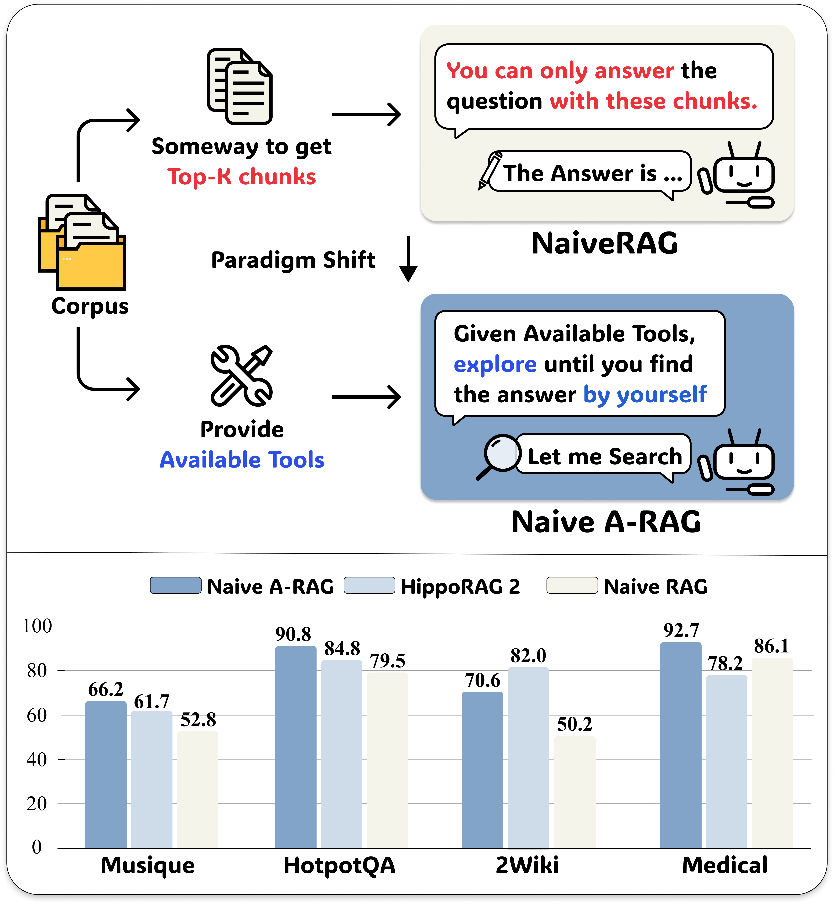
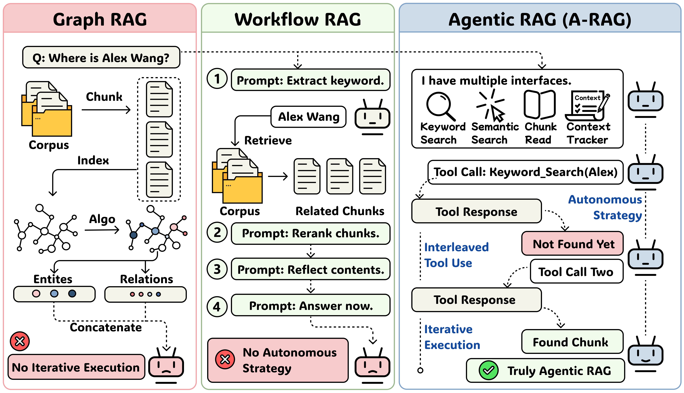
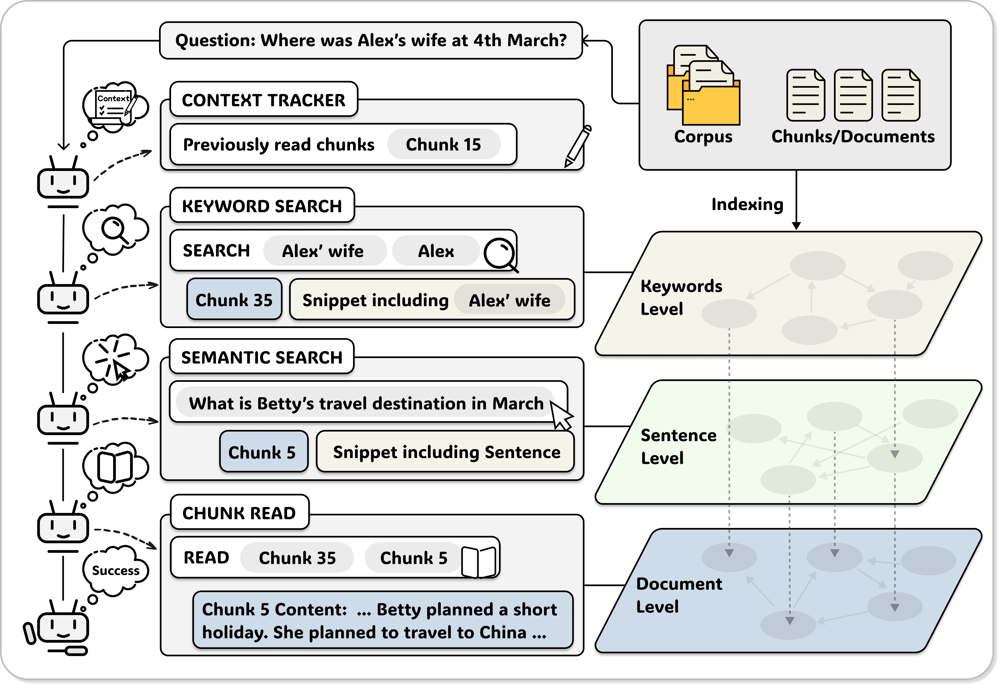
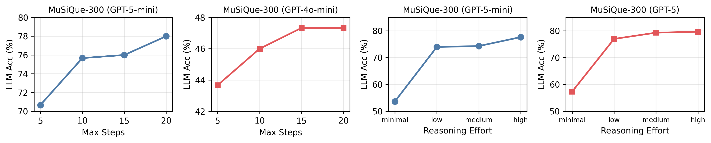
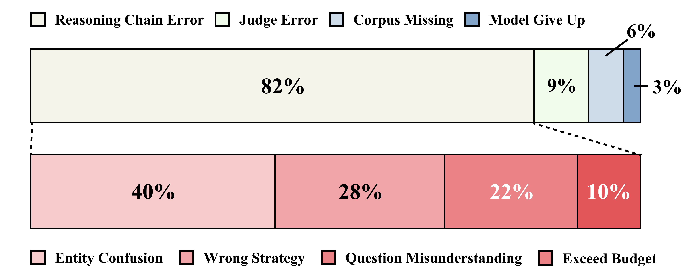

# A-RAG：透過階層式檢索介面擴展代理式檢索增強生成
**(A-RAG: Scaling Agentic Retrieval-Augmented Generation via Hierarchical Retrieval Interfaces)**

**作者團隊**：Mingxuan Du, Benfeng Xu, Chiwei Zhu, Shaohan Wang, Pengyu Wang, Xiaorui Wang, Zhendong Mao  
**發表日期**：2026 年 2 月  
**arXiv 論文編號**：[arXiv:2602.03442v1](https://arxiv.org/abs/2602.03442) [cs.CL]  
**原始程式碼與評測基準**：[https://github.com/Ayanami0730/arag](https://github.com/Ayanami0730/arag)

---

## 摘要 (Abstract)

前沿的大型語言模型（Frontier Language Models）在邏輯推理與長程工具調用（Long-Horizon Tool-Use）上已展現卓越能力；然而，現有的檢索增強生成（Retrieval-Augmented Generation, RAG）系統卻未能有效地發揮這些潛能。目前的系統普遍依賴兩種固守的設計範式：（1）在單次嘗試中檢索相關段落，並將結果硬性拼貼至模型的輸入提示中；或（2）預先撰寫固定的工作流程（Predefined Workflow），提示模型按部就班地執行各子步驟。這兩種範式皆無法讓語言模型主動參與到檢索決策中，從而限制了系統隨模型能力提升所能帶來的運算成效與擴展性（Scaling）。

在本論文中，我們提出了 **A-RAG**，這是一個直接向語言模型暴露**階層式檢索介面（Hierarchical Retrieval Interfaces）**的代理式 RAG（Agentic RAG）框架。A-RAG 提供了三種不同資訊粒度的檢索工具——**關鍵字搜尋（Keyword Search）**、**語意搜尋（Semantic Search）**與**區塊閱讀（Chunk Read）**——使代理系統（Agent）能夠自適應地於不同層次的文本粒度間進行搜尋與檢索。

我們在多項跨段落開放領域問答（Open-Domain QA）評測基準上進行了廣泛實驗。結果證實，A-RAG 在維持約略相當甚至更低 token 使用量的同時，穩定優於現行各種做法，這證明 A-RAG 能夠自適應不同 RAG 任務需求，並充分展現模型的推理表現。進一步地，我們系統性地探究了 A-RAG 如何隨模型參數規模及**推論時期運算（Test-Time Compute）**呈現擴展行為。本研究公開發布完整的程式碼與評測套件，以協助學術與工程社群推展後續研究。

---

## 1. 前言 (Introduction)

大型語言模型（LLMs）近年在複雜推理、規劃與自律工具調用方面取得了突破性成果。當面對需要真實世界新近知識或專業知識庫的自然語言任務時，**檢索增強生成（RAG）**已成為克服模型長期記憶過時與減輕事實性幻覺（Hallucination）的核心技術標準。

然而，現今主流 RAG 架構在設計哲學上，與語言模型日漸強大的推理能力之間出現了顯著斷裂。傳統 RAG（例如標準 Naive RAG 架構）多半把「檢索」當成一組封閉的離線預處理程序：系統在單次查詢中將篩選出的若干文獻區塊（Chunks），以拼貼方式前置於模型的提示語（Prompt）開頭。這種「先檢索後生成（Retrieve-Then-Generate）」的單次式架構，全然剝奪了語言模型決定該何時查詢、該查詢何物的主動決策權。


*圖 1：標準 Naive RAG 與 Naive Agentic RAG 的根本差異在於代理自主性（Agent Autonomy）。即便是僅配備單一向量檢索工具的極簡 Naive Agentic RAG，其效能亦穩定超越傳統 Naive RAG 與既有對照組。*

此外，近期興起的圖譜增強與工作流程增強方法（如 GraphRAG、HippoRAG2 及多種代理流程架構），雖然試圖捕捉長篇文章與實體間的多重連結，但通常仰賴工程師在事前硬編碼（Hard-Coding）寫死固定的檢索程序與遍歷圖譜的規則。在這類系統中，模型僅被賦予按步驟填空或單向調用的被動功能，無法適時依據解題當下的推理狀態進行彈性反思、提早收斂答案或隨機應變地更換搜尋關鍵詞。由此一來，就算核心模型升級更強的推理版本，系統也容易受限於僵化的檢索路徑而遇上成效天花板，難以實現有效的「推論時期擴展（Test-Time Scaling）」。

針對此項關鍵挑戰，我們提出了 **A-RAG**，將 RAG 重構為一個真正的代理式連續決策任務。A-RAG 的設計核心在於：**不再試圖為模型編寫僵化的檢索演算法，而是向大型語言模型直接開放一組結構精緻、可映射知識庫不同語境深度的「階層式檢索介面（Hierarchical Retrieval Interfaces）」**。這些檢索工具具體包含：
1. **關鍵字搜尋（Keyword Search）**：進行精密的詞彙與字面比對（Lexical Matching），使代理可以以輕量方式即時精準鎖定特定專有名詞或實體出處。
2. **語意搜尋（Semantic Search）**：透過稠密向量檢索（Dense Retrieval），依據概念語意於句子層級抓取相關描述。
3. **區塊閱讀（Chunk Read）**：由代理系統依據前兩步驟獲得之摘要資訊（Snippets），自行判斷是否需花費額外 token 調閱該區塊的完整文字內文。

在此分層工具群的支持下，語言模型得以在簡明乾淨的「推理－行動（ReAct-like）」代理循環中，自主策劃最適合當前難題的檢索方針：何時需要透過關鍵字精確錨定實體、何時該用語意搜索概念、又或是在何處該直接閱讀完整段落，真正使模型的深度推理能力與檢索系統達到優美融合。

---

## 2. 相關工作 (Related Work)


*圖 2：三種 RAG 範式對比。圖譜 RAG 與工作流程 RAG 依賴事前定義好的檢索演算法或固定流程；A-RAG 則是唯一同時滿足自主性、迭代探索與交互調用三項真實代理原則之架構。*

### 2.1 基礎檢索增強生成 (Basic RAG)
早期基礎 RAG 著重於依賴向量相似度查詢，將與問題相符的語料補貼至上下文視窗。然而，在面臨需要跨段落多重推理與邏輯拼圖的「多重推論問答（Multi-Hop QA）」情境下，單次檢索容易引入大批不相干的背景片段，造成上下文膨脹甚至干擾生成準確率。

### 2.2 圖結構檢索增強生成 (Graph RAG)
為提升跨段落實體關係查詢的表達力，近年研究相繼提出將文獻庫結構化為知識圖譜與社群結構的 Graph-RAG 架構（如 GraphRAG、HippoRAG2、LinearRAG、RAPTOR 等）。此類方法善於追蹤隱含的實體網絡，但除了龐大的離線圖譜索引建構成本外，其檢索機制通常遵循固定公式或僵化的圖節點漫遊規則，限縮了模型於推論階段的自由度。若最初檢索到的內容不足，模型無法利用其推理能力迭代收集更完整準確的信息。

### 2.3 工作流程檢索增強生成 (Workflow RAG)
以工作流程為基底的做法（如 FaithfulRAG、MA-RAG、RAGentA、IRCoT、FLARE）透過規劃多回合的驗證、分解與篩選步驟來提升問答準度。然而，這類系統主要聚焦在人為訂立的步驟依序調用，尚未將探索與工具選用的主體控制權交還給先進大型語言模型。

---

## 3. 方法論 (Methodology)

在這一節中，我們介紹 **A-RAG**，這是一個向模型開放階層式檢索介面的代理式 RAG（Agentic RAG）框架。如 **圖 3** 所示，我們的方法由三個關鍵元素組成：(i) 階層式索引、(ii) 一組檢索工具群，以及 (iii) 簡明的代理循環設計，以明確展現 A-RAG 的技術成效。


*圖 3：A-RAG 框架全景圖。左側為分層語料庫索引與三種層級介面；右側為簡明的 ReAct 代理循環，使模型能自主判斷並調用相應工具。*

### 3.1 階層式索引建構 (Hierarchical Index Construction)

為達到高效的多粒度檢索，我們建構了階層式索引，依不同抽象層級組織語料庫資訊。我們的索引建構流程極為輕量，僅包含兩個階段：區塊分割與嵌入向量。

#### 區塊分割 (Chunking)
依循 LinearRAG (Zhuang et al., 2025) 的設定，我們將每一份語料庫文檔分割為約 1,000 個 token 大小的文本區塊集合 $\mathcal{C} = \{c_1, c_2, \ldots, c_N\}$，每個區塊帶有對應的文字內容 $T_i$，並確保區塊邊界與句子邊界對齊以維繫語意連貫性。每個區塊均為語意自足的獨立單元，代理可透過專用的檢索介面進行選擇性存取，而非如傳統 RAG 方法般不加選擇地硬性拼接至脈絡中。

#### 嵌入向量 (Embedding)
對於任何區塊 $c_i$，我們先以規則化斷句將其拆解為句子清單 $\{s_{i,1}, s_{i,2}, \ldots, s_{i,n_i}\}$，隨後透過預訓練句子編碼器 $f_{\text{emb}}$ 產生精細的句子嵌入向量：

$$\mathbf{v}_{i,j} = f_{\text{emb}}(s_{i,j})$$

此一句級嵌入不僅支援細粒度的語意比對，同時維繫了從句子映射回原始父區塊（Parent Chunk）的結構關係，使代理得以先鎖定相關句子，再研讀完整的區塊脈絡。

#### 關鍵字層級 (Keyword-Level)
在關鍵字層級資訊部分，我們避免進行離線預先索引。不同於在離線階段建構倒排索引或知識圖譜，我們直接於查詢時期（Query Time）執行字面精確比對。相較於基於圖結構的方法，這項設計決策大幅降低了索引建構時間與運算成本。透過此輕量級索引程序，我們獲得了三種層級的資訊表示：（1）透過執行時文字搜尋進行精確實體比對的隱式關鍵字層級；（2）用於語意搜尋的句級嵌入向量；以及（3）用於全文內容存取的區塊層級儲存，這三者共同支撐了階層式檢索介面。

---

### 3.2 階層式檢索介面 (Hierarchical Retrieval Interfaces)

我們設計了三種在不同資訊粒度下運作的檢索工具，使代理能夠根據每個問題的特性，自適應地選擇最適合的搜尋策略。

#### 1. 關鍵字搜尋 (Keyword Search)
本工具執行精確的詞彙字面比對，定位含有特定術語的區塊。代理給定查詢關鍵字清單 $\mathcal{K} = \{k_1, k_2, \ldots, k_m\}$ 及目標返回筆數 $k$。區塊 $c_i$ 的相關性評分公式為：

$$\text{Score}_{\text{kw}}(c_i, \mathcal{K}) = \sum_{k \in \mathcal{K}} \text{count}(k, T_i) \cdot |k| \tag{1}$$

其中 $\text{count}(k, T_i)$ 指關鍵字 $k$ 在該文本區塊 $T_i$ 中的出現頻率，$|k|$ 則代表其字元長度（長字串因為特異度高而獲得較大權重）。針對得分最高的前 $k$ 名區塊，工具透過提取至少包含一個關鍵字之句子，建構出精簡摘要（Snippet）：

$$\text{Snippet}(c_i, \mathcal{K}) = \{s \in \text{Sent}(c_i) \mid \exists k \in \mathcal{K}, k \subseteq s\} \tag{2}$$

其中 $\text{Sent}(c_i)$ 代表區塊 $c_i$ 內的句子集合。該工具會回傳排名最高的前 $k$ 個區塊 ID 及其精簡摘要，讓代理能自主決定下一步行動。

#### 2. 語意搜尋 (Semantic Search)
本工具利用稠密檢索尋找概念語意相近的段落。給定使用者的自然語言查詢語句 $q$，系統將其轉化為查詢向量 $\mathbf{v}_q = f_{\text{emb}}(q)$，並與所有句子向量進行餘弦相似度（Cosine Similarity）運算：

$$\text{Score}_{\text{sem}}(s_{i,j}, q) = \frac{\mathbf{v}_{i,j}^{T} \mathbf{v}_q}{\|\mathbf{v}_{i,j}\| \|\mathbf{v}_q\|} \tag{3}$$

系統選定排名最佳的句子並依其原始父區塊彙整。每個區塊的相關性評分由其內部相似度最高的句子決定。該工具會回傳排名最高的前 $k$ 個區塊 ID，並附帶各區塊內比中句子所構成的精簡摘要，讓代理能自主決定下一步行動。

#### 3. 區塊閱讀 (Chunk Read)
基於關鍵字搜尋與語意搜尋所回傳的精簡摘要，代理可判斷哪些區塊需要完整閱讀，並使用本工具讀取區塊 $c_i$ 的完整內容。代理亦可在必要時延伸閱讀相鄰區塊以收集更多補充脈絡。
此一階層式設計本質上對代理極為友善，允許代理根據自身判斷以不同資訊粒度存取語料庫。代理無須盲目載入大量脈絡，而是可以按需漸進地獲取資訊，在最小化脈絡開銷的同時，仍保有在必要時蒐集完整證據的彈性。
由於我們的方法主要專注於介面設計與探究 A-RAG 的推論時期擴展行為，我們特意採用最單純的代理循環底座，以盡可能減少來自複雜調控機制的干擾變因。

---

### 3.3 代理循環與脈絡追蹤器 (Agent Loop and Context Tracker)

#### 代理循環 (Agent Loop)
我們採用類似 ReAct 的框架 (Yao et al., 2023)，其中模型採取交替方式逐次執行推理思考與工具調用。在每一輪迭代中，代理選擇一項工具呼叫、觀察回傳結果，並決定下一部行動。我們刻意避免採用平行工具調用或其他繁複設計，以便乾淨地觀察不同介面配置如何影響代理行為。當運算達到最大步數上限而仍未產生最終答案時，系統將提示代理基於目前蒐集到的資訊綜合產出回答。

#### 脈絡追蹤器 (Context Tracker)
為防止在多次檢索迭代中重複讀取資訊並造成 token 浪費，我們設計了脈絡追蹤器以記錄在檢索過程中曾經閱讀過的區塊。具體而言，我們維護一個集合 $\mathcal{C}^{\text{read}} = \{c_{i_1}, c_{i_2}, \ldots, c_{i_k}\}$，其中每個 $c_{i_j}$ 表示先前曾訪問過之區塊 ID。當代理試圖再次閱讀已經存在於清單中的區塊 $c_i \in \mathcal{C}^{\text{read}}$ 時，區塊閱讀工具不會再次傳回完整內文，而是回傳系統提示「*This chunk has been read before (此區塊先前已閱讀過)*」，且不耗費額外 token。此機制不僅減少了運算成本，也能鼓勵代理去探索語料庫中不同的部分，而非重複檢查相同的文句段落。
這項簡淨的設計使我們能夠清楚剝離並分析階層式介面對代理行為與檢索成效的影響。

---

## 4. 實驗 (Experiments)

### 4.1 實驗設定
- **多跳問答資料集**：採用四座主流之跨段落長程問答評測集：HotpotQA、2WikiMultiHopQA、MuSiQue 及 GraphRAG-Bench（包含 Medical 與 Novel 兩個領域子集），並使用相同的公開題目與文庫配置。
- **對照組基準線**：包含基礎 Zero-Shot LLM 推論與傳統 Naive RAG；現代圖譜與工作流程 RAG（GraphRAG、HippoRAG2、LinearRAG、FaithfulRAG、MA-RAG 與 RAGentA）；以及自家架構變體（A-RAG Naive 與 A-RAG Full）。
- **實作與評估指標**：主幹 LLM 使用 GPT-4o-mini 與 GPT-5-mini；向量嵌入採用 Qwen3-Embedding-0.6B；並同時量測大型語言模型對齊準確率（LLM-Acc, %）以及字面答案涵蓋準確率（Contain-Acc, %）。

### 4.2 主要結果

以下 **表 1** 展示了不同 RAG 方法於 5 大 QA 評測基準上的完整實驗對比與精確數值：

| 模型與方法 | MuSiQue (LLM) | MuSiQue (Cont) | HotpotQA (LLM) | HotpotQA (Cont) | 2Wiki (LLM) | 2Wiki (Cont) | Med. (LLM) | Novel (LLM) |
| :--- | :---: | :---: | :---: | :---: | :---: | :---: | :---: | :---: |
| **GPT-4o-mini 主幹** | | | | | | | | |
| Direct Answer (零樣本回答) | 18.3 | 13.9 | 45.4 | 40.7 | 30.3 | 49.7 | 68.6 | 45.3 |
| Naive RAG (標準向量 RAG) | 38.6 | 36.1 | 74.5 | 72.9 | 42.6 | 59.0 | 75.3 | 68.5 |
| GraphRAG | 26.4 | 20.8 | 33.2 | 33.3 | 18.4 | 47.2 | 51.3 | 28.8 |
| HippoRAG2 | 40.6 | 38.4 | 80.7 | 69.7 | 64.7 | 68.5 | 72.0 | 70.1 |
| LinearRAG | 34.8 | 26.3 | 72.0 | 60.5 | 62.9 | 62.3 | 53.1 | 45.4 |
| FaithfulRAG | 28.8 | 22.6 | 60.5 | 52.5 | 38.8 | 38.1 | 42.5 | 33.3 |
| MA-RAG | 34.1 | 27.4 | 60.6 | 54.4 | 51.0 | 53.4 | 62.3 | 44.5 |
| RAGentA | 32.2 | 29.9 | 63.0 | 62.4 | 27.7 | 50.3 | 67.7 | 61.3 |
| **A-RAG (Naive, 僅語意介面)** | 43.8 | 38.5 | 76.6 | 70.7 | 52.3 | 62.4 | 79.0 | 70.0 |
| **A-RAG (Full, 三層完整介面)** | **46.1** | **39.6** | **77.1** | **74.0** | 60.2 | 63.7 | **79.4** | **72.7** |
| **GPT-5-mini 主幹** | | | | | | | | |
| Direct Answer (零樣本回答) | 35.8 | 26.5 | 63.6 | 53.5 | 51.3 | 54.0 | 90.5 | 45.1 |
| Naive RAG (標準向量 RAG) | 52.8 | 48.7 | 81.2 | 79.5 | 50.2 | 66.5 | 86.1 | 70.6 |
| GraphRAG | 48.3 | 39.1 | 82.5 | 74.9 | 66.5 | 70.7 | 87.3 | 77.1 |
| HippoRAG2 | 61.7 | 52.5 | 84.8 | 75.0 | 82.0 | 79.7 | 78.2 | 54.3 |
| LinearRAG | 62.4 | 51.8 | 86.2 | 77.6 | 87.2 | 84.8 | 79.2 | 54.7 |
| FaithfulRAG | 52.9 | 52.8 | 76.9 | 75.3 | 51.8 | 56.6 | 75.4 | 60.7 |
| MA-RAG | 40.0 | 31.6 | 67.1 | 57.9 | 54.7 | 54.3 | 68.3 | 45.1 |
| RAGentA | 38.3 | 37.4 | 61.2 | 65.0 | 24.0 | 53.5 | 73.7 | 60.2 |
| **A-RAG (Naive, 僅語意介面)** | 66.2 | 59.7 | 90.8 | 85.3 | 70.6 | 76.9 | 92.7 | 80.4 |
| **A-RAG (Full, 三層完整介面)** | **74.1** | **65.3** | **94.5** | **88.0** | **89.7** | **88.9** | **93.1** | **85.3** |

*表 1 說明：在強勁的高規格向量嵌入與新型推論模型支持下，A-RAG (Full) 在 GPT-4o-mini 下拿下 3/5 個榜首，而在具備強大深度推論與反思工具能力的 GPT-5-mini 下則全面征服 **5/5 所有評測基準**。*

由上述實驗結果，我們可總結出三大關鍵實證觀察：

#### 標準檢索方法依然是穩健的基準線 (Vanilla retrieval method remain robust baseline)
在採用 GPT-5-mini 作為裁判模型並使用 Qwen3-Embedding 進行稠密檢索的統一實驗評估設定下，標準 Zero-Shot 與 Naive RAG 基準線在 GPT-4o-mini 與 GPT-5-mini 骨幹模型上均展現出相當穩健的競爭力。現有的圖譜增強（Graph-RAG）與工作流程增強（Workflow RAG）方法，往往無法在所有資料集上一致並顯著地優於這些簡潔的基礎設定。

#### Naive A-RAG 確立了代理式 RAG 的強大新基準 (Naive A-RAG establishes a new strong baseline for agentic RAG)
即使作為僅配備單一稠密語意檢索工具的簡化變體，A-RAG (Naive) 仍在多個資料集上明顯超越現存的 Graph-RAG 與 Workflow RAG 方法，證明了代理式 RAG 範式（Agentic Paradigm）本質上的優越性。當底座模型升級至推理能力更強的 GPT-5-mini 時，這項優勢更為擴大與顯著。此結果表明，賦予語言模型更大的檢索決策自主權，比依賴預先定義的死板檢索演算法或流程能帶來更強的問答表現，即便未配備複雜的多粒度介面工具亦然。

#### A-RAG 透過階層式檢索介面超越所有既有 RAG 方法 (A-RAG outperforms existing RAG methods through hierarchical retrieval interfaces)
A-RAG 是專門為具備現代工具調用（Tool-Use）與推理能力的模型所量身打造的框架，高度契合目前大型語言模型領域的發展趨勢。當使用 GPT-4o-mini 作為骨幹時，A-RAG (Full) 於 5 個測試集中取得 3 項最佳成績；而當切換至擁有更強推理與決策調度能力的 GPT-5-mini 時，A-RAG (Full) 則在**所有評測基準上全面取得最優良的答題準確度**。A-RAG 相較於對照組基準線及 A-RAG (Naive) 的穩定增幅，有力證實了該框架具有優異的「代理友善性（Agent-Friendly）」：它使模型能充分發揮推論潛能，依據任務需求動態調整策略並編排運用多層次介面，進而實現效能全面突破。

### 4.3 消融研究 (Ablation Study)

為了深入探究各個檢索工具在系統中的獨立貢獻，我們針對 A-RAG (Full) 進行了系統性的組件移除消融實驗。具體評估了三種變體配置：（1）**w/o Keyword Search** 與 **w/o Semantic Search**：分別直接自代理的工具集中移除對應的關鍵字搜尋與語意搜尋工具；（2）**w/o Chunk Read**：將關鍵字與語意搜尋的「摘要提示（Snippet-based）」結果替換為完整長文區塊，並完全移除區塊閱讀工具。

以下 **表 2** 呈現了以 GPT-5-mini 為底座的模型在不同介面消融下的問答精確度對比：

| 消融配置變體 | MuSiQue (LLM) | MuSiQue (Cont) | HotpotQA (LLM) | HotpotQA (Cont) | 2Wiki (LLM) | 2Wiki (Cont) | Med. (LLM) | Novel (LLM) |
| :--- | :---: | :---: | :---: | :---: | :---: | :---: | :---: | :---: |
| **A-RAG (Full, 完整三層介面)** | **74.1** | **65.3** | **94.5** | **88.0** | **89.7** | **88.9** | **93.1** | **85.3** |
| w/o KW Search (移除關鍵字搜尋) | 72.6 | 65.3 | 93.0 | 87.4 | 88.9 | 88.1 | 93.2 | 85.0 |
| w/o Semantic (移除語意搜尋) | 69.4 | 63.3 | 93.9 | 88.4 | 89.1 | 88.0 | 92.1 | 85.2 |
| w/o Chunk Read (移除區塊閱讀) | 73.6 | 67.0 | 93.6 | 88.8 | 89.0 | 87.9 | 93.3 | 85.1 |

如 **表 2** 所示，完整的階層式三層介面配置（A-RAG Full）取得了最佳的總體效能。在大多數評測基準上，A-RAG (Full) 皆表現最為優異；移除語意搜尋或關鍵字搜尋皆會導致效能衰退，凸顯了多粒度資訊於多跳檢索任務上的核心價值。此外，w/o Chunk Read 相較於 A-RAG (Full) 的表現下滑，有力證明了我們「漸進式資訊揭露（Progressive Information Disclosure）」的設計原則：透過讓代理先瀏覽簡短摘要再自主判斷調閱內文，不僅增強了代理自主性，更能避免無關長文帶來的注意力噪音與推論干擾。

---

## 5. 分析與討論 (Analysis and Discussion)

### 5.1 推論時期擴展分析 (Test-Time Scaling Analysis)


*圖 4：推論時期運算擴展曲線。隨著推論步數上限（Max-step Budget）增加至 20 步，GPT-5-mini 於 MuSiQue 上的答題成功率持續單調上升超過 8%；且高推論強度（High Reasoning Effort）設置能大幅將解答正確率增幅約 25%。*

我們分析了 A-RAG 的「推論時期擴展特性 (Test-Time Scaling Behaviour)」。結果顯示，當逐步提升模型在推論階段的最高迭代步數上限（由 5 步增加至 20 步），以及將思考強度調升至 high 時，系統表現呈現強烈的單調增長趨勢 (Monotonic Scaling)：
- 在多重推理難度極高的 MuSiQue 上，隨著推理步數增加，GPT-5-mini 的答題成功率穩定成長超過 **8%**。
- 若將推理努力設定由 minimal 調升至 high，模型之解答精確度顯著提升約 **25%**，證實 A-RAG 能夠有效吸收轉化額外推論算力（Test-Time Compute）並不斷打破準確度天花板。

### 5.2 脈絡效率分析 (Context Efficiency Analysis)

在建構高可靠性系統時，除了答題正確率，系統對脈絡長度與 Token 的使用效率至關重要。以下 **表 3** 呈現了各類方法於各評測資料集中每次問答平均檢索消耗的 token 數 (Average Tokens Retrieved per Question)：

| 檢索與問答方法 | MuSiQue (Tokens) | HotpotQA (Tokens) | 2WikiMultiHopQA (Tokens) | Med. (Tokens) | Novel (Tokens) |
| :--- | :---: | :---: | :---: | :---: | :---: |
| Naive RAG | 5,387 | 5,358 | 5,506 | 5,418 | 4,997 |
| HippoRAG2 | 5,411 | 5,380 | 5,538 | 5,447 | 5,019 |
| GraphRAG | 9,234 | 8,744 | 4,201 | 9,391 | 9,318 |
| LinearRAG | 5,418 | 5,353 | 5,518 | 5,427 | 4,998 |
| FaithfulRAG | 5,342 | 5,310 | 5,419 | 5,410 | 4,994 |
| MA-RAG | 9,566 | 8,007 | 8,857 | 6,858 | 6,101 |
| **A-RAG (Naive, 僅語意介面)** | 56,360 | 27,455 | 45,406 | 23,657 | 22,391 |
| **A-RAG (Full, 完整階層式介面)** | **5,663** | **2,737** | **2,930** | **7,678** | **6,087** |

*表 3 說明：A-RAG (Full) 使用約略相當甚至大幅低於 Naive RAG、HippoRAG2 與 LinearRAG 的 token 使用量（在 HotpotQA 與 2Wiki 僅約 2,700-2,900 Tokens），卻取得了大幅領先的回答正確率；而缺乏摘要快篩的 A-RAG (Naive) 則消耗超過數倍的 token，印證階層式介面對維持脈絡效率的關鍵作用。*

### 5.3 失敗案例分析 (Failure Mode Analysis)


*圖 5：A-RAG 失敗案例分析圖。推理鏈條失誤（Reasoning Chain Error）為佔比最大的錯誤根因，其中實體混淆（Entity Confusion）為核心難題。*

藉由人工檢視 MuSiQue 測試集中前 100 筆 A-RAG 的錯誤答覆，我們將失敗根因歸納為三個主要類別：
1. **推理鏈條失誤（Reasoning Chain Errors, 82%）**：佔比最重，常見現象為推理長步驟中發生的「實體混淆 (Entity Confusion, 40%–71%)」，以及多跳連結中的邏輯推理偏差。
2. **檢索策略失誤（Wrong Retrieval Strategies, 28%–29%）**：代理未能根據問題屬性正確選取關鍵字或語意介面，或在未查遍關鍵證據前過早中止搜索。
3. **題意誤解（Question Misunderstanding, 0%–22%）**：模型對於迂迴或具備歧義的多重問句主體產生誤讀。

---

## 6. 結論與限制 (Conclusion and Limitations)

### 6.1 結論
本研究指出 RAG 技術正經歷從被動式管道演進為「代理式主動檢索」的根本性典範轉移。我們提出之 **A-RAG** 架構，透過輕量而強大的**階層式檢索介面**（關鍵字搜尋、語意搜尋與區塊閱讀），讓先進大語言模型在 ReAct 循環中展現極致的自主檢索調度能力。大量跨段落問答基準上的實驗證明，A-RAG 不僅在正確性上超越所有現代圖譜或工作流程 RAG 系統，更在推論時期運算擴展（Test-Time Scaling）與脈絡使用效率上展現絕佳優勢。我們呼籲學術與實務界未來的 RAG 發展中心應從「精心編程的死板演算法」轉向「對模型代理更具友善與擴展彈性的介面與互動設計」。

### 6.2 限制與未來工作
- 本文未對所有潛在的檢索介面組合（如結合圖資料庫或多模態查詢工具）進行大規模的組合消融分析。
- 受限於硬體資源，尚未於頂尖大參數模型（如 GPT-5 或 Gemini 3）中進行實測；然鑑於 A-RAG 正是為了具備頂尖推理與工具適應能力的模型所設計，我們預測模型越為先進，其所帶來的擴展效益將越加巨大。
- 架構於事實查證、長文檔撰寫與對話系統等非傳統多跳問答任務中的廣泛適用性，值得後續深入探究。

### 6.3 倫理考量 (Ethical Considerations)
本研究中使用之所有資料集均為公開取得的基準評測集，且皆經由先前研究於適切之倫理考量下進行蒐集與處理。本論文專注於改善大型語言模型檢索增強生成之基礎方法研究，不涉及新資料蒐集或人體研究對象。作為對 RAG 系統的方法論貢獻，我們的方法並未引入既有大型語言模型固有風險之外的額外倫理風險。

---

## 附錄與補充參考資料 (Appendix & Supplementary Data)

### 附錄 A：各類 RAG 方法自主性與互動機制對比 (Comparison of RAG Method Autonomy)

我們明定了三項核心準則，以判定一個 RAG 方法是否具備真正的代理自主性（Truly Agentic）：
1. **自主策略 (Autonomous Strategy)**：該方法是否允許大型語言模型（LLM）動態挑選與組織高階推理策略（例如：是否檢索、何時檢索、如何拆解子問題、驗證答案或重新規劃），而非被限制在單一寫死的預設工作流程內，抑或完全依賴外部規則、分類器與評鑑器來決定方針。
2. **迭代執行 (Iterative Execution)**：該方法是否支援多回合執行流程，並能基於前輪中間的觀察結果彈性自適應執行輪數，而非死板的單次一擊式檢索（One-shot Retrieval）。
3. **交互調用工具 (Interleaved Tool Use)**：該方法是否遵循類 ReAct（ReAct-like）的「行動 → 觀察 → 推論」迴圈，即每一次調用工具均建立在前次工具產出之觀測脈絡基礎上，而非按照固定順序被動執行不變的工具序列。

以下 **表 4** 針對這三大核心維度，比較了 18 種主流與新興的 RAG 方法。如表所示，儘管部分現有方法能達成其中一至兩項準則，A-RAG 卻是唯一兼顧並完全滿足此三大核心準則的方法，這使其成為真正意義上的代理式 RAG 架構（Truly Agentic RAG Framework）。

| 檢索增強生成 (RAG) 方法 | 自主性 (Autonomy) | 迭代搜尋 (Iterative) | 交互調用 (Interleaved) | 系統所屬範式歸類 |
| :--- | :---: | :---: | :---: | :--- |
| Naive RAG | ✗ | ✗ | ✗ | 標準 RAG / 基礎 RAG |
| Self-RAG | ✗ | ✓ | ✓ | 基礎 / 反思式 RAG |
| CRAG | ✗ | ✗ | ✗ | 基礎 / 改正式 RAG |
| Adaptive-RAG | ✗ | Δ (部分) | Δ (部分) | 基礎 / 自適應路由 RAG |
| FLARE | ✗ | Δ (部分) | Δ (部分) | 工作流程 RAG (Workflow RAG) |
| IRCoT | ✗ | ✓ | Δ (部分) | 工作流程 RAG (Workflow RAG) |
| RQ-RAG | ✗ | ✗ | ✗ | 工作流程 RAG (Workflow RAG) |
| RA-ISF | ✗ | Δ (部分) | Δ (部分) | 工作流程 RAG (Workflow RAG) |
| RAPTOR | ✗ | ✗ | ✗ | 圖譜 RAG (Graph RAG) |
| GraphRAG | ✗ | ✗ | ✗ | 圖譜 RAG (Graph RAG) |
| LightRAG | ✗ | ✗ | ✗ | 圖譜 RAG (Graph RAG) |
| MemoRAG | ✗ | ✗ | ✗ | 圖譜 / 記憶增強 RAG |
| HippoRAG2 | ✗ | ✗ | ✗ | 圖譜 RAG (Graph RAG) |
| LinearRAG | ✗ | ✗ | ✗ | 圖譜 RAG (Graph RAG) |
| FaithfulRAG | ✗ | ✗ | ✗ | 工作流程 RAG (Workflow RAG) |
| MA-RAG | Δ (部分) | ✓ | Δ (部分) | 多代理工作流程 RAG |
| RAGentA | Δ (部分) | ✓ | Δ (部分) | 多代理工作流程 RAG |
| **A-RAG (Ours, 本文提出)** | **✓** | **✓** | **✓** | **真正代理式 RAG (Agentic RAG)** |

*表 4 說明：「✓」代表具備完整支援；「Δ」代表僅部分具備或需受限於寫死規則；「✗」代表缺乏該項能力。A-RAG 是唯一滿足全方位代理自主互動的系統。*

---

### 附錄 B：基準線重現細節 (Baseline Reproduction Details)

在我們的統一評估設定下，所有對照組基準線均於本地端重新運行。所有方法在檢索時統一採用 $k=5$（即返回 Top-5 區塊或片段），並將生成最大 token 上限設定為 $\text{max\_tokens} \geq 16384$，以防止深度推理思考過程被異常截斷。以下簡述各項基準線方法的具體實作配置：
- **GraphRAG (Edge et al., 2025)**：基於語料庫文檔建構具有階層式社群結構的知識圖譜，同時支援面向局部實體（Local）與全域社群（Global）的查詢導向摘要檢索。
- **HippoRAG2 (Gutiérrez et al., 2025)**：仿照人類海馬迴記憶索引機制，運用知識圖譜與個人化 PageRank (Personalized PageRank, PPR) 演算法，在顯著提升效率的同時實現單步多跳推理檢索。
- **LinearRAG (Zhuang et al., 2025)**：透過以單純的「實體抽取」取代傳統繁重的「關係抽取」，簡化圖結構建構程序，並建立具備兩階段檢索的階層式圖譜。
- **FaithfulRAG (Zhang et al., 2025a)**：透過自主事實探勘（Self-Fact Mining）、衝突辨識與推理整合，解決檢索內容與模型參數化知識之間的知識衝突。
- **MA-RAG (Nguyen et al., 2025)**：採用多代理協作框架，由特定功能之專業代理（規劃代理 Planner、步驟定義代理 Step Definer、抽取代理 Extractor、問答代理 QA）經由思維鏈推理（CoT）進行協作。
- **RAGentA (Besrour et al., 2025)**：結合稀疏-稠密混合檢索與迭代式文檔篩選的多代理系統，並能產出附帶引用來源（Citation-Attributed）的標準解答。

**表 5** 總結了各項基準線與 A-RAG 的關鍵重現設定對比：

| 方法名稱 | 檢索機制與圖譜結構 | 檢索 Top-$k$ | 最大 Token 預算 ($\text{max\_tokens}$) | 多跳/迭代協作機制 |
| :--- | :--- | :---: | :---: | :--- |
| **GraphRAG** | 階層式社群知識圖譜 (Local & Global) | 5 | $\geq 16384$ | 靜態社群摘要 / 非迭代 |
| **HippoRAG2** | 海馬迴記憶圖譜 + 個人化 PageRank (PPR) | 5 | $\geq 16384$ | PPR 單步全域漫遊檢索 |
| **LinearRAG** | 無關係線條之實體圖譜 + 兩階段檢索 | 5 | $\geq 16384$ | 兩階段篩選 |
| **FaithfulRAG** | 衝突辨識與事實判斷工作流程 | 5 | $\geq 16384$ | 衝突消解與自省驗證 |
| **MA-RAG** | 4 代理專業分工作 (Planner/Definer/Extractor/QA) | 5 | $\geq 16384$ | 思維鏈式多代理流程協作 |
| **RAGentA** | 混合稀疏-稠密檢索 + 迭代篩選 | 5 | $\geq 16384$ | 引用來源校驗迭代 |
| **A-RAG (Ours)** | 階層式索引 + 三層檢索介面 (關鍵字/語意/閱讀) | 5 | $\geq 16384$ | **ReAct 代理循環 + 脈絡追蹤器自主迭代** |

---

### 附錄 C：代理循環演算法 (Agent Loop Algorithm)

**演算法 1** 列出了 A-RAG 代理循環的完整形式化虛擬碼。代理於運行時維護一份歷史訊息清單 $\mathcal{M}_{\text{msg}}$ 以及一個已閱讀區塊追蹤集合 $\mathcal{C}^{\text{read}}$。在每一輪迭代中，大語言模型 $\mathcal{M}$ 接收目前歷史訊息與可調用工具群 $\mathcal{T}$，隨後決定要呼叫特定工具或直接產出最終解答；若觸發最大步數上限 $L$，系統將強制引導模型基於現有脈絡綜合產出最後答案。

```markdown
演算法 1：A-RAG 代理循環 (A-RAG Agent Loop)
================================================================================
輸入：使用者的問題 q，最大運算步數上限 L，可調用工具群 T = {KeywordSearch, SemanticSearch, ChunkRead}，大語言模型 M
輸出：最終回答 Answer

1: 初始歷史訊息清單 M_msg <- [UserMessage(q)]
2: 初始已讀取區塊集合 C_read <- empty_set
3: for t = 1 to L do
4:     a_t <- M(M_msg, T)                // 模型產生思考邏輯與決定下一步行動
5:     if a_t 屬於最終解答 (Final Answer) then
6:         return a_t.answer
7:     else if a_t 為調用工具 T_i in T 且帶有參數 args then
8:         if T_i == ChunkRead 且 args.chunk_id in C_read then
9:             res <- "This chunk has been read before (此區塊先前已閱讀過)"
10:        else
11:            res <- T_i(args)          // 執行相應檢索介面工具
12:            if T_i == ChunkRead then
13:                C_read <- C_read union {args.chunk_id}
14:            end if
15:        end if
16:        M_msg <- M_msg + [AssistantMessage(a_t), ToolMessage(res)]
17:    end if
18: end for
19: // 若達最大步數上限仍未收斂，則提示模型綜合既有資訊作答
20: M_msg <- M_msg + [SystemPrompt("Please synthesize an answer based on current context.")]
21: return M(M_msg, empty_set).answer
================================================================================
```

---

### 附錄 D：錯誤模式細節與分析 (Failure Mode Details)

為了深刻理解當 RAG 典範由 Naive RAG 轉移至代理式 RAG（Agentic RAG）時，系統失敗模式的結構性轉變，我們對兩個核心實驗設定中的前 100 筆錯誤案例進行了人工鑑識：（1）GPT-4o-mini 搭配 Naive RAG（在 HotpotQA 與 MuSiQue 上）；以及（2）GPT-5-mini 搭配 A-RAG（在 MuSiQue 與 2WikiMultiHopQA 上）。本項分析意在指明未來領域研究的優化著力點。

#### D.1 Naive RAG 錯誤類別 (Naive RAG Failure Categories)
在 GPT-4o-mini 搭配 Naive RAG 的設定下，我們將錯誤根因歸納為四類：
- **模型理解失誤 (Model Understanding)**：正確解答（Gold Answer）已完整存在於檢索到的文檔中，但模型未能正確理解文意或精準抽取答案。
- **多跳檢索失敗 (Multi-hop Retrieval)**：正確解答存在於語料庫內，但單次靜態檢索（Single-pass Retrieval）無法找齊跨段落多跳推導所需的所有前提。
- **裁判評估錯誤 (Judge Error)**：模型所給出的回答事實上正確或語意等價，卻被評測腳本或裁判模型判定為錯誤。
- **Top-K 涵蓋不足 (Top-K Insufficient)**：正確答案完全不在當前文庫中，抑或 $k=5$ 的數量限制無法涵蓋完整的長程推導路徑。

#### D.2 A-RAG 錯誤類別 (A-RAG Failure Categories)
針對 GPT-5-mini 搭配 A-RAG 的設定，我們建構了「主類別－次類別」的雙層分級分析體系：
- **主要類別 (Primary Categories)**：
  1. **推理鏈條失誤 (Reasoning Chain Error)**：模型順利完成了多輪檢索並取得相關證據，卻在中間邏輯推理鏈上失誤，導致最後推導結論錯誤。
  2. **裁判評估錯誤 (Judge Error)**：模型答覆無誤，為評估工具或裁判模型誤判。
  3. **模型放棄作答 (Model Gave Up)**：模型用盡所有檢索回合後，主動宣告「查無相關資訊 (Information not found)」。
  4. **語料庫缺失答案 (Corpus Missing)**：目標答案之核心依據不存在於測試文庫中。

- **次要類別 (Secondary Categories - 針對「推理鏈條失誤」之內部細分)**：
  1. **實體混淆 (Entity Confusion)**：模型雖閱讀了包含正確解答的區塊，卻被文內相近或重疊的其他干擾實體（Distractor Entities）誤導。
  2. **檢索策略錯誤 (Wrong Strategy)**：模型在關鍵字挑選、語意查詢構想或介面調用上作出不當決策。
  3. **題意誤讀 (Question Misunderstanding)**：複雜的多重遞迴問句結構造成模型對題目核心意圖產生誤讀。
  4. **超出預算上限 (Exceed Budget)**：模型在未找到關鍵解答前即消耗完最大思考或檢索步伐上限。

**表 6** 展示了 A-RAG 於不同基準測試上各類失敗模式的比例分佈：

| 錯誤主類別 | 次級錯誤原因 | MuSiQue (%) | 2WikiMultiHopQA (%) |
| :--- | :--- | :---: | :---: |
| **推理鏈條失誤 (Reasoning Chain Error)** | 小計 | **82.0%** | **45.0%** |
| — | 實體混淆 (Entity Confusion) | 40.0% | 71.0% |
| — | 檢索策略錯誤 (Wrong Strategy) | 28.0% | 29.0% |
| — | 題意誤讀 (Question Misunderstanding) | 22.0% | 0.0% |
| — | 超出預算上限 (Exceed Budget) | 10.0% | 0.0% |
| **裁判評估錯誤 (Judge Error)** | — | **8.0%** | **12.0%** |
| **模型放棄作答 (Model Gave Up)** | — | **6.0%** | **33.0%** |
| **語料庫缺失答案 (Corpus Missing)** | — | **4.0%** | **10.0%** |

#### D.3 深度分析 (Analysis)
- **典範轉移改變了效能瓶頸 (Paradigm shift changes the bottleneck)**：在 Naive RAG 中，約有 50% 的失敗歸咎於「檢索限制」（多跳檢索失敗 + Top-K 涵蓋不足），顯示傳統架構的核心痛點在於「找不到必要文獻」；對比之下，A-RAG 的最大失誤類別（在 MuSiQue 上高達 82%）為推理鏈條失誤，顯示瓶頸已從「文獻尋找」轉移為「找到文獻後的推論消歧能力」。
- **實體混淆為首要挑戰 (Entity confusion is the primary challenge)**：跨越兩大資料集，實體混淆皆是最大的次級失誤來源（MuSiQue 上佔 40%、2Wiki 上佔 71%）。這證實了在檢索脈絡增加的環境下，強化大型語言模型在干擾資訊中的實體消歧與核心事實抽取能力，將是下一步最關鍵的優化方向。
- **資料集特性深刻影響失敗分佈 (Dataset characteristics affect failure patterns)**：MuSiQue 由於具有高度複雜且迂迴的多重推導問句，有高達 22% 屬於題意誤讀；2Wiki 則表現出高達 33% 的「模型放棄作答」情境。這顯示針對不同任務與提問難度，代理系統必須具備客製化的策略自適應與容錯韌性。

---

### 附錄 E：提示詞模板與工具說明 (Prompt Templates and Tool Descriptions)

為了證明代理式 RAG (Agentic RAG) 典範的核心優勢來自於**階層式介面設計本身**，而非冗長複雜的提示詞工程，我們於全系統中有意使用極其精簡的系統提示詞（System Prompts）。如論文中的**圖 6 (Figure 6)** 所示，所有模型配置（包含 A-RAG Naive 與 A-RAG Full）皆共用相同的骨幹系統指令結構，僅在「授權調用之工具定義」與「策略使用指引」部分有所差異。提供給代理系統的完整工具定義與策略指引詳細記載於**圖 7 (Figure 7)** 與**圖 8 (Figure 8)**。

#### 圖 6：骨幹系統提示詞結構 (System Instruction Backbone)

> **系統提示詞核心模板 (System Prompt)**：
> You are a helpful assistant designed to answer questions based on the given tools and context.
> （你是一個設計用來基於可用工具與上下文回答問題的專業助手。）
> 
> When answering, you should:
> 1. Think step by step and reason about what information you need.
> 2. Call available tools to search and inspect the corpus when necessary.
> 3. Provide accurate and faithful answers based on the retrieved evidence.
> （回答時，你應當：1. 循序漸進地思考並推論所需資訊；2. 必要時調用可用工具搜尋與查閱語料庫；3. 基於檢索到的證據給出精準且忠實的最終回答。）

#### 圖 7：A-RAG Full 完整工具定義與策略使用指引 (A-RAG Full Tools & Strategy Guidance)

在 A-RAG Full 配置下，代理被授權使用三種不同資訊粒度的階層式檢索介面工具，並收到以下工具定義與指引宣告：

1. **`keyword_search(keywords: list[str], top_k: int = 5)`**
   - **功能定義**：執行字面精確比對（Lexical Matching），回傳包含目標關鍵字出現頻率最高的前 $k$ 個區塊之「精簡摘要 (Snippet)」。
   - **策略使用指引 (Strategy Guidance)**：適用於尋找特定專有名詞、實體名稱、罕見關鍵字或精準數值。當你需要比對具體詞彙是否存在於文庫中時，應優先採用關鍵字搜尋。

2. **`semantic_search(query: str, top_k: int = 5)`**
   - **功能定義**：將自然語言查詢語句轉換為稠密嵌入向量，在向量空間中搜尋語意與概念相近之文句段落，回傳最高相關分數的前 $k$ 個區塊之「精簡摘要 (Snippet)」。
   - **策略使用指引 (Strategy Guidance)**：適用於探索概念性主題、抽象語意、跨句關係或整體語境。當問題描述較為廣義、涉及同義詞表達或無法依賴單一關鍵字時，應優先使用語意搜尋。

3. **`chunk_read(chunk_id: str)`**
   - **功能定義**：按需讀取指定區塊 $c_i$ 的完整文字內容與上下文。若該區塊已於先前回合閱讀過，脈絡追蹤器將回傳系統提示「*This chunk has been read before (此區塊先前已閱讀過)*」以避免 token 浪費。
   - **策略使用指引 (Strategy Guidance)**：當關鍵字搜尋或語意搜尋所回傳的精簡摘要（Snippet）已顯示高度相關，但仍不足以完成嚴謹判斷與推理時，調用本工具以載入該區塊的完整文字脈絡；亦可依需延伸閱讀相鄰區塊以蒐集完整證據鏈。

#### 圖 8：A-RAG Naive 工具定義與策略使用指引 (A-RAG Naive Tools & Strategy Guidance)

在作為消融對照的 A-RAG Naive 配置下，代理不具備多層級階層式存取介面，而是採用單層式的基礎檢索機制：

- **單一檢索介面**：代理僅可調用基礎語意或文字檢索工具，每次返回固定筆數之文檔片段並直接硬性拼接至當前脈絡中，缺乏精簡摘要（Snippet）篩選與選擇性全文深讀（Chunk Read）的層級解耦。
- **策略對比結論**：如實驗（參閱 4.3 節消融研究）所示，即便在相同的推論時期運算（Test-Time Compute）與最大思考步數預算下，缺乏圖 7 階層式介面設計的 A-RAG Naive 系統在多跳推理準確率與脈絡效率（Context Efficiency）上皆顯著低於 A-RAG Full，實證了「階層式介面」本身即是解放代理擴展潛能的根本驅動力。

透過上述透明且精簡的介面設計與策略指引，大型語言模型能夠於推論時期專注發揮其強大的推理思考與策略決策能力，在長程多跳問答任務中維持極致的 token 使用效率。


