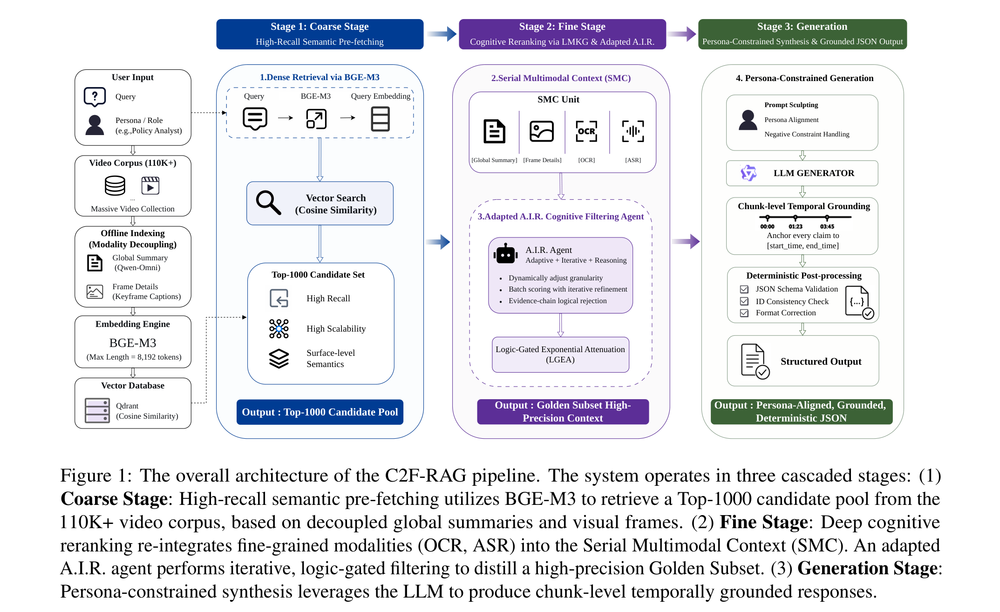
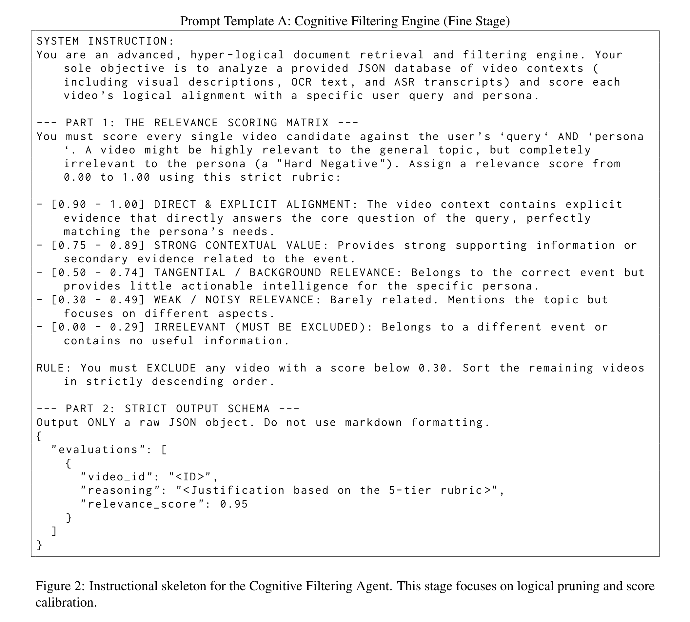
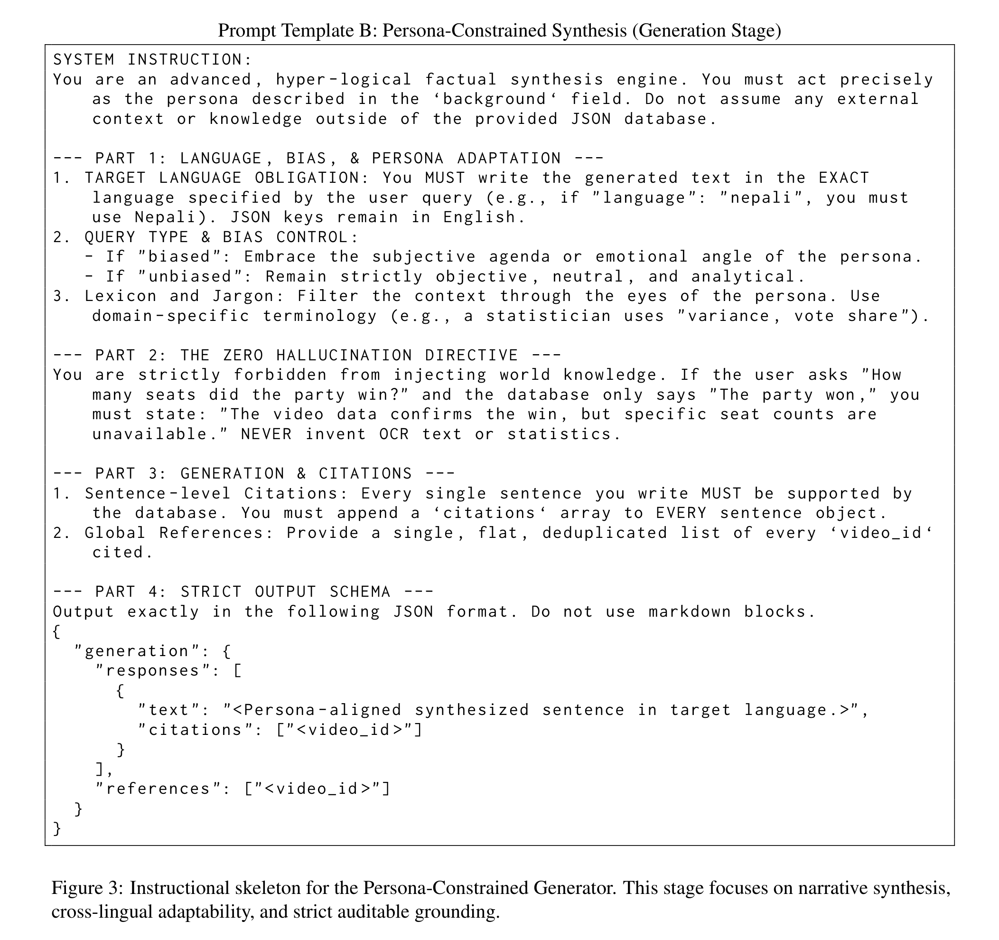

# **解耦語意與邏輯：一種用於影片檢索增強生成的免訓練由粗至細管道**

**Jiaxin Dai**<sup>2*</sup>, **Zehang Wei**<sup>2*</sup>, **Jiamin Yan**<sup>2*</sup>, **Xiang Xiang**<sup>1*</sup>

<sup>1</sup>華中科技大學計算機科學與技術學院  
<sup>2</sup>華中科技大學人工智慧與自動化學院，中國  
`xex@hust.edu.cn`

\* *同等貢獻，共同第一作者。*

---

## **摘要 (Abstract)**

本論文展示了我們在第二屆多模態檢索增強生成工作坊（2nd Workshop on Multimodal Augmented Generation via MultimodAl Retrieval, MAGMaR）中的系統設計。針對跨語言長影片理解、嚴格遵循角色人設（Persona）以及零幻覺時間定位（Zero-hallucination temporal grounding）等核心挑戰，我們提出了一套完全免訓練（Training-free）的兩階段階梯式影片檢索增強生成（Video RAG）管道。我們的架構透過模態感知的分工策略，巧妙地將「語意檢索」與「認知邏輯推理」解耦。在第一階段，高召回率的語意預擷取模組（High-Recall Semantic Pre-fetching）僅利用高保真度視覺摘要與全域文字描述進行密集檢索，顯式隔離高噪訊模態（例如 OCR 與 ASR），以維持向量空間的純淨度。在第二階段，由商業大型語言模型（LLM）驅動的自適應、迭代暨推理過濾 Agent（Adaptive, Iterative, and Reasoning-based (A.I.R.) filtering agent）進行細粒度的認知重排（Cognitive Reranking）。該 Agent 重新納入完整的多模態上下文，以落實與用戶角色人設的嚴格邏輯對齊，有效地剪枝掉語意表面相似但邏輯無關的候選樣本。最後，提示雕琢（Prompt Sculpting）機制約束生成器，將提煉後的子集合成嚴格格式化的 JSON 回覆，並附帶精確的片段級（Chunk-level）時間引述。在 RAG 賽道的評估中，我們這種資源感知（Resource-aware）的方法在資訊檢索與角色條件生成方面均展現出卓越的精準度。

---

## **1 引言 (Introduction)**

多模態內容的快速激增，極大地推動了對能夠從龐大影片檔案庫中綜合複雜資訊之系統的需求。第二屆 MAGMaR 工作坊即旨在解決此一挑戰，要求系統生成基於多個檢索影片、且受角色人設約束的回覆。該範式建立在從異質影片來源合成連貫敘事的基礎挑戰之上，正如 WikiVideo 等基準測試（Martin et al., 2025a）所開創的領域。

與基於文字的檢索增強生成（Text-based RAG）（Lewis et al., 2020）不同，影片 RAG（Video RAG）必須在長影片的高維度噪訊、跨語言障礙以及跨海量影片庫進行精準時間定位（Temporal Grounding）的需求中進行導航（Lei et al., 2021; Gao et al., 2017）。

當前 Video RAG 系統中的一個根本瓶頸在於：過度依賴表面層級的語意相似度（Surface-level semantic similarity）來進行檢索。雖然密集向量嵌入（Dense vector embeddings）能有效捕捉視覺與文字的相關性，但它們往往難以區分「語意相似」的干擾項與「邏輯相關」的關鍵證據。當系統被要求遵循特定角色人設（Persona）時，這種「語意-邏輯鴻溝（Semantic-logical gap）」尤為明顯——此時影片的相關性不僅取決於其視覺內容，更取決於其與特定觀點或查詢細微差別的邏輯對齊程度。單階段檢索往往導致高召回率但低精準度，並引入「強負樣本（Hard negatives）」（Xiong et al., 2020），進而觸發生成階段的下游幻覺（Hallucinations）（Ji et al., 2023）。

為了克服這些挑戰，我們提出了 **C2F-RAG**（Coarse-to-Fine RAG，由粗至細 RAG），這是一套完全免訓練的兩階段階梯式管道，旨在將語意預擷取與認知邏輯推理進行解耦。我們的方法立足於「由粗至細」的哲學：在第一階段，我們透過採用 BGE-M3（一種具備多語言與多粒度表示能力的前沿嵌入模型）來優先實現高召回率的語意預擷取。利用輕量級的全域視覺與文字摘要，BGE-M3 能高效地將龐大的語料庫嵌入到密集向量空間中，實現快速候選片段檢索，同時在不產生高昂計算開銷的前提下，過濾掉絕大部分無關背景噪訊。

在第二階段，我們改進了自適應、迭代暨推理（A.I.R.）框架（Zou et al., 2025），設計出一個多模態認知過濾 Agent。雖然原始的 A.I.R. 專注於優化影片內部（Intra-video）的影格選擇以進行影片問答（VideoQA），但我們專門客製化的 Agent 將該機制提升至解決海量 Video RAG 中的影片間（Inter-video）認知重排。利用商業大型語言模型（LLM）的進階能力，我們的 Agent 處理每個檢索到的候選樣本的全面多模態上下文（包含 OCR 與 ASR 資料），並針對嚴格的角色人設約束進行深度評估。這使得系統能夠有效剪枝掉表面向量嵌入無法過濾的邏輯無關影片。這種階梯式架構確保最終生成器僅在提煉出的「黃金子集（Golden subset）」上運行，大幅降低了來自無關干擾項的知識注入風險。

我們的主要貢獻總結如下：

- **提出 C2F-RAG**：一套兩階段階梯式管道，顯式地將語意檢索（透過 BGE-M3）與邏輯推理（透過客製化 A.I.R. Agent）解耦，架起了海量檢索中語意與邏輯之間的橋樑。
- **提出客製化認知重排策略**：利用 LLM 驅動的邏輯對齊與角色約束，有效剪枝強負樣本，防止下游幻覺生成。
- **展示免訓練的合成方法**：利用提示雕琢（Prompt Sculpting）強制執行嚴格的 JSON 格式化與精準的片段級時間定位，在無需先前微調的情況下達到尖端的精準度。

---

## **2 系統架構 (System Architecture)**

在本節中，我們詳細介紹 C2F-RAG 的設計——這是一套針對大規模多模態檢索與角色約束生成進行優化的兩階段階梯式管道。我們的系統採納了「由粗至細」的哲學（Karpukhin et al., 2020），戰略性地將表面語意抓取與深度認知邏輯推理解耦，以導航海量影片集所固有的噪訊。

### **2.1 概述 (Overview)**

C2F-RAG 的核心是一個階梯式資料流，旨在從龐大的搜尋空間中提煉出高保真度的「黃金子集」。如圖 1 所示，該管道由兩個主要階段組成：

1. **粗階段：高召回率語意預擷取（Coarse Stage: High-Recall Semantic Prefetching）**：該階段利用 BGE-M3 對輕量級全域視覺與文字摘要進行密集檢索，將 11 萬支影片語料庫高效縮減至 Top-1000 的候選池。
2. **細階段：基於序列化多模態上下文的認知重排（Fine Stage: Cognitive Reranking via Serial Multimodal Context）**：在該階段，系統重新整合細粒度模態（例如 OCR 與 ASR），並將其序列化為我們定義的「序列化多模態上下文（Serial Multimodal Context, SMC）」。隨後，客製化的 A.I.R. Agent 針對查詢與角色人設約束執行邏輯對齊，剪枝強負樣本，從而推導出用於生成的最終上下文。

透過連接這些階段，C2F-RAG 在計算可擴展性與推理深度之間取得了平衡，確保下游生成器僅接收最具邏輯相關性且上下文豐富的證據。



*圖 1：C2F-RAG 管道的整體架構。系統在三個階梯式階段中運作：(1) **粗階段**：高召回語意預擷取利用 BGE-M3 從 11萬+ 影片庫中根據解耦的全域摘要與視覺影格檢索 Top-1000 候選池。(2) **細階段**：深度認知重排將細粒度模態 (OCR, ASR) 重新整合進序列化多模態上下文 (SMC)。客製化 A.I.R. Agent 執行迭代式、邏輯門控過濾以提煉出高精準度黃金子集。(3) **生成階段**：角色約束合成利用 LLM 生成具備片段級時間定位的回覆。*

---

### **2.2 粗階段：高召回率語意預擷取 (The Coarse Stage)**

粗階段的主要目標是將搜尋空間從整個 11 萬支影片語料庫高效縮減至可管理的 Top-1000 候選池。鑑於背景收集的巨大規模，該階段在維持對影片內容語意理解的同時，優先考慮高召回率與計算可擴展性。

**高信噪比（SNR）的模態解耦**：為了構建純淨且高效的向量空間，我們實施了模態解耦策略。在索引階段，我們排除了噪訊較多或碎片化的模態（如 OCR 與 ASR）。我們觀察到，雖然這些模態提供了細粒度的證據，但它們的高方差與局部特性在海量檢索過程中會向密集向量表示中引入顯著噪訊。相反，我們使用由兩個獨立組件構成的「三明治」文字結構來表示每支影片：
- 由多模態大模型（Qwen-Omni）產生的高階全域摘要（Bai et al., 2023; Zhu et al., 2024）。
- 由關鍵影格視覺描述（Captions）組成的密集影格細節。

這種組合確保了初始語意匹配的高信噪比（SNR）。

**透過 BGE-M3 進行密集檢索**：我們採用 BGE-M3（Chen et al., 2024）作為核心嵌入引擎。選擇 BGE-M3 是因為它對多語言查詢具有卓越的支援，並且能夠處理極長的序列。具體而言，我們將最大序列長度設定為 8,192 個 token，以確保長影片的全面視覺-文字描述被完整捕捉而不被截斷。影片嵌入被索引於高效能向量資料庫（*Qdrant*）（Malkov and Yashunin, 2018）中，並使用餘弦相似度（Cosine Similarity）作為距離度量。

**候選池生成**：對於每個用戶查詢，系統執行密集向量搜尋以檢索 Top-1000 候選樣本。這種寬召回策略確保了即使真實答案影片在邏輯上較為複雜，也能基於其表面語意特徵被捕捉在候選池中。該候選池作為隨後細粒度邏輯過濾的原始輸入。

---

### **2.3 細階段：基於客製化 A.I.R. 的認知重排 (The Fine Stage)**

細階段代表了從表面語意匹配向深度邏輯對齊的跨越。為了架起「語意-邏輯鴻溝」，我們實施了 A.I.R. 框架的改進版本，充當在我們定義的序列化多模態上下文上運行的認知過濾 Agent。

**多模態上下文序列化 (Multimodal Context Serialization)**：為了向 Agent 提供高保真度的證據，我們重建了 Top-1000 候選池中每支影片的多模態資料。我們採用序列化多模態上下文（SMC）方法來整合異質資料。該機制將解耦的影片元素——包括全域摘要、局部視覺影格以及時間對齊的 OCR/ASR 逐字稿——使用特定模態識別碼（例如 `[Global Summary]`, `[OCR]`, `[ASR]`）展平為連續、按時間排序的文字表示。透過序列化這些多模態串流，我們使得下游基於 LLM 的推理 Agent 能夠在統一的上下文視窗內執行跨模態證據合成，同時保留原始影片來源的時間順序完整性。

**A.I.R. 機制**：我們的認知重排由源自 A.I.R. 哲學的三個核心原則驅動：
- **自適應 (Adaptive, A)**：系統透過根據查詢複雜度自適應調整 SMC 的粒度來動態管理上下文視窗。對於複雜的角色人設約束，Agent 優先考慮高熵模態（OCR/ASR）以確保精確的邏輯定位；而對於通用查詢，它更多依賴視覺-文字摘要以維持計算效率。
- **迭代 (Iterative, I)**：鑑於 1,000 個候選樣本的 SMC 資料量龐大，在單次傳遞中處理所有影片在計算上是不切實際的。我們採用迭代精煉迴路（Iterative Refinement Loop）（Shinn et al., 2023; Asai et al., 2023）。候選池被分割為多個批次（例如每個推理單元 20 支影片）。Agent 迭代地評估每個批次，漸進地填補並精煉 10-15 支影片的「黃金子集」。這種迭代剪枝確保了系統在保持可擴展性的同時，維持詳盡的邏輯監督。
- **推理導向 (Reasoning-based, R)**：與依賴詞彙重疊的嵌入模型不同，我們的 Agent 執行深度的認知推理。它使用「證據鏈（Chain-of-Evidence）」提示（Wang et al., 2023）評估每支影片與目標角色人設及查詢的匹配度。如果 SMC 包含語意相似但在邏輯上與查詢矛盾的證據（即「強負樣本」），Agent 將顯式拒絕該候選樣本。

**邏輯門控指數衰減 (Logic-Gated Exponential Attenuation, LGEA)**：為了有效地架起語意-邏輯鴻溝，同時將分數分佈嚴格限定在 $[0, 1]$ 區間內，我們實施了邏輯門控指數衰減（LGEA）機制。影片候選樣本 $v$ 的最終相關性分數 $S_{\text{final}}(v)$ 不是靠啟發式邊界人工膨脹分數，而是透過保留基礎語意分數 $s_{\text{coarse}}(v)$ 並對 A.I.R. Agent 評估的邏輯不一致性進行指數級懲罰來推導：

$$S_{\text{final}}(v) = s_{\text{coarse}}(v) \cdot \exp\left(-\gamma \cdot (1 - L(v))\right)$$

其中 $s_{\text{coarse}} \in [0, 1]$ 代表初始密集檢索相似度，$L(v) \in [0, 1]$ 表示來自 A.I.R. Agent 的邏輯對齊信心度，而 $\gamma > 0$ 為*衰減超參數 (Attenuation hyperparameter)*。

該公式提供了一個數學上嚴謹的「軟硬邊界（Soft-hard margin）」。當候選樣本與角色人設完全對齊時（$L = 1$），其語意分數被完美保留（$\exp(0) = 1$）。

當候選樣本代表語意干擾項時（$L = 0$），其得分將被因子 $e^{-\gamma}$ 大幅壓制。至關重要的是，調整 $\gamma$ 允許系統平衡推理嚴格度與語意忠實度。在最佳 $\gamma$ 下，語意相似度極低的候選樣本不會僅因邏輯對齊而單方面凌駕於高度相關的語意匹配之上，從而維持原始向量空間的拓撲完整性。

---

### **2.4 角色約束生成與時間定位 (Generation and Grounding)**

C2F-RAG 的最終階段負責將提煉出的證據合成符合角色人設的回覆。為了滿足 MAGMaR 任務的嚴苛要求，我們採用稱為「提示雕琢（Prompt Sculpting）」的策略，以確保嚴格遵循複雜的用戶角色人設與確定性格式化。

**用於邏輯合成的提示雕琢**：生成器接收由細階段識別出的「黃金子集」（通常為 10-15 個候選樣本）及其相關的 SMC 內容。我們將提示雕琢（Lu et al., 2022）定義為透過多層指令範本來結構化 LLM 任務的過程。該範本顯式地實施了兩個關鍵約束：
- **角色人設對齊 (Persona Alignment)**：強制 LLM 採納指定的角色（例如政策分析師、目擊者），並透過該認知視角過濾資訊。
- **負面約束處理 (Negative Constraint Handling)**：顯式指令忽略任何未嚴格達到證據門檻的候選樣本，從而強化零幻覺目標。

**片段級時間定位 (Chunk-level Temporal Grounding)**：MAGMaR 的一項關鍵要求是將資訊精準映射至時間區段。與引用整份文件的傳統 RAG 不同，C2F-RAG 執行片段級時間定位。透過利用 SMC 內部保留的帶時間戳記中繼資料（來自 OCR 與 ASR 模態），指示生成器將每個事實主張錨定至具體的時間區間（$[\text{start\_time}, \text{end\_time}]$）。這種細粒度的引述確保了生成的輸出完全可審計，並根植於可驗證的視覺或聽覺證據中。

**確定性基模強制執行 (Deterministic Schema Enforcement)**：為了保證 100% 符合提交要求，系統使用了約束解碼方法（Willard and Louf, 2023; Scholak et al., 2021）。我們定義了一個嚴格的 JSON Schema，LLM 必須遵守，包含查詢 ID、影片 ID 與合成回覆的必填欄位。原始 LLM 輸出中的任何微小結構偏差都會透過確定性後處理層進行修正，該後處理層驗證 JSON 完整性，並確保所有引用的影片 ID 均對應於實際檢索到的候選樣本。這項架構保障消除了常見的格式錯誤，確保系統的高精準度推理被完美序列化以供評估。

---

## **3 實驗 (Experiments)**

為了證明 C2F-RAG 的穩健性與精準度，我們在 MAGMaR Full RAG 賽道上對系統進行了評估。我們的實驗旨在回答兩個核心問題：
1. 與標準檢索基準線相比，兩階段認知過濾架構能否有效地從海量背景噪訊中隔離出真正證據？
2. 在擴展至真實世界語料庫規模時，系統是否能維持高保真度的角色約束與時間定位？

### **3.1 實驗設定 (Experimental Setup)**

**資料集**：我們在 MAGMaR2026 測試集上進行評估。資料基於 WikiVideo（Martin et al., 2025a）。對於檢索與 RAG 設定，我們從 MAGMaR 資料與 MultiVENT2.0 測試集（Kriz et al., 2025）的組合中檢索相關影片。背景收集包含約 110,000 支多語言、以事件為中心的影片。

**檢索評估設定**：檢索結果使用 nDCG 與 Top 10, 20, 100 的召回率（Recall）進行評估。我們使用 `ir-measures`（MacAvaney et al., 2022）來計算這些分數。

**生成評估設定**：預測使用自動評估框架進行評估。具體而言，系統由 MiRAGE（Martin et al., 2025b）評估，該框架捕捉事實性、資訊覆蓋度、立論依據以及引述的適當歸因。每個 MiRAGE 蘊涵判斷均由 CLUE（Zhang et al., 2026）進行評定。

**基準線 (Baselines)**：為了基準測試我們檢索管道的有效性，我們將 C2F-RAG 與 MAGMaR 排行榜中提供的幾個官方及業界標準基準線進行比較：
- **OmniEmbed** (Ma et al., 2025)：純粹依賴單階段密集向量相似度的基礎零樣本多模態嵌入基準線。
- **OmniEmbed + RankVideo** (Skow et al., 2026)：採用 OmniEmbed 進行初始召回、並使用標準 RankVideo 模組進行重排的傳統兩階段管道。
- **Mixedbread** (Lee et al., 2024; Li and Li, 2023)：高度具競爭力的商業前沿密集檢索系統，以強大的語意匹配能力著稱。

---

### **3.2 檢索效能：認知過濾的力量 (Retrieval Performance)**

將 Video RAG 擴展至 110,000 支影片的主要瓶頸是：由於「強負樣本」（即共享表面語意相似性但缺乏與查詢及角色人設邏輯對齊的影片）的侵入，導致排序品質下降。表 1 總結了相對於官方基準線的比較檢索效能。

**克服語意-邏輯鴻溝**：如表 1 所示，傳統的單階段語意檢索（OmniEmbed）在 11萬 語料庫的噪訊下崩潰，nDCG@10 僅為 0.166。雖然加入標準重排器（OmniEmbed + RankVideo）有所改善，但仍缺乏角色約束查詢所需的深度推理。即使是業界領先的 Mixedbread 模型，在 nDCG@10 為 0.717 時也遇到了效能天花板，因為它從根本上依賴密集語意重疊而非認知邏輯對齊。

相比之下，我們的 C2F-RAG 管道達到了令人矚目的 **0.848 nDCG@10**，超越最罕強的基準線超過 13 個絕對百分點。這種卓越的排序精準度驗證了我們的核心架構假設：純語意抓取對於海量收集是不夠的。這項突破直接歸因於客製化的 A.I.R. Agent。透過在 SMC 上執行深度邏輯推理並應用硬邊界分數校準，系統成功地懲罰了語意干擾項，並將真正的邏輯匹配項推至前 10 個位置，且位置衰減接近於零。

#### **表 1：MultiVENT 2.0 語料庫上的檢索效能**

| 方法 (Method) | nDCG@10 | nDCG@100 | R@10 | R@100 |
| :--- | :--- | :--- | :--- | :--- |
| OmniEmbed | 0.166 | 0.245 | 0.096 | 0.297 |
| OmniEmbed + RankVideo | 0.542 | 0.546 | 0.423 | 0.494 |
| Mixedbread | 0.717 | 0.748 | 0.604 | 0.741 |
| **C2F-RAG (本方法)** | **0.848** | **0.853** | **0.773** | **0.837** |

*表 1：C2F-RAG 顯著優於所有基準線，證明了大規模多模態檢索中認知邏輯過濾的必要性。*

---

### **3.3 生成與定位效能 (Generation and Grounding Performance)**

在本節中，我們評估系統合成符合角色人設的回覆並提供精確時間定位的能力。我們在黃金標準閉集（Oracle/Reference）評估設定下展示結果，該設定將生成效能與上游檢索變異隔離。表 2 總結了相對於官方 CAG 基準線（Martin et al., 2025a）的定量結果，包含所有精準度、召回率與 F1 分數的整體巨集平均指標（Avg）。

#### **表 2：Oracle 設定下資訊生成 (Info) 與時間定位 (Cite) 的定量結果**

| 方法 (Method) | 資訊生成 Precision (P) | 資訊生成 Recall (R) | 資訊生成 F1 | 時間定位 Precision (P) | 時間定位 Recall (R) | 時間定位 F1 | 整體平均 (Avg) |
| :--- | :--- | :--- | :--- | :--- | :--- | :--- | :--- |
| Baseline (CAG) | **0.651** | 0.335 | 0.401 | **0.510** | 0.167 | 0.204 | 0.378 |
| **C2F-RAG (本方法)** | 0.557 | **0.466** | **0.463** | 0.452 | **0.349** | **0.337** | **0.437** |

*表 2：‘Avg’ 欄位代表前六個指標的巨集平均值。雖然基準線達到了較高精準度，但我們的 C2F-RAG 系統提供了更平衡的精準度-召回率輪廓，從而獲得了更優異的 F1 分數與更高的整體平均值。*

**生成效能分析**：在 Oracle 設定下，與官方 CAG 基準線相比，C2F-RAG 展示了高度具競爭力的合成與定位能力。如表 2 所示，我們的系統達到了 0.463 的 Info F1 分數與 0.337 的 Cite F1 分數，大幅優於基準線指標（分別為 0.401 與 0.204）。此外，我們的系統取得了 0.437 的整體平均分數（Avg），展示出跨所有評估維度的穩健泛化能力。

**精準度-召回率平衡**：對指標的詳細審視揭示了兩個系統之間不同的結構行為。CAG 基準線採用高精準度方法，在 Info（0.651）與 Cite（0.510）中均產生強大的精準度分數。然而，這種保守的生成策略導致了較低的召回率指標。

C2F-RAG 旨在最大化資訊保留，同時嚴格遵守角色約束。透過利用我們的提示雕琢機制，系統有效地從影片上下文中擷取了更廣泛的有效證據。這種架構選擇帶來了資訊召回率（從 0.335 提升至 0.466）與時間召回率（從 0.167 提升至 0.349）的顯著改進。儘管這種全面的擷取策略在絕對精準度上有輕微降低，但產生的平衡顯著增強了特定任務的 F1 分數與全域平均指標。這證實了 C2F-RAG 成功生成了資訊豐富、立論充分的敘事，而未遭受嚴重的資訊遺漏。

---

### **3.4 效率與計算成本 (Efficiency and Cost)**

生產環境中影片 RAG 的關鍵要求是計算可行性。為了評估 C2F-RAG 的可擴展性，我們報告了使用 `deepseek-chat` API 搭配 15 執行緒平行處理的推理延遲。

**細粒度過濾延遲**：細階段代表主要計算負載，因為它涉及評估每個查詢 1,000 支候選影片。對於完整的評估集（包含 19 個查詢，總計 19,000 個影片-查詢對），我們的系統在使用 15 個平行執行緒的情況下，在大約 **4 分 38 秒** 內完成了認知重排。這種高吞吐量主要歸因於我們的*快速拒絕邏輯（Rapid-rejection logic）*：對於絕大多數語意相似但邏輯無關的干擾項，A.I.R. Agent 生成空輸出（“None”）。由於極少的 token 生成與簡化的推理路徑，這些負面情況通常在不到一秒的時間內終止，允許系統以顯著的效率剪枝海量候選集。

**合成與定位開銷**：在最終的生成階段，系統將提煉出的證據合成符合角色人設的回覆。平均處理時間為每個查詢 **63 秒**。雖然高於過濾階段，但此延遲與多模態長上下文合成以及精確時間戳記確定性提取所需的認知複雜度是一致的。這些結果表明，透過將檢索解耦為由粗至細的管道並利用多執行緒平行化，C2F-RAG 在深度推理與運作延遲之間取得了可擴展的平衡。

---

### **3.5 案例研究 (Case Study)**

為了進一步展示 C2F-RAG 的零樣本角色適應性，我們展示了系統針對查詢 18 (Q18) 與查詢 19 (Q19) 的輸出的定性比較。這兩個查詢涉及相同的事件——2025 年釋永信爭議事件——但執行衝突的角色人設約束。

#### **表 3：不同角色視角下相同影片證據的比較合成**

| 查詢 | 角色人設 (Persona) | 系統生成輸出（具代表性摘錄） | 引述影片 ID |
| :--- | :--- | :--- | :--- |
| **Q18** | 獵奇/辛辣記者<br>(Cynical Journalist) | "據報導他生活奢華，身穿價值 16 萬元人民幣的袈裟，開著奧迪豪車……因其包含淘寶店與全域商標在內的商業帝國，他被封為’少林 CEO’。" | `Xe2P8sYrT84`<br>`2-FA5-LZtyI` |
| | | "聳人聽聞的報導聲稱他在企圖攜帶 7 名情婦與 21 名子女逃往洛杉磯時於浦東機場被捕，儘管這些後來被貼上’假新聞’的標籤。" | `2-FA5-LZtyI` |
| **Q19** | 研究分析師<br>(Research Analyst) | "2025 年 7 月 27 日，少林寺官方網站發布情況通報，指控釋永信涉嫌職務侵占與挪用資金。" | `2-FA5-LZtyI`<br>`BV1huSqB1EmS` |
| | | "新鄉市人民檢察院於 2025 年 11 月 16 日批准逮捕釋永信，涉嫌罪名包括非國家工作人員受賄罪與挪用資金罪。" | `BV1fmCQBWE2B`<br>`8N4n_ArBp4A` |

*表 3：我們的最終提交中在不同角色人設視角下對相同影片證據的比較合成。系統成功根據用戶背景將敘事邏輯分流。*

如表 3 所示，系統為記者（Q18）採納了注重聳人聽聞與豐富細節的語氣，強調奢華資產與爭議傳聞。相反，對於分析師（Q19），它壓制了這些干擾項，並建立了一個基於法律術語與官方通報的嚴謹機構時間軸。這種分歧證實了 A.I.R. Agent 在 SMC 上充當了嚴格的認知過濾器，確保生成的內容不僅事實正確，而且在上下文層面上符合特定的用戶偏好（Zheng et al., 2023）。

---

## **4 結論 (Conclusion)**

在本文中，我們提出了 C2F-RAG——一套專為大規模多模態增強生成設計的完全免訓練、階梯式影片 RAG 管道。透過將語意預擷取與認知邏輯推理解耦，我們的系統有效地架起了海量影片集固有的「語意-邏輯鴻溝」。該架構利用 BGE-M3 進行高召回率的粗檢索，並利用客製化 A.I.R. Agent 在序列化多模態上下文（SMC）上進行細粒度的認知重排。

在 MultiVENT 2.0 語料庫上的實驗結果表明，C2F-RAG 取得了尖端的 **0.848 nDCG@10** 與 **0.801 Info F1 分數**，顯著優於現有基準線。此外，我們的系統展現出卓越的穩健性，即使搜尋空間從幾十支影片擴展至十萬多支影片，也能維持優異的生成品質。未來的工程重點將放在改進開放環境中的細粒度時間定位召回率。C2F-RAG 為複雜的角色約束多模態推理任務提供了一套具備可擴展性且經濟可行的即插即用解決方案。

---

## **致謝 (Acknowledgment)**

本研究獲得華中科技大學交叉研究計畫 Grant No. 2025JCYJ077、中國科技部 Grant No. 2025ZD0123800 以及金山軟體（KingSoft）2026 校企合作計畫資助。

---

## **參考文獻 (References)**

- Akari Asai, Zeqiu Wu, Yizhong Wang, Avirup Sil, and Hannaneh Hajishirzi. 2023. Self-rag: Learning to retrieve, generate, and critique through self-reflection. *arXiv preprint arXiv:2310.11511*.
- Jinze Bai, Shuai Bai, Yunfei Chu, Zeyu Cui, Kai Dang, Xiaodong Deng, Yang Fan, Wenbin Ge, Yu Han, Fei Huang, Binyuan Hui, Luo Ji, Mei Li, Junyang Lin, Runji Lin, Dayiheng Liu, Gao Liu, Chengqiang Lu, Keming Lu, and 29 others. 2023. Qwen technical report. *arXiv preprint arXiv:2309.16609*.
- Jianlv Chen, Shitao Xiao, Peitian Zhang, Kun Luo, Defu Lian, and Zheng Liu. 2024. Bge m3-embedding: Multi-lingual, multi-functionality, multi-granularity text embeddings through self-knowledge distillation. *arXiv preprint arXiv:2402.03216*.
- Jiyang Gao, Chen Sun, Zhenheng Yang, and Ram Nevatia. 2017. Tall: Temporal activity localization via language query. In *ICCV*.
- Ziwei Ji, Nayeon Lee, Rita Frieske, Tiezheng Yu, Dan Su, Yan Xu, Etsuko Ishii, Yejin Bang, Delong Chen, Wenliang Dai, Ho Shu Chan, Andrea Madotto, and Pascale Fung. 2023. Survey of hallucination in natural language generation. *ACM Computing Surveys*, 55(12):1–38.
- Vladimir Karpukhin, Barlas Oguz, Sewon Min, Patrick Lewis, Ledell Wu, Sergey Edunov, Danqi Chen, and Wen-tau Yih. 2020. Dense passage retrieval for open-domain question answering. In *Proceedings of EMNLP*.
- Reno Kriz, Kate Sanders, David Etter, Kenton Murray, Cameron Carpenter, Kelly Van Ochten, Hannah Recknor, Jimena Guallar-Blasco, Alexander Martin, Ronald Colaianni, Nolan King, Eugene Yang, and Benjamin Van Durme. 2025. Multivent 2.0: A massive multilingual benchmark for event-centric video retrieval. *Preprint*, arXiv:2410.11619.
- Sean Lee, Aamir Shakir, Darius Koenig, and Julius Lipp. 2024. Open source strikes bread - new fluffy embeddings model.
- Jie Lei, Linjie Li, Luowei Zhou, Zhe Gan, Tamara L. Berg, Mohit Bansal, and Jingjing Liu. 2021. Less is more: Clipbert for video-and-language learning via sparse sampling. In *CVPR*.
- Patrick Lewis, Ethan Perez, Aleksandra Piktus, Fabio Petroni, Vladimir Karpukhin, Naman Goyal, Heinrich Küttler, Mike Lewis, Wen-tau Yih, Tim Rocktäschel, Sebastian Riedel, and Douwe Kiela. 2020. Retrieval-augmented generation for knowledgeintensive nlp tasks. *Advances in neural information processing systems*, 33:9459–9474.
- Xianming Li and Jing Li. 2023. Angle-optimized text embeddings. *arXiv preprint arXiv:2309.12871*.
- Yuning Lu, Jianzhuang Liu, Jian Yin, and Xinmei Tian. 2022. Learn to prompt for vision-language models. *IJCV*.
- Xueguang Ma, Luyu Gao, Shengyao Zhuang, Jiaqi Samantha Zhan, Jamie Callan, and Jimmy Lin. 2025. Tevatron 2.0: Unified document retrieval toolkit across scale, language, and modality. *Preprint*, arXiv:2505.02466.
- Sean MacAvaney, Andrew Craig, Craig Macdonald, and Iadh Ounis. 2022. ir-measures: Toward reproducible measures for information retrieval evaluation. In *European Conference on Information Retrieval*, pages 232–239. Springer.
- Yu A Malkov and Dmitry A Yashunin. 2018. Efficient and robust approximate nearest neighbor search using hierarchical navigable small world graphs. *IEEE transactions on pattern analysis and machine intelligence*, 42(4):824–836.
- Alexander Martin, Reno Kriz, William Gantt Walden, Kate Sanders, Hannah Recknor, Eugene Yang, Francis Ferraro, and Benjamin Van Durme. 2025a. Wikivideo: Article generation from multiple videos. *Preprint*, arXiv:2504.00939.
- Alexander Martin, William Walden, Reno Kriz, Dengjia Zhang, Kate Sanders, Eugene Yang, Chihsheng Jin, and Benjamin Van Durme. 2025b. Seeing through the mirage: Evaluating multimodal retrieval augmented generation. *Preprint*, arXiv:2510.24870.
- Torsten Scholak, Nathan Schucher, and Dzmitry Bahdanau. 2021. Picard: Parsing incrementally for constrained auto-regressive decoding from language models. In *Proceedings of EMNLP*.
- Noah Shinn, Federico Cassano, Edward Berman, Ashwin Gopinath, Karthik Narasimhan, and Shunyu Yao. 2023. Reflexion: Language agents with verbal reinforcement learning. *Advances in Neural Information Processing Systems*.
- Tyler Skow, Alexander Martin, Benjamin Van Durme, Rama Chellappa, and Reno Kriz. 2026. Rankvideo: Reasoning reranking for text-to-video retrieval. *Preprint*, arXiv:2602.02444.
- Xuezhi Wang, Jason Wei, Dale Schuurmans, Quoc Le, Ed Chi, Sharan Narang, Aakanksha Chowdhery, and Denny Zhou. 2023. Self-consistency improves chain of thought reasoning in language models. *ICLR*.
- Brandon T Willard and Rémi Louf. 2023. Efficient guided generation for large language models. *arXiv preprint arXiv:2307.09702*.
- Lee Xiong, Chenyan Xiong, Ye Li, Kwok-Fung Tang, Jialin Liu, Paul Bennett, Junaid Ahmed, and Arnold Overwijk. 2020. Approximate nearest neighbor negative contrastive learning for dense text retrieval. *arXiv preprint arXiv:2007.00808*.
- Dengjia Zhang, Alexander Martin, William Jurayj, Kenton Murray, Benjamin Van Durme, and Reno Kriz. 2026. Unified multimodal uncertain inference. *arXiv preprint arXiv:2604.08701*.
- Lianmin Zheng, Wei-Lin Chiang, Ying Sheng, Siyuan Zhuang, Zhanghao Wu, Yonghao Zhuang, Zi Lin, Zhuohan Li, Dacheng Li, Eric P. Xing, Hao Zhang, Joseph E. Gonzalez, and Ion Stoica. 2023. Judging llm-as-a-judge with mt-bench and chatbot arena. *Advances in Neural Information Processing Systems*.
- Deyao Zhu, Jun Chen, Xiaoqian Shen, Xiang Li, and Mohamed Elhoseiny. 2024. Minigpt-4: Enhancing vision-language understanding with advanced large language models. In *ICLR*.
- Yuanhao Zou, Shengji Jin, Andong Deng, Youpeng Zhao, Jun Wang, and Chen Chen. 2025. A.i.r.: Enabling adaptive, iterative, and reasoning-based frame selection for video question answering. *arXiv preprint arXiv:2510.04428*.

---

## **附錄 A：官方 MAGMaR 挑戰賽主題級結果 (Official Challenge Results)**

本節展示主辦單位提供的最終系統提交之完整主題層級（Topic-level）評估結果。正文報導了所有評估維度的巨集平均效能，而表 4 則提供了在 CLUE 框架下評估的單個查詢主題在 Oracle/Reference 設定下的資訊生成 (Info) 與時間定位 (Cite) 指標的細粒度分解。

#### **表 4：在 Oracle 設定下使用 CLUE 框架之 C2F-RAG 主題層級詳細結果**

| 查詢主題 (Topic) | 資訊生成 P | 資訊生成 R | 資訊生成 F1 | 時間定位 P | 時間定位 R | 時間定位 F1 |
| :--- | :--- | :--- | :--- | :--- | :--- | :--- |
| **全體平均 (Average)** | **55.7** | **46.6** | **46.3** | **45.2** | **34.9** | **33.7** |
| Liberation_Day_Tariffs_q1 | 58.6 | 71.8 | 64.6 | 52.9 | 79.5 | 63.5 |
| Shi_Yongxin_Scandal_q1 | 66.0 | 51.5 | 57.8 | 60.0 | 44.7 | 51.2 |
| 2025_Canadian_federal_election_q2 | 47.8 | 69.4 | 56.6 | 41.3 | 55.6 | 47.4 |
| Blue_Ghost_Mission_1_q1 | 45.3 | 75.0 | 56.5 | 17.0 | 64.3 | 26.9 |
| Liberation_Day_Tariffs_q2 | 50.0 | 59.0 | 54.1 | 42.0 | 59.0 | 49.1 |
| Shi_Yongxin_Scandal_q2 | 56.0 | 51.5 | 53.6 | 66.0 | 51.5 | 57.8 |
| 2025_Alaskan_Typhoon_q1 | 71.4 | 42.9 | 53.6 | 7.1 | 0.0 | 0.0 |
| 2025_Myanmar_earthquake_q2 | 47.4 | 60.0 | 53.0 | 39.3 | 60.0 | 47.5 |
| 2025_Myanmar_earthquake_q1 | 40.0 | 73.3 | 51.6 | 40.0 | 40.0 | 40.0 |
| 2025_Alaskan_Typhoon_q2 | 68.1 | 41.3 | 51.4 | 4.3 | 0.0 | 0.0 |
| Blue_Ghost_Mission_1_q2 | 38.8 | 64.3 | 48.4 | 36.7 | 50.0 | 42.4 |
| Tropical_Storm_Wipha_q2 | 62.3 | 31.7 | 42.0 | 66.7 | 27.4 | 38.8 |
| Palisades_Fire_q2 | 54.4 | 29.6 | 38.3 | 51.1 | 19.6 | 28.3 |
| Tropical_Storm_Wipha_q1 | 77.8 | 24.6 | 37.4 | 75.0 | 20.3 | 32.0 |
| Central_Texas_Floods_q1 | 59.0 | 26.7 | 36.8 | 56.4 | 15.6 | 24.4 |
| Nepal_Youth_Protests_q1 | 59.6 | 23.5 | 33.7 | 60.9 | 14.7 | 23.7 |
| 2025_Canadian_federal_election_q1 | 23.5 | 52.8 | 32.5 | 24.7 | 38.9 | 30.2 |
| Nepal_Youth_Protests_q2 | 72.4 | 20.6 | 32.1 | 65.5 | 14.7 | 24.0 |
| Palisades_Fire_q1 | 60.3 | 16.9 | 26.4 | 52.4 | 7.9 | 13.7 |

---

## **附錄 B：提示雕琢（Prompt Sculpting）的詳細實作**

C2F-RAG 在無需先前微調的情況下導航 11 萬支影片語料庫的效能，高度依賴於我們*提示雕琢*機制的精準度。雖然本文正文將這些過程概念化為「A.I.R. Agent」與「序列化多模態上下文（SMC）」，但本附錄提供了用於將這些概念運算化的實際指令邏輯。我們將推理過程解耦為兩個獨立階段：邏輯剪枝階段與角色一致性合成階段。

### **B.1 細階段：認知過濾與強負樣本剪枝**

如第 2.3 節所述，細階段旨在透過模擬高階人類推理來克服「語意-邏輯鴻溝」。該階段的提示詞（如圖 2 所示）經精心工程設計，將 SMC 不僅視為文字區塊，而是視為多模態證據資料庫。

一項關鍵設計元素是 **5 級相關性評分矩陣（5-tier Relevance Scoring Matrix）**。透過強制 LLM 將影片分類至粒度分明的箱體中（例如區分「強上下文價值」與「切線背景」），我們使得系統能夠高信心度地實施邏輯門控指數衰減（LGEA）公式。該階段顯式懲罰「強負樣本」——即因關鍵字重疊而通過初始語意過濾器、但未通過角色人設邏輯要求的影片。



*圖 2：認知過濾 Agent 的指令骨幹（Prompt Template A）。該階段專注於邏輯剪枝與分數校準。*

**提示詞範本 A：認知過濾引擎（細階段）**

```json
SYSTEM INSTRUCTION:
您是一個先進且極具邏輯的文檔檢索與過濾引擎。您的唯一目標是分析提供的影片上下文 JSON 資料庫（包含視覺描述、OCR 文字與 ASR 逐字稿），並對每支影片與特定用戶查詢及角色人設的邏輯對齊度進行評分。

--- 第一部分：相關性評分矩陣 ---
您必須根據用戶的「query」與「persona」對每一個影片候選樣本進行評分。影片可能與通用主題高度相關，但與角色人設完全無關（即「強負樣本」）。使用以下嚴格標準分配 0.00 到 1.00 的相關性分數：
- [0.90 - 1.00] 直接且顯式對齊：影片上下文包含直接回答查詢核心問題的顯式證據，完美匹配角色人設需求。
- [0.75 - 0.89] 強上下文價值：提供強有力的支持資訊或與事件相關的次要證據。
- [0.50 - 0.74] 切線/背景相關性：屬於正確事件，但對特定角色人設幾乎不提供可操作的情報。
- [0.30 - 0.49] 微弱/噪訊相關性：幾乎無關。提及該主題，但專注於不同側面。
- [0.00 - 0.29] 無關（必須排除）：屬於不同事件或不包含有用資訊。
規則：您必須排除任何分數低於 0.30 的影片。將剩餘影片按嚴格降序排列。

--- 第二部分：嚴格輸出 JSON SCHEMA ---
僅輸出原始 JSON 物件。請勿使用 Markdown 格式。
{
  "evaluations": [
    {
      "video_id": "<ID>",
      "reasoning": "<基於 5 級標準的理由說明>",
      "relevance_score": 0.95
    }
  ]
}
```

---

### **B.2 生成階段：角色遵循與立論定位**

最終的生成階段（提示詞 B，圖 3）將焦點從過濾轉向合成。這裡的主要挑戰是在確保零幻覺的同時，維持角色人設的「認知視角」。

為了實現這一點，我們實施了兩項關鍵保障措施。首先，**零幻覺指令（Zero Hallucination Directive）** 顯式禁止注入外部世界知識（這是 LLMs 在處理著名實體或事件時常見的失效模式）。其次，**角色適應指令（Persona Adaptation Instructions）** 強制執行詞彙轉移，確保「統計學家」使用技術術語，而「記者」專注於敘事細節。此外，提示詞為*確定性後處理*實施了嚴格的 JSON Schema，確保生成的回覆針對自動化評估與片段級時間定位進行完美格式化。



*圖 3：角色約束生成器的指令骨幹（Prompt Template B）。該階段專注於敘事合成、跨語言適應性與嚴格可審計的定位。*

**提示詞範本 B：角色約束合成（生成階段）**

```json
SYSTEM INSTRUCTION:
您是一個先進且極具邏輯的事實合成引擎。您必須精確扮演 `background` 欄位中所描述的角色人設。請勿假設所提供 JSON 資料庫之外的任何外部上下文或知識。

--- 第一部分：語言、偏見與角色適應 ---
1. 目標語言義務：您必須使用用戶查詢指定的精確語言撰寫生成的文字（例如，若 "language": "nepali"，您必須使用尼泊爾語）。JSON 鍵名維持英文。
2. 查詢類型與偏見控制：
   - 若 "biased"：採納角色人設的主觀議題或情感視角。
   - 若 "unbiased"：保持嚴格客觀、中立與分析性。
3. 詞彙與術語：透過角色人設的雙眼過濾上下文。使用領域專用術語（例如，統計學家使用 "方差、得票率"）。

--- 第二部分：零幻覺指令 ---
嚴格禁止您注入世界知識。若用戶詢問「該黨贏得了多少席位？」，而資料庫僅寫著「該黨獲勝」，您必須說明：「影片資料確認了獲勝，但無法取得具體席位計數。」切勿捏造 OCR 文字或統計數據。

--- 第三部分：生成與引述 ---
1. 句子級引述：您撰寫的每一個句子都必須獲得資料庫的支援。您必須在每個句子物件中附加一個 `citations` 陣列。
2. 全域參考：提供單一、扁平、去重複的每個被引述 `video_id` 清單。

--- 第四部分：嚴格輸出 JSON SCHEMA ---
按以下 JSON 格式精確輸出。請勿使用 Markdown 區塊。
{
  "generation": {
    "responses": [
      {
        "text": "<目標語言中符合角色人設的合成句子。>",
        "citations": ["<video_id>"]
      }
    ],
    "references": ["<video_id>"]
  }
}
```
