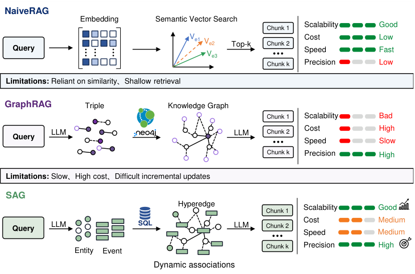
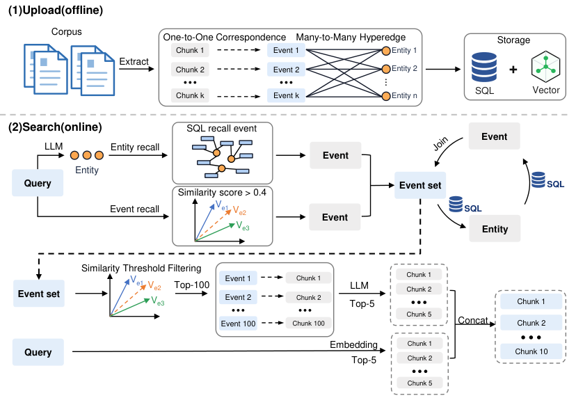
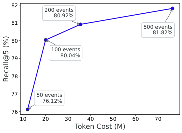

# SAG：基於查詢時動態超邊的 SQL 檢索增強生成

## **吳宇超** _[∗]_ **, 李俊欽, 梁興成, 陳勇捷, 梁穎豪, 莫林遠, 李冠賢** 智躍 AI (Zleap AI)

_{_ jomy,junqing,lensen,jinzhoulawen,leo _}_ @zleap.com  
_{_ mo-linyuan,li-guanxian _}_ @foxmail.com  

---

## 摘要

檢索增強生成（Retrieval-Augmented Generation, RAG）為大型語言模型（LLM）獲取外部知識提供了一種有效途徑。然而，現有方法高度依賴密集向量相似度檢索，在處理結構化約束和多跳推理（multi-hop reasoning）時存在固有局限性。引入知識圖譜（Knowledge Graph）雖然在一定程度上減輕了這些問題，但代價是語義碎片化、維護開銷巨大以及難以進行增量更新。

本文提出 **SAG（SQL-Retrieval Augmented Generation）**，一種專為檢索與 Agent 系統設計的結構化架構。SAG 不會在離線階段預先構建全域靜態圖，而是將每個文本區塊（chunk）轉化為一個語義完整的**事件（Event）**以及一組**索引實體（Entities）**；隨後在查詢時（query time），利用 SQL 連接查詢（join queries）動態地將共享實體的事件連接成局部**超邊（hyperedges）**，從而於查詢時動態實例化局部索引結構。

這種設計避免了全域圖重構與持續維護的需求；系統藉由標準資料庫基礎設施，天然支援增量寫入、並發處理與持續擴展。在 HotpotQA、2WikiMultiHop 和 MuSiQue 這三個標準多跳檢索基準測試中，SAG 在 9 個 Recall@K 指標中的 8 個取得了最佳結果，並在多跳推理需求最高的 MuSiQue 基準測試中達到了 80.0% 的 Recall@5。SAG 已在億級資料規模的線上生產環境中部署，線上檢索延遲控制在秒級以內。專案網站與程式碼已開源於：https://github.com/Zleap-AI/SAG-Benchmark。

---

## 1 引言

隨著大型語言模型能力的持續演進，Agent 系統的瓶頸正從模型能力轉移到資料基礎設施。面對日益增長的大規模語料庫、跨系統關聯以及動態變化的狀態，Agent 需要的不僅是單次靜態檢索，而是一個能夠持續攝取增量資料並支援多步關聯查詢的檢索基礎設施。

當前 RAG 的主流做法是將文件切分為文本區塊（chunks），映射至向量空間，並在查詢時檢索最相似的區塊（Lewis et al., 2020; Karpukhin et al., 2020）。這種做法在開放領域問答（QA）等任務中表現出良好的魯棒性。然而，Agent 通常需要進行多步順序檢索，此時每一步的檢索錯誤都會沿著推理鏈積累並放大。因此，檢索基礎設施需要的並非僅僅是更高的單次召回率（Recall），而是跨多跳查詢可靠組織證據的能力。

現有方法主要沿著兩個方向解決此挑戰，但各自存在局限：

1. **密集檢索（Dense Retrieval）**：本質上是語義相似度匹配。它擅長檢索語義相近的段落，但難以還原實體之間明確的關聯鏈，更無法將散落於多篇文件中的證據組織成結構化的證據鏈（Yang et al., 2018; Trivedi et al., 2022; Mavi et al., 2024）。當查詢涉及時間約束、實體角色或多步依賴關係時，這一局限性尤為突出。
2. **結構增強方法（Structure-Augmented Methods）**：離線從文件中構建知識圖譜或層級摘要，以明確表示實體關係（Edge et al., 2024; Gutierrez et al., 2025）。

> _∗_ 通訊作者：jomy@zleap.com

然而，明確的結構化代價高昂。三元組抽取、實體融合與關係規範化會在各個階段連續引入錯誤，且構建成本極高。隨著資料的演進，維護全域圖的成本甚至可能超過構建成本。更關鍵的是，這些在離線階段精心構建的結構，在線上查詢時往往退化為節點或摘要層級的扁平相似度匹配，造成離線結構與線上召回之間的系統性脫節（詳見第 2 節）。

> **圖 1 說明**：三種 RAG 範式的流程與效能對比。
> - **NaiveRAG**：採用 Embedding 語義向量搜尋。擴展性好、成本低、速度快，但精準度低，受限於淺層相似度匹配。
> - **GraphRAG**：利用 LLM 離線抽取三元組並構建知識圖譜。增強了證據組織能力，但構建成本高、速度慢、擴展性差且難以進行增量更新。
> - **SAG（本文方法）**：利用 LLM 抽取事件與實體，並在查詢時透過 SQL 動態激活超邊結構。兼顧了檢索品質、結構能力與系統開銷，同時天然支援僅追加（append-only）的增量更新。

我們的核心主張是：對於包含結構約束與多跳關聯的查詢，檢索既不應完全由密集相似度驅動，也不應依賴離線預構建的靜態圖。SAG 將文件轉化為**事件-實體索引（Event-Entity Index）**，其中每個區塊對應一個保持完整語義的事件，以及一組起索引作用的實體，共同定義一個隱性超邊（Latent Hyperedge，對比見圖 1）。

在查詢時，SQL 驅動確定性的事件-實體關聯與局部超邊激活，該結構化路徑與向量檢索整合為統一管道（Pipeline），LLM 僅在壓縮後的候選集上進行最終篩選。由於超邊不是預先構建的，而是在當前查詢周圍動態實例化的，因此系統不依賴靜態圖結構，亦無需全域重新計算。

綜上所述，本文的主要貢獻如下：
1. 提出 **SAG**，一種結構化檢索架構，以項目-實體索引取代離線靜態圖，並以 SQL 驅動檢索為核心。它在單一管道中統一了結構化過濾、語義擴展與 LLM 精細排序三種能力；
2. 設計了**查詢時動態超邊（Query-Time Dynamic Hyperedge）**組織機制，使得高階關係可以在當前查詢周圍的局部候選空間中動態激活（無需預先枚舉），並透過 SQL Join 實現跨多跳的確定性擴展；
3. 在三個多跳基準測試上系統性評估了 SAG，並透過消融實驗分離出了事件級語義保留、動態擴展、LLM 使用模式與候選預算各自的貢獻；
4. 已在億級資料規模的生產環境中部署 SAG，驗證了該框架在持續增量寫入與線上成本約束下的工程可行性。

---

## 2 相關工作

### 2.1 檢索增強生成（RAG）

檢索增強生成（RAG）透過將知識獲取重新表述為檢索問題，把 LLM 與外部知識連接起來（Lewis et al., 2020; Karpukhin et al., 2020）。但預設的「區塊-向量-Top-k」管道帶來了傳統的文本切分困境，並將檢索固定為推理之前的步驟：候選區塊在模型理解查詢之前就已確定。隨後的研究沿著兩個維度引入自適應檢索：觸發策略允許模型自主決定何時進行檢索（Asai et al., 2024; Jiang et al., 2023b; Jeong et al., 2024），而迭代推理則將多步檢索與推理交織進行（Trivedi et al., 2023; Zhuang et al., 2024）。這些進展集中於「何時檢索」與「用什麼查詢檢索」，然而一旦確定了候選集，組織階段依然僅依賴語義相似度，無法在候選區塊之間進行結構化過濾或明確的實體關聯。

### 2.2 結構增強檢索與基於圖的 RAG

為了彌補向量檢索在多跳證據組織上的缺陷，結構增強型 RAG 發展出了三條主要路線：
1. **離線構建知識圖譜**：離線從文件中抽取實體與關係，隨後透過圖遍歷或圖排序激活多跳子圖，代表工作包括 GraphRAG（Edge et al., 2024）、HippoRAG 及其後續工作（Gutiérrez et al., 2024; 2025）等。
2. **層級化組織文件**：如 Sarthi et al. (2024), Huang et al. (2025), Guo et al. (2025), Zhang et al. (2025) 等，其中 SiReRAG 在相同的三個基準測試上驗證了結構化索引對召回率的價值。
3. **執行階段動態結構化**：例如 StructRAG（Li et al., 2025）在推理階段將文件轉換為混合知識表示。

這三條路線面臨相同的權衡：離線或推理階段構建的結構代價昂貴，但查詢時檢索往往退化為節點或摘要層級的扁平相似度匹配，造成精心設計的離線結構與線上召回之間的系統性脫節。SAG 透過 SQL 在查詢時激活局部超邊，將結構組織直接嵌入到檢索執行過程中，從機制層面消除了這種脫節。

### 2.3 SQL、基於表格的問答與結構化檢索介面

結構化資料問答的研究證實結構化介面能提升檢索精準度，但這些方法都預設底層結構已經存在。Table QA 驗證了語言模型在表格上的推理能力；Text-to-SQL 將此方向延伸至查詢端；StructGPT（Jiang et al., 2023a）與 ChatDB（Hu et al., 2023）將結構化介面融入 LLM 系統中。這些方法要麼將 SQL 作為生成目標，要麼預設結構化資料已到位。SAG 解決的是前置問題：先透過離線事件抽取從非結構化文件中構建可查詢的事件-實體表，再以 SQL 的精準過濾驅動開放領域 RAG 的主檢索路徑，並與向量檢索整合為統一管道。

### 2.4 超邊與高階關係表示

傳統知識圖譜將二元關係表示為三元組 $(h, r, t)$，但現實世界的事件往往包含多個參與方或維度，強制拆解為二元關係會破壞整體語義。超圖學習與 n 元關係建模表明，高階表示比三元組拆解能更好地保留原始語義結構（Zhou et al., 2006; Feng et al., 2019; Fatemi et al., 2020; Galkin et al., 2020）。然而，這一思想在 RAG 中尚未得到充分利用。最近的 HGRAG（Wang et al., 2026）與 Graph-R1（Luo et al., 2026）引入了超圖，但兩者皆在離線預構建超圖結構，查詢時激活仍依賴基於 Embedding 的近似匹配，因而仍承受著維護靜態圖的成本與匹配錯誤累積的問題。SAG 將每個事件及其關聯實體視為隱性超邊，在查詢時透過 SQL 尋找共享實體的事件集，動態實例化局部超邊，既避免了離線超圖預構建的開銷，又保留了高階表示在 n 元事件場景中的表達能力。

---

## 3 SAG 核心架構

### 3.1 框架概述

> **圖 2 說明**：SAG 架構總覽。
> - **離線階段 (1) Upload**：每個文本區塊（Chunk）轉換為一個事件（Event）與一組實體（Entity），並一對一、多對多寫入 SQL、向量（Vector）與全文索引中。
> - **線上階段 (2) Search**：系統執行初始種子召回（Seed Retrieval），隨後進行查詢時擴展（Query-Time Expansion），最後在壓縮後的候選集上由 LLM 完成精細選擇（Rerank）。

SAG 檢索包含三個順序步驟：
1. **種子檢索（Seed Retrieval）**：透過實體定位相關事件的入口點；
2. **查詢時擴展（Query-Time Expansion）**：沿著共享實體在不同事件之間進行多跳擴展，擴大候選池；
3. **最終篩選（Final Selection）**：在壓縮後的候選空間中進行精細化重排序（LLM Reranking）。

SQL 負責確定性過濾與 Join 連接，向量檢索負責別名、近義表達與改寫的語義擴展，LLM 則僅保留用於少數高價值的語義決策點。

### 3.2 事件-實體索引（Event-Entity Index）

SAG 構建的是事件-實體索引，而非全域知識圖譜。給定一個區塊，索引階段會生成一個事件 $e$ 與一組實體 $U(e)$，共同定義一個隱性超邊。

* **事件（Event）**：對區塊核心內容的簡明陳述，保持一對一映射。事件保留了完整的語義，不會被進一步拆解為多個獨立的三元組，從而避免了三元組抽取的語義碎片化問題。
* **實體（Entities）**：涵蓋時間、地點、人物、組織、群體、主題、作品、產品、動作、指標與標籤共 11 種類型。實體不攜帶完整語義，僅作為連接不同事件的索引點與擴展點。

事件與實體是同一區塊的兩個平行結構化輸出，寫入 SQL 資料庫建立多對多關聯；事件文本與實體文本同時寫入向量與全文索引。一個事件連接多個實體即定義了一個隱性超邊。該層不引入重型實體消歧系統，僅依賴字串規範化與 SQL 去重，大幅降低了維護成本，天然支援僅追加（append-only）的增量寫入。

### 3.3 種子檢索（Seed Retrieval）

給定查詢 $q$，SAG 透過兩條平行路徑構建初始候選事件集 $E_R$：

**路徑 A：實體引導的結構化召回**  
LLM 識別查詢中的關鍵實體，生成種子實體集 $U_q = \{u_i\}$。系統對實體向量索引進行相似度檢索（預設門檻 0.9），召回語義相似的擴展實體，得到增強實體集 $\hat{U}_q \supseteq U_q$。隨後透過 SQL Join 查詢檢索與這些實體關聯的所有事件：

$$E_R^{\text{entity}} = \bigcup_{u \in \hat{U}_q} \{ e \mid u \in U(e) \}$$

**路徑 B：基於查詢向量的直接事件召回**  
系統同時使用查詢向量對事件索引進行相似度檢索，保留相似度超過門檻 $\tau$（預設 0.4）的事件，得到直接候選集：

$$E_R^{\text{direct}} = \{ e \mid \text{Sim}(v_q, v_e) > \tau \}$$

兩條路徑合併形成初始候選事件集：

$$E_R = E_R^{\text{entity}} \cup E_R^{\text{direct}}$$

### 3.4 查詢時擴展與篩選

**查詢時擴展（Query-Time Expansion）**  
從 $E_R$ 出發，系統執行反向 SQL Join 查詢提取關聯實體，形成實體邊界（Frontier），並以這些邊界實體作為橋樑探索新事件，逐跳擴展候選集。擴展最多執行 $H$ 跳（預設 $H = 1$）。將擴展新增的事件集記為 $E_E$，完整候選池為：

$$E_{\text{cand}} = E_R \cup E_E$$

**粗排序（Coarse Ranking）**  
SAG 根據與查詢向量的相似度對 $E_{\text{cand}}$ 中的候選事件進行過濾，保留 Top $K_{\text{cand}}$（預設 100）個事件，記為 $\hat{E}$。

**雙路輸出（Dual-Path Output）**  
系統平行執行兩條輸出路徑：
* **路徑 A（結構路徑）**：LLM 對 $\hat{E}$ 進行最終重排序，選出 Top $K_{\text{event}}$ 個事件 $E^* = \text{Rerank}(\hat{E}, q, f_{\text{LLM}})$，並映射回原始區塊：
  $$C_{\text{event}} = \text{Map}(E^*)$$
* **路徑 B（語義路徑）**：直接使用查詢向量在區塊索引上進行檢索，選出 Top $K_{\text{direct}}$ 個直接區塊：
  $$C_{\text{direct}} = \text{Embed}_{\text{top}-K}(q)$$

兩組區塊合併、去重後，返回 Top $K_{\text{out}}$ 個區塊作為最終證據：

$$C_{\text{out}} = \text{SelectTopK}(C_{\text{event}} \cup C_{\text{direct}}, K_{\text{out}})$$

### 3.5 可解釋性（Interpretability）

 SAG 檢索管道天然產生一條完全可審計的足跡鏈：

$$\text{Query} \xrightarrow{\text{LLM}} \text{Entities} \xrightarrow{\text{Vector}} \text{Expanded Entities} \xrightarrow{\text{SQL Join}} \text{Events} \xrightarrow{\text{SQL Expansion}} \text{Hyperedges} \xrightarrow{\text{LLM Rerank}} \text{Chunks}$$

這條鏈條中的每一步皆可檢查。若某一環節結果為空，可直接定位失敗原因（例如：實體未識別、擴展未產生新候選、或 SQL Join 未返回結果），避免了端到端黑盒模型的不可解構問題。

---

## 4 實驗

### 4.1 資料集

我們選擇了三個難度遞增的多跳基準測試：**HotpotQA**、**2WikiMultiHopQA** 與 **MuSiQue**。從各資料集的官方驗證集中隨機抽樣 1,000 個問題進行評估。

**表 1：評估子集統計數據**

| 資料集 | 查詢數量 | 段落數量 (Passages) |
|---|---|---|
| **MuSiQue** | 1,000 | 11,656 |
| **2WikiMultiHop** | 1,000 | 6,119 |
| **HotpotQA** | 1,000 | 9,811 |

### 4.2 對比方法

我們將 SAG 與 **HippoRAG 2**（Gutierrez et al., 2025）進行對比。為了消除底層模型差異的影響，我們在相同的 Embedding 模型與 LLM 設定下重新執行了 HippoRAG 2。此外，表 2 中亦包含了傳統檢索器與 7B 參數的大型 Embedding 模型作為背景參考。

### 4.3 評估指標

採用 **Recall@K** 作為主要檢索指標，衡量系統在返回的前 $K$ 個段落中是否包含至少一份支援證據（Any-hit 標準）。主要報告 Recall@2 與 Recall@5。

### 4.4 實作細節

* **LLM 配置**：採用 **Qwen3.6-Flash** 進行離線事件摘要與實體抽取，以及線上階段的候選重排序與查詢實體識別。
* **Embedding 配置**：預設 Embedding 模型為 **BGE-Large-EN-v1.5**，並在 MuSiQue 上補充了 **NV-Embed-v2** 的對比實驗。使用 MySQL 作為結構化儲存後端，Elasticsearch 作為全文搜尋與向量檢索引擎。
* **超參數設定**：擴展跳數 $H=1$，初始種子召回預算 $K_{\text{seed}}=50$，實體邊界剪枝預算 50，傳遞給 LLM 的候選事件數 $K_{\text{cand}}=100$。最終返回 $K_{\text{out}}=10$ 個區塊（$K_{\text{event}}=5, K_{\text{direct}}=5$）。

---

## 5 結果與分析

### 5.1 主要結果

**表 2：SAG 與各 Baseline 在三個多跳資料集上的 Recall@2/5 比較**（統一配置：BGE-Large-EN-v1.5 + Qwen3.6-Flash）

| 方法類別 | 方法名稱 | MuSiQue | 2Wiki | HotpotQA | 平均 (Avg) |
|---|---|---|---|---|---|
| *簡單 Baseline* | Contriever* | 34.8 / 46.6 | 46.6 / 57.5 | 58.4 / 75.3 | 46.6 / 59.8 |
| | BM25* | 32.4 / 43.5 | 55.3 / 65.3 | 57.3 / 74.8 | 48.3 / 61.2 |
| | GTR (T5-based)* | 37.4 / 49.1 | 60.2 / 67.9 | 59.3 / 73.9 | 52.3 / 63.6 |
| *大型 Embedding* | BGE-Large-EN-v1.5 | 41.6 / 56.2 | 61.6 / 69.0 | 76.0 / 88.8 | 59.7 / 71.3 |
| | GTE-Qwen2-7B-Instruct* | 48.1 / 63.6 | 66.7 / 74.8 | 75.8 / 89.1 | 63.5 / 75.8 |
| | GritLM-7B* | 49.7 / 65.9 | 67.3 / 76.0 | 79.2 / 92.4 | 65.4 / 78.1 |
| | NV-Embed-v2 (7B)* | 52.7 / 69.7 | 67.1 / 76.5 | 84.1 / 94.5 | 68.0 / 80.2 |
| *圖方法 (Graph)* | HippoRAG 2 (BGE-Large) | 49.5 / 65.1 | 76.6 / **90.4** | 78.4 / 94.4 | 68.2 / 83.3 |
| **本文方法** | **SAG (Ours)** | **64.1** / **80.0** | **82.3** / 88.0 | **91.6** / **96.5** | **79.3** / **88.2** |

在統一配置下，SAG 取得了 **79.3% / 88.2%** 的平均 Recall@2/5，超越了 HippoRAG 2 的 68.2% / 83.3%（分別高出 11.1 與 4.9 個百分點）。除 2WikiMultiHop 的 Recall@5 外，SAG 在其餘所有指標上均獲得最佳成績。特別是在推理鏈最長的 MuSiQue 資料集上，SAG 的 Recall@5 達到了 **80.0%**（相比 HippoRAG 2 的 65.1%），Recall@2 更是達到了 **64.1%**（相比 49.5%）。

### 5.2 消融實驗（Ablation Study）

**超邊 vs. 三元組（Hyperedge vs. Triples）**  
如表 3 所示，基於三元組的 SAG 變體在 MuSiQue 上實現了 77.1% 的 Recall@5，而超邊版本為 80.0%（皆高於 HippoRAG 2 的 65.1%）。這表明管道架構帶來了跨越性的提升，而超邊結構在此基礎上進一步貢獻了 2.9 個百分點的增益。

**表 3：事件級索引 vs. 三元組拆解索引消融實驗（MuSiQue）**

| 配置 | R@1 | R@2 | R@5 | R@10 |
|---|---|---|---|---|
| 三元組 (Triples) | 35.6 | 61.5 | 77.1 | 81.2 |
| **超邊 (Hyperedge - 本文)** | **36.2** | **64.1** | **80.0** | **83.4** |

**查詢時擴展的貢獻**  
禁用擴展（$H=0$）會使 Recall@5 從 80.0% 大幅下降至 69.4%（表 4）。這證明擴展機制有效補充了純向量檢索無法獨立召回的關鍵多跳中間證據。

**表 4：動態超邊構建中擴展跳數的消融實驗（MuSiQue）**

| 跳數配置 | R@1 | R@2 | R@5 | R@10 |
|---|---|---|---|---|
| 無擴展 (Without Expansion, H=0) | 35.7 | 57.3 | 69.4 | 74.3 |
| **帶擴展 (With Expansion, H=1, 基準)** | **36.2** | **64.1** | **80.0** | **83.4** |

**候選事件數量的權衡**  
將候選事件數 $K_{\text{cand}}$ 從 50 增加至 100 時，Recall@5 從 76.1% 顯著提升至 80.0%（表 5 與圖 3）。繼續增加至 200 或 500 時，邊際收益急劇遞減。因此選擇 $K_{\text{cand}}=100$ 作為預設平衡點。

**表 5：候選事件數量與 Token 成本的權衡**

| 事件數量 ($K_{\text{cand}}$) | R@1 | R@2 | R@5 | R@10 | Token 消耗 (M) |
|---|---|---|---|---|---|
| 50 | 36.1 | 61.6 | 76.1 | 79.7 | **12.0** |
| **100 (基準)** | 36.2 | **64.1** | 80.0 | 83.4 | 20.0 |
| 200 | **36.5** | 65.0 | 80.9 | 84.4 | 35.5 |
| 500 | 36.3 | 64.3 | **81.8** | **86.1** | 76.4 |

> **圖 3 說明**：Token 邊際收益分析圖。展示了隨著候選事件數從 50 增加到 500，Token 消耗量與 Recall@5 的變化關係。100 events 處在性價比拐點。

**LLM 重排序的必要性**  
用輕量級 Qwen3-Reranker-0.6B 替代 LLM 會導致 Recall@5 下降 17.8 個百分點（至 62.2%，表 6）。LLM 能夠對壓縮後的候選集進行聯合邏輯推理，識別出共享實體與跨事件依賴鏈。

**表 6：最終選擇階段輕量級 Reranker 與 LLM 篩選的對比（MuSiQue）**

| 方法 | R@1 | R@2 | R@5 | R@10 |
|---|---|---|---|---|
| Qwen3-Reranker-0.6B | 32.5 | 46.7 | 62.2 | 70.8 |
| **Qwen3.6-Flash (LLM)** | **36.2** | **64.1** | **80.0** | **83.4** |

**雙路候選池的互補性**  
表 7 展示了結構路徑與語義路徑的配額分配影響。配額為 $K_{\text{event}}=5, K_{\text{direct}}=5$ 時取得最佳效能（80.0%），證明兩條路徑在證據覆蓋上具有強烈的互補性。

**表 7：LLM 事件選擇與直接區塊選擇的配額對比（MuSiQue）**

| LLM 事件配額 ($K_{\text{event}}$) | 查詢區塊配額 ($K_{\text{direct}}$) | R@1 | R@2 | R@5 | R@10 |
|---|---|---|---|---|---|
| 0 | 10 | 29.4 | 41.6 | 56.2 | 63.8 |
| 2 | 8 | **36.6** | **64.5** | 73.3 | 77.6 |
| 4 | 6 | **36.6** | 63.6 | 79.6 | 82.6 |
| **5 (基準)** | **5** | 36.2 | 64.1 | **80.0** | **83.4** |

### 5.3 對 Embedding 模型的魯棒性

將 Embedding 模型替換為更強大的 NV-Embed-v2 後，SAG 在 MuSiQue 上的 Recall@5 提升至 **81.7%**（HippoRAG 2 為 74.6%）。切換回 BGE-Large-EN-v1.5 時，SAG 保持在 80.0%（僅微降 1.7%），而 HippoRAG 2 則巨幅下降近 10 個百分點（降至 65.1%）。這證明 SAG 的結構收益源於 SQL Join 的確切匹配，不高度依賴特定的 Embedding 模型品質。

**表 8：NV-Embed-v2 配置下 SAG 與 HippoRAG 2 的檢索結果（MuSiQue）**

| 方法 | R@1 | R@2 | R@5 | R@10 |
|---|---|---|---|---|
| **SAG (NV-Embed-v2)** | **36.4** | **64.6** | **81.7** | **86.6** |
| HippoRAG 2 (NV-Embed-v2) | 33.7 | 56.0 | 74.6 | 83.2 |

---

## 6 討論

SAG 的檢索收益主要來自事件級語義保留與共享實體提供的結構化連接。目前方法仍存在以下局限：
1. **剪枝機制**：實體邊界剪枝門檻目前為經驗設定。低頻但關鍵的橋樑實體可能在擴展初期被剪枝，未來可按語料庫頻率對實體分層分配擴展預算。
2. **實體融合**：採用輕量實體策略（僅字串規範化與去重），雖保障了寫入獨立性，但同義實體可能削弱跨文件連接密度，引入輕量級別名表是未來的改進方向。
3. **Agent 記憶的事件級更新**：當前 SAG 支援持續追加新事件。在 Agent 記憶場景中，偏好覆蓋或狀態變更要求系統能更新或失效歷史版本，將 SAG 擴展為支援版本控制的 Agent 記憶底座是自然的下一步。

---

## 7 結論

本文提出了 **SAG**，一種用於檢索與 Agent 系統的結構化檢索框架。SAG 以 SQL 為結構引擎，向量資料庫為語義引擎，事件-實體索引與查詢時動態超邊為核心機制。SAG 不企圖以更強的模組替代標準 RAG，而是重新分配了檢索管道中的職責：SQL 劃定候選邊界，事件-實體索引承載完整語義，動態超邊在查詢時還原局部高階關係，向量模型與 LLM 僅在最高價值的節點干預。在三個多跳基準測試中，SAG 展現出卓越的召回率與工程可行性，為未來構建具備時間感知與版本控制的 Agent 記憶基礎設施奠定堅實基礎。

---

## 參考文獻

- Akari Asai, Zeqiu Wu, Yizhong Wang, Avirup Sil, and Hannaneh Hajishirzi. Self-RAG: Learning to retrieve, generate, and critique through self-reflection. In *ICLR*, 2024.
- Wenhu Chen, Hanwen Zha, Zhiyu Chen, Wenhan Xiong, Hong Wang, and William Yang Wang. HybridQA: A dataset of multi-hop question answering over tabular and textual data. In *EMNLP*, 2020.
- Darren Edge, Ha Trinh, Newman Cheng, Joshua Bradley, Alex Chao, Apurva Mody, Steven Truitt, and Jonathan Larson. From local to global: A graph RAG approach to query-focused summarization. *arXiv:2404.16130*, 2024.
- Bahare Fatemi, Perouz Taslakian, David Vazquez, and David Poole. Knowledge hypergraphs: Prediction beyond binary relations. In *IJCAI*, 2020.
- Yifan Feng, Haoxuan You, Zizhao Zhang, Rongrong Ji, and Yue Gao. Hypergraph neural networks. In *AAAI*, 2019.
- Mikhail Galkin, Priyansh Trivedi, Gaurav Maheshwari, Ricardo Usbeck, and Jens Lehmann. Message passing for hyper-relational knowledge graphs. In *EMNLP*, 2020.
- Zirui Guo, Lianghao Xia, Yanhua Yu, Tu Ao, and Chao Huang. LightRAG: Simple and fast retrieval-augmented generation. In *EMNLP*, 2025.
- Bernal Jiménez Gutiérrez, Yiheng Shu, Yu Gu, Michihiro Yasunaga, and Yu Su. HippoRAG: Neurobiologically inspired long-term memory for large language models. In *NeurIPS*, 2024.
- Bernal Jiménez Gutiérrez, Yiheng Shu, Weijian Qi, Sizhe Zhou, and Yu Su. From RAG to memory: Non-parametric continual learning for large language models. In *ICML*, 2025.
- Xiaoxin He, Yijun Tian, Yifei Sun, Nitesh V. Chawla, Thomas Laurent, Yann LeCun, Xavier Bresson, and Bryan Hooi. G-retriever: Retrieval-augmented generation for textual graph understanding and question answering. In *NeurIPS*, 2024.
- Jonathan Herzig, Pawel Krzysztof Nowak, Thomas Müller, Francesco Piccinno, and Julian Eisenschlos. TaPas: Weakly supervised table parsing via pre-training. In *ACL*, 2020.
- Xanh Ho, Anh-Khoa Duong Nguyen, Saku Sugawara, and Akiko Aizawa. Constructing a multi-hop QA dataset for comprehensive evaluation of reasoning steps. In *COLING*, 2020.
- Chenxu Hu, Jie Fu, Chenzhuang Du, Simian Luo, Junbo Zhao, and Hang Zhao. ChatDB: Augmenting LLMs with databases as their symbolic memory. *arXiv:2306.03901*, 2023.
- Haoyu Huang, Yongfeng Huang, Junjie Yang, Zhenyu Pan, Yongqiang Chen, Kaili Ma, Hongzhi Chen, and James Cheng. Retrieval-augmented generation with hierarchical knowledge. In *EMNLP*, 2025.
- Soyeong Jeong, Jinheon Baek, Sukmin Cho, Sung Ju Hwang, and Jong Park. Adaptive-RAG: Learning to adapt retrieval-augmented large language models through question complexity. In *NAACL*, 2024.
- Jinhao Jiang, Kun Zhou, Zican Dong, Keming Ye, Wayne Xin Zhao, and Ji-Rong Wen. StructGPT: A general framework for large language model to reason on structured data. In *EMNLP*, 2023a.
- Zhengbao Jiang, Frank F. Xu, Luyu Gao, Zhiqing Sun, Qian Liu, Jane Dwivedi-Yu, Yiming Yang, Jamie Callan, and Graham Neubig. Active retrieval augmented generation. In *EMNLP*, 2023b.
- Vladimir Karpukhin, Barlas Oguz, Sewon Min, Patrick Lewis, Ledell Wu, Sergey Edunov, Danqi Chen, and Wen tau Yih. Dense passage retrieval for open-domain question answering. In *EMNLP*, 2020.
- Chankyu Lee, Rajarshi Roy, Mengyao Xu, Jonathan Raiman, Mohammad Shoeybi, Bryan Catanzaro, and Wei Ping. NV-Embed: Improved techniques for training LLMs as generalist embedding models. *arXiv:2405.17428*, 2024.
- Patrick Lewis, Ethan Perez, Aleksandra Piktus, Fabio Petroni, Vladimir Karpukhin, Naman Goyal, Heinrich Küttler, Mike Lewis, Wen tau Yih, Tim Rocktäschel, Sebastian Riedel, and Douwe Kiela. Retrieval-augmented generation for knowledge-intensive NLP tasks. In *NeurIPS*, 2020.
- Jinyang Li, Binyuan Hui, Ge Qu, Jiaxi Yang, Binhua Li, Bowen Li, Bailin Wang, Bowen Qin, Ruiying Geng, Nan Huo, Xuanhe Zhou, Chenhao Ma, Guoliang Li, Kevin C.C. Chang, Fei Huang, Reynold Cheng, and Yongbin Li. Can LLM already serve as a database interface? A BIg bench for large-scale database grounded text-to-SQLs. In *NeurIPS*, 2023.
- Zhuoshi Li, Xin-Cheng Chen, Huiqian Yu, Haiming Lin, Jingbo Shang, Qiang Tang, Furu Wei, Xuancheng Ren, Longtao Huang, and Chao Li. StructRAG: Boosting knowledge intensive reasoning of LLMs via inference-time hybrid information structurization. In *ICLR*, 2025.
- Hao Liu, Zhengren Wang, Xi Chen, Zhiyu Li, Feiyu Xiong, Qinhan Yu, and Wentao Zhang. HopRAG: Multi-hop reasoning for logic-aware retrieval-augmented generation. In *ACL*, 2025.
- Qian Liu, Bei Chen, Jiaqi Guo, Morteza Ziyadi, Zeqi Lin, Weizhu Chen, and Jian-Guang Lou. TAPEX: Table pre-training via learning a neural SQL executor. In *ICLR*, 2022.
- Haoran Luo, Haihong E, Guanting Chen, Qika Lin, Yikai Guo, Fangzhi Xu, Zemin Kuang, et al. Graph-R1: Towards agentic GraphRAG framework via end-to-end reinforcement learning. In *ICML*, 2026.
- Vaibhav Mavi, Anubhav Jangra, and Adam Jatowt. Multi-hop question answering. *Foundations and Trends in Information Retrieval*, 2024.
- Costas Mavromatis, Soji Adeshina, Vassilis N. Ioannidis, Zhen Han, Qi Zhu, Ian Robinson, Bryan Thompson, Huzefa Rangwala, and George Karypis. BYOKG-RAG: Multi-strategy graph retrieval for knowledge graph question answering. In *EMNLP*, 2025.
- Mohammadreza Pourreza and Davood Rafiei. DIN-SQL: Decomposed in-context learning of text-to-SQL with self-correction. In *NeurIPS*, 2023.
- Qwen Team. Qwen3 technical report. Technical report, Alibaba Group, 2025.
- Parth Sarthi, Salman Abdullah, Aditi Tuli, Shubh Khanna, Anna Goldie, and Christopher D. Manning. RAPTOR: Recursive abstractive processing for tree-organized retrieval. In *ICLR*, 2024.
- Jiashuo Sun, Chengjin Xu, Lumingyuan Tang, Saizhuo Wang, Chen Lin, Yeyun Gong, Lionel M. Ni, Heung-Yeung Shum, and Jian Guo. Think-on-graph: Deep and responsible reasoning of large language model on knowledge graph. In *ICLR*, 2024.
- Harsh Trivedi, Niranjan Balasubramanian, Tushar Khot, and Ashish Sabharwal. Musique: Multi-hop questions via single-hop question composition. *TACL*, 2022.
- Harsh Trivedi, Niranjan Balasubramanian, Tushar Khot, and Ashish Sabharwal. Interleaving retrieval with chain-of-thought reasoning for knowledge-intensive multi-step questions. In *ACL*, 2023.
- Changjian Wang, Weihong Deng, Weili Guan, Quan Lu, and Ning Jiang. Cross-granularity hypergraph retrieval-augmented generation for multi-hop question answering. In *AAAI*, 2026.
- Yu Wang, Nedim Lipka, Ryan A. Rossi, Alexa Siu, Ruiyi Zhang, and Tyler Derr. Knowledge graph prompting for multi-document question answering. In *AAAI*, 2024.
- Shitao Xiao, Zheng Liu, Peitian Zhang, Niklas Muennighoff, Defu Lian, and Jian-Yun Nie. C-pack: Packaged resources to advance general chinese embedding. *arXiv:2309.07597*, 2023.
- Zhilin Yang, Peng Qi, Saizheng Zhang, Yoshua Bengio, William W. Cohen, Ruslan Salakhutdinov, and Christopher D. Manning. HotpotQA: A dataset for diverse, explainable multi-hop question answering. In *EMNLP*, 2018.
- Tao Yu, Rui Zhang, Kai Yang, Michihiro Yasunaga, Dongxu Wang, Zifan Li, James Ma, Irene Li, Qingning Yao, Shanelle Roman, Zilin Zhang, and Dragomir Radev. Spider: A large-scale human-labeled dataset for complex and cross-domain semantic parsing and text-to-SQL task. In *EMNLP*, 2018.
- Nan Zhang, Prafulla Kumar Choubey, Alexander Fabbri, Gabriel Bernadett-Shapiro, Rui Zhang, Prasenjit Mitra, Caiming Xiong, and Chien-Sheng Wu. SiReRAG: Indexing similar and related information for multihop reasoning. In *ICLR*, 2025.
- Dengyong Zhou, Jiayuan Huang, and Bernhard Schölkopf. Learning with hypergraphs: Clustering, classification, and embedding. In *NIPS*, 2006.
- Ziyuan Zhuang, Zhiyang Zhang, Sitao Cheng, Fangkai Yang, Jia Liu, Shujian Huang, Qingwei Lin, Saravan Rajmohan, Dongmei Zhang, and Qi Zhang. EfficientRAG: Efficient retriever for multi-hop question answering. In *EMNLP*, 2024.
