# 進階 RAG 系列：生成與評估 (Generation and Evaluation)

「無法衡量，就無法管理」——彼得·杜拉克

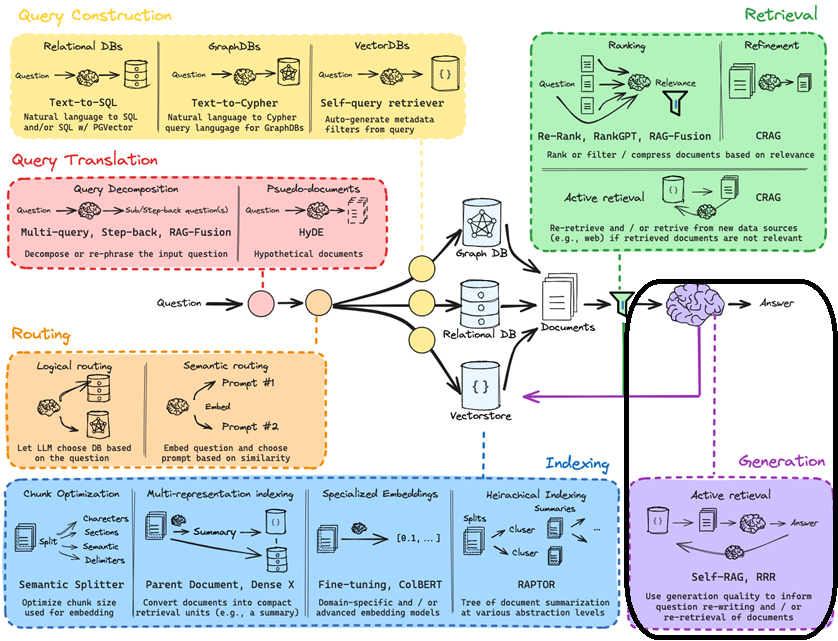[

資料來源：Langchain

](https://docs.google.com/presentation/d/1C9IaAwHoWcc4RSTqo-pCoN3h0nCgqV2JEYZUJunv_9Q/edit?usp=sharing&utm_campaign=advanced-rag-series-generation-and-evaluation&utm_medium=referral&utm_source=div.beehiiv.com)

*「無法衡量，就無法管理」*——彼得·杜拉克

在投入大量心力最佳化[查詢翻譯 (Query Translation)](https://div.beehiiv.com/p/rag-say)、[路由與查詢建構 (Routing and Query construction)](https://div.beehiiv.com/p/routing-query-construction)、[索引 (Indexing)](https://div.beehiiv.com/p/advanced-rag-series-indexing) 以及[檢索 (Retrieval)](https://div.beehiiv.com/p/advanced-rag-series-retrieval) 之後，今天我們終於要迎來「生成」與「評估」的成果檢驗，為這個進階 RAG 管道畫下圓滿的句點。

## 生成 (Generation)：

這是建置 RAG 管道的最後一個步驟，也是見真章的時刻！雖然索引與檢索在確保輸出完整性方面功不可沒，但在為使用者生成最終回覆之前，針對檢索結果進行批判性評估，並隨後做出決策以觸發適當的行動，同樣是至關重要的。語言代理的認知架構 (Cognitive architectures for Language Agents, [CoALA](https://arxiv.org/abs/2309.02427?utm_campaign=advanced-rag-series-generation-and-evaluation&utm_medium=referral&utm_source=div.beehiiv.com)) 提供了一個極佳的框架來幫助我們理解這個過程：在這個框架下，檢索到的資訊會被針對一系列的可能性進行評估。下方的圖表能最好地說明這個概念。

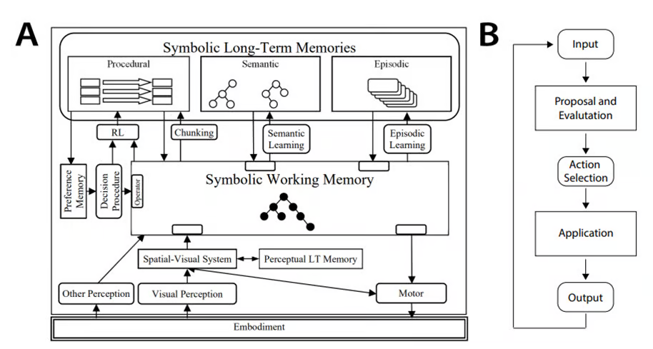[

資料來源：Arxiv, Sumers et al

](https://arxiv.org/abs/2309.02427?utm_campaign=advanced-rag-series-generation-and-evaluation&utm_medium=referral&utm_source=div.beehiiv.com)

有幾種方法可以實作這種用於選擇行動的決策程序。

### 校正型 RAG (Corrective RAG, CRAG)：

對於眼尖的讀者來說，我們在上一篇關於「檢索」的文章中曾簡短討論過這個方法；但由於它與生成的設定有所重疊，因此值得在本文中進一步展開說明。

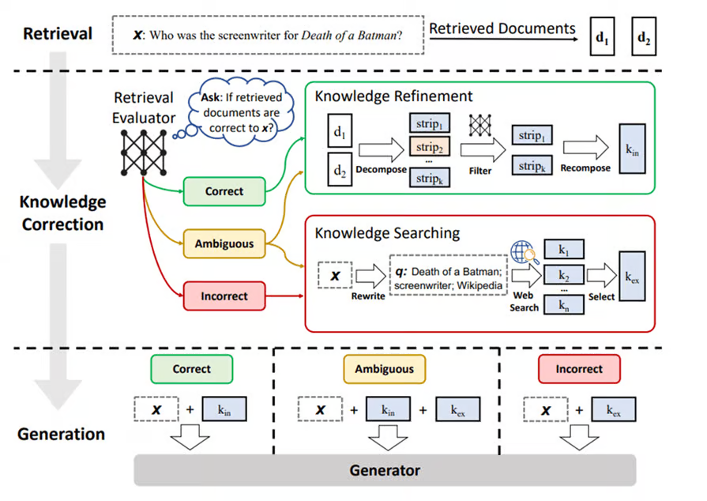[

資料來源：Arxiv, Yan et al

](https://arxiv.org/abs/2401.15884?utm_campaign=advanced-rag-series-generation-and-evaluation&utm_medium=referral&utm_source=div.beehiiv.com)

CRAG 增強生成的方式是利用輕量級的「檢索評估器 (Retrieval Evaluator)」為每一份檢索到的文件計算一個信心分數。這個分數接著會決定該觸發哪種檢索行動。例如，評估器可以根據信心分數，將檢索到的文件歸類到三個分類之一：正確 (Correct)、模糊 (Ambiguous) 或不正確 (Incorrect)。

如果**所有**檢索到的文件信心分數都低於閾值，該次檢索就會被判定為「不正確」。這將觸發引入新知識來源（如外部網路搜尋）的行動，以確保生成的品質。

如果**至少有一份**檢索到的文件信心分數高於閾值，該次檢索就會被判定為「正確」，並對該文件觸發「知識精煉 (knowledge refinement)」方法。知識精煉包含將文件拆分成數個「知識片段 (knowledge strips)」，接著根據相關性為每個片段評分，最後將最相關的片段重新組合成用於生成的內部知識。若要獲得更直觀的視覺化呈現，請參考上方圖片。

當檢索評估器對其判斷缺乏信心時，該次檢索會被判定為「模糊」，這將導致上述策略的混合使用。下方的決策樹清楚地展示了這個過程：

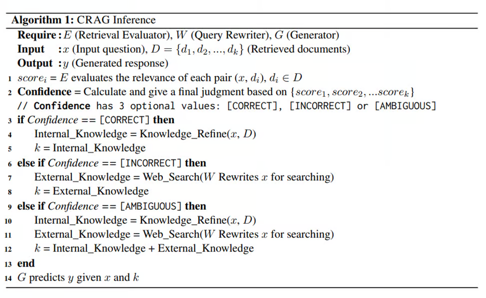[

資料來源：Arxiv, Yan et al

](https://arxiv.org/abs/2401.15884?utm_campaign=advanced-rag-series-generation-and-evaluation&utm_medium=referral&utm_source=div.beehiiv.com)

上述方法已被證實在使用到的四個資料集上皆產生了最佳結果。如下圖所示，CRAG 的表現大幅超越了傳統的 RAG。而 Self-CRAG（請參考下方關於 Self-RAG 的段落）讓這個差距變得更顯著，也關鍵地展現了 CRAG 作為 RAG 管道「隨插即用 (plug-and-play)」選項的適應力。CRAG 相較於其他方法（例如 Self-RAG）的另一個巨大優勢，在於它替換底層 LLM 的靈活性；這點在我們未來想採用更強大的 LLM 時至關重要。

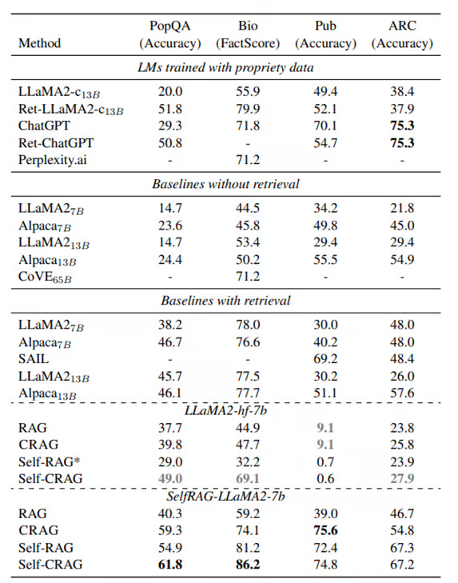[

資料來源：Arxiv, Yan et al

](https://arxiv.org/abs/2401.15884?utm_campaign=advanced-rag-series-generation-and-evaluation&utm_medium=referral&utm_source=div.beehiiv.com)

明顯的限制在於，CRAG 高度依賴檢索評估器的品質，而且容易受到網路搜尋可能引入的偏差所影響。因此，微調檢索評估器可能是在所難免的，此外，也必須設定防護網 (guardrails) 來確保輸出的品質與準確性。

### 自我反思 RAG (Self-RAG)

這是另一個用來思考如何提升 LLM 品質與事實正確性，同時兼顧其多功能性的框架。與其不論需求與相關性，一律檢索固定數量的段落，這個框架的重點在於「按需檢索 (on-demand retrieval)」與「自我反思 (self-reflection)」。

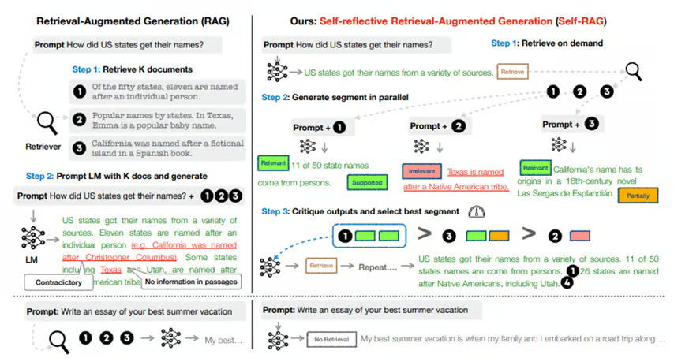[

資料來源：Arxiv, Asai et al

](https://arxiv.org/abs/2310.11511?utm_campaign=advanced-rag-series-generation-and-evaluation&utm_medium=referral&utm_source=div.beehiiv.com)

**步驟 1：** 訓練一個任意的 LLM 來反思自己生成的內容。這是透過所謂的「反思 token (reflection tokens)」（包含檢索與評論）來實現的。檢索行動由「檢索 token」觸發，該 token 是 LLM 根據輸入提示與先前的生成內容所輸出的（請參考圖片）。

**步驟 2：** 接著，LLM 會同時處理這些檢索到的段落，以平行的方式生成多個輸出。這會觸發 LLM 生成「評論 token」來評估這些輸出。

**步驟 3：** 根據「事實正確性」與「相關性」，選出最佳的輸出作為最終生成結果。該演算法在論文中有很好的描述，其中 token 的定義如下：

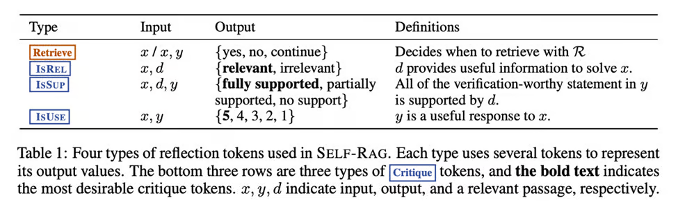[

資料來源：Arxiv, Asai et al

](https://arxiv.org/abs/2310.11511?utm_campaign=advanced-rag-series-generation-and-evaluation&utm_medium=referral&utm_source=div.beehiiv.com)

以下由 Langchain 製作的示意圖，很好地闡釋了基於上述反思 token 進行決策的 Self-RAG 推論演算法。

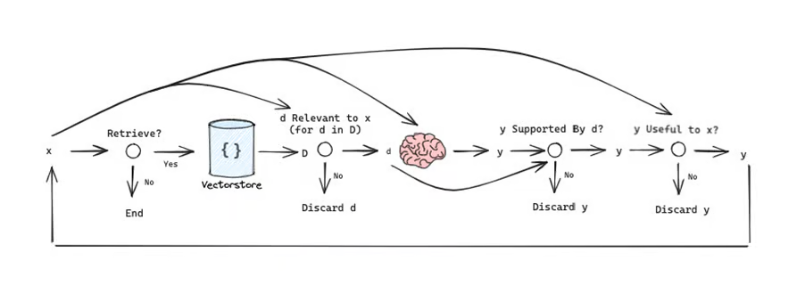[

資料來源：Langchain

](https://blog.langchain.dev/agentic-rag-with-langgraph/?utm_campaign=advanced-rag-series-generation-and-evaluation&utm_medium=referral&utm_source=div.beehiiv.com)

在效能方面，無論是否有搭配檢索，Self-RAG 都顯著超越了基準線模型。請參考前面關於 CRAG 基準測試表現的討論。值得注意的是，Self-CRAG 正是建立在此框架之上來進一步提升效能。

考量到在這個框架中需要呼叫 LLM 的次數，在成本與延遲上可能會有一些限制。因此，探索像是「只生成一次」而非「為每個段落生成兩次」之類的替代方案是值得的。

### RRR (Rewrite-Retrieve-Read, 重寫-檢索-閱讀)：

*「RRR 模型 \[Ma et al., 2023a\] 引入了『重寫-檢索-閱讀』流程，利用 LLM 的表現作為重寫模組的強化學習誘因。這讓重寫器能夠微調檢索查詢，進而提升閱讀器在下游任務的表現。」*

這個框架的前提假設是：使用者的查詢可以由 LLM 進一步最佳化（也就是重寫），以實現更準確的檢索。雖然透過查詢重寫的過程讓 LLM 去「思考」，確實能提升表現，但像是推理錯誤或無效搜尋等問題，仍會是部署到正式環境時的潛在障礙。

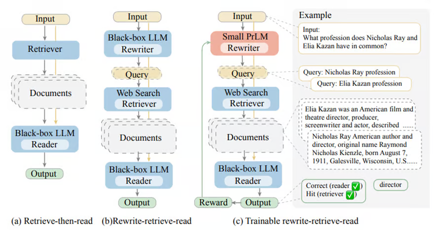[

資料來源：Arxiv, Ma et al

](https://arxiv.org/pdf/2305.14283.pdf?utm_campaign=advanced-rag-series-generation-and-evaluation&utm_medium=referral&utm_source=div.beehiiv.com)

為了解決這個問題（如上圖所示），加入一個可訓練的小型 LLM 作為重寫器，已被證實能隨著訓練帶來一致的效能提升，使這個框架具備可擴展性與效率。這裡的訓練實作分為兩個階段：「熱身 (warm-up)」與「強化學習 (reinforcement learning)」，而其中的關鍵突破在於能夠將可訓練的模組整合到更大型的 LLM 中。

## 評估 (Evaluation)

如果我漏掉了任何 RAG 管道中最重要的一個步驟——「評估」，那我就太失職了。評估的方法有很多種，最基本的就是準備一組問答對作為測試資料集，然後將輸出與實際答案進行核對。這種方法明顯的陷阱在於它不僅耗時，還帶來了將管道「為了測試資料集而最佳化」的風險；相反地，更廣泛的現實世界應用場景可能包含許多邊角案例 (edge cases)（這在下方討論的許多指標中都有所涵蓋）。

### RAGAs：

這就是 RAGAs（RAG Assessment 的縮寫）發揮作用的地方了。它是一個用於評估 RAG 管道的開源框架。它透過以下方式協助評估管道：

a) 提供基於「真實標準 (ground truth)」生成測試資料的方法
b) 針對檢索與生成步驟（無論是個別步驟或端到端）提供基於指標的評估。

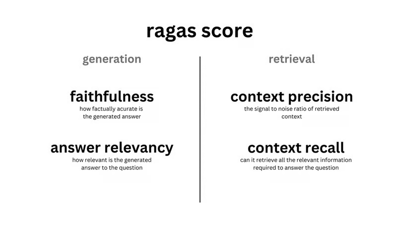[

資料來源：Ragas docs

](https://docs.ragas.io/en/stable/?utm_campaign=advanced-rag-series-generation-and-evaluation&utm_medium=referral&utm_source=div.beehiiv.com)

它評估 RAG 系統的以下面向，也就是所謂的「指標」：

1. **忠實度 (Faithfulness)：** 事實的一致性
2. **答案相關性 (Answer Relevance)：** 答案與提示詞的相關程度
3. **上下文精確度 (Context Precision)：** 檢查相關區塊是否獲得較高的排名
4. **面向評論 (Aspect Critique)：** 根據預先定義的面向（如無害性與正確性）來評估提交內容
5. **上下文召回率 (Context Recall)：** 比較真實標準與上下文，以檢查是否檢索出所有相關資訊
6. **上下文實體召回率 (Context entities Recall)：** 評估檢索到的上下文中與真實標準相比出現的實體數量
7. **上下文相關性 (Context Relevancy)：** 檢索到的上下文與提示詞的相關程度
8. **答案語意相似度 (Answer Semantic Similarity)：** 生成答案與實際答案在語意上的相似程度
9. **答案正確性 (Answer Correctness)：** 評估生成答案與實際答案的準確度與一致性

這是一份相當詳盡的清單，在如何評估 RAG 設定方面提供了很好的選擇彈性——強烈建議查看他們的[官方文件](https://docs.ragas.io/en/stable/?utm_campaign=advanced-rag-series-generation-and-evaluation&utm_medium=referral&utm_source=div.beehiiv.com)。

##### Langsmith：

在上述背景下，同樣值得一提的是 Langchain 推出的可觀察性與監控工具 Langsmith。

*「* [*LangSmith*](https://docs.smith.langchain.com/?ref=blog.langchain.dev&utm_campaign=advanced-rag-series-generation-and-evaluation&utm_medium=referral&utm_source=div.beehiiv.com) *是一個協助你針對建置於任何 LLM 框架上的鏈 (chains) 與代理 (agents) 進行除錯、測試、評估與監控的平台」*

當我們想要更深入探究結果時，將 Langsmith 整合到 RAGAs 評估框架中會非常有幫助。你會發現 Langsmith 在評估過程中的記錄 (logging) 與追蹤 (tracing) 部分特別實用；它能根據評估結果，讓你了解哪些步驟可以進一步最佳化，以改善檢索器或生成器。

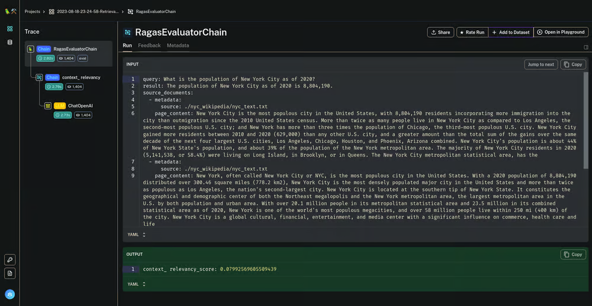[

資料來源：Langchain

](https://blog.langchain.dev/evaluating-rag-pipelines-with-ragas-langsmith/?utm_campaign=advanced-rag-series-generation-and-evaluation&utm_medium=referral&utm_source=div.beehiiv.com)

### DeepEval

這裡值得一提的另一個評估框架是 DeepEval。它擁有超過 14 種以上的指標，涵蓋了 RAG 與微調，並包含 G-Eval、RAGAS、摘要 (Summarization)、幻覺 (Hallucination)、偏差 (Bias)、有害性 (Toxicity) 等等。

這些指標不言自明的特性有助於解釋指標分數，使得除錯變得更加容易。這是它相較於上述 RAGAs 框架的一個關鍵優勢（這也是為什麼我前面會將 Langsmith 與 RAGAs 相提並論）。

它還具備其他實用的「加分」功能，例如整合 [Pytest](https://docs.pytest.org/en/stable/contents.html?utm_campaign=advanced-rag-series-generation-and-evaluation&utm_medium=referral&utm_source=div.beehiiv.com)（對開發者友善）、模組化元件等等，而且它也是開源的。

### 評估 → 迭代 → 最佳化

有了「生成」與「評估」這兩個步驟的加入，我們現在已裝備齊全，不僅能部署一個 RAG 系統，還能針對我們設計它的特定應用場景進行評估、迭代與最佳化。

當談到 LLM 這個黑盒子時，並沒有所謂絕對正確或錯誤的做法。RAG 管道向來以難以建置且更難維護著稱。要知道什麼方法最有效，唯一的途徑就是動手建置……然後去評估它！

下次見……祝您閱讀愉快！