# 進階 RAG 系列：索引 (Indexing)

如何最佳化嵌入表示 (embeddings) 以實現精準檢索

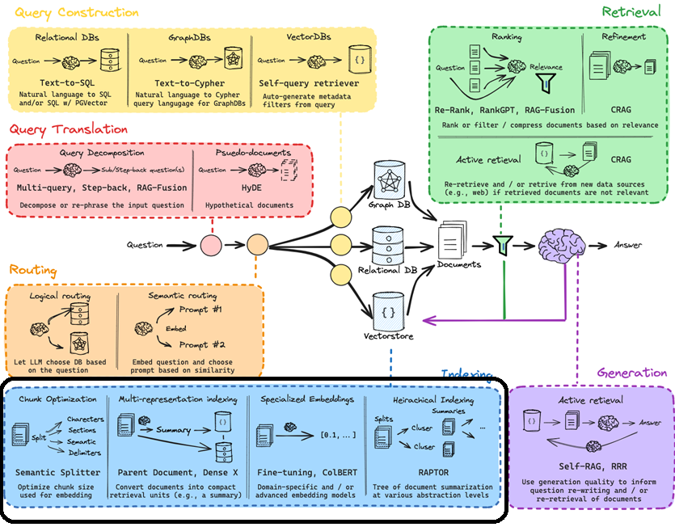

現在我們已經完成了前面的苦差事：包含[轉換](https://div.beehiiv.com/p/rag-say)與[路由、建構查詢](https://div.beehiiv.com/p/routing-query-construction)（**指的是將使用者的自然語言轉換為資料庫能理解的查詢條件，並導向合適的資料來源**），接著要如何確保我們得到的回覆是準確的，或者更糟的是避免 LLM 憑空捏造（也就是所謂的「幻覺」）？這就進入了我們今天要探討的重點：如何為後續的檢索 (Retrieval) 與生成 (Generation) 準備好資料。

## 索引 (Indexing)：

之前在談論建構查詢時，我們提到了必須要「說資料庫聽得懂的語言」。而在「索引」這個環節中，我們對即將被查詢的資料也要做類似的事情。建立索引的方法有很多種，但最終目的都是讓 LLM 能輕易理解資料，同時不流失上下文的脈絡。使用者問題的答案可能藏在文件的任何一個角落，但受限於 LLM 對即時資料的掌握度、有限的上下文視窗大小，以及常見的「迷失在中間 (lost in the middle)」問題（**當輸入文本太長時，模型往往會遺漏中間段落的資訊**），我們必須有效率地將資料進行分塊 (chunking)，並賦予它們適當的上下文。

這時候就該來定義一下什麼是「嵌入表示 (embeddings)」了，因為如何進行分塊與嵌入，正是建立索引的核心，也是實現精準檢索的基石。簡單來說，嵌入表示就是把一大段複雜的資料轉換成一組數字，這組數字能精準捕捉該資料的本質。這讓我們能夠將使用者的查詢同樣轉換成嵌入表示（也是一組數字），然後透過計算語意上的相似度來檢索相關資訊。這在多維空間中看起來會是什麼樣子呢？大概就像下面這張圖（請注意，在這樣的空間裡，語意相似的詞彙彼此會靠得比較近）：

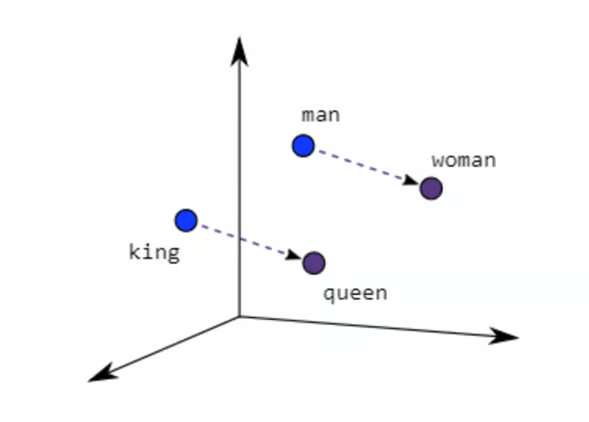[

資料來源：Qiming Bao IEEE

](https://14h034160212.github.io/Qiming_Bao_IEEE_VTS_Natural_Language_Processing_Reasoning_Invited_Talk_Final.pdf?utm_campaign=advanced-rag-series-indexing&utm_medium=referral&utm_source=div.beehiiv.com)

回到分塊！為了方便理解，假設你正在處理一份大型文件，例如一本電子書。你可能想問關於書中內容的問題，但因為整本書的字數遠超過 LLM 的上下文視窗限制（加上模型其他的侷限性），我們希望將書本切分成小塊，只挑選與使用者查詢相關的片段餵給 LLM。然而，在切分時，我們又不能讓這些片段失去故事或角色的上下文。想像一下，如果你隨手拿起一本書，直接從第 145 頁開始看，你會對劇情有多麼一頭霧水？這正是「索引」派上用場的時候。

以下是幾種構思索引策略的方法：

## 1\. 最佳化分塊 (Chunk Optimization)：

首先要考慮的是資料本身：它是短篇還是長篇？這將決定你的分塊策略以及該使用的模型。舉例來說，如果你只是要嵌入一個句子，使用 [sentence transformer](https://huggingface.co/sentence-transformers?utm_campaign=advanced-rag-series-indexing&utm_medium=referral&utm_source=div.beehiiv.com) 可能就綽綽有餘了；但如果是大型文件，你可能需要根據 token 數量來分塊，這時依賴像 [text-embedding-ada-002](https://openai.com/blog/new-and-improved-embedding-model?utm_campaign=advanced-rag-series-indexing&utm_medium=referral&utm_source=div.beehiiv.com) 這樣的模型會是更好的選擇。

第二個考量點是這些嵌入表示的最終應用場景。你是要打造一個問答機器人？一個摘要工具？還是要將它作為 Agentic 工作流（**具備代理能力的自動化流程**）的一部分，將輸出結果餵給另一個 LLM 進行後續處理？如果是後者，你可能會希望限制輸出長度，以符合下一個 LLM 的上下文限制。

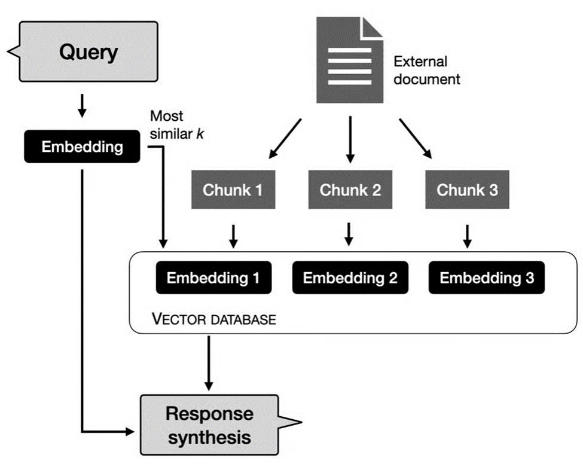

資料來源：[Medium @thallyscostalat](https://medium.com/@thallyscostalat/chunking-strategies-optimization-for-retrieval-augmented-generation-rag-in-the-context-of-e47cc949931d?utm_campaign=advanced-rag-series-indexing&utm_medium=referral&utm_source=div.beehiiv.com)

那麼，我們來深入探討各種策略：

### (i) 基於規則 (Rule Based)：

使用分隔符號（如空白字元、標點符號等）來切分文本。以下是這類方法的幾個例子：

**a. 固定長度 (Fixed length)：** 最直接的方法是透過計算字元數，按照固定的長度來切分。單純依靠字數切分有流失上下文的風險，為了降低這個風險，通常會讓相鄰的區塊保留部分重疊 (overlapping) 的文字，這個重疊量可以由使用者自訂。但這顯然不是最理想的方法，想像一下你必須根據句子的前半段來拼湊出整句話的意思。Langchain 提供的 [CharacterTextSplitter](https://api.python.langchain.com/en/latest/text_splitter/langchain.text_splitter.CharacterTextSplitter.html?utm_campaign=advanced-rag-series-indexing&utm_medium=referral&utm_source=div.beehiiv.com) 是一個不錯的測試工具。

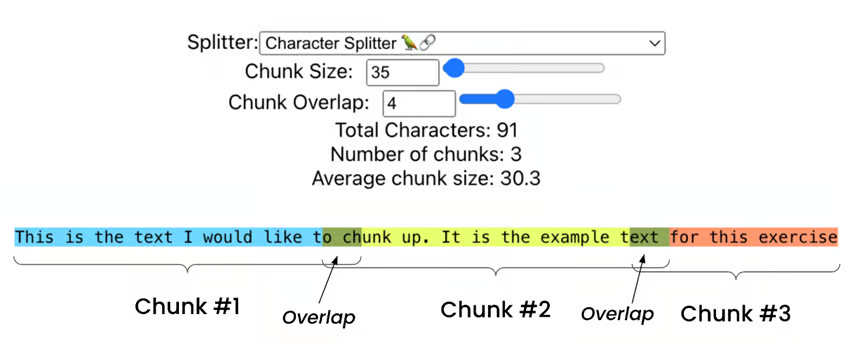[

資料來源：FullStackRetrieval

](https://github.com/FullStackRetrieval-com/RetrievalTutorials/blob/main/5_Levels_Of_Text_Splitting.ipynb?utm_campaign=advanced-rag-series-indexing&utm_medium=referral&utm_source=div.beehiiv.com)

接著是所謂「具備結構感知能力 (Structure aware)」的切分器，亦即基於句子、段落等單位來切分。

**b. NLTK 句子分詞器 (Sentence Tokenizer)：** 這對於將文本切分為句子非常實用。雖然方法很直接，但它在理解底層文本的語意上仍有侷限。用來做初步測試很棒，但當上下文跨越多個句子或段落時（這也是我們使用 LLM 查詢時最常見的狀況），這絕對不是理想的選擇。

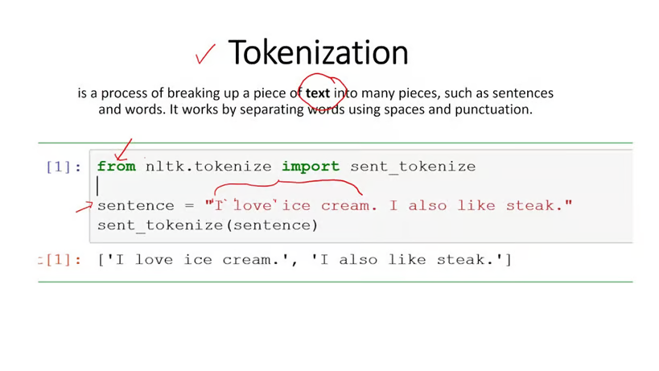[

資料來源：Youtube

](https://www.youtube.com/watch?app=desktop&v=vyyTpL8QKgc&utm_campaign=advanced-rag-series-indexing&utm_medium=referral&utm_source=div.beehiiv.com)

**c. Spacy 句子切分器 (Sentence Splitter)：** 這是另一種基於句子切分的工具，當我們需要參考較小的區塊時很有用。不過，它也面臨著與 NLTK 相似的缺點。

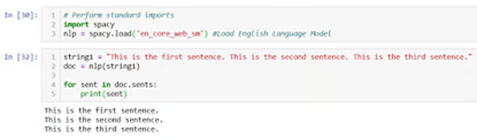[

資料來源：ashutoshtripathi.com

](https://ashutoshtripathi.com/2020/05/04/how-to-perform-sentence-segmentation-or-sentence-tokenization-using-spacy-nlp-series-part-5/?utm_campaign=advanced-rag-series-indexing&utm_medium=referral&utm_source=div.beehiiv.com)

### (ii) 遞迴結構感知切分 (Recursive structure aware splitting)：

將「固定長度」與「結構感知」結合起來，就會得到「遞迴結構感知切分」。你會在 Langchain 的官方文件中發現這種方法被廣泛使用。它的好處是能夠更好地控制上下文。雖然切分出來的區塊大小不再完全一致，但這確實有助於語意搜尋；不過，它對於結構化資料的處理效果依然有限。

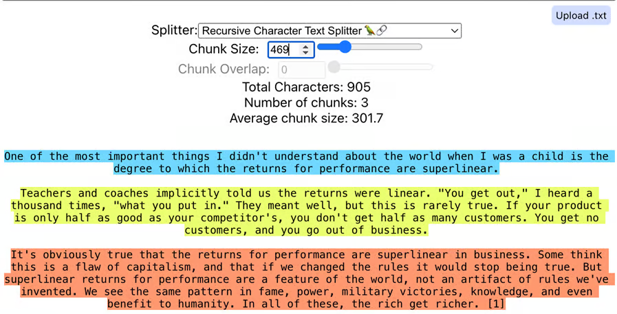[

資料來源：FullStackRetrieval

](https://github.com/FullStackRetrieval-com/RetrievalTutorials/blob/main/5_Levels_Of_Text_Splitting.ipynb?utm_campaign=advanced-rag-series-indexing&utm_medium=referral&utm_source=div.beehiiv.com)

### (iii) 內容感知切分 (Content-Aware Splitting)：

前面的策略用在非結構化資料上可能還算堪用，但遇到結構化資料時，根據資料本身的結構類型來進行切分就顯得至關重要。這也就是為什麼會出現專門針對 Markdown、LaTeX、HTML、包含表格的 PDF、甚至是多模態（文本+圖片）資料設計的文本切分器。

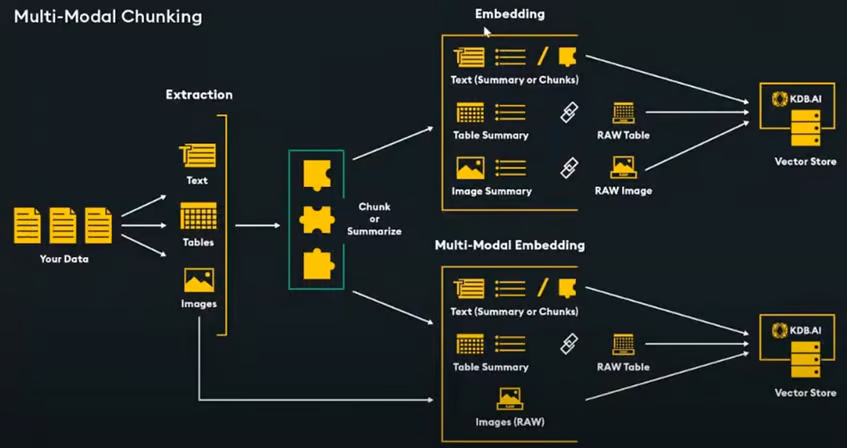[

資料來源：KDB.AI

](https://www.youtube.com/watch?v=uhVMFZjUOJI&t=1209s&utm_campaign=advanced-rag-series-indexing&utm_medium=referral&utm_source=div.beehiiv.com)

## 2\. 多重表示索引 (Multi-representation indexing)：

與其將整份文件直接切塊並依賴語意相似度檢索出前 k 個結果，如果我們能將文件轉換成更緊湊的「檢索單元（例如摘要）」呢？這裡有幾個值得一提的方法：

### (i) 父文件 (Parent Document)：

在這種情況下，系統會根據使用者的查詢，檢索出相關度最高的區塊，但**不只**將該區塊傳給 LLM，而是將該區塊所屬的「父文件（整份文件或較大的段落）」一併傳遞。這有助於提供更完整的上下文，進而提升檢索品質。然而，如果父文件大於 LLM 的上下文視窗該怎麼辦？我們可以同時建立較大的區塊與較小的區塊，在檢索到小區塊時，傳遞對應的較大區塊（而非整份父文件）來適應視窗大小。

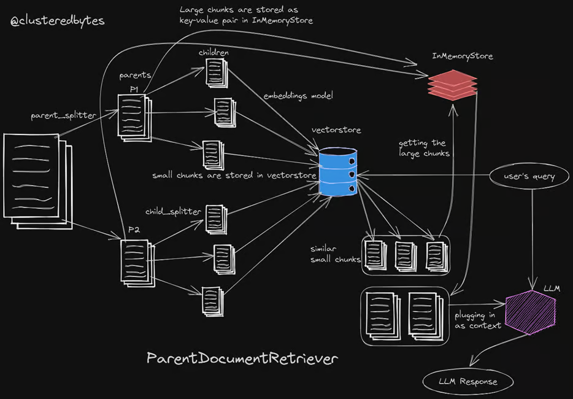[

資料來源：clusteredbytes

](https://clusteredbytes.pages.dev/posts/2023/langchain-parent-document-retriever/?utm_campaign=advanced-rag-series-indexing&utm_medium=referral&utm_source=div.beehiiv.com)

### (ii) 密集 X 檢索 (Dense X Retrieval)：

這是一種上下文檢索的新方法，其切分的區塊不再是我們前面看到的句子或段落。相反地，這篇論文的作者引入了一個稱為「命題 (proposition)」的概念。一個命題有效地封裝了以下特質：

- 文本中獨立的含意。捕捉到的含意必須確保將所有命題組合起來時，能涵蓋整個文本的語意。
- 最小化，即不能再進一步拆分成更小的命題。
- 「情境化且自給自足」，這意味著每個命題本身就必須包含理解它所需的所有文本上下文。

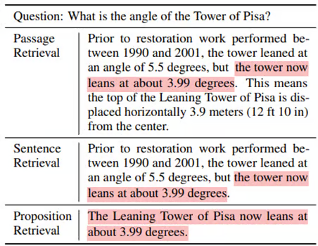[

資料來源：Arxiv

](https://arxiv.org/pdf/2312.06648.pdf?utm_campaign=advanced-rag-series-indexing&utm_medium=referral&utm_source=div.beehiiv.com)

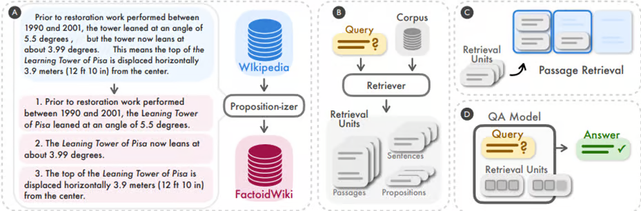[

資料來源：Arxiv

](https://arxiv.org/pdf/2312.06648.pdf?utm_campaign=advanced-rag-series-indexing&utm_medium=referral&utm_source=div.beehiiv.com)

結果如何？命題級別的檢索表現，比句子和段落級別的檢索分別高出了 35% 和 22.5%（非常顯著的提升）。

## 3\. 專門的嵌入表示 (Specialized Embeddings)：

使用特定領域或更進階的嵌入表示模型。

### (i) 微調 (Fine-tuning)：

微調嵌入表示模型，對於提升 RAG 管道檢索相關文件的能力非常有用。在這裡，我們使用 LLM 生成的查詢、文本語料庫，以及兩者之間的交叉對照映射。這有助於讓嵌入模型了解該去哪裡尋找對應的語料。微調後的嵌入表示已證實能帶來 5% 到 10% 的效能提升。

Jerry Liu （**LlamaIndex 創辦人**）對於微調嵌入模型時該注意的事項，給出了一些很好的建議：

### (ii) ColBERT：

這是一種檢索模型，能夠對大量資料進行可擴展的、基於 BERT 的搜尋（時間達到毫秒等級）。快速且準確的檢索是這裡的關鍵。順帶一提，BERT 是 Bidirectional Encoder Representations from Transformers（來自 Transformers 的雙向編碼器表示法）的縮寫；而 ColBERT 則是 Contextual Late Interaction over BERT（基於 BERT 的上下文延遲互動）的縮寫。

它會將每一個段落編碼成由 token 級別的嵌入表示所組成的矩陣（如下圖藍色部分所示）。當執行搜尋時，它會將使用者的查詢編碼成另一個 token 級別的嵌入矩陣（如下圖綠色部分）。然後，它會利用*「可擴展的向量相似度 (MaxSim) 運算」*，根據上下文來匹配查詢與段落。

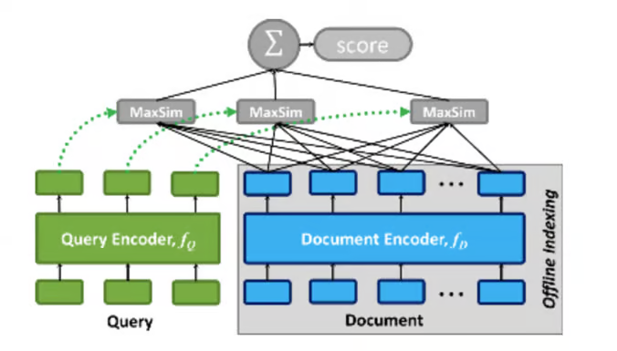[

資料來源：Github - Stanford

](https://github.com/stanford-futuredata/ColBERT?utm_campaign=advanced-rag-series-indexing&utm_medium=referral&utm_source=div.beehiiv.com)

這裡的「延遲階段互動 (late-stage interaction)」是實現快速且可擴展檢索的關鍵。雖然交叉編碼器 (cross-encoders) 會評估查詢與文件之間的每一種可能配對，從而帶來極高的準確度，但在大規模應用中，這種特性反而成了一個負擔，因為運算成本會直線飆升。為了能從龐大的資料集中快速檢索，預先計算文件的嵌入表示就變得很有效率，這在運算成本與品質之間取得了一個良好的平衡。

## 4\. 階層式索引 (Hierarchical Indexing)：

### RAPTOR：

由史丹佛大學研究人員提出的 RAPTOR 模型，是基於各種抽象層級的「文件摘要樹」：亦即透過總結文字區塊叢集來建立一棵樹，以實現更準確的檢索。這種為了增強檢索而設計的文本摘要，能在不同的尺度上捕捉大範圍的上下文，同時兼顧主題的理解與細緻度 (granularity)。

該論文聲稱，使用這種結合遞迴摘要的檢索方法能帶來顯著的效能提升。例如：*「在涉及複雜、多步驟推理的問答任務上，我們展現了目前最先進 (SOTA) 的成果；舉例來說，將 RAPTOR 檢索與 GPT-4 結合使用，我們能在 QuALITY 基準測試上，將最佳表現的絕對準確率提升 20%。」*

如果準確率能提升 20%，我絕對舉雙手贊成！

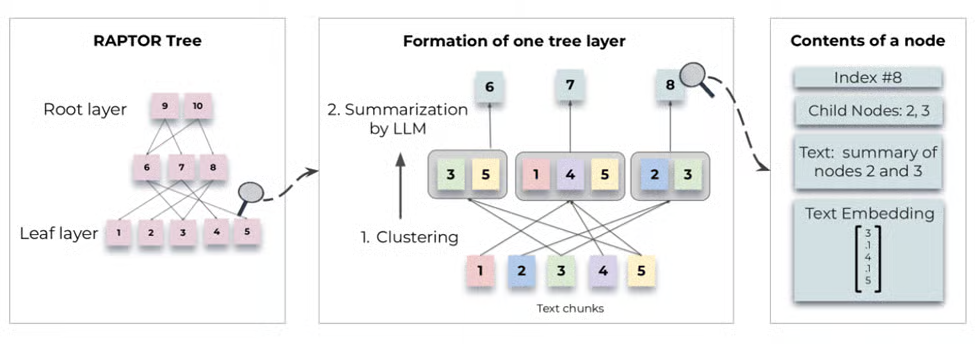[

資料來源：Arxiv

](https://arxiv.org/html/2401.18059v1?utm_campaign=advanced-rag-series-indexing&utm_medium=referral&utm_source=div.beehiiv.com)

用來存放這些嵌入表示的向量資料庫 (Vector stores) 如今正變得越來越普及且商品化，因此我們不會花太多時間著墨，唯一要提的是：對於較大的資料集，採用具備擴展能力的解決方案確實有其必要。市場上的一些主要產品包含 [Pinecone](https://www.pinecone.io/?utm_campaign=advanced-rag-series-indexing&utm_medium=referral&utm_source=div.beehiiv.com)、[Weaviate](https://weaviate.io/?utm_campaign=advanced-rag-series-indexing&utm_medium=referral&utm_source=div.beehiiv.com) 以及開源的 [Chroma](https://www.trychroma.com/?utm_campaign=advanced-rag-series-indexing&utm_medium=referral&utm_source=div.beehiiv.com) 等。

在花費了時間與精力進行索引 (Indexing) 之後，我們將在下一個章節——檢索 (Retrieval) ——中收穫這些努力的成果！