# 進階 RAG 系列：檢索 (Retrieval)

「檢索很難」 - 匿名者

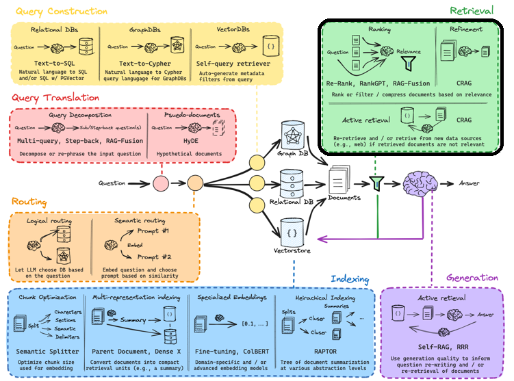[

資料來源：Langchain

](https://docs.google.com/presentation/d/1C9IaAwHoWcc4RSTqo-pCoN3h0nCgqV2JEYZUJunv_9Q/edit#slide=id.g2b6714d62f7_0_0)

***檢索 (re·triev·al)（名詞）***：「從某處取回某物的過程。」*

在完成了資料[索引 (Indexing)](https://div.beehiiv.com/p/advanced-rag-series-indexing) 這項苦差事之後，下一步就是根據使用者的查詢來獲取「相關資料」（參考[查詢翻譯](https://div.beehiiv.com/p/rag-say)、[路由與查詢建構](https://div.beehiiv.com/p/routing-query-construction)）。

最常見也最直接的做法，是從先前建立好索引的資料中，找出並取得與使用者查詢在語意上最相似的區塊（最近鄰搜尋）。這在向量空間中看起來大概像這樣：

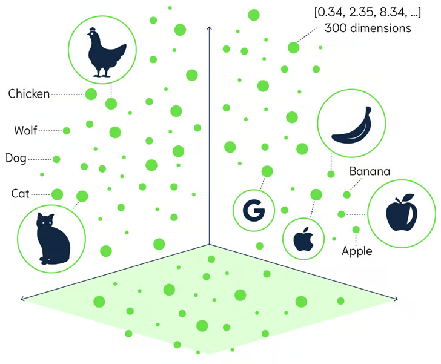[

資料來源：Weaviate

](https://weaviate.io/blog/distance-metrics-in-vector-search)

很明顯地，檢索並非單一步驟，而是一連串的過程：從查詢轉換開始，接著是建立索引，到現在要在取得相關區塊後，進一步提升檢索的品質。如果你想問為什麼要這麼麻煩？我們來假設一個具體情況：假設我們已經根據向量資料庫的相似度搜尋，取得了前 k 個相關的區塊，但其中大部分內容是重複的，或者總長度超過了我們所使用的 LLM 的上下文視窗限制。這時，在將這些上下文呈現給 LLM 之前，我們就必須應用一些「檢索後 (post retrieval)」技術來提升其品質。

延續「在 LLM 領域中沒有所謂唯一正確做法」的主題，最合適的技術取決於你的應用場景以及文本區塊的性質。以下是一些最著名的方法：

## 排序 (Ranking)

#### 重新排序 (Reranking)：

如果我們想找出可能深埋在資料庫某個特定區塊中的答案，「重新排序」是一個非常有效的策略，能提供最相關的上下文給 LLM。實作的方法有以下幾種：

1. **增加多樣性：** 最常被用來達成這個目的的方法是[最大邊際相關性 (Maximum Marginal Relevance, MMR)](https://www.cs.cmu.edu/~jgc/publication/The_Use_MMR_Diversity_Based_LTMIR_1998.pdf)。它的原理是同時考量 a) 與查詢的相似度，以及 b) 與已選定文件之間的距離。

	這裡值得一提的是 Haystack 提供的 DiversityRanker。它使用 sentence transformers 來計算文件之間的相似度。它會先挑選語意最接近的文件，接著選擇*「平均而言，與已選定文件最不相似的文件」*，依此類推。視覺化的呈現如下：
	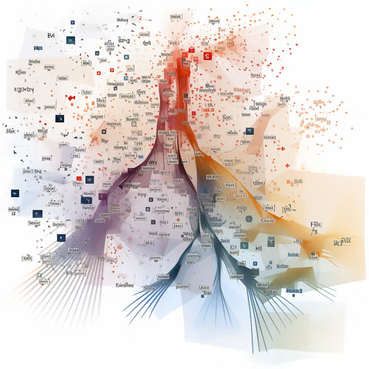[
	資料來源：Haystack
	](https://towardsdatascience.com/enhancing-rag-pipelines-in-haystack-45f14e2bc9f5)
2. **LostInTheMiddleReranker：** 這是 Haystack 提供的另一個排序器，用來解決 LLM 不擅長從文件「中間段落」提取資訊的問題。它的做法是透過重新排序，將最佳（最相關）的文件放置在上下文視窗的最開頭與最結尾。官方建議將這個排序器放在「相關性」與「多樣性」排序之後，作為最後一個步驟。
	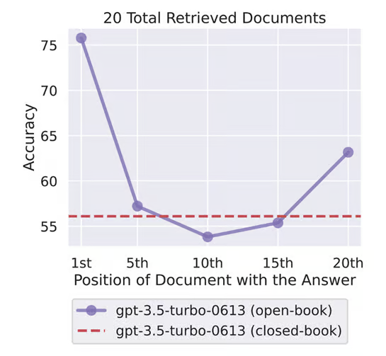[
	資料來源：Arxiv - Liu at al
	](https://arxiv.org/abs/2307.03172)
	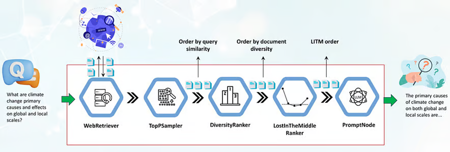[
	資料來源：Enhancing RAG Pipelines in Haystack - Vladimir Blagojevic
	](https://towardsdatascience.com/enhancing-rag-pipelines-in-haystack-45f14e2bc9f5)
3. **Cohere Rerank：** 這是透過 Cohere 的 Rerank 端點 (endpoint) 提供的服務。它會將初步的搜尋結果與使用者查詢進行比對並重新評分。這有助於根據查詢文本與文件之間的語意相似度來重新計算結果，而不僅僅依賴基於向量的搜尋。
	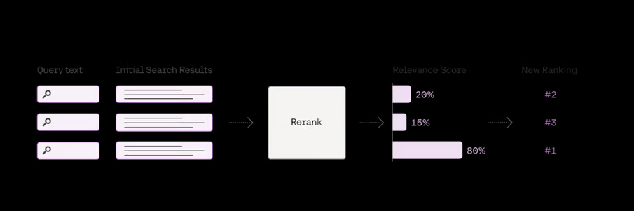[
	資料來源：Cohere
	](https://txt.cohere.com/rerank/)
4. **bge-rerank：** 除了評估哪種嵌入表示模型最適合你的資料外，至關重要的是，還要找出哪種檢索器 (retriever) 能與該嵌入模型搭配出最佳效能。我們可以使用命中率 (Hit Rate) 與平均倒數排名 (Mean Reciprocal Rank, MRR) 作為檢索的評估指標。簡單來說，命中率是指在前 k 個檢索到的區塊中找到正確答案的頻率，而 MRR 則是評估最相關文件在排名中的位置。從下表可以看出，對於這個特定資料集，將 bge-rerank-large 或 cohere-reranker 與 JinaAI-Base 嵌入模型搭配使用，似乎能獲得相當不錯的表現。下表中值得注意的一點是，一般而言，嵌入模型本身並不是好的重新排序器。例如，Jina 在嵌入方面表現最佳，而 bge-reranker 則在重新排序方面表現出色。
	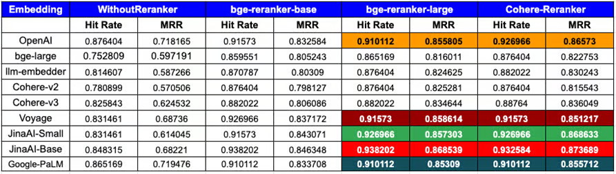[
	資料來源：Llamaindex
	](https://www.llamaindex.ai/blog/boosting-rag-picking-the-best-embedding-reranker-models-42d079022e83)
5. **mxbai-rerank-v1：** 如果不提一下由 Mixedbread 團隊發布、號稱達到 SOTA 且完全開源的最新重新排序模型，那就太說不過去了。它聲稱其效能超越了 Cohere 與 bge-large——絕對值得一試！
	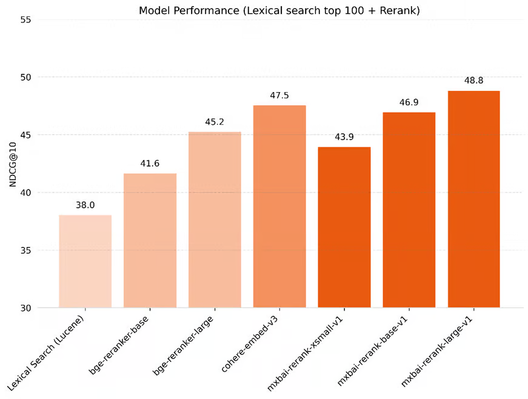[
	資料來源：Mixedbread
	](https://www.mixedbread.ai/blog/mxbai-rerank-v1)

#### RankGPT：

這是首批有效利用現成 LLM（例如 GPT-3.5）來重新排序檢索文件的技術之一，而且表現比 Cohere reranker 還要好。為了解決檢索到的上下文大於 LLM 視窗限制的問題，這個方法採用了「滑動視窗 (sliding window)」策略，顧名思義，就是在一個滑動視窗內逐步對區塊進行排序。實驗顯示這個方法的表現優於大多數其他方法，包括 Cohere rerank。但這裡的缺點是 LLM 往往會為流程引入較高的延遲與成本，因此值得嘗試使用較小的開源模型來調整出最佳效能。

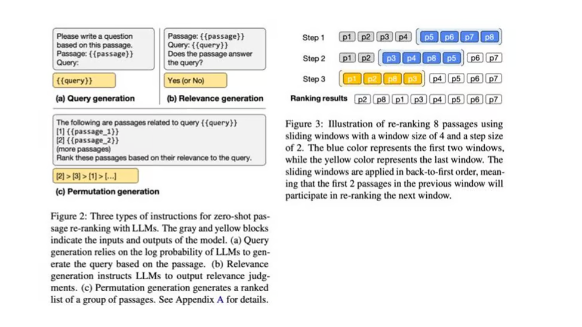[

資料來源：Arxiv - Weiwei Sun et al

](https://arxiv.org/abs/2304.09542)

#### 提示詞壓縮 (Prompt Compression)：

這似乎是介紹「提示詞壓縮」概念的最佳時機，因為它與重新排序有著密切的關聯。這項技術的目的是藉由「壓縮（捨棄）」不相關的資訊（也就是與使用者查詢無關的內容），來減少檢索文件中的雜訊。在這個框架下有幾種不同的方法：

1. **[LongLLMLingua](https://arxiv.org/abs/2310.06839)：** 此方法基於 [Selective-Context](https://arxiv.org/abs/2310.06201) 和 [LLMLingua](https://arxiv.org/abs/2310.05736) 框架，它們是目前提示詞壓縮領域的 SOTA 方法，能在成本與延遲上達到最佳化。在此之上，LongLLMLingua 透過使用*「具備問題感知的由粗到細壓縮方法、文件重新排序機制、動態壓縮比率，以及壓縮後的子序列恢復策略，來提升 LLM 對關鍵資訊的感知能力」*，進而改善檢索品質。這在處理長文本時特別有用，因為 LLM 在這類情況下經常會遇到「[迷失在中間 (Lost in the middle)](https://arxiv.org/abs/2307.03172)」的問題。
	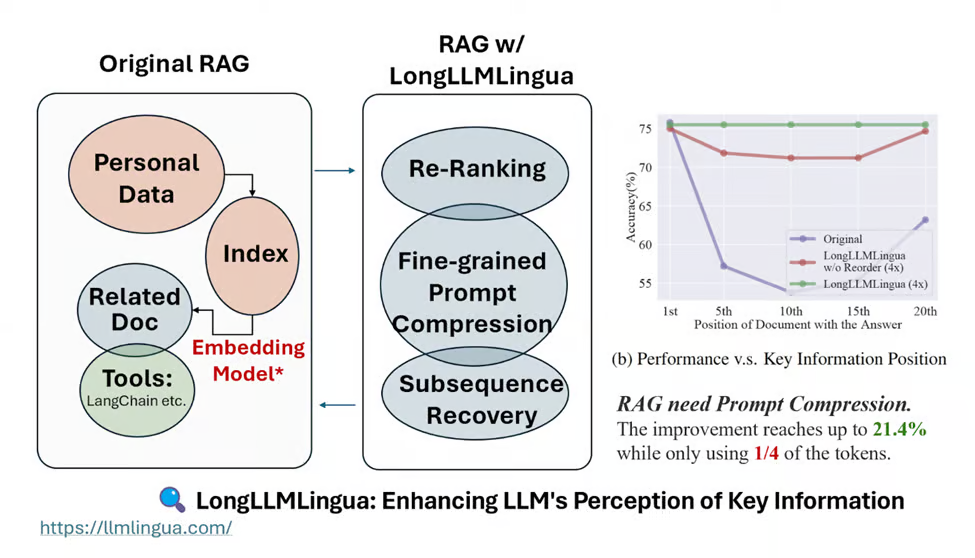[
	資料來源：LLMLingua
	](https://llmlingua.com/)
2. **[RECOMP](https://arxiv.org/abs/2310.04408)：** 這種方法使用「壓縮器 (compressors)」，提議將文本摘要作為 LLM 的上下文，以降低推論成本並提升品質。該論文提出了兩種壓縮器：a) 「抽取式壓縮器 (extractive compressor)」：從檢索到的文件中挑選相關的句子；以及 b) 「生成式壓縮器 (abstractive compressor)」：透過綜合來自多份文件的資訊來產生摘要。
	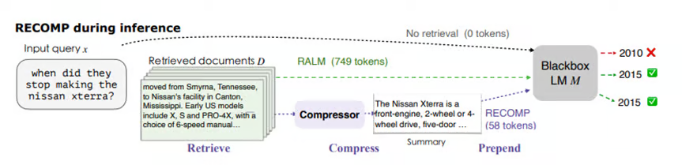[
	資料來源：Arxiv, Xu et al
	](https://arxiv.org/abs/2310.04408)
3. **走過記憶迷宮 (Walking Down the Memory Maze)：** 這個方法引入了 MEMWALKER 的概念，首先將上下文切塊並對每個片段進行摘要，從而將上下文處理成樹狀結構。為了回答查詢，這個模型會透過迭代提示 (iterative prompting) 來瀏覽樹狀結構，以找出包含該特定問題答案的片段。實驗證明這個方法在處理較長序列時的表現特別突出。
	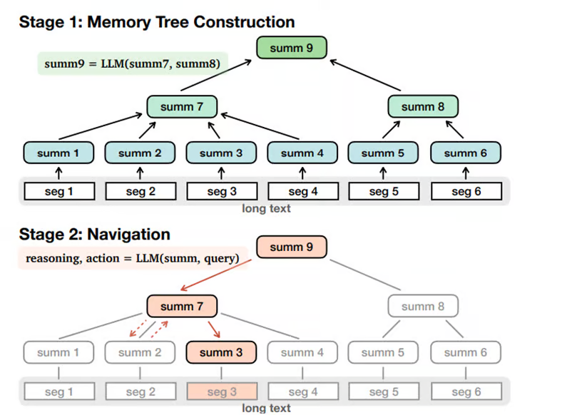[
	資料來源：Arxiv, Chen et al
	](https://arxiv.org/abs/2310.05029)

#### RAG-fusion：

這是一種由 [Adrian Raudaschl](https://www.linkedin.com/in/adrian-raudaschl/) 提出的方法，利用 [倒數排名融合 (Reciprocal Rank Fusion, RRF)](https://plg.uwaterloo.ca/~gvcormac/cormacksigir09-rrf.pdf) 與生成式查詢來提升檢索品質。它的運作方式是：使用 LLM 根據輸入來生成多個使用者查詢，對所有這些查詢執行向量搜尋，然後根據 RRF 匯總並精煉結果。最後一步，LLM 會利用這些查詢與重新排序後的清單來產生最終的輸出。這種方法已證實能在回應查詢時提供更好的深度，因此相當受歡迎。

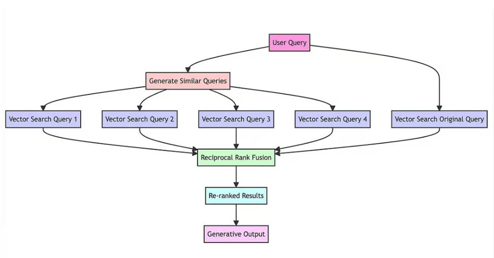

## 精煉 (Refinement)

#### CRAG (Corrective Retrieval Augmented Generation, 校正型檢索增強生成)：

這個方法旨在解決因靜態及有限資料所導致的次優檢索問題。它使用一個輕量級的檢索評估器，接著利用外部資料來源（例如網路搜尋）來補充最終的生成步驟。檢索評估器會透過評估檢索到的文件與輸入之間的關係來估算一個信心分數 (confidence degree)，進而觸發下游的知識擷取動作。

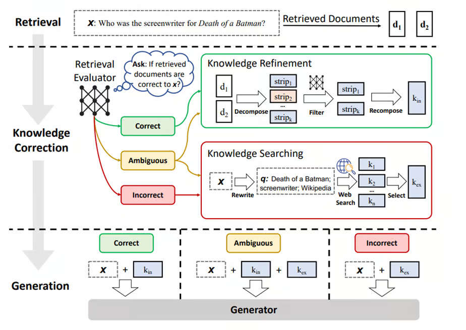[

資料來源：Arxiv, Yan et al

](https://arxiv.org/abs/2401.15884)

報告中顯示的結果令人印象深刻，並指出這在基於 RAG 的方法中帶來了顯著的效能提升：

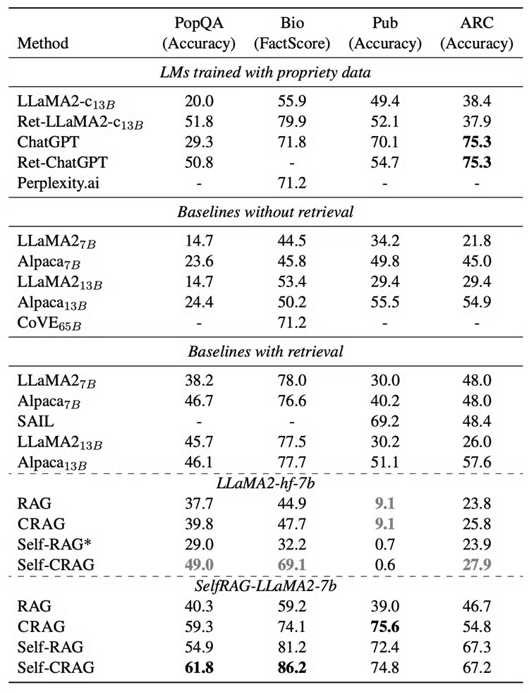[

資料來源：Github - CRAG

](https://github.com/HuskyInSalt/CRAG)

#### FLARE (Forward Looking Active Retrieval, 前瞻主動檢索)：

我們將以一些 FLARE 來結束這篇文章。這個方法在生成長篇文本時特別有用，因為它會先生成一個暫時的下一個句子，如果這個句子包含低機率的 token，它就會決定執行檢索。在決定何時該進行檢索這點上，它能發揮極大的威力，從而減少幻覺與事實上不正確的輸出。

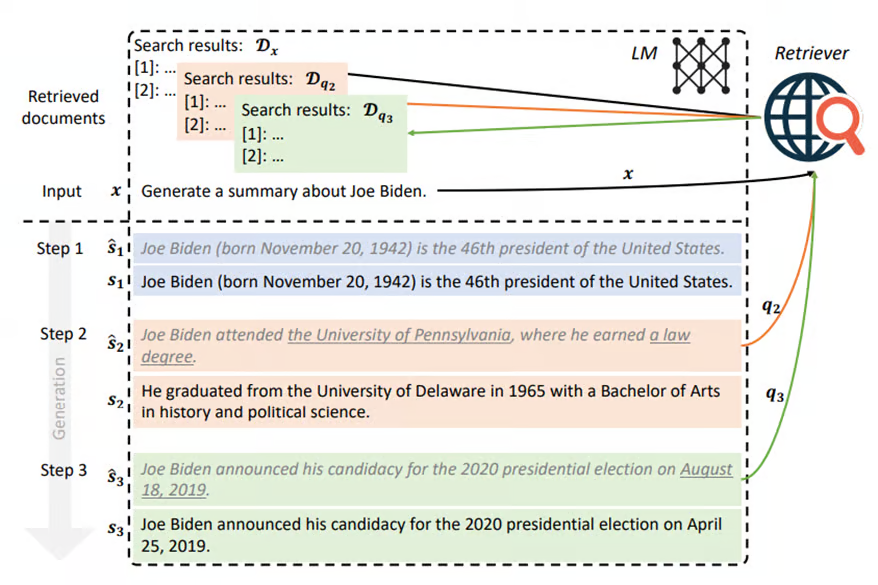[

資料來源：Arxiv, Jiang et al

](https://arxiv.org/abs/2305.06983)

這就是全部了！雖然考量到需要最佳化的變數數量，檢索可能是一件棘手的事，但只要根據應用場景與資料類型採取正確的做法，它就能在節省成本、降低延遲與提升準確度上帶來顯著的改善。

接下來，我們將探討「生成 (Generation)」，並試著理解一些評估策略。在那之前，祝您閱讀愉快！