# **Q-GroundCAM：透過 GradCAM 量化視覺語言模型中的對齊能力**

## Navid Rajabi 與 Jana Koˇseck´a 喬治梅森大學
_{_ nrajabi, kosecka _}_ @gmu.edu

## **摘要**

視覺與語言模型 (Vision and Language Models, VLMs) 繼續在各種任務中展現出色的零樣本 (Zero-Shot, ZS) 表現。然而，許多探索性研究揭露，即使是表現最好的 VLM 也難以捕捉場景理解的組合性，缺乏正確定位與對齊圖像中語言短語的能力。最近 VLM 的進展包括擴大模型與資料集規模、增加訓練目標與監督層級，以及模型架構上的變革。為了評估 VLM 的對齊能力，例如短語對齊、指代理解與關係理解等，指標遊戲 (Pointing Game, PG) 已經被用作具有邊界框註解資料集的評估指標。在本文中，我們引入了一套全新的量化指標，利用 GradCAM 的啟動值，來嚴格評估像 CLIP、BLIP 和 ALBEF 這些預訓練 VLM 的對齊能力。這些指標為 VLM 零樣本能力的詳細比較，提供了一種具可解釋性且可量化的方法，並使我們能測量模型在對齊時的不確定性。這項評估揭示了模型大小、資料集大小與它們效能之間有趣的權衡關係。

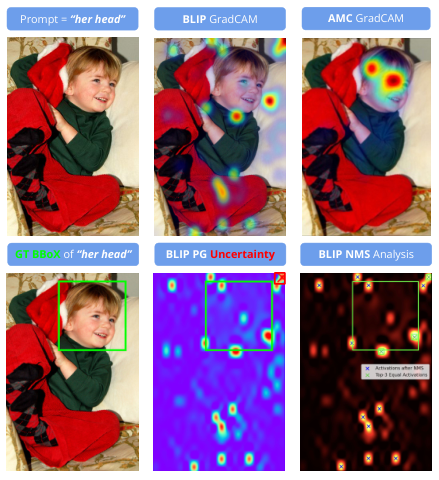

**----- Start of picture text -----** 
Prompt = “her head” BLIP  GradCAM AMC  GradCAM GT BBoX  of “her head” BLIP PG Uncertainty BLIP NMS  Analysis **----- End of picture text -----** 

圖 1. 指標遊戲 (PG) 準確度的不確定性：當擁有多個排名前 _k_ 的相同啟動值，且 PG 二元標籤不一致時（**情境 1**）。如右下圖所示，在我們進行非極大值抑制 (NMS) 分析後，存在三個高信心的啟動點，其值皆為 1.0。其中一個落在邊界框_外_，一個在_內_，另一個在_邊緣_。在這種情況下，PG 缺乏任何額外的線索或啟發式方法來決定要選擇哪一個。

## **1. 簡介**

基礎的視覺與語言模型 (VLMs) 在各種視覺與語言任務中展現了令人印象深刻的表現，包括視覺問答 (VQA)、檢索、圖文匹配、指代理解，或生成標題等。舉例來說，CLIP 已經成為各種應用中廣泛使用的骨幹，從開放詞彙的物件定位與指代特徵對齊 [3, 27]，到像 LLaVa [18] 這樣具生成能力的多模態大型語言模型 (MLLMs) 的上下文學習，以及導航相關任務的具身 AI (Embodied AI) [10]。儘管如此，最先進的 VLM 在捕捉場景組合理解的各個層面時，依然會遇到困難，並缺乏對於名詞短語、動詞或關係的正確對齊能力 [9, 28, 33]。早期的模型架構藉由預測邊界框位置來定位感興趣的物件，並使用相對於真實資料集的傳統 IoU 評估指標 [6, 8, 11]。近期的 MLLM 則放棄了邊界框預測，轉而從語言端解決位置預測問題 [18, 20]。對齊與定位概念的能力仍然是大家關注的焦點 [31]，而 GradCAM 視覺化 [25] 或指標遊戲 (PG) 準確度 [34] 經常被用來量化模型的對齊能力。指標遊戲 (PG) 認為，如果最高的 GradCAM 啟動值落在真實邊界框內，對齊就視為成功 [7]。雖然 PG 在評估對齊表現上已經被有效利用 [1, 2, 4, 7, 29, 31]，但它只提供了粗略的 0/1 評估，這很容易受到虛假的局部最大值或存在多個最大值的影響，並且無法很好地捕捉對齊概念的信心程度。圖 1 和圖 2 中的範例將會因為以下情境而被 PG 方法錯誤處理：

- **情境 1：** 模型預測出高信心的啟動點，有些在邊界框內，有些在外面，如圖 1 所示。在這些情況下，PG 必須隨機挑選局部最大值。我們將此稱為 PG _不確定性 (Uncertainty)_ 指標，並在表 1 中報告了每個資料集中發生此類不確定性情況的總數。

- **情境 2：** 當比較不同模型在相同實例上的表現時，PG 沒有考慮真實邊界框之外那些虛假的啟動預測。如圖 2 所示，雖然 PG 對所有四個模型都給了標籤 1，但我們的 IO _比率 (ratio)_ 指標提供了更精細的對齊品質特徵。

為了解決這個問題，並提供更精細的模型對齊能力特徵，我們提出了一組指標來 (1) 計算 GradCAM 啟動圖與真實二元遮罩之間的相似度，(2) 獎勵在真實邊界框內的啟動，同時懲罰_虛假_的外部啟動，以及 (3) 測量**情境 1** 中的不確定性。我們的靈感來自於 [31] 中引入的注意力遮罩一致性損失 (Attention Mask Consistency loss, AMC)，其旨在**最大化**真實邊界框**內部**的啟動並**最小化外部**的啟動，這被用於 ALBEF 的預訓練中 [15]。由於我們的指標適用於廣泛的 VLM，包括基於區塊的 ViT [5] 以及基於 CNN 的視覺轉換器編碼器 [3, 23]，因此即使沒有邊界框預測機制，它們也能徹底評估 VLM 的對齊能力。這套提出的指標可以區分 PG 無法捕捉到的模型對齊能力比較細微差異。我們將使用這些指標，在廣泛的對齊任務光譜中，評估四個最先進的 VLM（BLIP _base_ [16]、BLIP _large_ [16]、CLIP gScoreCAM [3, 23] 和 ALBEF 的 AMC 變體 [15]）[1]。

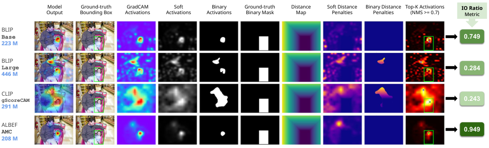

**----- Start of picture text -----** 
Model
 Ground-truth
 GradCAM
 Soft
 Binary
 Ground-truth
 Distance
 Soft Distance
 Binary Distance
 Top-K Activations  IO Ratio Output
 Bounding Box
 Activations
 Activations
 Activations
 Binary Mask
 Map
 Penalties
 Penalties
 (NMS >= 0.7)
 Metric BLIP Base 0.749 223 M BLIP Large 0.284 446 M CLIP gScoreCAM 0.243 291 M ALBEF AMC 0.949 208 M **----- End of picture text -----** 

圖 2. 給定 _**”his daughter”（他的女兒）**_ 提示詞，PG 對所有四個模型輸出皆以離散方式給予相同的準確度 1，忽略了它們在整體對齊品質上的差異（**情境 2**）。另一方面，我們的 **IO** _比率_ 指標能夠以更_具解釋性_且_連續_的方式來區分和排名它們，透過將它們各自量化為 0 到 1 之間的單一標準化數值。

## **2. 方法**

考慮一個 GradCAM 啟動圖 $A_{i,j}$，它是藉由將圖像和相應的文本提示傳遞給模型而獲得的，而 $M_{i,j}$ 則是二元真實邊界框遮罩的像素位置。為了計算 IoU _Soft_ 和 Dice _Soft_，我們遵循了 [19] 中用於語義分割的公式。我們首先對 $A_{i,j}$ 中的每個像素值應用 0.5 的閾值，並傳遞閾值化後的二元啟動圖來計算 IoU _Binary_ 和 Dice _Binary_。
**距離圖 (Distance Maps)。** 給定邊界框座標 $(y_0, x_0, y_1, x_1)$，距離圖 $D_{i,j}$ 的計算適用於所有 $(i, j)$，其中 $0 \le i < H, 0 \le j < W$：

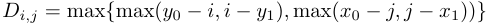

而加權懲罰矩陣 $P_{i,j}$ 計算如下：

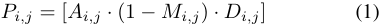

**加權距離懲罰 (Weighted Distance Penalty, WDP)** 的設計宗旨在於懲罰真實邊界框外部的_虛假_啟動，其懲罰力度與它們的_幅度_及距離真實邊界框的_距離_成正比，計算及標準化公式如下：

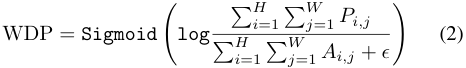

> 1我們已將程式碼發布於 Github.com/NavidRajabi/Q-GroundCAM。

（表格 1. 定量結果比較略，詳細數字請參閱原文件）

表 1. 所有設定的定量結果比較，其中數字皆回報為各設定的平均 IoU (**mIoU**)。對於每個設定，所有模型中表現最好的會以**粗體**標示，次佳的則加底線。

**內部/外部啟動比率 (Inside/Outside Activations Ratio, IO _ratio_)** 的計算方式如下：

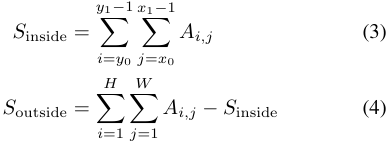

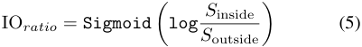

**指標遊戲不確定性分析 (Pointing Game Uncertainty Analysis)：** 我們擷取啟動圖 $A_{i,j}$ 中大於啟動閾值 ($\tau$) 0.7 的局部最大值 ($v$) 作為集合 $V = \{v_1, v_2, ..., v_n\}$。然後對 $V$ 進行排序，接著進行一個額外的 NMS 步驟，抑制那些與較大極值之歐幾里得距離小於 $\delta$[2] 的最大值。$V_{nms}$ 和 $C_{nms}$ 分別代表剩餘的啟動值和它們相應的座標。對於 $C_{nms}$ 中的每個點，我們檢查它是否落在真實邊界框內，並計算 $V_{nms}$ 中排名前 _k_ 的相等啟動值**不全**在邊界框內或全在邊界框外的案例數量。

> 2在我們的實驗中，$\delta = 50$

## **3. 實驗**

我們進行了實驗以評估四個最先進的 VLM（BLIP _base_、BLIP _large_、CLIP gScoreCAM 和 ALBEF 的 AMC 變體）在廣泛的對齊任務中的對齊能力，這些任務根據文本提示的粒度有所變化，並包含分佈內 (ID) 和分佈外 (OOD) 的資料。定量結果總結在表 1 中，分數分佈樣本則顯示在圖 3 中。對於短語對齊和指代理解，我們使用了 Flickr30K Entities [21] 的測試集以及 RefCOCO+ 的 testA & testB [12] 資料集，這些資料集被認為屬於模型的領域內分佈。為了解這些模型的領域外泛化能力，我們在 SpatialSense [30] 資料集的測試分割上進行了同樣的實驗，該資料集既有因包含 NYU 資料集 [26] 圖像而導致的**視覺**領域偏移（總共有 3,679 個獨特物件，包括小型/長尾概念），又有因註解了 17,498 個包含空間關係的三元組而造成的**語言**領域偏移。該資料集專為空間關係識別而設計，並以三元組 {SUBJECT-RELATION-OBJECT}（主體-關係-客體）的格式進行註解，附帶真實的 OBJECT 和 SUBJECT 邊界框。我們在三種不同的設定下執行了實驗：TRIPLET（三元組）、SUBJECT（主體）和 OBJECT（客體）對齊。圖 4 展示了 SpatialSense 資料集的一個實例。所有設定的實驗細節都可以在附錄 6 中找到。額外的定性結果可在附錄 7 中找到，其中在圖 6 展示了另一種**情境 1** 的不確定性案例，這是在第一個範例的左上角子圖中由 BLIP _base_ 所獲得的結果。

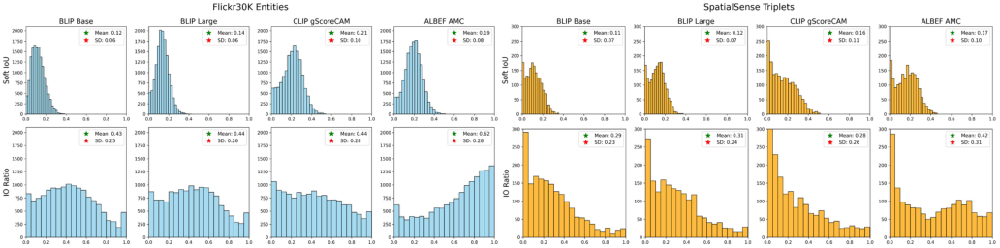

圖 3. IoU _Soft_ 和 IO _ratio_ 的直方圖分佈：**ID** 對比 **OOD**。請注意，分佈內資料集的直方圖在左側以**藍色**顯示，其峰值較為集中，且對於表現較好的模型，它們會向右偏移。而所有模型的領域外實驗則擁有較不集中、較平坦的直方圖，在右側以**橘色**顯示。完整的視覺化圖表可在附錄 8 中找到。

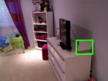

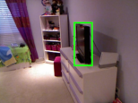
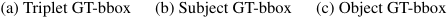
**----- Start of picture text -----** 
(a) Triplet GT-bbox (b) Subject GT-bbox (c) Object GT-bbox **----- End of picture text -----** 

圖 4. SpatialSense NYU 臥室集的一個樣本。我們將 _”wifi router to the right of television”（電視右側的 wifi 路由器）_ 提示詞視為 TRIPLET，_”wifi router”（wifi 路由器）_ 視為 SUBJECT，而 _”television”（電視）_ 視為 OBJECT。

## **4. 討論**

根據表 1，結合 PG _Accuracy_、PG _Uncertainty_ 和 IO _ratio_ 指標，ALBEF _AMC_ 是贏家。與使用通常存在雜訊的圖文對來擴充模型規模和訓練集規模相比，這凸顯了微調 ALBEF 邊界框層級監督的重要性。關於啟動與真實遮罩之間的相似度，根據 IoU 和 Dice 指標，CLIP _gScoreCAM_ 和 ALBEF _AMC_ 分別是表現最好和次好的模型，但就 WDP 而言，在大多數情況下卻是相反的。這顯示 CLIP 具有更多虛假的 GradCAM 啟動。此外，我們認為由於 GradCAM 啟動中普遍存在雜訊，WDP _Soft_ 的懲罰遠比 WDP _Binary_ 變種更為嚴格，這使得 WDP _Binary_ 成為一個更實用的指標。PG _Uncertainty_ 在 CLIP _gScoreCAM_ 中為零，我們認為這源於視覺骨幹的差異以及 [3] 中計算 GradCAM 方式的細微差別。ALBEF _AMC_ 在 PG _Uncertainty_ 上以微弱優勢位居第二。相比之下，BLIP _large_ 在所有設定中顯示出最高的相對 PG _Uncertainty_。我們的 IO _ratio_ 指標與 PG _Accuracy_ 有很強的正相關性，同時又更為嚴格。這使得它成為評估模型對齊表現的合適獨立指標，因為除了 PG _Accuracy_ 之外，它還同時考慮了內部和外部的啟動。請注意，PG _Accuracy_ 在所有模型中並不總是與 PG _Uncertainty_ 呈正相關。這項發現深具啟發性，因為它證明了在 PG _Accuracy_ 方面表現較好的模型，並不一定具有最低的 PG _Uncertainty_。我們的 OOD 實驗也展示了我們的指標適用於評估基於三元組的空間理解對齊 [13, 24] 以及轉移的視覺領域。

**模型大小與訓練資料的影響。** 除了 ALBEF _AMC_ 的優勢外，我們的實驗表明，擁有約 446M 參數並在 129M 圖文對上進行預訓練的 BLIP _large_，在所有 6 個資料集分割的 PG _Uncertainty_，以及 2 個資料集分割的 PG _Accuracy_ 方面，表現**不如**擁有約 223M 參數並在 14M 圖文對上預訓練的 BLIP _base_。考慮到在我們的實驗中，預訓練於約 400M 圖文對上的 CLIP 是模型和資料大小光譜的最高端，而 ALBEF 和 BLIP _base_ 都處於最低端，ALBEF _AMC_ 的表現再次強調了更精細微調的有效性。我們建議除了 PG _Accuracy_ 之外，再執行我們的 IO _ratio_、PG _Uncertainty_、WDP _Binary_，以及 IoU _Soft_ 或 Dice _Soft_ 其一，以進行徹底的對齊評估。

## **5. 結論**

我們首先展示了指標遊戲 (PG) 評估指標無法正確處理的兩種情境，並引入了一套用於評估模型對齊能力的新指標，能夠捕捉模型之間更精細的差異。根據我們的實驗，與其他三個模型相比，ALBEF _AMC_ 在量化上展現了其優勢，並在預測真實邊界框內啟動的清晰度（由 IO _ratio_ 所表徵）的定性表現上更好。所提出的指標能對短語對齊和指代理解的對齊能力進行更細緻的評估，以及了解其在分佈內和分佈外資料集之間的變化。

## **參考文獻**

(參考文獻略，請參閱原文)

## **Q-GroundCAM：透過 GradCAM 量化視覺語言模型中的對齊能力**

## 補充材料

## **6. 實驗細節**

對於**_短語對齊 (phrase grounding)_** 實驗，我們使用了 Flickr30K Entities [21] 資料集的測試分割，具體來說，是也被 MDETR [11] 和 SiRi [22] 使用過的_合併 (merged)_ 版本。在預訓練檢查點方面，我們透過 LAVIS [14] 程式碼庫，將 blip-image-text-matching 檢查點用於 BLIP（包含 base 和 large 兩種變體）。對於 ALBEF _AMC_，我們使用了由 AMC [31] 釋出的 best-flickr 檢查點，其定性結果樣本顯示在圖 1 和圖 2 中。對於所有 CLIP _gScoreCAM_ 實驗，我們使用了具有 top 300 頻道啟動圖平均池化的 RESNET50 $\times$ 16 變體的 CLIP，這是 [3] 所報告表現最佳的設定。

對於**_指代理解 (referring expressions comprehension)_** 實驗，我們對兩個 BLIP 實驗使用了與_短語對齊_相同的檢查點，但使用了 [31] 釋出的 best-refcoco 檢查點，其定性結果樣本顯示在圖 5 和圖 6 中。此外，在圖 6 的第一個範例中展示了 PG 不確定性（**情境 1**）的額外範例，在透過執行 BLIP _base_ 所獲得的第一個左上角 GradCAM 啟動圖中。同樣，存在兩個最高啟動值皆為 1.0，其中一個落在真實邊界框內，另一個在外部。在這些情況下，PG 在選擇最大值來計算準確度時變得猶豫不決，因為這部分評估變得隨機，直接影響了評估的可靠性。

對於**_分佈外 (Out-of-Distribution, OOD)_** 實驗，我們在 SpatialSense [30] 資料集上執行了模型。我們將 Spatial Sense 資料集視為 OOD，因為它在視覺端（因包含來自 Flickr [32] 和 NYU [26] 的新圖像，而非廣泛使用的預訓練/微調資料集如 MSCOCO [17] 和 Visual Genome [13]）以及語言端（透過包含空間子句和小型/長尾物件以增加檢測/對齊難度）都存在領域偏移。更具體地說，我們在測試集中標籤為 True 的實例上進行了這項實驗，在三種設定中總共有 1811 個實例。第一個設定對齊整個三元組 {SUBJECT-RELATION-OBJECT}，並且我們將 SUBJECT（主體）真實邊界框視為整個三元組的正確邊界框監督，因為根據他們的慣例，SUBJECT 充當目標，而 OBJECT（客體）充當參考。此外，我們針對 SUBJECTS 和 OBJECTS 的個別物件對齊進行了兩個獨立實驗，各自使用它們相應的真實邊界框。除了確認我們在 Spatial Sense 實驗中看到的高度困難（我們也在圖 7 中展示了一個定性範例樣本）之外，我們還注意到在某些實例中，由於將 SUBJECT 視為獨立短語進行對齊時潛在的歧義/干擾，對齊 SUBJECTS 變得更加複雜。這是由於需要依賴 RELATION（關係）和 OBJECT（客體）作為消歧義所需的上下文所發生的，圖 8 提供了一個範例。因此，整體來說，TRIPLET 和 OBJECT 對齊設定的結果似乎更可靠，但由於我們是在完全相同的基礎上比較不同的模型，因此我們的主體 (SUBJECT) 對齊結果在所有模型中也應被視為公平的。

## **7. 定性結果樣本**

圖 1 和圖 2 提供了 Flickr30K Entities 範例。圖 5 提供了 RefCOCO+ **testA** 範例。圖 6 提供了 RefCOCO+ **testB** 範例。圖 7 提供了 SpatialSense **第一個**範例。圖 8 提供了 SpatialSense **第二個**範例。

## **8. 分數分佈直方圖**

圖 9 提供了 Flickr30K Entities **test** 直方圖。圖 10 提供了 RefCOCO+ **testA** 直方圖。圖 11 提供了 RefCOCO+ **testB** 直方圖。圖 12 提供了 SpatialSense **triplets** 直方圖。圖 13 提供了 SpatialSense **subjects** 直方圖。圖 14 提供了 SpatialSense **objects** 直方圖。

以下為圖表 5 到 14 的補充影像，對應相關數據集與模型的定性展示：

### 補充影像

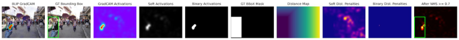

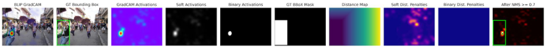

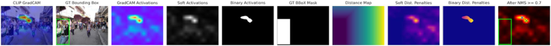

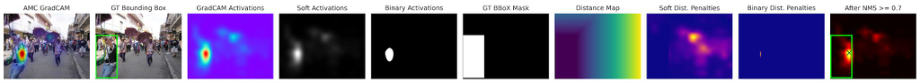

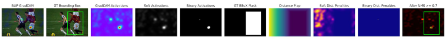

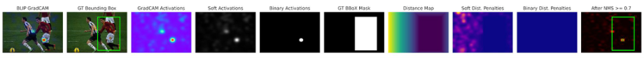

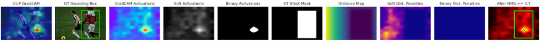

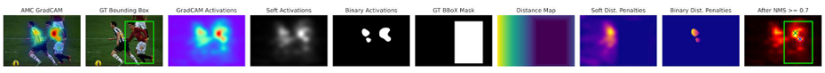

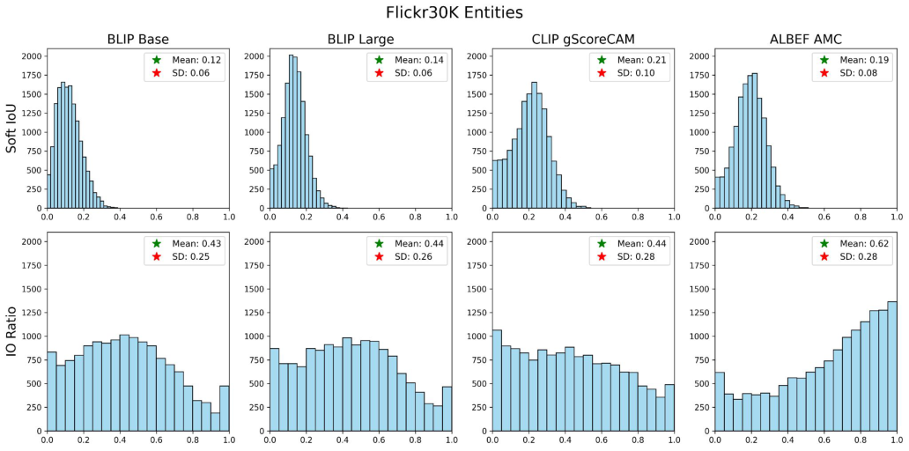

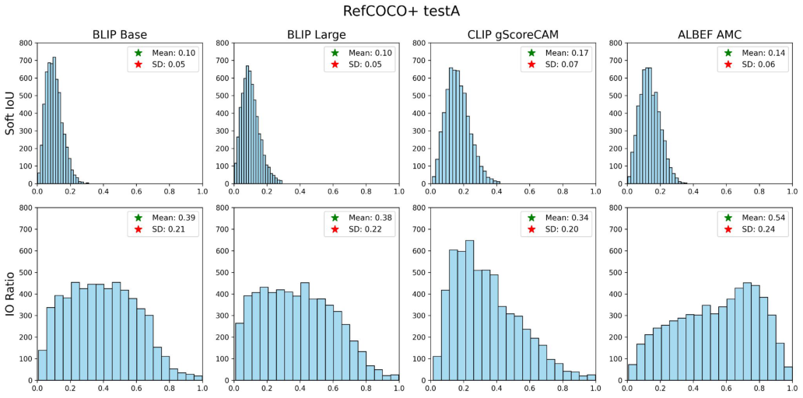

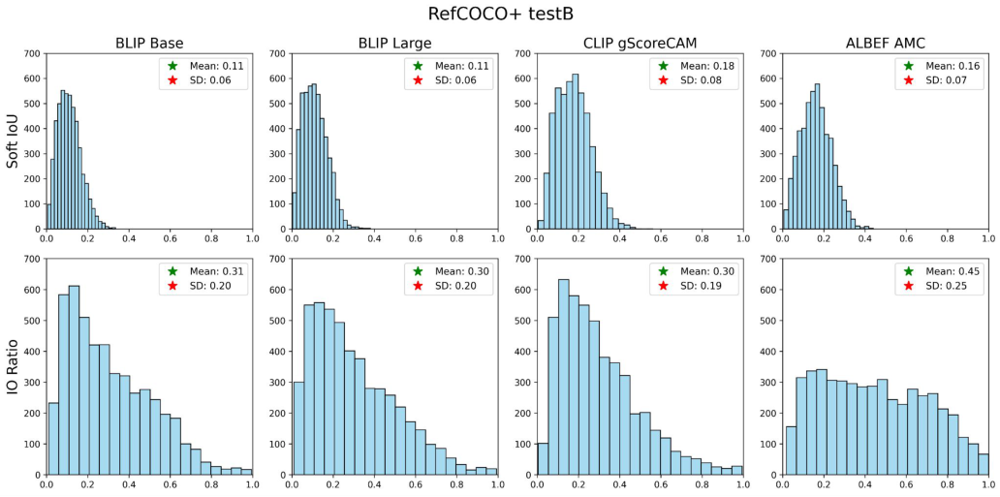

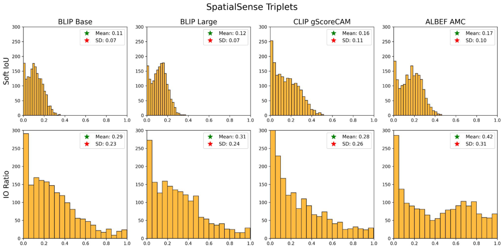

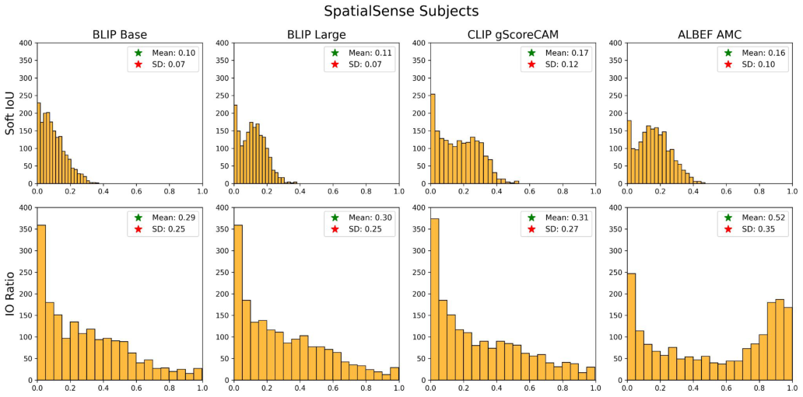

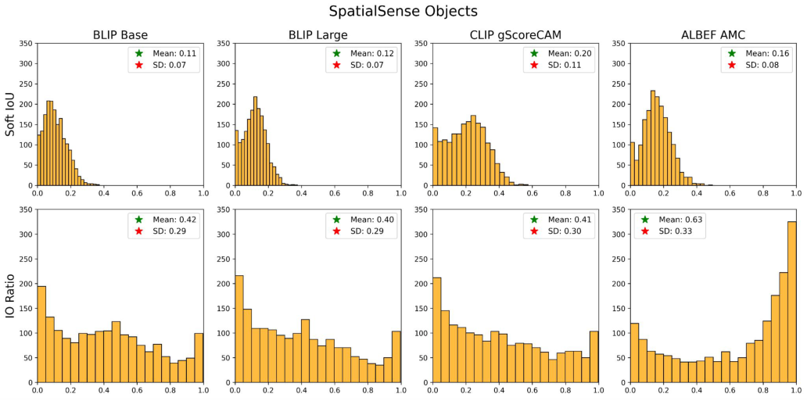

