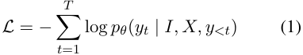
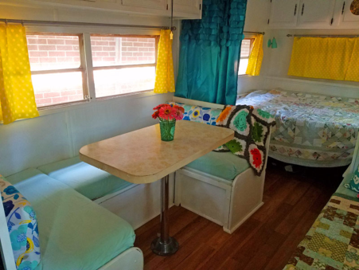

# **SpaRE：用合成資料，讓視覺語言模型學會「看懂」空間關係** 

**Michael Ogezi** 滑鐵盧大學、Vector 研究所 mogezi@uwaterloo.ca 

## **Freda Shi** 

滑鐵盧大學、Vector 研究所 fhs@uwaterloo.ca 

## **摘要** 

現在的視覺語言模型（**Vision-Language Models，簡稱 VLMs**）非常厲害，不論是幫圖片寫圖說，還是回答視覺問題（**Visual Question Answering，簡稱 VQA**）都難不倒它們。然而，一旦遇到我們人類再熟悉不過的「空間推理（**理解與解釋圖像中物體之間空間位置關係的能力**）」時，這些 AI 就開始吃癟了。

我們研究後發現，問題其實出在資料上：在目前主流的視覺語言資料集中，包含「空間關係」的例子非常少。除了少數幾個常見的詞（像是「在...上面」）常出現之外，大多數空間關係都散落在無人問津的「長尾分佈」中，根本得不到充分的學習。這導致視覺語言模型在面對各式各樣的空間關係時，顯得有些無能為力。

為了解決這個難題，我們發起了一場「搶救 AI 空間感」的行動。我們利用 Localized Narratives（**本地化敘事**）、DOCCI 和 PixMo-Cap 這三個資料集裡超詳細的影像描述，自動生成了一套專門訓練空間推理的「合成問答對（**Question-Answer pairs，簡稱 QA pairs**）」資料集。這套資料集規模驚人，包含了 45.5 萬個樣本，總計有 340 萬個問答對！

當我們用這套特訓教材來訓練視覺語言模型後，誕生了「空間推理強化版」的模型——SpaRE。在空間推理的基準測試中，SpaRE 的表現令人驚艷：在 What's Up 基準測試中，效能提升了高達 49%，而且原本擅長的其他一般任務也完全沒有退步。這項研究拉近了 AI 與人類在空間理解上的差距，也讓視覺語言模型在機器人、導航等真實世界的應用中，變得更實用、更可靠。我們也計劃在近期開源分享我們的程式碼和資料集。

## **1 引言** 

想像一下，如果你要讓一個智慧系統在實體世界中穿梭自如，那麼「空間推理」絕對是不可或缺的關鍵能力——這指的是理解並解釋物體與物體之間空間位置關係的本領 (Newcombe et al., 2000)。無論是自動駕駛的機器人、自主導航系統，還是最近很紅的延展實境（**Extended Reality，簡稱 XR**），要運作得安全又有效率，都得仰賴極為精準的空間理解力 (Landsiedel et al., 2017; Balakrishnan et al., 2021)。要是少了可靠的空間推理能力，這些系統很容易「看錯」周圍環境，進而引發安全與效率上的大麻煩。

雖然近年來視覺語言模型在許多方面取得了令人矚目的進展，例如幫相片寫說明、回答視覺問題、圖文檢索，甚至是零樣本圖像分類（**不需事先看過特定標籤就能辨識圖像的能力**），但令人頭痛的是，它們在空間推理上的表現卻始終差強人意 (Kamath et al., 2023; Liu et al., 2023a; Zhang et4 al., 2024)。舉例來說，一個模型可能可以精準指出照片裡有哪些物品，卻完全搞不清楚它們是怎麼擺放的。然而，這種空間排列關係，偏偏就是理解場景和導航時最核心的要素。

**----- 圖片文字開始 -----** 
一隻灰色小象公仔在左側的正視圖； 
中間有一隻黑橘條紋的老虎； 
右側是一個紙漿犀牛頭。 
它們並排擺放， 
彼此之間保留了空隙... 
大型語言模型：根據上述描述， 
提取出空間推理問答對... 
橘色老虎的右邊是什麼？ 犀牛頭 
哪個動物公仔位於最左邊？ 大象 
排在中間的是什麼動物？ 
老虎 
背景是什麼？ 花壁紙 
... 
**----- 圖片文字結束 -----** 

圖 1：我們的合成資料生成流程：將超詳細的影像描述輸入至大型語言模型（LLM），由其提取出空間推理問答對（QA pairs）。

為什麼 AI 的空間感會這麼差呢？我們去翻了翻現有的視覺語言資料集，發現裡面包含「空間關係」的資料少得可憐（如表 2 所示）。更糟的是，資料分布極度不均：像「在...上面（on）」、「左邊（left）」和「在...下面（under）」這類常見的關係佔據了絕大多數，而「面對著（facing）」、「在...對面（opposite）」或「包圍著（surrounding）」等較少見的關係，在資料集裡幾乎要絕跡了。事實上，排行前 17% 的熱門關係就佔了所有空間關係範例的 90% 以上（詳見附錄表 10）。這種極端的資料傾斜，讓 AI 在學習時「偏科」嚴重，根本無法應對五花八門的現實空間關係。

過去大家也不是沒有想過辦法，但可惜效果都不盡理想。有些研究嘗試用「合成資料集」 (Johnson et al., 2017; Agrawal et al., 2023)，雖然能提供結構化且容易控制的訓練環境，但裡面的圖像全是一些簡單的幾何形狀（比如紅色的積木或藍色的球），與複雜的現實世界天差地別，AI 根本無法將學到的能力轉移到真實圖像上。而另一條路則是靠人工標註的資料集 (Liu et al., 2023a; Kamath et al., 2023)，雖然品質好，但因為耗費人力，在數量和空間關係的多樣性上都受到了很大限制，讓 AI 的表現始終在低檔徘徊。

為了解決這個長久以來的痛點，我們提出了一種全新的方法。這一次，我們把目光投向了近來新興的「長篇影像描述資料集」，那裡藏著尚未被開發的巨大寶藏。像 DOCCI (Onoe et al., 2024)、PixMo-Cap (Deitke et al., 2024) 以及 Localized Narratives (Pont-Tuset et al., 2020) 這些資料集，裡面裝滿了對影像極為豐富、細緻的描述。它們不只寫出影像裡有什麼，還詳細記錄了物體之間的空間關係和互動細節（可以參考附錄中的圖 5）。

有了這些強大的資源，我們派出 Qwen2.5-3B-Instruct (Yang et al., 2024)[1] 這個聰明的 AI 助理，從這些超詳細的描述中把空間關係一條條「撈」出來，並自動生成各式各樣、充滿挑戰的空間推理問答對（QA 對）。我們的合成資料生成流程如圖 1 所示。這種做法最大的好處在於，我們使用的是真實世界的生活照片，這能讓模型在最真實的視覺場景中磨練空間推理技能，直接解決了過去用幾何合成圖片訓練時所產生的「領域轉移（**模型在虛擬訓練資料與真實測試資料之間因分佈不同而表現下滑的現象**）」問題。

接著，我們用這套新生成的合成資料集對視覺語言模型進行微調，打造出了「**空**間**推**理**強**化版（**Spatial-Reasoning Enhanced，簡稱 SpaRE**）」模型。果不其然，SpaRE 在 VSR、What’s Up、3DSRBench 和 RealWorldQA 等各大空間推理基準測試中的表現突飛猛進。如表 3 所示，在專為測試空間理解力而設計的 What's Up (Kamath et al., 2023) 基準測試 A 分組中，我們的效能足足提升了 49%！更棒的是，這種「空間感」的特訓並沒有讓 AI 的其他功力退步。SpaRE 在 MMMU (Yue et al., 2024) 和 MMBench (Liu et al., 2024b) 等標準基準測試上依然維持著頂尖水準。這證明了我們的方法既能精準補足空間推理的短板，又不會傷及模型本來的綜合實力。

透過大幅提升視覺語言模型的空間推理能力，這項研究能為許多仰賴精準空間理解的系統提供強大支援。例如，幫助自動駕駛車在複雜的路況中安全穿梭、讓服務型機器人能更自然地與人類協同工作，或是做為視障朋友的智慧導航輔助工具，指引他們前行的方向。

總結來說，我們的主要貢獻有以下三點：

1. **量化資料稀缺問題**：我們深入分析了現有的視覺語言資料集，揭露了嚴重的分配不均——前 17% 的熱門空間關係竟佔了近 90% 的樣本，指出了訓練資料在代表性上的巨大缺陷。

2. **合成空間資料生成**：我們開發了一套高效流程，利用先進的大型語言模型，將超過 100 萬張真實影像的超詳細描述，轉化為大量高品質的空間推理合成問答對。

3. **全面強化 VLM 空間推理**：我們成功讓視覺語言模型在不犧牲一般視覺語言任務效能的前提下，將空間推理能力提升了高達 49%。

本論文的其餘部分安排如下：第二節我們將回顧空間推理與視覺語言模型的相關研究；第三節將詳細介紹我們如何生成合成問答對並擴充訓練資料；第四節則展示實驗設計、結果與深入探討；最後，我們將在第五節進行總結，並簡要展望未來的研究方向。

## **2 背景與相關工作** 

## **2.1 視覺語言模型中的空間推理能力** 

對現在的視覺語言模型來說，空間推理依然是一塊難啃的硬骨頭。例如 Liu 等人 (2023a) 曾推出了 VSR 資料集，其中包含許多「圖片-描述」配對，任務很簡單：讓 AI 判斷描述裡的空間關係是否與圖片相符（二分法分類任務）。但實驗結果令人大失所望，模型的表現普遍非常差。Kamath 等人 (2023) 也指出，即便是目前最頂尖的視覺語言模型，在面對「左」、「右」、「上」、「下」等基本空間關係時，表現也跟隨機擺動（隨機瞎猜）差不多。此外，Gokhale 等人 (2023) 和 Cho 等人 (2022) 的研究也表明，現在的「文字生成圖片（Text-to-Image）」模型同樣很不擅長在畫布上擺對多個物體之間的相對位置。雖然 Chen 等人 (2402a) 嘗試透過自動生成資料來訓練模型預測物體間的大致距離，藉此提升「定量」空間推理能力（**涉及數值、距離等具體量化測量的推理**），但非數值的「定性」空間關係理解卻依然乏人問津（**理解諸如左、右、裡面、外面等相對方位關係的能力**）。種種跡象表明，現有的模型在處理和推導空間資訊的能力上，存在著學術界的巨大鴻溝。

1https://hf.co/Qwen/Qwen2.5-3B-Instruct 

## **2.2 空間推理資料集** 

**真實世界資料（Natural Data）** 我們深入分析了目前許多熱門且高品質的「監督式微調（**Supervised Fine-Tuning，簡稱 SFT**）」資料集，包括 TextCaps (Sidorov et al., 2020)、ShareGPT4o[2]、InternVL-SA-1B-Caption[3]、NewYorkerCaptionContest[4]、MMInstruct (Liu et al., 2024a)、VQAv2 (Goyal et al., 2017)、GQA (Hudson and Manning, 2019), OKVQA (Marino et al., 2019)、Visual7W、FSC147 (Ranjan et al., 2021)、Objects365-YorN (Shao et al., 2019) 以及 HatefulMemes (Kiela et al., 2020) 等。然而令人遺憾的是，這些資料集裡幾乎沒有多少可以用來測試或訓練空間知識的樣本。它們的主要精力都放在物體辨識、寫圖說以及通用的視覺問答上，缺乏詳細的空間關係標註，導致這方面的訓練資料面臨大缺貨。

雖然有些研究試圖挽救，手動整理了像 VSR (Liu et al., 2023a) 和 What's Up (Kamath et al., 2023) 這類專攻空間推理的真實世界資料集，但這些資料集的規模普遍偏小（上述兩個資料集加起來也只有約 8,000 個樣本），杯水車薪。

**合成資料（Synthetic Data）** 在 AI 領域中，用「合成資料」來擴充電腦訓練教材早已不是新鮮事，它在各種語言模型 (Gunasekar et al., 2023; Li et al., 2023; Abdin et al., 2024) 以及視覺語言模型的訓練中都大放異彩，包含寫圖說、文生圖任務 (Betker et al., 2023)，以及視覺問答和指令微調等任務 (Liu et al., 2023b; Chen et al., 2025)。針對空間推理，也有像 CLEVR (Johnson et al., 2017) 和 STUPD (Agrawal et al., 2023) 這樣的資料集，它們藉由 3D 模擬環境渲染出空間位置已設定好的虛擬圖像來供模型學習。然而，這種虛擬圖像太過單調，根本無法呈現真實相片中的複雜度與細微光影變化。這使得在這些虛擬資料上訓練出來的模型一碰到真實世界的照片就會水土不服，產生「領域轉移」的窘境，在實際應用中表現慘不忍睹 (Agrawal et al., 2023)。

2https://sharegpt4o.github.io/ 

3https://hf.co/datasets/OpenGVLab/InternVL-SA-1B-Caption 

4https://hf.co/datasets/jmhessel/newyorker_caption_contest 

**超詳細影像描述（Hyper-Detailed Image Descriptions）** 為了改善過去只從網頁替代文字（Alt-text）抓取簡陋描述的缺陷 (Betker et al., 2023)，近年來社群開始致力於建立對影像進行「超精細描述」的資料集。例如 DOCCI (Onoe et al., 2024)、PixMo-Cap (Deitke et al., 2024) 以及 Localized Narratives (Pont-Tuset et al., 2020) 等，這些專案累計提供了約 100 萬對「圖像-詳細描述」配對。在這些長篇且生動的描述中，其實就隱藏了大量關於物體相對位置與空間關係的細節（我們在附錄的圖 5 展示了來自 DOCCI 的一個範例）。這點燃了我們的靈感：我們決定效法前人 (Liu et al., 2023b; Chen et al., 2025) 的思維，好好利用這些文字寶庫，來提煉出高品質的合成問答對。

## **2.3 定位我們的貢獻** 

總而言之，過去用來提升視覺語言模型空間推理的方法，在多樣性、實際效能、資料集大小以及推廣通用性上都有所欠缺。我們在數據上量化了資料匱乏的嚴重性，並巧妙利用「超詳細描述」來大量合成能模擬真實複雜場景的空間推理問答對，徹底打破了過去的僵局。

## **3 研究方法** 

我們的核心目標，是利用大型語言模型，將原本靜態的「超詳細影像描述」點石成金，自動生成專門鍛鍊空間推理的合成問答對，進而大幅提升視覺語言模型的空間感。在這一節中，我們將完整公開這套新方法的技術細節。

## **3.1 資料來源與分析** 

## **3.1.1 超詳細資料集的篩選** 

為了能夠產出足夠數量的空間推理資料，我們精挑細選了三個高品質的超詳細影像描述資料集：DOCCI (Onoe et al., 2024)、Localized Narratives (Pont-Tuset et al., 2020) 和 PixMo-Cap (Deitke et al., 2024)。這些資料集的統計數據整理在表 1 中。

|**來源**|**原始規模**|**篩選後規模**|**平均字數**|**生成問答對數**|
|---|---|---|---|---|
|DOCCI|15k|10k|136|108k|
|LN|849k|232k|42|1,226k|
|Pixmo-Cap|717k|214k|196|2,038k|
|**總計**|1,581k|455k|113|3,372k|

表 1：所選影像描述資料集的詳細資訊。其中 LN 指 Localized Narratives，Gen. Pairs 指生成的問答對數量。 

**DOCCI** (Onoe et al., 2024) 特別為挑戰 AI 空間關係與常識而設計。它包含了長篇且由人工撰寫的英文描述，每一段描述都針對精選的影像進行了極致細緻的描繪，非常適合拿來做為模型訓練的養分。我們在附錄的圖 5 中放了一個具體範例。

**Localized Narratives（本地化敘事）** (Pont-Tuset et al., 2020) 這是一個非常有創意的多模態標註資料集。它讓標註員一邊用滑鼠游標在圖片上指引，一邊用語音進行口頭描述（之後被轉錄成文字），並將兩者的時間軸完全同步。其圖片涵蓋了 COCO (Lin et al., 2014)、Flickr30k (Young et al., 2014)、ADE20K (Zhou et al., 2019) 和 Open Images (Kuznetsova et al., 2020) 等熱門資料集，能極大增強如受控影像描述等應用。範例可見附錄中的圖 6。

**PixMo-Cap** (Deitke et al., 2024) 這是一個高品質的預訓練資料集，包含豐富多元的影像，並配有極為詳盡、高密度的描述文字。這些描述是透過將標註員針對大約 70 個主題的語音敘述進行轉錄與修飾而來，為模型的訓練提供了極為豐沛的背景脈絡。範例可見附錄中的圖 7。

## **3.1.2 空間關係出現頻率分析** 

為了具體量化現有視覺語言模型資料集中到底有多少空間推理資料，我們指派 Qwen2.5-3B-Instruct[5] (Yang et al., 2024) 去閱讀這些描述，並找出其中提及的空間關係。這個自動化分析方法效果非常好，我們所使用的 Prompt 可以在附錄的表 8 中找到。

我們將這套分析方法套用在好幾個常見的視覺語言模型資料集上（如表 2 所示），讓模型去判斷每個圖說中是否含有空間關係，接著利用關鍵字比對統計出各種空間關係出現的頻率。完整的統計數據已整理在附錄的表 10 中。

||**資料集**|**總量**|**佔比 (%)**|
|---|---|---|---|
||VQAv2|443.8k|1.44|
||GQA|943.0k|3.07|
||OKVQA|9.0k|0.03|
|VQA|Visual7W **VSR**|327.9k **7.7k**|1.07 **0.03**|
||FSC147|6.1k|0.02|
||Objects365-YorN|29,000.0k|94.35|
||Hateful-Memes|10.0k|0.03|
|||**30,747.5k**|**100**|

表 2：領先的開源 VLM 家族 InternVL2 (Chen et al., 2024b) 在其監督式微調集中所使用的 VQA 資料集。其中空間推理資料集以**藍色（此處以粗體呈現）**標示。 

## **3.2 合成資料生成** 

## **3.2.1 生成流程** 

我們藉由 Qwen2.5-3B-Instruct (Yang et al., 2024)[6] 從影像描述中提煉出專注於空間推理的問答對。整個生成流程可以細分為以下三個步驟：

1. **前期篩選（Pre-Filtering）**：首先，我們對原始資料集進行過濾，只留下那些明確包含空間資訊的描述。我們使用了與 3.1.2 節分析相似的方法來為這些描述進行分類與篩選。經過這一關，我們將合併後的資料集精簡了約 65%（詳見表 1），去蕪存菁。

2. **提示詞構建與問答對生成（Prompt Construction and QA Pair Generation）**：我們設計了一套非常詳盡的 Prompt，用來引導大語言模型只萃取與空間推理相關且多樣化的問答對。在生成過程中，我們將解碼溫度設為 0 以求結果穩定，並允許生成最多 8,192 個新 Token。我們也強制要求模型輸出結構化的 JSON 陣列格式，以便後續進行程式解析。我們引導生成的問答對要能覆蓋位置、方向和距離等層面，並排除非空間的雜訊資訊。完整的 Prompt 可以在附錄的表 9 中找到。

3. **後期品質保證（Post-Generation Quality Assurance）**：為了確保最終裝進資料集的問答對都具有極高的品質與空間知識相關性，我們實施了一系列自動化驗證關卡，直接淘汰所有未達標的問答對。這些驗證技術將在 3.3 節中詳細說明。

6https://hf.co/Qwen/Qwen2.5-3B-Instruct 

5https://hf.co/Qwen/Qwen2.5-3B-Instruct 

## **3.2.2 資料集結構** 

透過將上述方法應用到挑選的資料集上，我們成功打造出了一個規模龐大的空間推理合成問答對資料集。表 1 彙整了從各資料集生成的問答對數量。圖 1 則展示了一個具體的例子，說明我們如何將一張相片所對應的詳細描述，轉化為一連串精采的空間推理問答。

## **3.3 品質保證** 

為了確保生成的問答對品質與準確性，我們實施了自動化的品質保證措施。我們採用以下標準：

（計算）需求。我們也過濾掉了對應圖像無法下載的問答對。這使我們捨棄了約 5 萬個樣本，且大多來自 PixMo-Cap。

## **3.4 人工評估** 

為了進一步驗證資料集的品質，我們從中隨機抽取了 400 個具代表性的樣本。我們在附錄的 E.1 節中詳細說明了決定此樣本數量的過程。我們觀察到問答對的錯誤率僅為 4% 左右，對於合成資料集來說，這是一個相當合理的範圍。

## **3.5 緩解幻覺** 

1. **去重（Deduplication）**：我們檢查了為每個樣本生成的問答對中是否存在重複，並將其移除。具體來說，我們對問題進行完整字串匹配，並使用 CLIP (Radford et al., 2021) 語意相似度（設定閥值為 0.95，該值是我們藉由手動測試 25 張範例圖片的問答對樣本所選定的）。

2. **參照檢查（Reference Check）**：我們過濾掉了那些在問題中提到「描述」或「提及」等關鍵字、而非直接針對影像提問的樣本。

3. **答案與描述一致性檢查（Answer-Description Consistency Check）**：我們確認答案內容是否確實存在於原始描述中，以最大化其真實可靠性（Groundedness）。具體來說，我們驗證了答案的子集（如關鍵片語）是否出現在描述中，即使整個答案並未完全精確匹配。

4. **影像與問題一致性檢查（Image-Question Consistency Check）**：我們比較了影像與問答對中問題的語意相似度，以評估其對齊程度。具體而言，我們使用 CLIPScore (Hessel et al., 2021) 並將閥值設為 0.25，該值是我們手動測試 100 個問答對樣本後所選定的。

5. **空間關係驗證（Spatial Relation Verification）**：我們過濾掉了所有不包含空間推理問題的問答對，方法與 3.1.2 節所述類似。不同之處在於，此處我們是基於整個問答對進行分類，而非僅基於影像描述。

問答對會根據上述自動化標準逐步進行過濾，這些標準是按照計算資源需求由低到高的順序排列並套用的。

（計算）需求。我們也過濾掉了對應圖像無法下載的問答對。這使我們捨棄了約 5 萬個樣本，且大多來自 PixMo-Cap。

在初步研究中，我們發現導致幻覺（**模型生成與影像事實不符內容的現象**）的主要原因，在於那些本身根本不包含任何實際空間關係的影像描述。這個發現促使我們對這類描述採取了極為嚴格的篩選策略。經過此項改進後，幻覺率降到了可控範圍內，空間關係與物體的幻覺率分別降至約 4% 和 3%。

## **3.6 解決資料稀缺問題** 

我們的處理流程一共生成了 45.5 萬個樣本，包含 340 萬個問答對，有效填補了目前視覺語言模型資料集中空間推理資料的巨大缺口。藉由在各種空間關係和情境中提供豐富多樣的範例，我們提升了模型學習和推廣空間推理的能力，從而在相關任務中取得了更好的表現。

## **3.7 訓練目標** 

我們藉由最佳化模型預測的文字標記（Token）機率與真實標記機率之間的交叉熵損失（Cross-Entropy Loss）來訓練視覺語言模型，且不對視覺標記計算任何損失。具體來說，給定輸入影像 _I_ 與其對應的文字輸入 _X_（即問題），以及目標輸出序列（即答案） _Y_ = _{y_ 1 _, y_ 2 _, . . . , yT }_，模型旨在最小化給定輸入下目標標記的負對數似然（**Negative log-likelihood**）。

訓練目標定義為：

其中 _θ_ 代表模型參數，_pθ_ ( _yt | I, X, y<t_ ) 表示在給定影像 _I_、問題 _X_ 以及先前標記 _y<t_ 的情況下，在位置 _t_ 生成標記 _yt_ 的機率。

我們在 4.1.2 節中概述了更多訓練細節。

## **4 實驗與結果** 

在這一節中，我們將詳細介紹評估我們方法所使用的實驗設定，並展示與討論實驗結果。我們的實驗旨在驗證我們的方法在提升視覺語言模型空間理解力的同時，是否能維持其原有的一般視覺語言能力，並與相關的基準模型（Baselines）進行比較。

2. **What’s Up?** (Kamath et al., 2023)：專注於評估模型對基本空間關係的理解，例如「左（_left_）」、「右（_right_）」、「上（_above_）」、「下（_below_）」、「前（_in-front_）」和「後（_behind_）」。

3. **3D 空間推理基準測試 (3DSRBench)** (Ma et al., 2024)：評估模型在複雜場景中理解 3D 空間關係的能力。

4. **RealWorldQA**[8]：由真實世界影像和需要空間推理才能精確回答的問題所組成的資料集。

## **4.1 實驗設定** 

## **4.1.1 基準 VLM 模型選擇** 

我們選擇了 Qwen2-VL-2B-Instruct 和 Qwen2-VL-7B-Instruct 作為微調的基礎視覺語言模型（Base VLMs）。它們是各自參數規模級別中領先的開源模型，因此能提供強大的基礎。由於計算資源的限制，我們沒有使用更大規模的模型進行實驗。

## **4.1.2 訓練流程** 

為了挑選最適合的超參數，我們進行了超參數搜尋。我們在附錄的表 4 和表 5 中，分別展示了 2B 和 7B 變體模型的搜尋過程與最終選定的超參數。我們採用 bfloat16 精度進行訓練以提升運算效率，並在前 1,000 步實施線性學習率熱身（Warm-up），隨後採用餘弦衰減（Cosine decay）排程。為了穩定訓練過程，我們對梯度進行了裁剪（Gradient clipping），將最大範數（Maximum norm）限制在 1.0。我們使用 5 個不同的隨機種子（Random seeds）來訓練模型，並回報其平均結果。

所有訓練均在 4 張配備 48GB 記憶體的 NVIDIA A40 GPU 上進行。對於 2B 模型，我們對其所有權重進行了全參數訓練；而對於 7B 模型，為了節省記憶體，我們使用了 LoRA（**Low-Rank Adaptation，一種參數高效微調技術**）進行訓練 (Hu et al., 2021)。

## **4.2 評估基準測試** 

為了驗證我們方法的有效性，我們在涵蓋空間推理和通用視覺語言任務的多個基準測試上，對微調後的模型進行了全面評估。

## **4.2.1 空間推理基準測試** 

我們在以下空間推理基準測試上進行評估：

1. **視覺空間推理 (VSR)** (Liu et al., 2023a)：透過二分法分類任務，測試模型理解影像中多達 66 種空間關係的能力。

這些基準測試為不同空間關係類型與情境下的空間推理能力，提供了全面且系統性的評估。

## **4.2.2 通用視覺語言基準測試** 

為了確保空間推理能力的提升不會以犧牲通用性能為代價，我們還在多個通用視覺語言基準測試上進行了評估：包括檢驗特定領域多模態推理能力的 MMMU (Yue et al., 2024)、評估細粒度視覺語言技能的 MMBench (Liu et al., 2024b)、測試幻覺程度的 HallusionBench (Guan et al., 2024)、評估影像中文字推理能力的 TextVQA (Singh et al., 2019)，以及檢測綜合多模態認知能力的 MME (Yin et al., 2023)。這些基準測試能幫助我們評估 SpaRE 模型在經過空間推理微調後，相較於其他競爭模型的通用適用性與魯棒性。

## **4.3 評估指標** 

我們將準確率（Accuracy）作為所有空間推理基準測試的主要評估指標。對於像 What's Up、3DSRBench 和 RealWorldQA 這類選擇題任務，我們引導視覺語言模型預測正確的選項，然後利用字串匹配將輸出結果與真實答案進行比對。對於像 VSR 這類的二分法分類任務，我們則藉由讓模型預測「真（_True_）」或「假（_False_）」來評估二元準確率。

我們使用開源評估工具箱 VLMEvalKit (Duan et al., 2024) 進行評估，並針對該工具箱未支援的基準測試（VSR 和 What's Up）編寫了自己的評估程式碼。部分對照結果取自先前發表的研究，細節已在附錄的 F 節中說明。雖然大多數基準測試都以準確率計分，但 MME 採用了不同的計分系統：在 MME 中，感知能力總分為 2,000 分，推理能力總分為 800 分，程式碼、常識和數值計算任務則各有 200 分的總分。

8https://x.ai/blog/grok-1.5v 

|模型|空間推理基準測試 VSR What’s Up A What’s Up B 3DSRBench RealWorldQA 平均|通用基準測試 MMMU MMBench Hallusion Bench TextVQA MME 感知能力 MME 推理能力 MME 程式碼 MME 常識 MME 數值計算|
|---|---|---|
|隨機 人類預估值|50.0 25.0 25.0 20.9 – 30.2 95.4 100.0 100.0 95.7 – 99.8|– – – – – – – – – – – – – – – – – –|
|SpaRE-2B (我們的) Qwen2VL-2B InternVL2-2B|**80.8** **93.4** **95.1** **54.4** **63.5** **77.6** 70.3 44.6 79.1 46.5 58.6 59.8 68.7 86.8 84.7 46.7 57.4 68.9|**40.0** 71.6 58.2 **79.2** 1467.9 432.4 108.5 **110.1** 39.5 34.0 **72.0** **61.2** **75.0** **1490.7** **441.8** **112.5** 109.3 42.5 34.0 71.4 59.3 73.5 1442.2 423.6 92.5 108.6 **45.0**|
|SpaRE-7B (我們的) Qwen2VL-7B InternVL2-8B LLaVA-NeXT-8B SpaceLLaVa7|**85.4** **100.0** **100.0** **57.5** **68.8** **82.3** 82.3 99.5 99.3 49.2 67.7 79.2 73.1 79.2 94.4 53.3 64.4 72.5 71.9 93.6 95.6 51.1 58.2 74.1 65.9 75.5 75.6 47.2 48.4 62.5|**51.0** 78.6 56.3 80.5 1661.4 **642.3** 145.5 **156.3** 127.5 **51.0** 79.9 59.9 **81.7** **1667.3** 640.0 **152.5** 155.0 **132.5** 47.4 **80.9** **64.7** 77.6 1649.6 572.1 **152.5** 147.1 87.5 46.7 72.5 39.0 65.6 1540.2 308.6 52.5 118.6 47.5 35.3 66.5 43.9 32.4 1411.8 295.0 47.5 125.0 72.5|
|GPT-4o-mini GPT-4o|74.0 75.0 90.0 39.1 56.0 66.4 **79.0** **100.0** **100.0** **45.3** **61.0** **77.9**|– – – – – – – – – – – – – – – – – –|

表 3：原始視覺語言模型與 SpaRE 模型、以及其他競爭模型在眾多資料集（分為空間推理與通用基準測試）上的效能對比。表現**最佳**的分數以粗體標示。 

## **4.4 基準與對比視覺語言模型** 

我們將我們的 SpaRE 模型與多個視覺語言模型進行了對比。在基準模型方面，我們引入了「隨機預測（Random baseline）」作為參考值（即在所有選項中均勻隨機選擇答案），並在可行的情況下提供了來自基準測試作者的「人類預估值（Human estimate baseline）」。我們評估了多個領先的開源模型，包括 Qwen2VL (Wang et al., 2024)、InternVL2 (Chen et al., 2024b)、LLaVA-NeXT (Liu et al., 2023b)，以及特別針對定量空間推理進行最佳化的 SpaceLLaVa (Chen et al., 2024a)。此外，我們也與商用的閉源模型進行了對比，包括 GPT-4o 和 GPT-4o-mini (Achiam et al., 2023)。 

## **4.5 結果與討論** 

## **4.5.1 空間推理效能表現** 

經微調後的模型在各個空間推理基準測試中均展現出顯著的提升。具體而言，2B 和 7B 變體模型在這些任務上的平均準確率分別提高了約 **9%** 和 **3%**。這些增長證明了我們所合成的空間推理資料在提升模型空間推理能力方面的有效性。藉由將明確的空間關係和多樣化的空間情境融入訓練資料中，微調後的模型對空間概念建立起了更為魯棒的理解。這也印證了我們之前的猜想：現有資料集中空間推理資料的稀缺，確實是限制視覺語言模型空間能力發展的核心瓶頸。

## **4.5.2 通用視覺語言效能表現** 

實驗結果顯示，微調後的模型在通用視覺語言任務上的表現與原始模型不相上下，差異極小。這表明融入合成的空間推理資料並不會損害模型原本的綜合能力。在問答對生成的過程中，我們觀察到了「良性幻覺（_benign_ hallucinations）」現象——亦即模型生成了與影像高度相關、但與空間推理無關的問答對。將這些「良性幻覺」問答對納入訓練，反而有助於防止模型過度擬合（Overfitting），並保留其通用效能。這種在顯著增強空間推理能力的同時，仍能保持廣泛視覺語言能力的雙贏表現，進一步彰顯了我們資料增強方法的優越性。

## **4.5.3 合成空間推理資料的影響** 

空間推理任務之所以能取得如此顯著的進步，主要歸功於我們對合成資料的有效利用。藉由在廣泛的空間關係和情境中進行訓練，模型學會了更準確地理解和推導空間概念。我們從詳細的影像圖說中創建問答對，涵蓋了多種類型的空間關係。這種多樣性有助於模型將空間推理能力推廣應用到全新的場景中，甚至是那些在訓練中從未見過的場景。然而，合成資料的品質對於訓練出強大的模型至關重要。藉由精心設計的提示詞以及使用效能強大且快速的 LLM，我們得以生成正確反映影像中空間關係的高品質問答對。儘管如此，LLM 本身可能存在的任何缺點或偏見，仍可能會對合成資料的品質造成影響。

## **4.5.4 真實場景的泛化能力** 

在 RealWorldQA 基準測試中，SpaRE 模型相較於原始的 2B 和 7B 模型，準確率分別提升了 4.9% 和 1.1%。這表明它的空間推理技能確實能夠延伸到真實世界的資料中，而非僅侷限於合成或受控的實驗環境。在 RealWorldQA 上的進步，證明了模型有能力將空間推理套用在現實生活中的影像與問題上。RealWorldQA 包含了日常場景，考驗模型如何運用空間推理來解決實際任務。這展現了我們的方法在學術研究之外的應用潛力。這對於機器人等應用尤其具有價值，因為在這些領域中，模型必須在不可預測的環境下，理解極其複雜的空間相對關係。

## **4.6 定性分析** 

|問題|模型 回答|
|---|---|
|如果我站在圖中人物的位置， 面向他所面對的方向， 桌子是在我的左邊 還是右邊？|SpaRE-7B 右邊 (Right) ✔ Qwen2-VL-7B 左邊 (Left) ✘ Qwen2-VL-72B 左邊 (Left) ✘ InternVL2-76B 左邊 (Left) ✘ GPT-4o 左邊 (Left) ✘|

圖 2：不同視覺語言模型 (VLMs)（**結合視覺圖像理解與自然語言處理能力的 AI 模型**）對同一個空間推理問題的回答對比。 

在圖 2 中，當我們拋出這個棘手的問題：「……桌子是在我的左邊還是右邊？」時，SpaRE-7B 乾脆俐落地答對了「右邊」，但其他對手模型卻全軍覆沒，通通答成「左邊」。這個問題之所以難，是因為這需要切換視角！從我們這些螢幕前的「旁觀者」（也就是大多數視覺語言模型的預設視角）來看，桌子明明在左邊；但如果我們想像自己就是畫面裡的那個人，轉過身去，桌子其實就在右邊了。這個例子很直觀地證明了我們的訓練方法有多有效。雖然這種需要「感同身受」的視角切換對 SpaRE 模型來說依然是個不小的挑戰（我們待會兒會聊到這個），但它的表現已經遠遠把其他模型甩在身後了。我們在附錄的圖 4 中準備了更多對比範例。

## **4.7 錯誤分析** 

雖然我們的模型在 VSR 和 What's Up 基準測試上表現強悍，但在 3DSRBench 上的進步幅度卻相對有限。我們發現，這與 Zhang 等人 (2024) 的研究結論不謀而合：當前的視覺語言模型在面對需要「感同身受」的同理空間推理（**empathetic spatial reasoning，即設身處地從他人角度來判斷空間關係的能力**）時，往往會顯得手足無措。簡單來說，它們沒辦法換位思考。這種根深蒂固的「自我中心偏差」（**egocentric bias，總是從觀察者自身視角出發的傾向**）大多源自於原始的資料集，而我們生成的合成資料集也不幸繼承了這個缺點。要解決這個難題，我們未來可能需要更精準的資料集，專門人工標記場景中不同參考框架（frames of reference）的視角資訊。

## **5 結論** 

在這項研究中，我們迎難而上，針對視覺語言資料集中極度缺乏空間推理（**理解與解釋圖像中物體之間空間位置關係的能力**）資料的痛點，利用大語言模型 (LLMs) 從超詳細的影像描述中，點石成金般地生成了豐富的合成問答對。實測結果非常令人振奮！我們的訓練方法大幅提升了視覺語言模型的空間推理能力，在各大基準測試中都取得了顯著的成長，而且最棒的是，這完全沒有犧牲模型原本通用的視覺語言理解能力。

透過將豐富的空間描述轉化為多樣且精準的問答對，我們成功為視覺語言模型注入了學習空間概念所需的訓練資料。這項成果再次印證了在訓練強健的視覺語言模型時，資料的品質與多樣性是多麼關鍵，同時也為機器人、自主導航以及擴充實境（**Extended Reality, XR，包含虛擬實境 VR、擴增實境 AR 和混合實境 MR 的總稱**）等前沿領域開闢了新的研究道路。我們由衷希望這項工作能激發大家對合成資料的更多探索，一同突破視覺語言模型的瓶頸，打造出更聰明、更多才多藝的多模態 AI 系統。

## **6 限制** 

圖 3：沒有明確參考框架時空間關係的模糊性：從「觀察者」或「畫中女子」的視角來看，這盆植物到底是在長椅的「右邊」還是「左邊」？ 

儘管我們的新方法大幅提升了視覺語言模型的空間推理身手，但我們也坦承它並非十全十美。例如，如果沒有給定明確的「參考框架」（**Frames of Reference, FOR，即用來定義空間方向的基準，如『以我為中心』或『以物體為中心』**），空間描述就會變得非常含糊不清 (Levinson, 2003; Liu et al., 2023a)。此外，我們與 Zhang 等人 (2024) 都觀察到，現有的視覺語言模型在進行空間推理時，還無法很好地理解不同的參考框架。就像圖 3 所示，那盆植物到底是在長椅的「右邊」還是「左邊」，完全取決於你是站在觀察者的角度，還是站在長椅或畫中女子的角度——一旦少了參考框架的提示，我們就很難判定標準答案到底是什麼。

在未來的計畫中，我們打算把明確的參考框架標記引入合成資料的生成流程中，以克服這個痛點。同時，我們也想探索更有效率的大語言模型合成資料生成方法，並嘗試將這套方法推廣到其他語法結構更複雜（例如具有豐富詞形變化）的語言中。

## **7 倫理聲明** 

我們的研究是利用從超詳細影像描述中生成的合成資料（**Synthetic Data，非真實採集、由演算法或模型人工生成的資料**）來強化視覺語言模型的空間推理能力。我們使用的原始資料皆為公開資源，且不包含任何敏感資訊。然而，由於空間推理能力的提升會直接影響到機器人或自主導航等實際應用，因此在正式部署這些模型之前，進行全面且嚴格的安全測試至關重要。同時，我們也注意到，用來生成合成資料的大語言模型本身可能會帶有其訓練資料中的偏見。為了促進社群的檢驗與後續研究，我們計劃以開源形式釋出我們的程式碼 and 資料集。

## **References** 

- Marah Abdin, Sam Ade Jacobs, Ammar Ahmad Awan, Jyoti Aneja, Ahmed Awadallah, Hany Awadalla, Nguyen Bach, Amit Bahree, Arash Bakhtiari, Harkirat Behl, et al. 2024. Phi-3 technical report: A highly capable language model locally on your phone. _arXiv preprint arXiv:2404.14219_ . 

- Josh Achiam, Steven Adler, Sandhini Agarwal, Lama Ahmad, Ilge Akkaya, Florencia Leoni Aleman, Diogo Almeida, Janko Altenschmidt, Sam Altman, Shyamal Anadkat, et al. 2023. Gpt-4 technical report. _arXiv preprint arXiv:2303.08774_ . 

- Palaash Agrawal, Haidi Azaman, and Cheston Tan. 2023. Stupd: A synthetic dataset for spatial and temporal relation reasoning. _arXiv preprint arXiv:2309.06680_ . 

- S. Balakrishnan, M.Syed Shahul Hameed, Kavya Venkatesan, and G Aswin. 2021. Interaction of spatial computing in augmented reality. _2021 7th International Conference on Advanced Computing and Communication Systems (ICACCS)_ , 1:1900–1904. 

- James Betker, Gabriel Goh, Li Jing, † TimBrooks, Jianfeng Wang, Linjie Li, † LongOuyang, † JuntangZhuang, † JoyceLee, † YufeiGuo, † WesamManassra, † PrafullaDhariwal, † CaseyChu, † YunxinJiao, and Aditya Ramesh. 2023. Improving image generation with better captions. 

- Boyuan Chen, Zhuo Xu, Sean Kirmani, Brain Ichter, Dorsa Sadigh, Leonidas Guibas, and Fei Xia. 2024a. Spatialvlm: Endowing vision-language models with spatial reasoning capabilities. In _Proceedings of the IEEE/CVF Conference on Computer Vision and Pattern Recognition_ , pages 14455–14465. 

- Lin Chen, Jinsong Li, Xiaoyi Dong, Pan Zhang, Conghui He, Jiaqi Wang, Feng Zhao, and Dahua Lin. 2025. Sharegpt4v: Improving large multi-modal models with better captions. In _European Conference on Computer Vision_ , pages 370–387. Springer. 

- Zhe Chen, Weiyun Wang, Hao Tian, Shenglong Ye, Zhangwei Gao, Erfei Cui, Wenwen Tong, Kongzhi Hu, Jiapeng Luo, Zheng Ma, et al. 2024b. How far are we to gpt-4v? closing the gap to commercial multimodal models with open-source suites. _Science China Information Sciences_ , 67(12):220101. 

- Jaemin Cho, Abhaysinh Zala, and Mohit Bansal. 2022. Dall-eval: Probing the reasoning skills and social biases of text-to-image generation models. _2023 IEEE/CVF International Conference on Computer Vision (ICCV)_ , pages 3020–3031. 

- Matt Deitke, Christopher Clark, Sangho Lee, Rohun Tripathi, Yue Yang, Jae Sung Park, Mohammadreza Salehi, Niklas Muennighoff, Kyle Lo, Luca Soldaini, Jiasen Lu, Taira Anderson, Erin Bransom, Kiana Ehsani, Huong Ngo, YenSung Chen, Ajay Patel, Mark Yatskar, Chris Callison-Burch, Andrew Head, Rose Hendrix, Favyen Bastani, Eli VanderBilt, Nathan Lambert, Yvonne Chou, Arnavi Chheda, Jenna Sparks, Sam Skjonsberg, Michael Schmitz, Aaron Sarnat, Byron Bischoff, Pete Walsh, Chris Newell, Piper Wolters, Tanmay Gupta, Kuo-Hao Zeng, Jon Borchardt, Dirk Groeneveld, Jen Dumas, Crystal Nam, Sophie Lebrecht, Caitlin Wittlif, Carissa Schoenick, Oscar Michel, Ranjay Krishna, Luca Weihs, Noah A. Smith, Hannaneh Hajishirzi, Ross Girshick, Ali Farhadi, and Aniruddha Kembhavi. 2024. Molmo and pixmo: Open weights and open data for state-of-the-art multimodal models. _Preprint_ , arXiv:2409.17146. 

- Haodong Duan, Junming Yang, Yuxuan Qiao, Xinyu Fang, Lin Chen, Yuan Liu, Xiaoyi Dong, Yuhang Zang, Pan Zhang, Jiaqi Wang, et al. 2024. Vlmevalkit: An open-source toolkit for evaluating large multi-modality models. In _Proceedings of the 32nd ACM international conference on multimedia_ , pages 11198–11201. 

- Tejas Gokhale, Hamid Palangi, Besmira Nushi, Vibhav Vineet, Eric Horvitz, Ece Kamar, Chitta Baral, and Yezhou Yang. 2023. Benchmarking spatial relationships in text-to-image generation. _Preprint_ , arXiv:2212.10015. 

- Yash Goyal, Tejas Khot, Douglas Summers-Stay, Dhruv Batra, and Devi Parikh. 2017. Making the v in vqa matter: Elevating the role of image understanding in visual question answering. In _Proceedings of the IEEE conference on computer vision and pattern recognition_ , pages 6904–6913. 

- Tianrui Guan, Fuxiao Liu, Xiyang Wu, Ruiqi Xian, Zongxia Li, Xiaoyu Liu, Xijun Wang, Lichang Chen, Furong Huang, Yaser Yacoob, Dinesh Manocha, and Tianyi Zhou. 2024. Hallusionbench: An advanced diagnostic suite for entangled language hallucination and visual illusion in large vision-language models. In _Proceedings of the IEEE/CVF Conference on Computer Vision and Pattern Recognition (CVPR)_ , pages 14375–14385. 

- Suriya Gunasekar, Yi Zhang, Jyoti Aneja, Caio César Teodoro Mendes, Allie Del Giorno, Sivakanth Gopi, Mojan Javaheripi, Piero Kauffmann, Gustavo de Rosa, Olli Saarikivi, et al. 2023. Textbooks are all you need. _arXiv preprint arXiv:2306.11644_ . 

- Jack Hessel, Ari Holtzman, Maxwell Forbes, Ronan Le Bras, and Yejin Choi. 2021. Clipscore: A referencefree evaluation metric for image captioning. _arXiv preprint arXiv:2104.08718_ . 

- Edward J Hu, Yelong Shen, Phillip Wallis, Zeyuan Allen-Zhu, Yuanzhi Li, Shean Wang, Lu Wang, and Weizhu Chen. 2021. Lora: Low-rank adaptation of large language models. _arXiv preprint arXiv:2106.09685_ . 

- Drew A. Hudson and Christopher D. Manning. 2019. Gqa: A new dataset for real-world visual reasoning and compositional question answering. In _Proceedings of the IEEE/CVF Conference on Computer Vision and Pattern Recognition (CVPR)_ . 

- Justin Johnson, Bharath Hariharan, Laurens Van Der Maaten, Li Fei-Fei, C Lawrence Zitnick, and Ross Girshick. 2017. Clevr: A diagnostic dataset for compositional language and elementary visual reasoning. In _Proceedings of the IEEE conference on computer vision and pattern recognition_ , pages 2901–2910. 

- Amita Kamath, Jack Hessel, and Kai-Wei Chang. 2023. What’s ”up” with vision-language models? investigating their struggle with spatial reasoning. In _Proceedings of the 2023 Conference on Empirical Methods in Natural Language Processing_ , pages 9161– 9175, Singapore. Association for Computational Linguistics. 

- Douwe Kiela, Hamed Firooz, Aravind Mohan, Vedanuj Goswami, Amanpreet Singh, Pratik Ringshia, and Davide Testuggine. 2020. The hateful memes challenge: Detecting hate speech in multimodal memes. _Advances in neural information processing systems_ , 33:2611–2624. 

- Alina Kuznetsova, Hassan Rom, Neil Alldrin, Jasper Uijlings, Ivan Krasin, Jordi Pont-Tuset, Shahab Kamali, Stefan Popov, Matteo Malloci, Alexander Kolesnikov, 

et al. 2020. The open images dataset v4: Unified image classification, object detection, and visual relationship detection at scale. _International journal of computer vision_ , 128(7):1956–1981. 

- Christian Landsiedel, Verena Rieser, Matthew R. Walter, and D. Wollherr. 2017. A review of spatial reasoning and interaction for real-world robotics. _Advanced Robotics_ , 31:222 – 242. 

- Stephen C. Levinson. 2003. _Space in Language and Cognition: Explorations in Cognitive Diversity_ . Language Culture and Cognition. Cambridge University Press. 

- Yuanzhi Li, Sébastien Bubeck, Ronen Eldan, Allie Del Giorno, Suriya Gunasekar, and Yin Tat Lee. 2023. Textbooks are all you need ii: phi-1.5 technical report. _arXiv preprint arXiv:2309.05463_ . 

- Tsung-Yi Lin, Michael Maire, Serge Belongie, James Hays, Pietro Perona, Deva Ramanan, Piotr Dollár, and C Lawrence Zitnick. 2014. Microsoft coco: Common objects in context. In _Computer Vision– ECCV 2014: 13th European Conference, Zurich, Switzerland, September 6-12, 2014, Proceedings, Part V 13_ , pages 740–755. Springer. 

- Fangyu Liu, Guy Emerson, and Nigel Collier. 2023a. Visual spatial reasoning. _Transactions of the Association for Computational Linguistics_ , 11:635–651. 

- Haotian Liu, Chunyuan Li, Qingyang Wu, and Yong Jae Lee. 2023b. Visual instruction tuning. In _Advances in Neural Information Processing Systems_ , volume 36, pages 34892–34916. Curran Associates, Inc. 

- Yangzhou Liu, Yue Cao, Zhangwei Gao, Weiyun Wang, Zhe Chen, Wenhai Wang, Hao Tian, Lewei Lu, Xizhou Zhu, Tong Lu, et al. 2024a. Mminstruct: A high-quality multi-modal instruction tuning dataset with extensive diversity. _Science China Information Sciences_ , 67(12):1–16. 

- Yuan Liu, Haodong Duan, Yuanhan Zhang, Bo Li, Songyang Zhang, Wangbo Zhao, Yike Yuan, Jiaqi Wang, Conghui He, Ziwei Liu, et al. 2024b. Mmbench: Is your multi-modal model an all-around player? In _European conference on computer vision_ , pages 216–233. Springer. 

- Wufei Ma, Haoyu Chen, Guofeng Zhang, Celso M de Melo, Alan Yuille, and Jieneng Chen. 2024. 3dsrbench: A comprehensive 3d spatial reasoning benchmark. _arXiv preprint arXiv:2412.07825_ . 

- Kenneth Marino, Mohammad Rastegari, Ali Farhadi, and Roozbeh Mottaghi. 2019. Ok-vqa: A visual question answering benchmark requiring external knowledge. In _Proceedings of the IEEE/cvf conference on computer vision and pattern recognition_ , pages 3195–3204. 

- Nora S. Newcombe, Janellen, Huttenlocher, I. Campari, Nora S. Janellen Huttenlocher, and Janellen Huttenlocher. 2000. Making space: The development of spatial representation and reasoning. 

- Yasumasa Onoe, Sunayana Rane, Zachary Berger, Yonatan Bitton, Jaemin Cho, Roopal Garg, Alexander Ku, Zarana Parekh, Jordi Pont-Tuset, Garrett Tanzer, Su Wang, and Jason Baldridge. 2024. DOCCI: Descriptions of Connected and Contrasting Images. In _ECCV_ . 

- Jordi Pont-Tuset, Jasper Uijlings, Soravit Changpinyo, Radu Soricut, and Vittorio Ferrari. 2020. Connecting vision and language with localized narratives. In _ECCV_ . 

- Alec Radford, Jong Wook Kim, Chris Hallacy, Aditya Ramesh, Gabriel Goh, Sandhini Agarwal, Girish Sastry, Amanda Askell, Pamela Mishkin, Jack Clark, et al. 2021. Learning transferable visual models from natural language supervision. In _International conference on machine learning_ , pages 8748–8763. PMLR. 

- Viresh Ranjan, Udbhav Sharma, Thu Nguyen, and Minh Hoai. 2021. Learning to count everything. In _Proceedings of the IEEE/CVF Conference on Computer Vision and Pattern Recognition_ , pages 3394–3403. 

   - Peter Young, Alice Lai, Micah Hodosh, and Julia Hockenmaier. 2014. From image descriptions to visual denotations: New similarity metrics for semantic inference over event descriptions. _Transactions of the Association for Computational Linguistics_ , 2:67–78. 

   - Xiang Yue, Yuansheng Ni, Kai Zhang, Tianyu Zheng, Ruoqi Liu, Ge Zhang, Samuel Stevens, Dongfu Jiang, Weiming Ren, Yuxuan Sun, et al. 2024. Mmmu: A massive multi-discipline multimodal understanding and reasoning benchmark for expert agi. In _Proceedings of the IEEE/CVF Conference on Computer Vision and Pattern Recognition_ , pages 9556–9567. 

   - Zheyuan Zhang, Fengyuan Hu, Jayjun Lee, Freda Shi, Parisa Kordjamshidi, Joyce Chai, and Ziqiao Ma. 2024. Do vision-language models represent space and how? evaluating spatial frame of reference under ambiguities. _Preprint_ , arXiv:2410.17385. 

   - Bolei Zhou, Hang Zhao, Xavier Puig, Tete Xiao, Sanja Fidler, Adela Barriuso, and Antonio Torralba. 2019. Semantic understanding of scenes through the ade20k dataset. _International Journal of Computer Vision_ , 127:302–321. 

- Shuai Shao, Zeming Li, Tianyuan Zhang, Chao Peng, Gang Yu, Xiangyu Zhang, Jing Li, and Jian Sun. 2019. Objects365: A large-scale, high-quality dataset for object detection. In _Proceedings of the IEEE/CVF International Conference on Computer Vision (ICCV)_ . 

- Oleksii Sidorov, Ronghang Hu, Marcus Rohrbach, and Amanpreet Singh. 2020. Textcaps: a dataset for image captioning with reading comprehension. In _Computer Vision–ECCV 2020: 16th European Conference, Glasgow, UK, August 23–28, 2020, Proceedings, Part II 16_ , pages 742–758. Springer. 

- Amanpreet Singh, Vivek Natarajan, Meet Shah, Yu Jiang, Xinlei Chen, Dhruv Batra, Devi Parikh, and Marcus Rohrbach. 2019. Towards vqa models that can read. In _Proceedings of the IEEE/CVF Conference on Computer Vision and Pattern Recognition (CVPR)_ . 

- Peng Wang, Shuai Bai, Sinan Tan, Shijie Wang, Zhihao Fan, Jinze Bai, Keqin Chen, Xuejing Liu, Jialin Wang, Wenbin Ge, et al. 2024. Qwen2-vl: Enhancing vision-language model’s perception of the world at any resolution. _arXiv preprint arXiv:2409.12191_ . 

- An Yang, Baosong Yang, Beichen Zhang, Binyuan Hui, Bo Zheng, Bowen Yu, Chengyuan Li, Dayiheng Liu, Fei Huang, Haoran Wei, et al. 2024. Qwen2. 5 technical report. _arXiv preprint arXiv:2412.15115_ . 

- Shukang Yin, Chaoyou Fu, Sirui Zhao, Ke Li, Xing Sun, Tong Xu, and Enhong Chen. 2023. A survey on multimodal large language models. _arXiv preprint arXiv:2306.13549_ . 

## **A 實驗** 

## **A.1 超參數調整** 

為了在硬體限制下達到我們報告的批次大小，我們採用了梯度累積（**gradient accumulation，一種在多個小批次上累積梯度後再進行更新以模擬大批次訓練的技術**）技術。表 4 和表 5 分別整理了訓練 SpaRE-2B 與 SpaRE-7B 模型時，我們進行的超參數搜尋以及最終選定的數值。我們的搜尋範圍涵蓋了不同的學習率 (LR)、批次大小、訓練輪數 (epochs)、優化器 (optimizer)、預熱步數 (warm-up steps)、隨機丟棄率 (dropout rate) 以及學習率排程。針對這兩個模型，最優超參數的抉擇都是根據模型在獨立保留集（**held-out subset，未參與訓練的測試數據集**）上的表現來決定的。 

|超參數|嘗試範圍|最終選定|
|---|---|---|
|學習率 (Learning rate)|1 × 10⁻⁵, 3 × 10⁻⁵|3 × 10⁻⁵|
|批次大小 (Batch size)|32, 64|64|
|訓練輪數 (Epochs)|1, 2, 3|2|
|優化器 (Optimizer)|AdamW, AdamW8bit|AdamW8bit|
|預熱步數 (Warm-up steps)|500, 1000, 1500|1000|
|隨機丟棄率 (Dropout)|0, 0.1|0.1|
|學習率排程 (Schedule)|線性 (Linear), 餘弦 (Cos), 固定 (Fixed)|餘弦 (Cos)|

表 4：SpaRE-2B 訓練超參數搜尋及最終選定值總覽。 

|超參數|嘗試範圍|最終選定|
|---|---|---|
|學習率 (Learning rate)|3 × 10⁻⁴, 1 × 10⁻⁴|1 × 10⁻⁴|
|批次大小 (Batch size)|32, 64|64|
|訓練輪數 (Epochs)|1, 2, 3|2|
|優化器 (Optimizer)|AdamW, AdamW8bit|AdamW|
|預熱步數 (Warm-up steps)|500, 1000, 1500|1000|
|隨機丟棄率 (Dropout)|0, 0.1|0.1|
|學習率排程 (Schedule)|線性 (Linear), 餘弦 (Cos), 固定 (Fixed)|餘弦 (Cos)|

表 5：SpaRE-7B 訓練超參數搜尋及最終選定值總覽。 

## **B 流程消融實驗** 

接下來，我們將說明針對「問答對生成」和「原始資料集篩選」這兩個關鍵步驟所進行的消融實驗（**Ablation Studies，透過逐一拆除或替換系統的某些部件，來研究其對整體效能影響的實驗方法**）。 

## **B.1 問答生成消融實驗** 

我們隨機抽取了 100 個樣本，並使用不同規模的 Qwen2.5 指令微調模型（包含 0.5B、1.5B、3B 和 7B 版本）來從原始描述中生成合成問答對。接著，我們用人工方式檢查每個樣本中的問答對。 

|模型|空間相關性|問答對數量|
|---|---|---|
|0.5B|0.17|4.8|
|1.5B|0.93|13.6|
|3B|0.89|17|
|7B|0.86|14|

表 6：不同 Qwen2.5 指令微調模型在問答對生成上的消融實驗結果。 

實測下來，最小的 0.5B 模型表現相當慘烈，因此直接被我們淘汰出局。而在其他幾個模型中，最主要的差別在於「能生出多少問答對」。結果顯示，3B 模型生成的問答對數量最多，成為了我們的首選。雖然它生成的問答中，空間相關性的比例稍微低了一點點，但這並不是壞事——我們可以在後續流程中過濾掉非空間問題；而且在資料集中保留少部分非空間問答，其實有助於防止模型「讀書讀傻了」，避免它過度擬合（overfitting）在空間推理上而喪失了通用能力。考慮到運算資源的限制，加上較小規模的模型已經表現得有模有樣，我們實驗到 7B 模型就止步了。 

## **B.2 資料集篩選消融實驗** 

我們同樣測試了 0.5B、1.5B、3B 和 7B 的 Qwen2.5 指令微調模型，看看它們在「判斷原始影像描述是否包含空間資訊」這項分類任務上的表現。我們手動檢驗了 100 個分類後的樣本。 

|模型|運算時間|準確率 (Acc)|精確率 (P)|召回率 (R)|F1 值 (F1)|
|---|---|---|---|---|---|
|0.5B|1x|0.33|1|0.20|0.33|
|1.5B|1.26x|0.60|1|0.56|0.71|
|3B|1.42x|0.57|1|0.54|0.70|
|7B|1.49x|0.63|1|0.58|0.73|

表 7：不同 Qwen2.5 指令微調模型在資料集篩選任務上的消融實驗結果。其中 Acc 代表準確率，P 代表精確率，R 代表召回率，F1 代表 F1 值。 

同樣地，考慮到運算資源的上限，以及較小模型表現已達標，我們測試到 7B 之後就收工了。值得一提的是，在這項篩選任務中，「精確率 (Precision)」是我們最看重的指標。因為一旦出現「偽陽性」（**False Positive，指明明描述裡沒有空間關係，模型卻誤判為有**），就會將無效的描述送進問答生成流程，這會導致模型產生嚴重的幻覺，進而搞砸後續的訓練成果。 

## **C 定性分析** 

## **C.1 回答生成** 

我們在圖 4 中展示了更多 SpaRE 模型與同類視覺語言模型的實際回答對比案例。 

## **D 提示詞** 

我們展示了用於 VQA 資料集分析以及問答對生成的提示詞。 

## **D.1 資料集分析提示詞** 

在表 8 中，我們展示了用於分析 VQA 資料集以識別描述中空間關係的提示詞。該提示詞要求模型判斷給定的描述是否包含空間關係，從而幫助篩選出相關樣本以供進一步分析或生成問答對。 

根據下方詳細的影像描述，生成一個 JSON 格式的問答對清單。問題應完全聚焦於物體之間的空間關係，包括它們的位置、朝向、距離以及任何定義其相對位置的相關互動。請避免問答中出現空間細節之外的內容。 

輸出格式應如以下範例： [ {"question": <問題>, "answer": <回答>}, . . . ] 

- 關於空間關係，可以考慮詢問以下內容： - 位置與方向：物體所處的位置（例如：左、右、上、下）。 -相對距離與鄰近度：物體彼此之間的距離有多近或多遠。 - 朝向與角度：物體任何顯著的角度或朝向（例如：傾斜、旋轉）。 - 前景與背景層次：哪些元素處於前景、中景或背景。 - 邊界與邊緣：物體如何與邊緣對齊或融入背景。 - 陰影與反射的互動：陰影相對於物體的位置，或物體在表面上的反射。 

- 重疊與分層：如果物體重疊或分層，哪些物體在上方或後方。 - 比例與尺寸對比：基於空間線索的物體相對尺寸。 

僅輸出 JSON 內容，並以 ‘[’ 開頭和 ‘]’ 結尾。 

判斷下方提供的描述是否包含空間關係： **{description}** 

表 8：用於識別描述中空間關係的提示詞。 

影像描述： **{description}** 

表 9：基於聚焦空間關係的描述生成問答對的提示詞。 

## **E 人工評估** 

研究團隊的一名成員手動驗證了資料集中 400 個條目的樣本，以評估其品質 and 準確性。具體的篩選過程如下。 

## **D.2 問答生成提示詞** 

## **E.1 樣本量** 

我們使用有限母體（**finite population，指研究對象的數量是有限且可以確定的總體**）公式來確定所需的樣本量： 

在表 9 中，我們展示了用於從聚焦於空間關係的影像描述中生成問答對 (QA pairs) 的提示詞。該提示詞指示模型生成一個問答對的 JSON 清單，其中每個問題都圍繞空間細節展開，例如物體的位置、朝向、距離和互動。提示詞中指定了輸出格式，並引導模型僅關注空間關係，同時排除無關的問題。 

其中 _N_ = 455,494（資料集大小），_Z_ = 1.96（95% 信心水準），_p_ = 0.5（最大變異數），而 _E_ = 0.05（誤差範圍）。將這些數值代入公式後，我們得到 _n_ ≈ 384，為了讓評估結果更具穩健性，我們將其四捨五入至 400。 

## **F 結果來源** 

對於主實驗結果表（表 3），所有數值均使用多模態評估工具箱 VLMEvalKit (Duan et al., 2024) 以及我們針對未支援基準測試所撰寫的自訂評估程式碼計算得出。以下，我們將說明使用外部資料來源或需要特殊處理的具體情況。 

VSR (Liu et al., 2023a)、What’s Up (Kamath et al., 2023) 和 3DSRBench (Ma et al., 2024) 的隨機基準線（random baseline）數據均直接取自基準測試的原作者論文。對於 VSR 和 What's Up，我們使用自己開發的評估程式碼測試了所有模型。 

為了節省 API 呼叫成本，針對 GPT-4o-mini 和 GPT-4o，我們從 VSR、What’s Up A 和 What’s Up B 中各隨機抽樣了 100 個範例進行評估。而對於 3DSRBench，我們則直接採用了 Ma 等人 (2024) 論文中報告的這兩個模型的結果。 

我們並沒有在通用視覺語言基準測試中填寫 GPT-4o 和 GPT-4o-mini 的結果，因為這些基準測試的核心目的只是為了確認：進行空間推理微調後，模型的通用視覺語言任務效能並不會發生顯著退化。 

## **G 資料集** 

## **G.1 超詳細描述** 

我們在圖 5、圖 6 和圖 7 中，分別展示了來自 DOCCI (Onoe et al., 2024)、Localized Narratives (Pont-Tuset et al., 2020) 和 PixMo-Cap (Deitke et al., 2024) 三個資料集的影像描述對範例。

## **附錄 H：基礎空間關係分類法**

為了解構這些複雜的空間感，我們參考了 Liu 等人 (2023a) 的做法，建立了一套基礎的「空間關係分類架構」（**用來系統性分類和整理物體間各種空間關係的框架**）。我們把這些空間關係分門別類，從粗放的大方向到非常精細的關鍵字一網打盡。有了這套工具，我們就能像拿著顯微鏡一樣，好好分析視覺問答（**讓 AI 根據影像內容回答人類提問的任務**，簡稱 VQA）資料集裡，各種空間關係到底是如何分佈和被使用的。

在表 10 中，我們整理了這套分類法的核心統計數據。我們把每一個主要的「空間關係 (SR)」與其對應的「關鍵字 (K)」配對，藉此區分出粗略的宏觀類別與具體的微觀特例。在表格裡，你還能看到每個關鍵字在其空間關係群組中的佔比 (K %)、該空間關係在整個資料集中的總佔比 (SR %)，以及它在各個資料集之間的相對出現頻率。

我們所分析的資料集清單已列於表 2 中。這套分類法為空間關係的解讀建立了標準，也為視覺問答 (VQA) 及相關任務中的空間推理，提供了一個更系統化、結構化的研究方法。

**問題：** 吹風機正朝向遠離人的方向。對還是錯？

|模型|預測結果|是否正確？|
|---|---|---|
|SpaRE-2B|True（對）|✔|
|Qwen2VL-2B|False（錯）|✘|
|InternVL2-2B|No（否）|✘|
|GPT-4o-mini|False（錯）|✘|

(a) 來自 VSR（**視覺空間關係基準測試**）的範例 1

**問題：** 這個人正朝向哪個物體：筆記型電腦還是電視？

|模型|回答|是否正確？|
|---|---|---|
|SpaRE-2B|Laptop（筆記型電腦）|✔|
|Qwen2VL-2B|TV（電視）|✘|
|InternVL2-2B|TV（電視）|✘|
|GPT-4o-mini|TV（電視）|✘|

(b) 來自 3DSRBench（**三維空間關係基準測試**）的範例 2

圖 4：在我們的定性分析（**藉由具體案例來深入評估模型回答品質與推理邏輯的研究方法**）中，每個子圖都包含了一張影像、一個相對應的問題、不同模型的回答，以及它們的答案是否正確（✔ 或 ✘）。

這是一根乳白色石柱的低角度特寫畫面，上面雕刻著埃及風格的插圖和象形文字。畫面中央的浮雕插圖描繪了一個人，他_右手裡_拿著一根頂端有著菱形物體的長杖，同時將長杖的底部立在地上；而他的_左手裡_則拿著一個_在其之上_有著彎曲手柄的十字形物體。這個人正面朝_影像的左側_，右腳在前，左腳在後。_在此人的左側_，有一個生物正坐在小階梯_之上_。這個生物坐著，雙膝彎曲，雙腳放_在身體前方_，其雙腳和臀部都_觸碰著表面_，而雙手則置於_膝頭上_。它戴著一個_在後方_很長的頭飾，頭飾_頂端_放著一個圓形物體。這個生物看起來不像人類，坐姿也不像人類。在這個插圖的_周圍與上方_，石柱上雕刻著象形文字和各種形狀。

圖 5：來自 DOCCI 的範例。DOCCI 是我們用來提取問答對的超詳細影像描述（hyper-detailed image-captioning，**提供極為詳盡細緻之畫面細節說明的圖像標註**）資料集之一。我們對空間相關的詞彙進行了_斜體_標示以示強調。

這張照片拍的是一棟建築物的室外。那裡有一頂帳篷。帳篷_上_有一塊看板和一條橫幅。在帳篷_下_有椅子、人和一些其他東西。在_背景_中有一棟建築。天空非常晴朗。

圖 6：來自本地化敘事（**Localized Narratives**）的範例。Localized Narratives 是我們用來提取問答對的超詳細影像描述資料集之一。我們對空間相關的詞彙進行了_斜體_標示以示強調。

在一個陽光明媚的日子裡，這張照片捕捉到了一輛露營車內溫馨舒適的景象。畫面中最醒目的是一個卡座式、呈 U 形或 C 形的座位區，上面鋪著淡藍綠色或薄荷綠色的坐墊，並點綴著色彩繽紛的抱枕。這個座位區_環繞著_一張呈黃褐色的矩形桌子，桌子是由一根鍍鉻金屬支柱所_支撐_。桌子_上方_放著一個綠色花瓶，裡面插滿了紅色的花朵，每朵花都帶有明顯的黃色花芯。露營車內裝飾著芥末黃色圓點圖案的窗簾，框架著窗戶。透過窗戶可以看到外面的紅磚，這暗示了附近有一棟建築物。_往露營車的後方_，有一個用藍綠色窗簾隔開的區域，那裡很可能是臥室，裡面有一張圓形床，上面鋪著淡綠色與白色相間的粉彩薄被。露營車的上方_沿著_車身裝有一排白色儲物櫃，提供了充足的收納空間。一張帶有多彩方格的鉤針編織毯隨意地搭在其中一張長椅上，暗示著車主精湛的針線活手藝。在深褐色的木地板_上_，這個雖然有些狹窄卻極具吸引力的空間，既強調了舒適感，也展現了在這個精緻移動小屋_內_對空間的實用規劃。

圖 7：來自 PixMo-Cap 的範例。PixMo-Cap 是我們用來提取問答對的超詳細影像描述資料集之一。我們對空間相關的詞彙進行了_斜體_標示以示強調。

表 10：我們的空間關係分類法展示了在選定視覺問答 (VQA) 資料集裡觀察到的空間關係種類、子關鍵字，以及它們的百分比與頻率。所涵蓋的資料集詳見表 2。
- **空間關係 (SR)**：高階的關係類別。
- **關鍵字 (K)**：代表該空間關係的子關鍵字。
- **關鍵字佔比 (K %)**：該子關鍵字在所屬空間關係群組所有關鍵字中的百分比。
- **空間關係佔比 (SR %)**：該高階空間關係在整個資料集中的百分比。
- **資料集頻率 (Dataset freq.)**：該空間關係在各個資料集中的相對出現頻率（以 % 表示）。

|空間關係|關鍵字|K (%)|SR (%)|
|---|---|---|---|
||left|7.41|19.28|
||at the left|1.27||
||on the left|1.24||
|左 (left)|to the left of|3.04||
||left of|3.75||
||left side of|1.31||
||at the left side of|1.25||
||right|8.04|21.65|
||at the right|1.42||
||on the right|1.75||
|右 (right)|to the right of|3.40||
||right of|4.03||
||right side of|1.59||
||at the right side of|1.42||
||above|1.64|2.35|
||directly above|≈0.00||
||over|0.37||
|上方 (above)|over the|0.34||
||upward of|≈0.00||
||overlying|≈0.00||
||on|9.29|13.04|
||on top of|1.72||
||atop|≈0.00||
|在……上 (on)|on the top of|0.04||
||on top|1.72||
||lying on|0.04||
||sitting on|0.22||
||positioned on|≈0.00||
||placed on|≈0.00||
||overlaying on|≈0.00||
||below|1.42|8.32|
||under|1.98||
||beneath|1.29||
|下方 (below)|directly below|≈0.00||
||down|0.13||
||underneath|0.04||
||under the|1.98||
||below the|1.40||
||lower|0.06||
||down from|≈0.00||
||front|3.66|10.60|
||in front of|3.40||
||in the front of|0.02||
|前方 (front)|directly in front of|≈0.00||
||front of|3.51||
||confronting|≈0.00||

續下頁

|**表 10（續）**|**表 10（續）**|||
|---|---|---|---|
|空間關係 (SR)|關鍵字 (K)|K %|SR %|
||back|0.30|3.75|
||behind|3.04||
||at the back of|0.19||
|後方 (back)|in back of|≈0.00||
||directly behind|≈0.00||
||rear of|≈0.00||
||backing onto|≈0.00||
||back of|0.22||
||near|0.75|1.12|
||near to|0.02||
||nearby|0.02||
|鄰近 (near_close)|close to|0.32||
||close by|≈0.00||
||in proximity to|≈0.00||
||within sight of|≈0.00||
||far|1.08|2.07|
||far from|0.28||
||far away from|0.71||
|遙遠 (far)|farther than|≈0.00||
||distant from|≈0.00||
||remote from|≈0.00||
||inside|0.56|7.97|
||within|0.15||
||inside of|0.04||
|內部/之內 (inside_within)|contained in|≈0.00||
||enclosed by|≈0.00||
||in|7.22||
||outside|0.09|0.17|
||out of|0.09||
|外部/之外 (outside)|outer outside of|≈0.00 ≈0.00||
||outlying|≈0.00||
||next to|1.79|3.60|
||beside|0.62||
||adjacent|0.34||
||adjacent to|0.34||
|旁邊/相鄰 (next_to_beside_adjacent)|by at the side of|0.19 0.30||
||by the side of|≈0.00||
||side by side with|≈0.00||
||contiguous with|≈0.00||
||opposite|0.09|0.17|
||opposite to|0.09||
|對面 (opposite)|opposite side of diagonally across|≈0.00 ≈0.00||
||opposite from|≈0.00||
||opposed to|≈0.00||
||facing|0.62|0.62|
||facing toward|≈0.00||
|朝向 (facing)|looking at|≈0.00||
||confronting|≈0.00||
||in view of|≈0.00||
||parallel to|0.13|0.13|
|平行於 (parallel_to)|in line with aligned with|≈0.00 ≈0.00||
||running parallel to|≈0.00||

續下頁

**表 10（續）**

|空間關係 (SR)|關鍵字 (K)|K %|SR %|
|---|---|---|---|
||perpendicular to|0.15|0.15|
|垂直於 (perpendicular_to)|perpendicular with orthogonal to|≈0.00 ≈0.00||
||at right angles to|≈0.00||
||toward|0.15|0.15|
||towards|≈0.00||
||proceeding to|≈0.00||
|向著 (toward_towards)|progressing toward|≈0.00||
||moving toward|≈0.00||
||heading toward|≈0.00||
||approaching|≈0.00||
||away|1.40|2.80|
||away from|1.40||
||moving away from|≈0.00||
|遠離 (away_from)|departing from|≈0.00||
||receding from|≈0.00||
||withdrawing from|≈0.00||
||retreating from|≈0.00||
||between|0.02|0.02|
||among|≈0.00||
|之間 (between)|amid amidst|≈0.00 ≈0.00||
||amongst|≈0.00||
||betwixt|≈0.00||
||through|0.02|0.04|
||passing through|≈0.00||
||traversing|≈0.00||
|穿過 (through)|transiting|≈0.00||
||running through|≈0.00||
||crossing|0.02||
||piercing|≈0.00||
||around|0.17|0.22|
||circling|≈0.00||
||encircling|≈0.00||
||surrounding|0.04||
|周圍 (around)|enveloped by|≈0.00||
||enclosing|≈0.00||
||skirting|≈0.00||
||encompassing|≈0.00||
||encircled by|≈0.00||
||overlapping|≈0.00|≈0.00|
||overlapping with|≈0.00||
||intersecting with|≈0.00||
|重疊/相交 (overlapping_intersecting)|interlacing with intertwined with|≈0.00 ≈0.00||
||interlocking|≈0.00||
||crisscrossing|≈0.00||
||interlaced with|≈0.00||
||connected to|≈0.00|≈0.00|
||connected with|≈0.00||
||attached to|≈0.00||
||attached with|≈0.00||
|連接/附著 (connected_attached)|linked to|≈0.00||
||joined to|≈0.00||
||contiguous with|≈0.00||
||linked with|≈0.00||
||adjoined to|≈0.00||

續下頁

||**表 10（續）**|||
|---|---|---|---|
|空間關係 (SR)|關鍵字 (K)|K %|SR %|
||at the edge of|0.65|0.65|
||at the corner of|≈0.00||
|邊界內 (within_boundary)|on the edge of bordering|≈0.00 ≈0.00||
||edged by|≈0.00||
||at the boundary of|≈0.00||
||north of|≈0.00|≈0.00|
||south of|≈0.00||
||east of|≈0.00||
|基本方位/羅盤方向 (cardinal_directions)|west of northeast of|≈0.00 ≈0.00||
||northwest of|≈0.00||
||southeast of|≈0.00||
||southwest of|≈0.00||
||center of|0.04|0.60|
||at the center of|≈0.00||
||in the center of|0.04||
|中心位置 (central_position)|middle of|0.26||
||in the middle of|0.26||
||in the midst of|≈0.00||
||amidst|≈0.00||
||part of|0.34|0.34|
||has as a part|≈0.00||
||consists of|≈0.00||
||comprising|≈0.00||
|一部分 (part_of)|including|≈0.00||
||possessing|≈0.00||
||containing|≈0.00||
||consisting of|≈0.00||
||made up of|≈0.00||
||relative to|0.02|0.02|
||relationship to|≈0.00||
|相對於 (relative_to)|in relation to with respect to|≈0.00 ≈0.00||
||regarding|≈0.00||
||respecting|≈0.00||
||along|≈0.00|0.15|
||alongside|0.15||
|沿著 (movement_along)|running along stretching across|≈0.00 ≈0.00||
||progressing along|≈0.00||
||moving along|≈0.00||
|總計||100.00|100.00|
