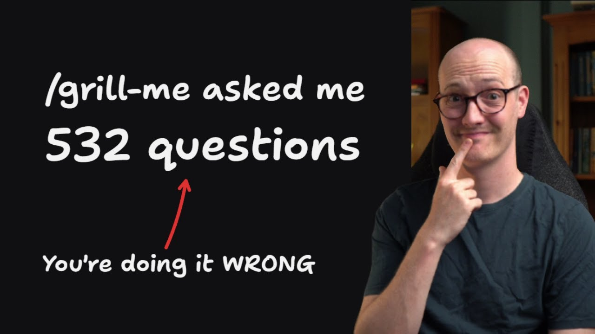

# 大家在使用我的 /grill-* 技能時常犯的 9 個錯誤

學習如何精通 /grill-with-docs 技能，並避免浪費上下文長度與規劃時間的常見錯誤。這部影片涵蓋了 9 種主要的失敗模式以及解決方法。

## 目錄 (Table of Contents)

* [00:00:00] 總覽
* [00:01:28] 低保真與高保真問題
* [00:03:44] 正確管理範圍
* [00:05:41] 主動引導而非被動接受
* [00:06:54] 保留對話過程的價值
* [00:08:40] 使用聰明的模型進行對話
* [00:10:24] 平行執行多個對話任務
* [00:11:26] 總結與重點回顧

## [00:00:00] 總覽

我的 Grill Me 和 Grill with Docs 技能已經發布一段時間了，世界各地的人們都在使用它們作為 AI 代理 (agents) 規劃模式的替代方案。然而，我有時會聽到使用者抱怨，像是「Codex 剛剛問了我 200 個問題，這問題太大了」。聽到這些，我都不禁會皺一下眉頭。這些技能的設計理念是「無情地對你提問」，也就是它們會不斷地問你問題，直到你們對某件事達成共識為止。這意味著，它非常依賴回答問題的人（也就是正在使用 Grill Me 技能的你）的規劃能力。 [00:00:00 → 00:00:30]

作為回答問題的人，你需要擅長規劃。你需要了解「範圍 (scope)」等概念。你需要知道哪些問題需要什麼樣的保真度 (fidelity) 才能回答。這也是我想做這部影片的原因。我希望讓你們能非常熟練地使用這些技能，因為這些技能本身並不長，它們的目的是「輔助」你成為更好的工程師，而不是「取代」你。 [00:00:30 → 00:00:56]

因此，我整理了一份人們在使用這些技能時常犯的 9 個錯誤清單。但在進入正題之前，讓我們先探討幾個理解這些失敗模式的視角（lenses），因為如果我們不能正確地理解它們，就無法改變現狀。如果你喜歡我的教學方式以及我教授的內容，那你一定會非常喜歡我為真正的工程師打造的「AI Coding Cohort」課程。下一期課程將在 6 月 1 日開課。距離享有 7 折優惠只剩下 1 天 11 小時了。所以，你絕對不會想錯過。 [00:00:56 → 00:01:25]

希望我今天就能把這部影片發布，這樣你還有時間可以報名購買。 [00:01:25 → 00:01:28]

## [00:01:28] 低保真與高保真問題

讓我們開始吧。首先要思考的第一件事是，當我們進入一個拷問對話 (grilling session) 時，我們真正想做的是回答問題。我們對即將構建的項目可能還有一些未知的部分。這些問題需要不同層級的保真度才能回答。我借用了 Ryan Singer 在他的傑作《Shape Up》中的用詞。 [00:01:28 → 00:01:49]

高保真 (High fidelity) 問題是指你需要一個非常放大、非常詳細、高保真的畫面才能理解的問題。舉例來說，這可能意味著「這個 UI 元件在使用起來感覺如何？」、「我們應該把這些表單欄位拆分成多個不同的頁面，還是放在一個巨大的表單裡讓使用者填寫？」要真正理解這些，唯一的方法就是製作一個高保真的原型 (prototype)，或是實際把它整個做出來。相對地，低保真 (Low-fidelity) 問題則是那些你不需要高保真原型或畫面就能回答的問題。 [00:01:49 → 00:02:25]

像是「這個路由 (route) 應該放在哪個 URL 上？」這類問題，你只需要直接回答即可。我看到大家在使用 Grill Me 技能時犯的第一個錯誤，就是試圖在對話過程中回答高保真問題。換句話說，有些問題是「可對話的 (grillable)」，也就是可以在對話過程中回答的；而有些問題是「不可對話的 (ungrillable)」，無法在純對話中得到答案。那麼，當你遇到一個「不可對話的」問題時該怎麼辦呢？ [00:02:25 → 00:02:52]

當問題與「感覺 (feel)」有關，當你需要看到更高保真度的東西才能回答時，我通常會進行「原型設計交接 (prototyping handoff)」。假設在藍色的第一次對話階段，我進行了一些問答，然後遇到了一個不可對話的問題（我需要更高保真度才能看清的問題）。這時，我會使用「交接 (handoff)」技能（我會把連結放在下方），將任務交接給一個原型設計會話。在那個會話中，我會花時間針對這個問題建立原型，以更高保真度的方式來審視它。接著，我會把從中學到的東西交接回原本的問答會話，這樣我就能繼續處理那些「可對話的」問題。 [00:02:52 → 00:03:32]

這就是我許多對話過程的真實樣貌：你會先進行一段 Grill with Docs 會話，然後交接給原型設計會話，之後再交接回原本的 Grill with Docs 會話。這就是我回答那些需要更高保真度問題的方式。 [00:03:32 → 00:03:45]

## [00:03:44] 正確管理範圍

我們需要理解的下一個概念是「範圍 (scope)」，也就是你正在探討的事物有多大。如果你探討的範圍太大，你最終會遇到兩個問題。首先，如果範圍太大，裡面很可能隱藏著一些高保真問題，如果沒有看到全貌，這些問題是很難回答的。在一個你已經確認有效且做得很好的基礎上進行擴展，總是比試圖無止盡地規劃未來的範圍要容易得多。這也是很多人在試圖為工作排定好幾天的任務時會遇到的問題：他們最終做出來的東西很糟，因為他們並不是建立在一個自己充分認可的基礎上。 [00:03:45 → 00:04:30]

換言之，他們試圖把眼光放得太遠，卻沒有建立在穩固的基礎上。此外，這裡還有實際的限制。如果你探討的範圍太大，你最終會觸及 AI 模型的「愚鈍區 (dumb zone)」。當然，你可能在開始對話時擁有一個幾乎空白的上下文視窗 (context window)，但隨著你不斷地討論下去，你可能連一半的問題都還沒回答完，就已經達到了這個愚鈍區。這時候你可能需要進行交接、壓縮 (compact) 上下文，或是做一些有點尷尬的操作。如果你一開始就選擇較小的範圍，這一切都是可以避免的，而且你也能夠在「聰明區 (smart zone)」內舒適地進行對話。對於不知道的人來說，大約 120k tokens 是我估計目前大多數最先進模型的極限，超過這個點它們的愚鈍區就開始了。 [00:04:30 → 00:05:15]

所以你必須密切關注你的上下文視窗，確保你不會超過那個極限，因為模型會開始在注意力機制上感到過度緊繃，並開始做出愚蠢的決定。這基本上意味著，如果你一開始就設定了一個這麼大的範圍（這對 AI 代理來說可能太大了），不如事先要求代理將這個大範圍拆解成多個小範圍，然後你就可以針對每個小範圍個別進行對話並回答所有問題。 [00:05:15 → 00:05:43]

## [00:05:41] 主動引導而非被動接受

我想讓你們看的下一個視角是，在與代理對話時，尤其是在問答環節中，你是處於被動還是主動的狀態。我看到人們進行的許多大型對話環節，我很擔心他們對代理太過被動。當我進行對話時，我總是非常主動，總是試圖引導對話的方向。記住，這是一場對話 (conversation)，而不是面試 (interview)。代理確實是在問你問題，但你要知道，你的職責是釐清方向、確定範圍，並讓事情保持在正軌上。 [00:05:43 → 00:06:13]

如果你太過被動，代理很容易就會在問答中做出愚蠢的事情，例如問你 540 個問題、讓範圍無限擴張、或是問一些保真度太低的問題。你必須採取主動的態度。但也可能會有「太過主動」的情況，也就是你一直在低保真問題上打轉，而你真正需要做的其實是開始寫程式，看看實際運作的情況。因此，這裡隱藏了兩個失敗模式：過於被動（也就是太過依賴代理），以及太過固執己見，沒有盡快開始撰寫程式碼。因此，在使用這些技能時，考慮自己在這個光譜上的位置（是太被動還是太強勢主動）是非常重要的。 [00:06:13 → 00:06:55]

## [00:06:54] 保留對話過程的價值

這裡的另一個失敗模式是，人們不重視他們在對話過程中創造出來的價值。當你在回答這些問題時，當你用非常有價值的回答和設計決策來填滿上下文視窗時，這一小塊藍色的上下文是非常寶貴的。通常你的目標是，如果你還有足夠的上下文空間（budget），你就可以立即開始實作。換句話說，你規劃了一段時間，然後你說：「好吧，我們就來實作這個吧。我們不需要交接。我們的上下文視窗還有足夠的空間，可以根據我已經做出的設計決策來實作它。」 [00:06:55 → 00:07:29]

然而，如果你已經到了必須退出對話、必須進行交接的地步，那麼可能就該寫一份 PRD (產品需求文件) 了。我的「to PRD」技能是一個很好的方式，可以用來建立一份更適合工程開發的交接文件，這對於跨會話或單一會話都很有用。但我看到人們犯的一個最瘋狂的錯誤是，他們竟然先清除了上下文，建立了一個新的上下文視窗，然後在裡面執行「to PRD」。這對我來說太瘋狂了。你在做什麼？ [00:07:29 → 00:08:00]

你建立了一個不可思議的對話會話，裡面有 100,000 個 token 都是非常好的設計決策，然後你打算把它直接丟掉？每一次的對話會話，你在那次會話中做出的每一個決定都非常有價值。這些都應該被記錄在某個地方，不管是轉化為程式碼，或是放入一份你之後可以參考的交接文件中。不要把對話會話裡的東西直接丟掉，這一點非常重要。我認為這可能只是一個技巧問題。 [00:07:57 → 00:08:26]

人們需要對上下文管理有更多的認知，對於清除、壓縮、交接等決策有更深的了解。所以，對我來說那真的是個瘋狂的舉動。請確保你保留了在對話會話中所做的決定，並為它們建立一些交接產出物 (artifact)。 [00:08:24 → 00:08:41]

## [00:08:40] 使用聰明的模型進行對話

人們犯的另一個錯誤是使用太笨的模型來進行對話。了解哪些是低保真問題、哪些是高保真問題、弄清楚該問什麼問題來促使你做出更好的設計，這需要一個夠聰明的模型。如果我們思考模型從哪裡獲取知識，通常有兩個來源。第一個是它們的「上下文知識 (contextual knowledge)」，也就是你特別傳遞給它們的上下文中的東西。這可能來自於讀取檔案、使用者提示詞，或是它們呼叫工具並帶回的調查結果。 [00:08:41 → 00:09:14]

但還有一種是它們的「參數知識 (parametric knowledge)」，也就是它們被訓練去觀察和理解的事物。這比較不可靠，但這正是我們在此所依賴的。我們依賴模型對系統和應用程式的固有理解，來向我們提出一些我們可能還沒考慮過的好點子。因為如果我們已經考慮過這些點子，我們早就把它們當作上下文知識傳遞進去了，我們依賴它固有的理解來為我們提供意想不到的建議和奇特的想法。當你像這樣依賴參數知識時，你需要一個擁有大量參數的模型，而這通常是大型前沿模型 (frontier models) 才具備的。 [00:09:14 → 00:09:53]

不僅如此，它們也是受過頂級訓練的。它們的能力就是比小型模型更強。因此，在對話過程中使用太笨的模型，是我看到的一個非常常見的失敗模式，因為我們太依賴參數知識了。大多數人不知道的是，在「實作階段」你其實可以使用比較笨的模型，因為你在那裡傳遞的大部分資訊都是上下文的。你知道的，當你進入實作階段時，通常你已經有了一份詳細的實作計畫。 [00:09:53 → 00:10:20]

你會傳入程式碼庫中的相關檔案，所以它有一些東西可以參考複製。你知道的，其中大部分都不是參數知識。 [00:10:18 → 00:10:24]

## [00:10:24] 平行執行多個對話任務

實作主要是基於上下文知識。最後，這是一個非常簡單的觀念，但很多人卻沒有做到。你應該平行執行多個對話會話 (grilling sessions)。通常我的工作方式是，我正在進行一個對話會話，然後我輸入一些東西（或者通常我是用語音輸入的）。我回答了它的問題，然後我就切換到另一個會話（通常另一個會話那時已經處理完畢了）。 [00:10:24 → 00:10:42]

我回答那個會話的問題，然後再回到第一個會話。我就像這樣來回切換。人們說這是「上下文切換 (context switching)」，但說真的，這就只是同時管理兩個不同的 Slack 對話串而已。你知道，這真的沒那麼難。當然，你在這裡做出了許多高階的決策，但這確實是我發現能在更短時間內提高產出、完成更多規劃的唯一方法。 [00:10:42 → 00:11:05]

通常我最多同時處理兩個會話，除非其中一個正在執行需要很長時間的任務（比如某些研究），那種情況下如果我狀態很好、精力充沛，我會嘗試同時開三個，但兩個通常是我的極限。但無論如何，我的產出翻倍了，而且感覺相當不錯。如果你有足夠的腦力，你絕對應該這麼做。我也認為進行對話 (grilling) 是一項你可以越做越好的技能，隨著你越來越熟練，你可以增加更多的產出和平行任務。 [00:11:03 → 00:11:27]

## [00:11:26] 總結與重點回顧

讓我們總結一下今天學到的東西。我們了解到，對話 (grilling) 主要與「問題」有關。我們有低保真問題和高保真問題。低保真問題只需要一問一答就能解決，換言之，它是「可對話的 (grillable)」問題。 [00:11:27 → 00:11:41]

但是，高保真問題是「不可對話的 (ungrillable)」。你可能需要透過「交接 (handoff)」技能進入原型設計模式，將任務交接給原型設計會話，只為了解決那個問題（或是一系列相關問題），然後再回到最初的對話會話繼續進行。確定正確的工作範圍 (scope) 至關重要。如果你試圖探討太多東西，你最終只會耗盡你的上下文視窗、消耗你自己的精力，而且一無所獲。如果你在對話會話中太過被動，你只會坐在那裡被電腦不斷地拋出越來越多問題轟炸。 [00:11:41 → 00:12:12]

但如果你太過主動，你可能會無止盡地在低保真問題上打轉，而你真正需要的是開始寫程式。你需要一個聰明的模型，這樣你才能依賴它的參數知識來為你提供更好的建議和更好的問題。最後，我建議同時進行兩個對話會話。一旦你掌握了這些基礎知識並了解每個會話的功能，你應該就能在它們之間順暢地切換。如果你有一個比我更靈活的大腦，你甚至可能可以同時開到四個。 [00:12:12 → 00:12:40]

總而言之，謝謝各位的觀看。如果你喜歡這部影片，那你一定會非常喜歡我為真正的工程師打造的 AI Coding Cohort 課程。哇哦，距離折扣結束只剩 1 天 10 小時了。你可以獲得許多影片內容和互動式練習，這些內容的編排方式是為了達到最快速度和最高效率的學習。你還可以讓我在辦公時間或 Discord 聊天室裡回答你的問題。這真的很棒。 [00:12:40 → 00:13:04]

順帶一提，如果你喜歡這部影片，我的 YouTube 頻道最近訂閱數暴增，感謝大家的支持。我非常感激。我真的很享受製作這些影片。我也很喜歡製作這些技能。我想我們剛剛在 star 數量上超過了 Gary Tan 的 G stack，這對我來說真是太不可思議了。 [00:13:04 → 00:13:17]

如果你有想讓我製作的下一部影片主題，請告訴我，因為我需要你們的建議和想法來獲得靈感。感謝觀看，我們很快再見。 [00:13:17 → 00:13:29]
